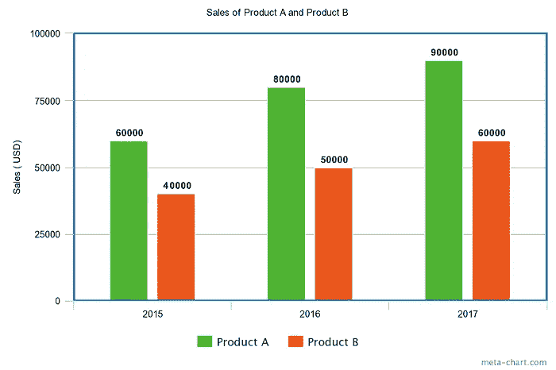
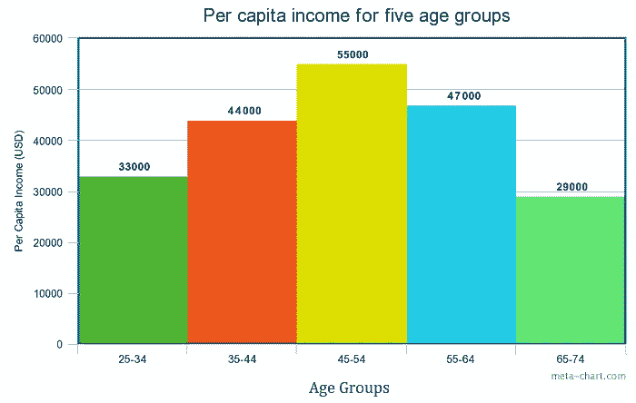
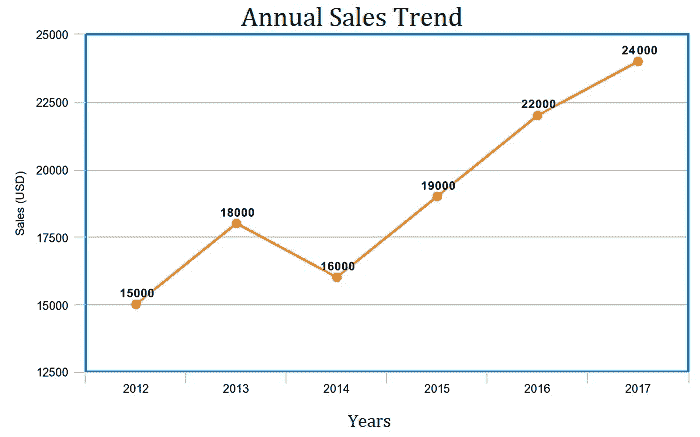
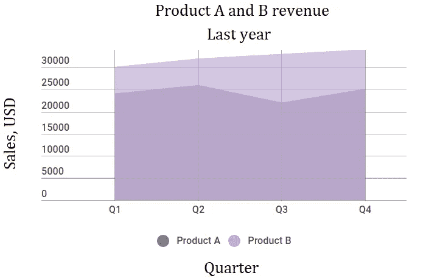
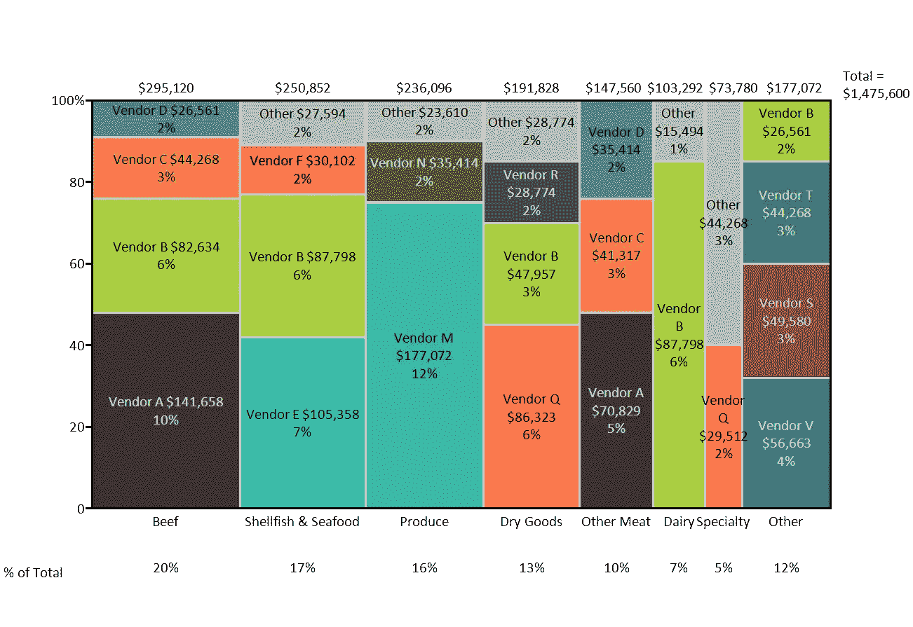
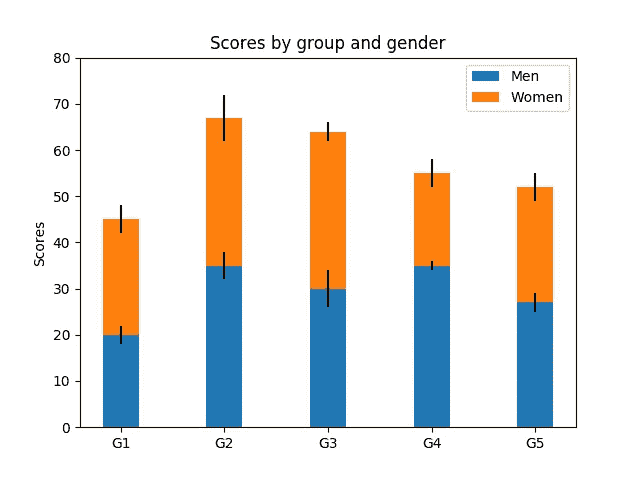
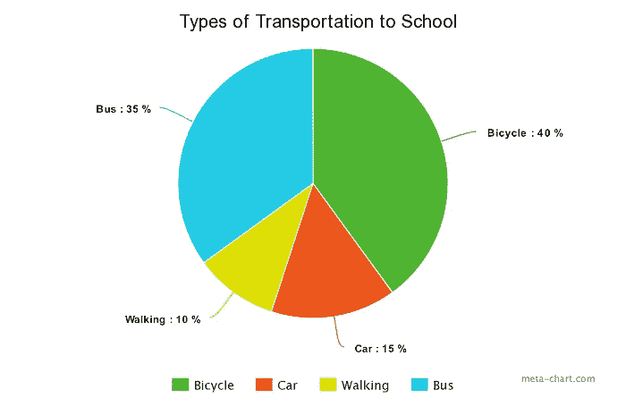
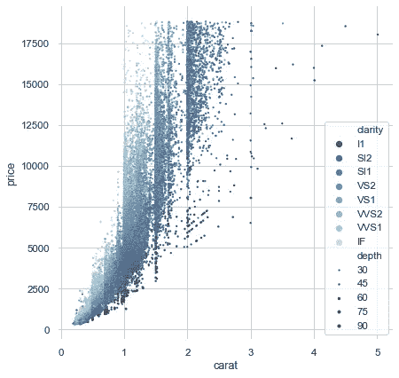
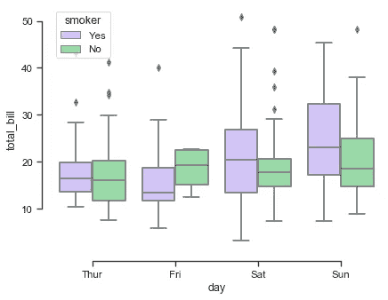
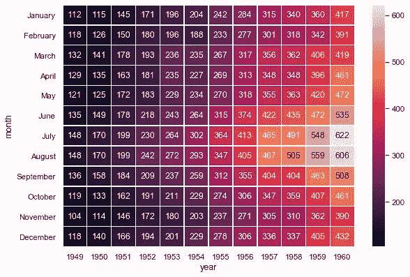

# 如何为您的数据选择正确的图形和图表？

> 原文：<https://medium.com/analytics-vidhya/how-can-you-choose-right-graphs-and-charts-for-your-data-8cc7320dadf8?source=collection_archive---------25----------------------->

每个人在为他们的观想选择正确的图表和图形时都面临困难。在为可视化选择图表类型之前，有几件事情需要考虑。

## 比较

比较图表用于比较一个或多个数据集。

## 关系

关系图用于显示两个或多个变量之间的相关性。

## 作文

成分图用于显示整体的一部分，并随时间而变化。

## 分配

分布图用于显示变量如何随时间分布，有助于识别异常值和趋势。

# 图表的类型。

# 1.条形图

条形图基本上是一个水平柱形图。当一个数据标签很长或者有超过 10 个项目要比较时，应该使用它来避免混乱。这也可以用来显示负数。

# 2.柱状图

直方图显示了数据集的频率分布(形状)。乍一看，直方图与条形图很相似。然而，它们之间有一个关键的区别。条形图代表分类数据，直方图代表连续数据

# 3.曲线图

折线图突出显示一段时间内的趋势和进度，可用于显示许多不同的分类数据。当您想要可视化一个连续的数据集时使用它。

# 4.面积图

面积图基本上是折线图，但 x 轴和线条之间的空间用颜色填充。这对于显示部分到整体的关系很有用。它有助于分析整体和个别趋势。

# 5.梅克图

也称为 marimekko 图表，这种类型的图表可以比较值，测量每个值的组成，并显示数据在每个值之间的分布情况。

# 6.堆积条形图

这可以用来比较许多不同的项目。

# 7.圆形分格统计图表

饼图用百分比表示数字，所有部分的总和需要等于 100%。

# 8.散点图

散点图或散点图可以显示两个不同变量之间的关系，也可以揭示分布趋势。这通常用于查找多数数据占据哪个区间。

# 9.箱线图

箱线图是一种基于五个数字汇总显示数据分布的标准化方法(“最小值”、“第一个四分位数(Q1)”、“中值”、“第三个四分位数(Q3)”和“最大值”)。

# 10.热图

热图显示两个项目之间的关系，并提供评级信息，如从高到低或从差到优。

## 参考资料:

datafloq。hubspot。智能点。seaborn。pydata。（同 organic）有机