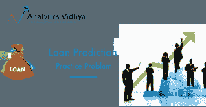

# 2020 年没有学位怎么掌握数据科学？

> 原文：<https://medium.com/analytics-vidhya/how-can-you-master-data-science-without-a-degree-in-2020-b07cbb8adfcd?source=collection_archive---------41----------------------->

# 介绍

成为一名数据科学家就像是“美国梦”——每个人都想拥有它！

然而，对于所有的初学者来说，一个大问题仍然没有答案，我需要有一个学位才能成为一名成功的数据科学家吗？

数据科学是一个相对较新的领域，即使是顶尖的大学也只是在最近才开始提供专业课程，这在业界引起了突然的轰动和混乱。在这篇文章中，我们将分解这个问题，看看它的所有方面。

# 没有数据科学学位能找到工作吗？

直截了当的回答是肯定的！不要误解我的意思，学位有它自己的优点和缺点，我们将在文章中详细讨论，但你肯定可以根据你的技能和项目找到工作。

你有没有参加过一次面试，面试官因为你有“学位”而立刻给了你这份工作？不要！他会测试你的知识深度，然后才会给你这份工作。因此，一个学位可能会给你带来工作的“机会”，但是“得到”这份工作需要技能和努力！

# 数据科学学位的利与弊

# 赞成的意见

*   **接触专家教师** —大学和学院在每个科目上都有教授和专家。毫无疑问，这些项目为你提供了接触一些伟大人物的机会，尤其是如果你希望获得博士学位的话
*   **一对一会议** —当你与专家和导师一对一互动时，学习总是更好。这有助于消除疑虑，获得建议，整体体验会更好。
*   **明确的课程设置**——学位课程的课程设置有明确的行业标准。这些都很全面，提供了数据科学的整体视图。
*   更容易被招聘者利用——大学和学院与组织有联系，因此有足够的机会在获得学位后直接获得一份梦寐以求的工作。

# 骗局

*   **当然是高成本** —数据科学需求很大，但这需要巨大的成本。你可能要掏出 10 亿卢比。此外，欧洲或美国大学的好学位可能要高得多，可能要花费你 7 位数的卢比。
*   **完成课程需要时间**——如果你已经是一名在职专业人士，你将很难放弃一份有报酬的工作，并承诺在 1-2 年内没有收入。
*   **选择过程通常更喜欢技术和统计领域的人** —如果你来自非技术或非统计背景，你可能不会被优先考虑。大多数大学的选拔过程和面试过程都是以技术人员具有更高优势的方式设计的。

获得学位的替代方案

如今，获得学位并不是获得“21 世纪最性感工作”称号的唯一途径。还有几个其他的选择。这肯定需要一些时间和努力，但这是值得的。所以让我们看看-

# 参加综合认证课程

认证课程是从零开始学习数据科学并掌握该领域的绝佳方式。这些课程通常为期 6-12 个月，价格也低得多。尽管在购买课程前你需要记住一些事情-

1.  确保课程内容全面
2.  课程讲师必须是专家
3.  课程必须是最新的
4.  它应该提供大量现实生活中的项目。
5.  一对一的指导会很棒。
6.  工作协助以及简历制作和面试准备。

可悲的是，有大量的球场收取额外费用，但不提供上述所有功能。但是有一门课程可以提供一切，并帮助您成为行业数据科学专家。

AI 和 ML 黑带+ 课程提供-

1.  精通 15 种以上的工具
2.  数据科学、机器学习和深度学习领域的专业知识
3.  解决现实世界行业问题的能力
4.  与行业从业者一对一的指导
5.  全面和个性化的学习路径
6.  专门的面试准备和支持

# 通过免费课程积累知识

免费课程是在旅程的初始阶段积累知识的好方法。这些课程为数据科学概念提供了很好的介绍。但是请注意，这些课程是为初学者开设的，如果你已经精通了几门课程，我建议你继续学习专业课程。让我们来看看几门重要的免费课程清单-

1.  [AI 和 ML 简介](https://courses.analyticsvidhya.com/courses/introduction-to-ai-ml?utm_source=data-science-degree_ram&utm_medium=blog_medium&utm_campaign=blackbelt) —理解和导航人工智能和机器学习行业的完美课程。它提到了成为人工智能和人工智能专业人员的所有技能、工具和职业道路。
2.  [用于数据科学的 Python](https://courses.analyticsvidhya.com/courses/introduction-to-data-science?utm_source=data-science-degree-ram&utm_medium=blog_medium&utm_campaign=blackbelt)—Python 是构建机器学习模型最强大、使用最广泛的语言之一。这个课程非常适合 Python 初学者，而且还提供免费认证！
3.  [自然语言处理介绍](https://courses.analyticsvidhya.com/courses/Intro-to-NLP?utm_source=data-science-degree-ram&utm_medium=blog_medium&utm_campaign=blackbelt) —如果你是 NLP 爱好者，这是最适合你的课程。在本课程中，您将学习自然语言处理的基础知识、使用机器学习的正则表达式&文本情感分析。
4.  [开始学习神经网络](https://courses.analyticsvidhya.com/courses/getting-started-with-neural-networks?utm_source=data-science-degree-ram&utm_medium=blog_medium&utm_campaign=blackbelt) —深度学习在过去十年中被选中，许多爱好者都对学习神经网络感兴趣。该课程回答了诸如什么是神经网络之类的问题。它是如何工作的？神经网络是做什么的？

# 几个肯定有事情

**参加竞赛** —数据科学竞赛是建立和证明你的技能并引起潜在招聘者注意的一种可靠方式..你可以上 DataHack 平台，选择一个问题陈述，然后开始。招聘人员喜欢通过实际应用积累知识的候选人。

**开始写文章** —如果你有数据科学的诀窍和写作的热情，那么什么是比写文章更好的表达自己的方式呢？文章写作帮助你学习所有难懂的技术概念，并把它们变成容易理解的主题。写文章是另一个帮助你抓住潜在招聘者眼球的好方法。

**从实习开始** —获得数据科学全职工作的问题是“必需的经验”。获得这种体验的最好方式是通过实习。虽然你可能不得不从初学者开始，即使你在其他领域有经验，但这绝对是值得的。

# 结束注释

为了进入数据科学领域，你不能让学位成为建立成功职业生涯的借口。在本文中，我们讨论了拥有数据科学学位的利弊以及全日制学位的替代方案。

参加一个全面的项目是最好的选择之一，这个项目为你提供从初级到高级的课程以及大量的实际项目。 [AI 和 ML Blackbelt+计划](https://blackbelt.analyticsvidhya.com/?utm_source=data-science-degree-ram&utm_medium=blog_medium&utm_campaign=blackbelt)为您提供 15+课程和 39+真人项目。最好的部分是什么？您可以参加一对一的指导会议，这样您就可以获得专为您定制的学习路径，并且永远不会偏离轨道！

*原载于 2020 年 11 月 30 日*[*【https://www.analyticsvidhya.com】*](https://www.analyticsvidhya.com/blog/2020/11/how-can-you-master-data-science-without-a-degree-in-2020/)*。*