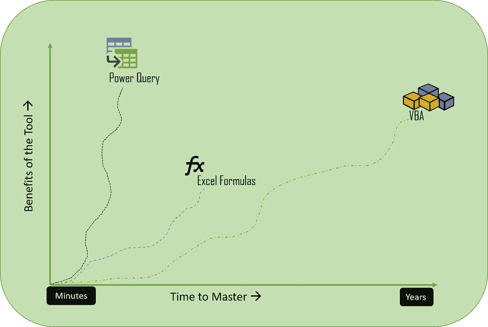
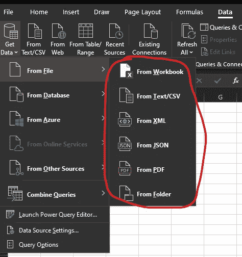
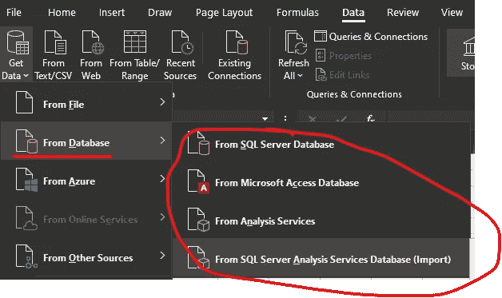
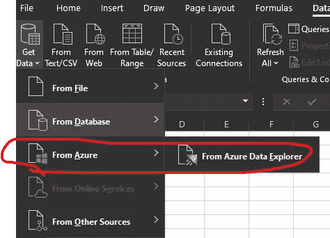
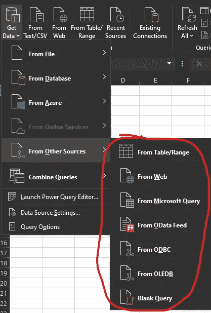
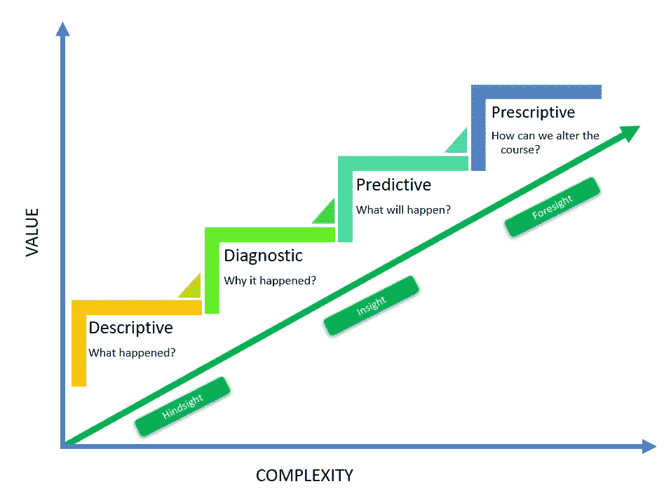
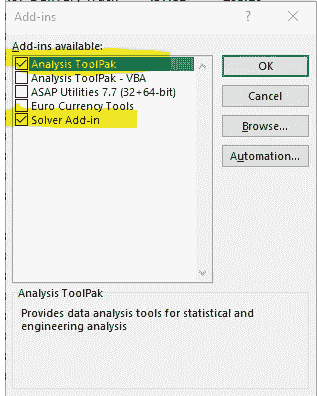
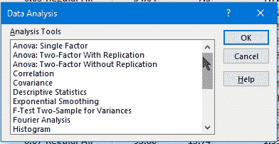
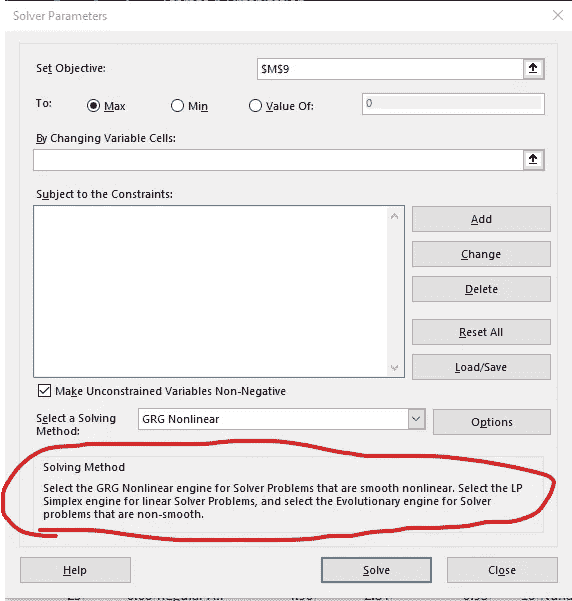
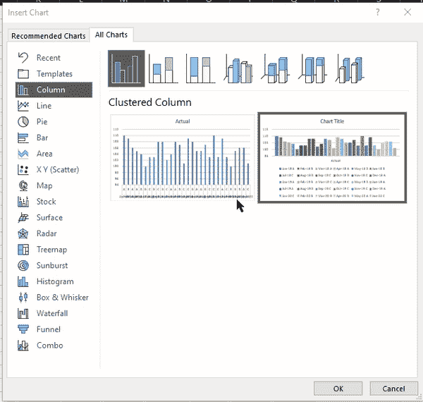

# Excel 的数据分析能力如何？

> 原文：<https://medium.com/analytics-vidhya/how-capable-is-excel-for-data-analytics-64553903ae14?source=collection_archive---------10----------------------->

数据科学、机器学习和商业智能是这些天的热门词汇。这是一个专门的配置文件，需要数学、编程和数据库的混合知识。随着技术的发展，我们在数据分析和可视化方面有了多种选择。但是这些工具中的大多数成本很高，并且需要时间来掌握它。

不是所有人都能成为数据科学家，因为不是所有人都渴望成为数据科学家。

在一个组织中，只有少数人从事这种专门的工作。相反，大多数人会进行某种形式的分析，并给出他们的发现和建议。他们的主要工具是 Excel。

那么，与 Power BI 或 Tableau 等更高级的工具相比，Excel 的能力如何呢？

任何数据分析过程都要经历以下几个阶段:

*   提取、转换和编译数据
*   数据建模
*   汇总和可视化数据
*   共享和发布结果

让我们来评估一下 Excel 在这些方面能有多大用处。

# 提取、转换和编译

在 Office 2013 中，微软引入了 Power Query，这是 Excel 中的一个 ETL(提取、转换、加载)工具。这是一个 Excel 公式和 VBA 代码的混合，但超级容易学习和实施。

现代 Excel 可以连接到多个数据源，包括其他 Excel 文件、CSV、SQL Server、SQL Server Analysis Services、网站等:

我们可以用 Power Query 做什么？我们可以:

*   从各种(复制粘贴作业)中编译数据
*   过滤不需要的行和列
*   [点击几下鼠标，合并多个表格](https://www.vivran.in/post/vlookup-joins-using-power-query)( VLOOKUP)
*   快速执行各种[文本](https://www.vivran.in/post/text-transformation-with-power-query) & [日期](https://www.vivran.in/post/date-transformations-with-power-query)转换
*   [添加类别](https://www.vivran.in/post/adding-categories-with-power-query) &附加计算列

在任何分析中，大部分时间和精力都花在数据清理和转换上。Power Query 完成了所有繁重的工作。我们可以自动化整个数据 ETL 过程，并且不需要编写一行代码。

你可以参考以下文章:

[数据分析师在 Power Query 中应该知道的 5 件事](https://www.vivran.in/post/5-things-data-analysts-should-know-in-power-query)

[使用超级查询将多个文件合并到一个文件夹中](https://www.vivran.in/post/combining-multiple-files-in-a-folder-power-query)

[电力查询博客](https://www.vivran.in/my-blog/categories/powerquery)

Power Query 不提供清理数据的代码/低代码功能，而且它不像 Excel 那样有记录数量的限制。换句话说，Power Query 能够处理超过一百万行的数据表。

此外，我们可以使用 Flash Fill 进行数据转换，而无需应用任何公式

[Excel QuickBytes# 4:用 Excel 快速填充](https://www.vivran.in/post/flash-fill-with-excel)

# 数据建模

# 动力中枢

随着 Power Query 的出现，Excel 有了自己的数据建模特性:Power Pivot。它就像 excel 中常规的数据透视表，但却是类固醇。我们可以执行一些高级的数据建模功能，比如使用关系表和使用 DAX 编写复杂的业务逻辑。

DAX 又称**D**ATA**A**analytics e**X**pressions，是 SQL Server Analysis Services、Power BI 和 Power Pivot 的表格模型的公式语言。有关更多详细信息，请参考以下文章:

[向达克斯问好](https://www.vivran.in/post/say-hello-to-dax)

就像超级查询一样，Excel 中百万行的限制在这里不适用。因此，我可以连接多个数据源，并且可以使用 Power Query 和 Power Pivot 进行一些高级数据建模。

简而言之:

您可以参考以下关于 Power Pivot 入门的文章:

【Power Pivot 数据建模:入门

因为 Power Query 和 DAX 是 Power BI 的构建模块，所以在 Excel 中学习和实践它们还有一个额外的优势。

# 数据分析

典型的 BI 或数据分析流程包括以下几个阶段:

使用 pivot、Power Pivot 和原生 Excel 公式，我们可以轻松地进行描述性和诊断性分析，但是预测性和规范性分析呢？

答案是:分析工具包和求解器加载项

分析工具库具有大多数统计测试，包括方差分析、线性回归

求解器适合运行“假设”方案。它可以使用不同的求解算法在几秒钟内解决具有多个约束的复杂场景。

另一篇文章将详细介绍这一点。

除此之外，Excel 还有一个内置的预测表，我们可以使用它进行时间序列预测。

[用 Excel 进行时间序列预测](https://www.vivran.in/post/time-series-forecast-with-excel)

# 汇总和可视化数据

这个很简单。我们已经为此使用 MS Excel 很长时间了。总而言之，数据透视表是显而易见的选择，因为它能够执行多种计算，而无需编写任何公式。您可以参考以下关于数据透视表的文章:

[Excel 数据透视表的五个有用特性](https://www.vivran.in/post/5-useful-features-of-excel-pivot-tables)

[对数据透视表执行更多操作:值字段设置](https://www.vivran.in/post/do-more-with-pivot-tables-value-field-settings)

当与 Power Pivot 的数据建模功能相结合时，我们可以构建健壮的业务模型。

除了 pivots，微软 365 还引入了一些想法。它是 Excel 中机器学习和人工智能能力的混合。请参考以下关于创意的文章:

[Excel QuickBytes# 5:见解的想法](https://www.vivran.in/post/excel-quickbytes-5-ideas-for-insights)

# 数据可视化

Excel 中的图表随着时间而发展。除了常规的条形图、柱形图和饼图，Excel 还包括直方图、箱线图、帕累托图等统计图表。一些可选的可视化效果，如瀑布、树状图、旭日图和漏斗图，使它成为一个全面的包。

我使用过 Power BI、Tableau、Python、r。在 Excel 中定制图表的容易程度远远超过这些工具。

# 共享和发布报告

共享在 Excel 上准备的报告或仪表板有多容易？我认为我们不需要为这一点写一篇文章。Excel 电子表格无疑是共享数据和见解的最常见方式。这仍然是创建仪表板并与更广泛的受众共享它们的最方便的方式。

Excel 最大的优点是它非常容易工作和学习。网上有大量的学习材料，很容易进行知识传授。

如果不是大数据，Excel 是掌握分析和可视化概念的绝佳工具。它可能缺乏交互性，但它仍然是一个有价值的竞争者和初露头角的数据爱好者的首选。

[@imvivran](https://twitter.com/imvivran)

*我写关于*[*MS Excel*](https://www.vivran.in/my-blog/categories/excel)*[*权力查询*](https://www.vivran.in/my-blog/categories/powerquery)*[*权力毕*](https://www.vivran.in/my-blog/categories/powerbi)*[*权力中枢*](https://www.vivran.in/my-blog/categories/power-pivot)*[*DAX*](https://www.vivran.in/my-blog/categories/dax)*[*数据分析【数据*](https://www.vivran.in/my-blog/categories/data-analytics)*****

**[@imVivRan](https://twitter.com/imvivran)**