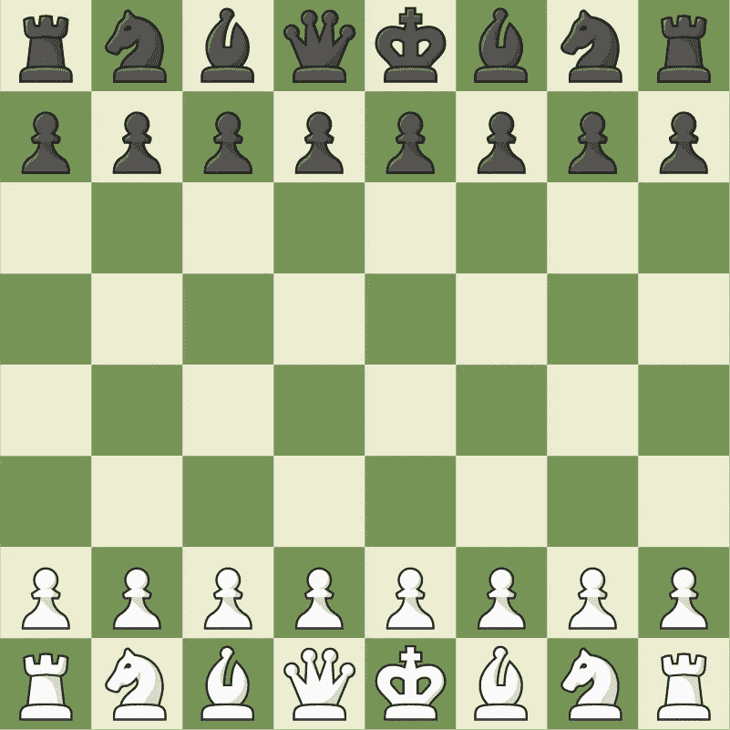
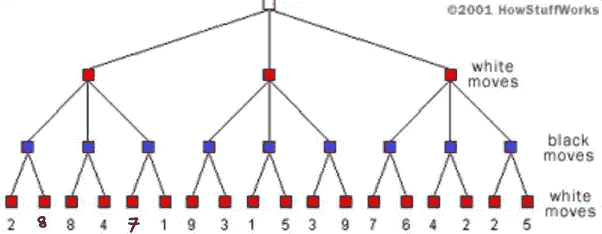
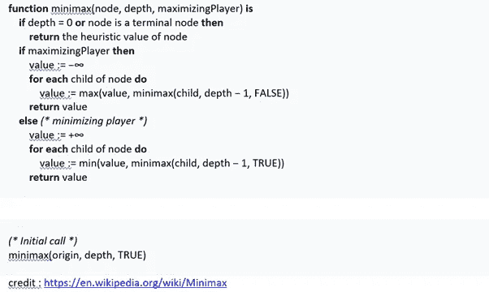
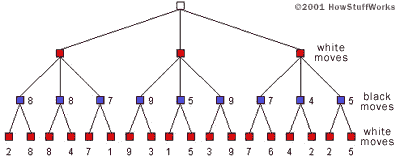
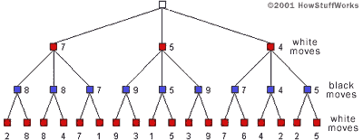

# 象棋算法是如何工作的？

> 原文：<https://medium.com/analytics-vidhya/how-chess-algorithm-works-69e8ae165323?source=collection_archive---------7----------------------->

资料来源:chess.com

国际象棋是一种双人战略棋盘游戏，在棋盘上进行，棋盘上有 64 个正方形，排列成 8×8 的网格。供您参考，国际象棋被认为是抽象的战略游戏，需要战略和战术来赢得比赛。这是一个很常见的游戏，我相信我们大多数人小时候都玩过。如今，我们可以和机器人下棋，只要我们有足够的平台，如 PC 和智能手机。

你们有没有想过象棋机器人是如何工作的？

当然，我们都知道象棋机器人的工作原理是因为数学。这是非常明显的，但我想在这里解释的是国际象棋算法在数学方面是如何工作的。实际上，象棋机器人的工作原理和其他计算机一样，都是通过将问题简化为一堆愚蠢的计算。别担心！国际象棋算法的本质很简单，尽管现代国际象棋算法本身有点复杂。但我是来解释本质的！

步骤 1:构建“树”

当我们开始游戏时，每个玩家有 16 个棋子。假设现在轮到电脑了。计算机可以走 20 步中的 1 步(8 个兵各走 2 步，骑士各走 2 步)。之后，对手还可以做出 20 种可能的招式。这使得我们有 20*20 个可能的场景，这意味着在两个回合中有 400 个场景。接下来，计算机可以对这 400 个场景中的每一个做出另外 20 种可能的移动。

只要游戏还在继续，这棵树就会一直生长。理论上，完美的计算机将能够到达这棵树的最底部，并且查看板的所有可能的配置，大约 10 ⁰.然后，它会看到沿着这棵树有哪些路径会导致胜利，并为机器人选择最佳路径。

步骤 2:评估结果

很肯定我们所有人都知道这个问题，10 ⁰是一个非常庞大的数字。供你参考，宇宙中估计的原子总数是 10⁷⁵，换句话说，当宇宙已经到达它的尽头时，机器人可能还在计算它的移动。

真正的、足够的计算机将尽它们最大的硬件能力来构建这棵树，比如 5 台、10 台、20 台或任何未来的计算机。一旦他们有了这个有限的树，他们就用一个评估函数来评估每个位置。

一个非常简单的例子是，评估函数可以是计算机拥有的棋子数减去对手拥有的棋子数。例如，计算机在棋盘上还剩 12 枚棋子，而对手只有 8 枚。那么计算机将评估这样的板为 12-8 = 4。

当然，这不是一个很好的评价函数，但这就是我们的想法。这可以变得越来越复杂，考虑到许多值，如单个棋子、棋盘位置、对中心的控制、国王检查的脆弱性、对手王后的脆弱性以及大量其他参数。函数可以是任何东西，只要它能工作，因为它允许计算机比较棋盘的位置，看哪一个是理想的结果。

第三步:行动

做了分析之后，现在是做决定的时候了，这就是简化树的例子。

扮演白棋的计算机必须决定它的移动。它像上面一样构造树并应用极大极小算法。Minimax 是人工智能、决策理论、博弈论、统计学和哲学中使用的决策规则，用于最小化最坏情况(最大损失)场景的可能损失。当处理增益时，它被称为“马希民”以最大化最小增益。它最初是为两人零和博弈理论制定的，涵盖了两人交替移动和同时移动的情况，也扩展到了更复杂的游戏和一般决策以及存在不确定性时的一般决策。它也用于其他两人回合制游戏，如井字游戏、双陆棋和曼卡拉游戏。

可能你们中的一些人想知道这是什么伪代码，所以在这里。下面给出了深度受限的 minimax 算法的伪代码。

现在，让我们开始有趣的部分。第一，从最底层开始，姑且称之为一级。计算机将选择得分最高的一个。考虑第一关最右边的方块队。它有两种可能的结果 2 和 5。由于在该阶段将轮到计算机，它选择最佳结果，即最高分为 5 的结果，因此它将 5 分配给该节点。同一层的其他方块也是如此。

现在，我们完成了第一关，现在让我们进行下一关，也就是第二关(蓝色方块的那一关)，结果由对手决定，因为那时，将轮到黑棋。电脑假设黑棋会走对黑棋最有利的棋，这意味着对白棋最不利，因此它选择最小分数的设置。例如，左边的蓝色正方形团队有 3 种可能性(或者实际上是 2 种)，分别是 8、8 和 7。电脑假设黑棋会拿走让电脑最弱的那一个，那就是 7。所以该层上的节点都有给定值。

最后，我们完成了第一关和第二关，接下来是第三关(再次回到红色方块),这意味着再次轮到计算机，所以它以最高分 7 做出选择。因此，计算机爬上树，交替选择最小和最大分数(这就是为什么名字是极小最大)，并最终做出选择，留下最好的。硬件越好，它能分析的树越深，赢的机会就越大。这就是为什么旧计算机通常不能打败人类(回到 1950-1960 年)，但现在，不骗你，这可能很难。

参考资料:

科学钩 Youtube 频道:[https://www.youtube.com/watch?v=CFkhUajb8c](https://www.youtube.com/watch?v=CFkhUajb8c8)8

quora post:[https://www . quora . com/How-exact-a-chess-computer-work](https://www.quora.com/How-exactly-does-a-chess-computer-work)

维基百科:【https://en.wikipedia.org/wiki/Minimax 和[https://en.wikipedia.org/wiki/Chess](https://en.wikipedia.org/wiki/Chess)的