# 新冠肺炎如何阻止我成为百万富翁

> 原文：<https://medium.com/analytics-vidhya/how-covid-19-prevented-me-from-being-a-millionnaire-in-2020-5b2144e8bdef?source=collection_archive---------6----------------------->

> 在新冠肺炎突然停止所有体育联盟之前，我创造了一个体育博彩算法，让我的资金在短短两个月内翻了六倍。

***NB:*** *本文旨在有所浓缩，仅展示* ***非常关键的信息*** *。关于详尽的细节，请参考我写的完整论文[1]，包含所有的构造步骤和数学基础。在这篇文章中，我只开发 NBA 的程序流程，因为其他运动的程序也在本文中描述。*

# **项目的起源**

图 1:数据科学维恩图

作为一名 22 岁的体育爱好者，我一直对体育分析很着迷，多年来一直专注于研究 NBA 的各种统计数据。

我在大学参加了多门数据科学课程后，也在发现了几篇关于该主题的出版物和科学论文后，想到了这样一个项目。我发现用数学函数如神经网络和其他机器学习模型对人类动力学建模非常有趣。

# 它是如何工作的？

管道的想法可以总结为**“我们寻求创建一个机器学习的获胜概率估计器，以便将这些概率与市场赔率进行比较，然后从这种比较中推断出有利可图的下注策略”。**

在记录了自己对这个主题的看法后，我意识到许多类似的项目仅仅满足于创建最精确的模型。然而，大多数时候他们无法利用他们的模型在体育博彩中获利，因为博彩公司的利润仍然弥补了他们模型的良好准确性。

然后我试图找出如何应对这种情况，开始创建自己的模型，然后我终于想到了一种识别博彩公司赔率偏差的方法。整个流程可以用下图来概括，本文简要描述了其中的主要步骤:

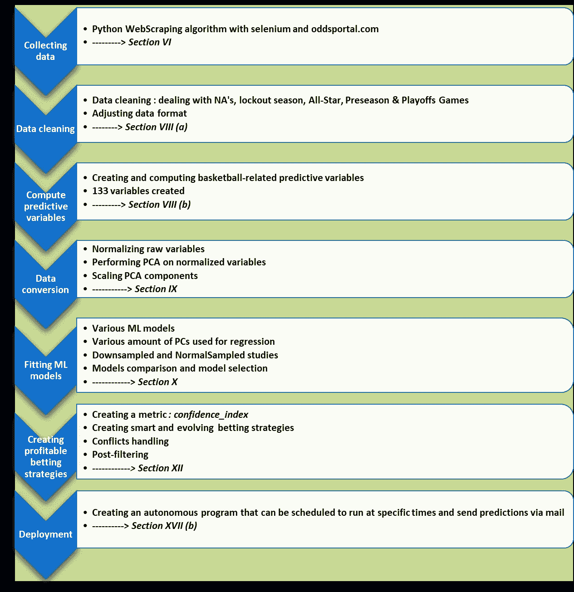

图 2:项目的描述管道(摘自论文)

我将在本文中描述的步骤如下:

*I —数据采集:在 Python* 中创建一个 ***webscraper 算法***

**II —变量计算:创建* ***预测变量*** *馈入 ML 模型**

**III —* ***主成分分析(PCA)*** *:通过创建一组新的正交成分来减少拟合过程中的方差**

**四—拟合多个* ***ML 模型*** *，具有不同的超参数设置**

**V —创造* ***盈利投注策略*** *拜一个原创启发式(个人创造)**

**六—那* ***结果*** *呢？**

# ***I —数据收集:用 Python 创建 webscraper 算法***

*第一步是收集原始历史数据，为此我创建了一个 **python webscraper** 来收集关于[www.oddsportal.com](http://www.oddsportal.com)的数据。我在我的 GitHub 页面上发布了我的包(GitHub page [2]， **repository [3]** )。该软件包是用户友好的，允许任何人在任何运动中勉强进入任何联赛。*

*我需要开始的唯一原始数据是一个**历史数据集**，其中包含每场比赛的结果，以及球队名称和博彩公司 Bet365 提出的收盘赔率。**收盘赔率**是比赛开始前的赔率。拥有这一特定数据非常重要，因为赔率在开幕和闭幕时间之间会有很大波动，主要是为了适应球员的受伤和赌徒在这支或那支球队下注。*

*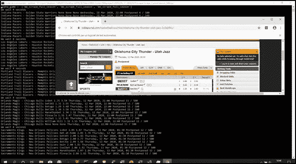*

*图 3:运行网络抓取算法的屏幕截图*

*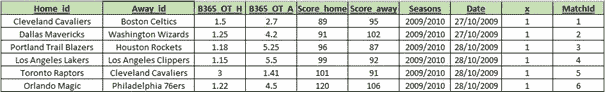*

*图 4:刮擦表概述*

# ***II——变量计算:创建预测变量以馈入 ML 模型***

*在去除季前赛、全明星赛和季后赛之后，下一步是创建**预测变量**，以便适应不同的机器学习模型。我为这条管道编码了总共 **133 个特性**。*

*综上所述，预测变量可分为:**记录变量**(W/L)**绩效变量**(平均得分、反对等)**市场相关** ( *例如团队的*ROI)**排名**变量(ELO)。*

# ***III——主成分分析(PCA):通过创建一组新的正交成分来减少拟合过程中的方差***

*在正确计算并检查了 133 个预测变量后，我们可以先看看**皮尔逊相关**矩阵。*

*一般来说，我们可以注意到许多变量是完全不相关的，这可能是一个好迹象，因为这意味着我们可以在数据集中捕获不同的统计模式。这也可能意味着数据集中有噪声。*

*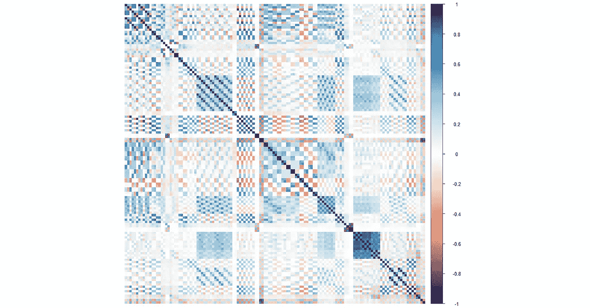*

*图 6:训练集的皮尔逊相关矩阵*

*然后，我应用了**主成分分析(PCA)** ，以过滤掉数据集中可能存在的噪音信息，同时减少拟合过程中的方差。实际上，新创建的主成分都是正交的，这增强了 ML 模型的性能。*

****注意:*** *为了避免测试和未来预测的因果关系问题，PCA 必须只适合于训练集。**

*PCA 是增强**信噪比(SNR)** 的非常强大的技术，因为我们可以选择第一个组件来拟合模型，以便在有限数量的预测器中捕获大部分信息。这通常对我们的研究有很大的好处，因为许多变量仍然是相关的。*

*在下图中，我们可以在**解释的累积方差比例(累积 PVE)** 图中识别出一个清晰的“肘形”模式，这可能表明大部分信息将包含在前 15 个样本中(*即*最后几个样本中没有太多的方差)。但是，我们将在构建模型时进行交叉验证(*NPC = 10、15、20、25、30、35、40、45、50、55、60、65、80* )，以便比较不同 PC 组获得的结果。最终目标是确定 PC 的最佳数量，使**偏差/方差权衡**在精度方面尽可能好。*

*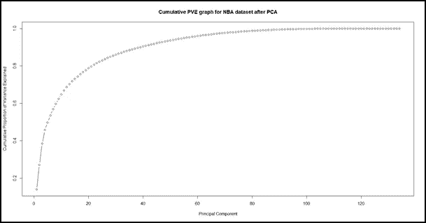*

*图 7:训练集的累积 PVE 图*

# ***IV——用不同的超参数设置拟合几个 ML 模型***

*我选择在新创建的主成分上拟合多种类型的模型，并用不同的超参数设置来拟合它们。我使用的四类模型分别是**随机森林**、**支持向量机(SVM)** 、**平均神经网络(avNNet)** 和判别分析 **(LDA/QDA)** 。*

*这些模型被训练成以二元方式预测比赛结果:要么预测主队(“H”)要么预测客队(“A”)获胜。我还将模型拟合到**输出估计的胜利概率**。所有模型都使用“准确性”作为度量标准进行训练，即使在这种二元分类的情况下，可以使用各种标准，如*基尼*、*熵*或*曲线下面积(AUC)* 。*

*所有模型的测试集由当时最后一个赛季(2018/2019 赛季-1230 场比赛)组成，这意味着我保留了 9 个赛季来训练模型。下面给出的结果显示，在预测准确性方面，avNNet 模型略占优势。最佳模型以深绿色突出显示，按模型类型划分的最佳模型以浅绿色突出显示。*

****NB :*** *测试期间，Bet365 最喜欢的赢了 67，64%的时间。我们可以在下面看到，我的最佳模型在测试期间超额完成了它们的估计。**

*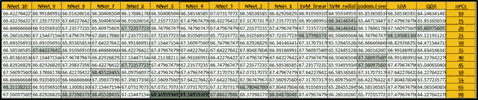*

*图 8:2018-2019 赛季模型精度对比(测试集)*

*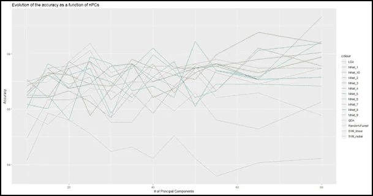*

*图 9:精度与用于回归的 PC 数量的函数关系*

# ***V——借助原始启发法(个人创造)创造有利可图的下注策略***

*如前所述，文献显示了许多非常强大的模型，这些模型将许多参数作为输入，并使用大量计算能力来计算变量和模型。然而，**他们中很少有人能够产生一个伟大的投注策略**，因为即使估计者准确地估计了获胜的机会，**人们也必须应付博彩公司的保证金。***

*出于保密原因，我没有深入细节，而是创建了一个指标，让我们能够识别博彩公司赔率估计中的偏差。*

*一旦我们确定了盈利策略，我们只需计算未来游戏的预测，确定属于盈利策略的游戏，并通过电子邮件发送即将到来的赌注。在策略冲突的情况下(*即*策略 A 说赌*家*而策略 B 说赌*走*)，我们选择最佳策略的预测。*

**瞧！我们只需要下注就能获利。**

*RStudio 中的输出如下所示(现在它作为*通过电子邮件发送)。csv* ):*

*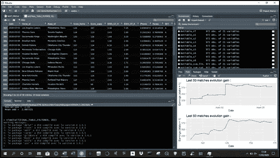*

*图 12:r studio 中的输出*

# *VI——结果如何？*

****NB:*** *管道一直在不断发展，因此第一次下注使用的算法远没有本文中介绍的最终版本复杂。人们甚至可以注意到，随着时间的推移，利润越来越高。**

*多亏了这个管道，我已经能够应用从这个算法中得到的**下注指令，并且能够通过 NBA 比赛赢得 856€。NBA 联盟是我迄今为止最好的节目，考虑到在 6 个月的赛季中有许多比赛，这是令人愉快的。这里有几幅图显示了获得这一金额的途径:***

*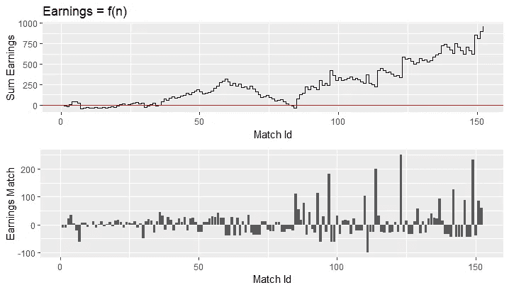*

*图 13:NBA 比赛的累积收入和边际收入*

*然后我们可以看看结果，包括其他联赛的投注记录。*

*截至 2020 年 3 月 13 日，上述策略的应用，加上我对表现良好的联盟(如 NBA 和意大利足球联赛*意甲*)加大赌注的下注策略，使我在 12 月 31 日至 3 月 13 日期间产生了 1284，33 €的**净利润，初始资金为 250€，每场比赛的**投资回报率(ROI)为 7，42%*****

*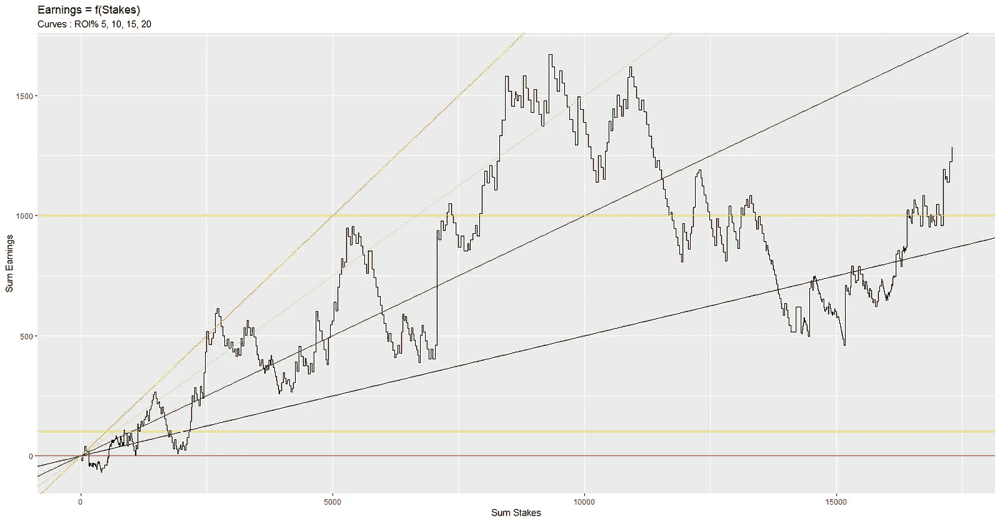*

*图 14:自 2020 年 1 月以来的利润演变(€),作为总赌注的函数*

*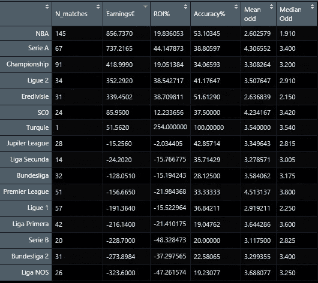*

*图 15:整体投注统计*

**整篇文章包含了关于这些投注结果重要性的详尽信息，尤其是通过蒙特卡洛模拟得出的信息。**

# ***结论***

*总的来说，我们对这条管道相当满意。它混合了我对数据分析的兴趣和对体育的热情。还有，希望这篇文章能对想开始自己的数据衍生投注策略的人有所帮助。*

*请随时与我联系，获取有关程序化体育博彩主题的更多信息/帮助。我还为各种运动和联赛建立了类似的管道(现在已经建立了 76 个不同的程序！—参见关于该项目的完整论文和大量文档[1])。*

*不要犹豫，留下任何反馈/问题/ *掌声*或联系我获取更多信息。我可以进行商业讨论:个人使用，商业使用，产权。*

***联系人:** sebcararo@hotmail.fr*

***另一篇文章:** [一、创建股票预测数据集的交钥匙 Python 代码|作者 sébastien Cararo | Analytics vid hya | Dec，2020 | Medium](/analytics-vidhya/i-a-turnkey-python-code-for-creating-a-stock-forecasting-dataset-ad25f673f3b7)*

***参考文献:***

*[1]全文:[Paper _ exploining _ bookmakers _ bias . pdf(SEB 943 . github . io)](https://github.com/Seb943/PCA_and_ML_R/raw/main/Report/Paper_Exploiting_bookmakers_biases.pdf)*

*[2] GitHub 页面:【github.com】SEB 943*

*[3] ScrapeOP 库:【github.com】SEB 943/ScrapeOP:一个用于抓取 oddsportal.com 的 python 包*

***使用的软件:***

*在 R 3.6.0 中，我从头开始编写所有代码。 *web 抓取*程序是使用 Pyzo 环境在 Python 3.6.2 中开发的。*

***题中的理由:***在 73 天里我们乘以 1534.33/250，那么在 366 天里我们就可以乘以***r =(1534.33/250)^(366/73)=****8926.64****。最后的资金是 250*r =* ***2 231 660 €。*** *显然，标题本意是朗朗上口，并非真实估计。***