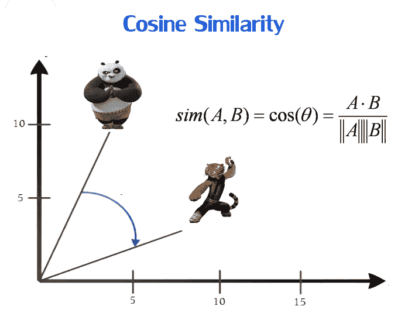
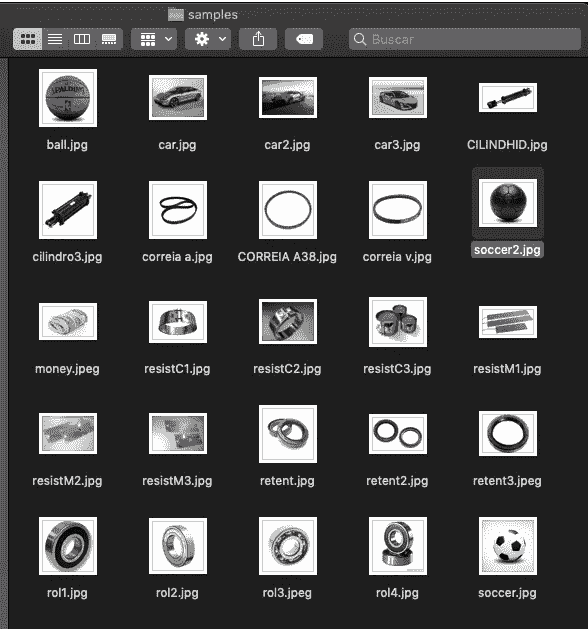
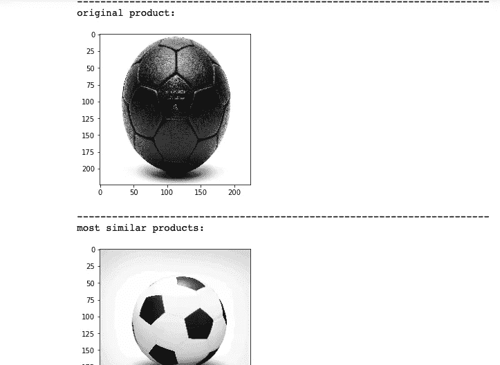
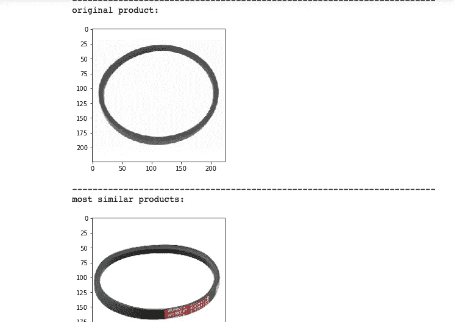

# 如何创建形象推荐系统

> 原文：<https://medium.com/analytics-vidhya/how-create-image-recomendation-system-3dcc5edf1597?source=collection_archive---------17----------------------->


一个**推荐系统**，或一个**推荐系统**(有时用一个同义词如平台或引擎代替‘系统’)，是[信息过滤系统](https://en.wikipedia.org/wiki/Information_filtering_system)的一个子类，它试图预测用户对一个项目的“评分”或“偏好”。[【1】](https://en.wikipedia.org/wiki/Recommender_system#cite_note-handbook-1)[【2】](https://en.wikipedia.org/wiki/Recommender_system#cite_note-2)它们主要用于商业应用。

推荐系统被用于各种领域，并且最普遍地被认为是用于视频和音乐服务的播放列表生成器、用于在线商店的产品推荐器、或者用于社交媒体平台的内容推荐器和开放网络内容推荐器。[【3】](https://en.wikipedia.org/wiki/Recommender_system#cite_note-twitterwtf2-3)[【4】](https://en.wikipedia.org/wiki/Recommender_system#cite_note-4)这些系统可以使用单一输入(如音乐)或跨平台的多重输入(如新闻、书籍和搜索查询)来运行。也有针对特定主题的流行推荐系统，如餐馆和网上约会。推荐系统也被开发来探索研究文章和专家、[【5】](https://en.wikipedia.org/wiki/Recommender_system#cite_note-expertseer-5)合作者、[【6】](https://en.wikipedia.org/wiki/Recommender_system#cite_note-collabseer-6)和金融服务。

([https://en.wikipedia.org/wiki/Recommender_system](https://en.wikipedia.org/wiki/Recommender_system))


# 协同过滤

协同过滤方法的一个关键优点是它不依赖于机器可分析的内容，因此它能够准确地推荐诸如电影之类的复杂项目，而不需要“理解”项目本身。在推荐系统中，许多算法已经被用于测量用户相似性或项目相似性。例如，艾伦首先实现的[k-最近邻](https://en.wikipedia.org/wiki/K-nearest_neighbors_algorithm) (k-NN)方法[【38】](https://en.wikipedia.org/wiki/Recommender_system#cite_note-38)和[皮尔逊相关](https://en.wikipedia.org/wiki/Pearson_correlation)。[【39】](https://en.wikipedia.org/wiki/Recommender_system#cite_note-39)

当根据用户行为建立模型时，通常会区分[数据收集](https://en.wikipedia.org/wiki/Data_collection)的显性和[隐性](https://en.wikipedia.org/wiki/Implicit_data_collection)形式。

显式数据收集的示例包括:

*   要求用户对一个项目进行分级。
*   要求用户搜索。
*   要求用户从最喜欢到最不喜欢排列项目集合。
*   向用户呈现两个项目，并要求他/她选择其中较好的一个。
*   要求用户创建他/她喜欢的项目列表(参见 [*罗基奥分类*](https://en.wikipedia.org/wiki/Rocchio_algorithm) 或其他类似技术)。

# 余弦相似性



使用 Keras 和 CNN vgg16，我们将开发一个推荐类似产品的算法；

```
*# imports*

from keras.applications import vgg16
from keras.preprocessing.image import load_img,img_to_array
from keras.models import Model
from keras.applications.imagenet_utils import preprocess_input

from PIL import Image
import os
import matplotlib.pyplot as plt
import numpy as np
from sklearn.metrics.pairwise import cosine_similarity
import pandas as pd*# parameters setup*

imgs_path = "../input/style/"
imgs_model_width, imgs_model_height = 224, 224

nb_closest_images = 5 *# number of most similar images to retrieve*
```

# 1.从 Keras 加载 VGG 预训练模型

Keras 模块包含几个预训练的模型，可以很容易地加载。

对于我们基于视觉相似性的推荐系统，我们需要加载一个卷积神经网络(CNN)来解释图像内容。

在这个例子中，我们将加载在 imagenet 上训练的 VGG16 模型，imagenet 是一个大的带标签的图像数据库。

如果我们采用整个模型，我们将得到一个包含属于某些类的概率的输出，但这不是我们想要的。

我们希望检索模型能够从图像中获得的所有信息。

为了做到这一点，我们必须删除 CNN 的最后几层，它们只用于类别预测。

```
files = [imgs_path + x for x in os.listdir(imgs_path) if “jpg” in x]print(“number of images:”,len(files))
```



项目中使用的路径文件示例

```
*# load the model*
vgg_model = vgg16.VGG16(weights='imagenet')

*# remove the last layers in order to get features instead of predictions*
feat_extractor = Model(inputs=vgg_model.input, outputs=vgg_model.get_layer("fc2").output)

*# print the layers of the CNN*
feat_extractor.summary()# compute cosine similarities between imagescosSimilarities = cosine_similarity(imgs_features)# store the results into a pandas dataframecos_similarities_df = pd.DataFrame(cosSimilarities, columns=files, index=files)
cos_similarities_df.head()def retrieve_most_similar_products(given_img):print("--------------------------------------------------------")
    print("original product:")original = load_img(given_img, target_size=(imgs_model_width, imgs_model_height))
    plt.imshow(original)
    plt.show()print("-------------------------------------------------------")
    print("most similar products:")closest_imgs = cos_similarities_df[given_img].sort_values(ascending=False)[1:nb_closest_images+1].index
    closest_imgs_scores = cos_similarities_df[given_img].sort_values(ascending=False)[1:nb_closest_images+1]for i in range(0,len(closest_imgs)):
        original = load_img(closest_imgs[i], target_size=(imgs_model_width, imgs_model_height))
        plt.imshow(original)
        plt.show()
        print("similarity score : ",closest_imgs_scores[i])
```



结果

