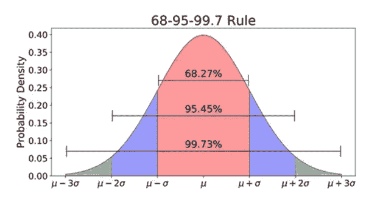
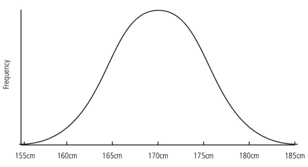
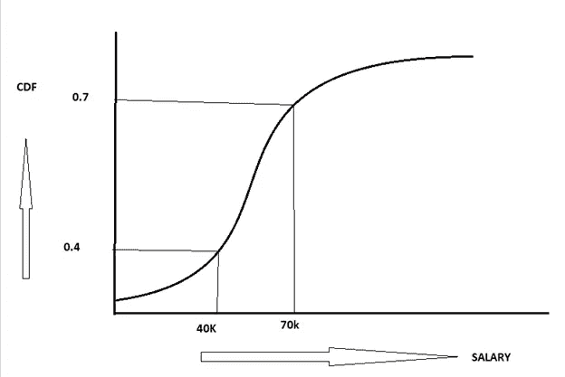
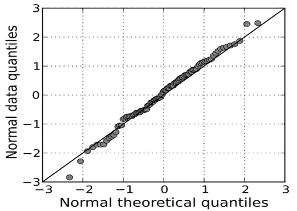

# 如何使用数据分布？

> 原文：<https://medium.com/analytics-vidhya/how-data-distributions-are-used-4403ab567c83?source=collection_archive---------15----------------------->

统计分析中最基本的术语之一是随机变量。与随机变量相关的概念有多个，如概率密度函数、累积分布函数等。

我们还有一个非常流行的分布概念，即高斯分布或正态分布，它有一些类似 68–95–99.7 的属性。

正态分布的例子

所有这些理论都很棒，但有两个大问题。

1.  如何在现实世界中使用这种分布？
2.  我们什么时候使用这些发行版？

简而言之，我说以上这些概念大多用于数据分析。

那么什么是数据分析呢？这一切都是为了回答关于数据的问题。当你的数据回答了你的问题，分析就变得很棒。

让我们通过几个例子来更好地理解这一点。

**业务问题 1:**

假设你在 XYZ 的一家公司工作，你的任务是在一年一度的活动中为所有员工订购 T 恤衫。该公司有 10 万名员工，有多种尺寸的 t 恤，如小号(S)、中号(M)、大号(L)、特大号(XL)。

现在，我们关心的是每种尺寸我们应该订购多少件 t 恤？这是一个非常有效的问题，因为如果你没有为你公司的 10 万名员工订购足够的正确尺寸的 t 恤，那么许多人将不会得到合适的 t 恤，因此他们不会使用它。如果你订购了太多特定尺寸的产品，那么大部分都会被浪费掉。对吗？所以这是一个非常有效的现实世界的问题。

**使用数据分发的解决方案**

**方法一:繁琐的方式**

要解决这个问题，一种方法是收集数据，即要求所有 10 万名员工分享他们的 t 恤尺寸。但是这种策略非常耗时，收集数据的成本太高。

**方法 2:使用统计技术**

*第一步:应用领域知识*

这种方法是一种统计方法，您可以在其中应用领域知识。这些领域知识将有助于制定某种规则，比如我们可以根据人的身高来确定 t 恤的尺寸。所以规则可能是 1。身高超过 180 厘米(5 英尺 10 英寸)的人倾向于穿加大码的 t 恤，2。如果人们的身高在 160 厘米(5 英尺 2 英寸)到 180 厘米(5 英尺 10 英寸)之间，他们倾向于穿 L 码的 t 恤。虽然这些规则可能并不完美，因为会有一些例外，如一些人可能会更宽或更薄，这些规则并不适合他们。这些规则可以说是你从以前做过这件事的人那里获得的领域知识，或者只是关于人和人的尺寸的观察。我们可以使用这些领域知识，因为从所有 10 万名员工中收集数据是昂贵的。

*第二步:使用采样*

第二步是随机收集 500 名员工的身高。从这 500 个高度，我会尝试估计均值和标准差。这就是样本均值和样本标准差。收集 500 名员工的数据并不是什么大事。我们应该以这样一种方式对数据进行抽样，即样本均值和标准差接近总体均值和标准差。

*第三步:了解样本数据分布*

第三步是理解这 500 个高度的分布，并假设它遵循高斯分布。

高度分布示例

高斯分布是在许多自然现象中观察到的理论模型，我们可以应用 68–95–99.7 的规则来解决我们的问题。

考虑到上述分布，假设 1%的样本数据高于 180 厘米。所以在 10 万名员工中，只有 1%的员工身高超过 180 厘米，因此我需要订购大约 1000 件加大码的 t 恤。

同样，我们可以根据 160 厘米至 180 厘米范围内的样本百分比，找到大码 t 恤的数量。如此等等。

**商业问题二:**

假设我们正在对一家公司所有员工的工资进行数据分析。一旦我知道工资服从具有某种均值和方差的正态分布，我就可以采用高斯分布的所有理论模型来回答许多问题，如有多少员工的工资> = 10 万美元？有多少员工的工资在 4 万到 7 万美元之间？

让我们试着理解下图中工资的累积分布。

样本工资的累积分布

如果你读了上面的累积分布图，X 轴代表薪水，Y 轴代表 CDF(累积分布函数)。工资 40k 点与 0.4 CDV(累积分配值)相关联，70K 点与 0.7 CDV(累积分配值)相关联。这是什么意思？这意味着 30%(0.7–0.4 = 0.3)的员工收入在 4 万到 7 万美元之间。同样，40%的员工工资低于 4 万美元，30%的员工工资超过 7 万美元。所有这些都是非常重要的分析数据。只有当我知道工资是否正态分布时，这才有可能。

**如何检验正态分布**

如何检验工资是正态分布的？这就是 Q-Q 图的用处。想象一下，如果我有 500 个观察值，我可以使用 Q-Q 图来确定工资是否正态分布。这是 Q-Q 图的图形表示示例。

一个正态 Q–Q 图，将垂直轴上随机生成的独立标准正态数据与水平轴上的标准正态总体进行比较。点的线性表明数据是正态分布的。

因此，高斯分布再次为我们提供了数据分布的理论模型，在自然现象的许多情况下都可以观察到高斯分布，同样的规则 68–95–99.7 也可以应用于许多数据分析问题。

参考:[https://en.wikipedia.org/wiki/Q%E2%80%93Q_plot](https://en.wikipedia.org/wiki/Q%E2%80%93Q_plot)

https://www.simplypsychology.org/normal-distribution.html