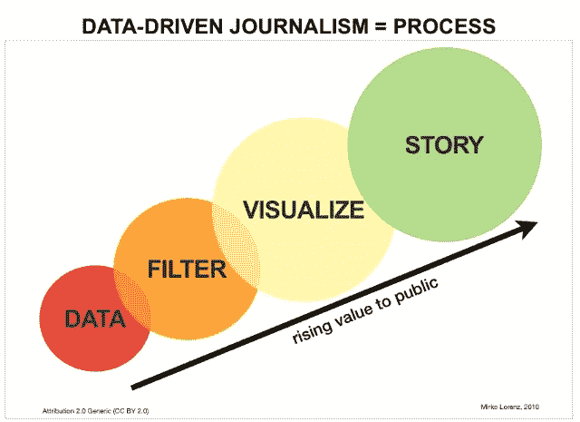
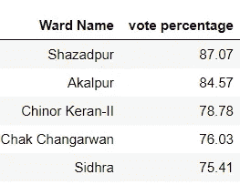
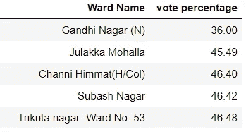
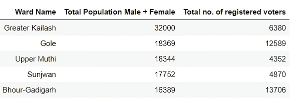
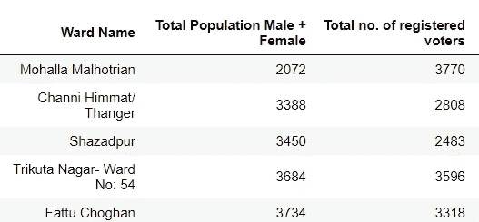
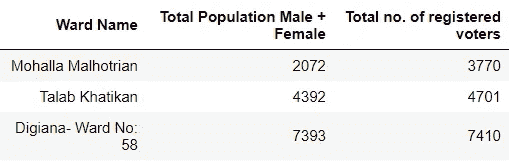

# 数据新闻如何影响媒体

> 原文：<https://medium.com/analytics-vidhya/how-data-journalism-can-impact-media-f6e45e4affc8?source=collection_archive---------31----------------------->

投票吧，因为你的生命依赖于它

这些数据是我从住房和城市事务部网站上下载的查谟市的数据。

因为数据是基于 2018 年的。

每一张选票都很重要，但如果你对这个决定不满意，为什么要责怪政府呢？真正应该责怪的是 38%没有在 2018 年选举中投票的人。只有 62%的人投票。

以下是投票率最高的选区名称:

以下是投票率最低的选区名称:

如果我们按人口统计，这里有 5 个人口最多的选区名称及其注册选民:

如果我们按人口统计，这是人口最少的 5 个选区名称及其登记选民:

登记选民多于人口的选区名称:

问题是为什么 38%的人在 2018 年选举中没有投票

如果按教育来看，该市约 20%的人口在学校(2017-18 年数据)。

在学校(私立和公立)中，每 15 名学生对应 1 名教师，这是另一个故事

让我们回到我们的故事

人们不投票的原因是什么:

1)缺乏兴趣:人们对政治不感兴趣

2)缺乏知识:人们对政府、选举过程或个别政党的政策不够了解，这就是为什么 20%的学生应该接受更多的政治教育

3)缺乏信任和信念:政党的 180 度大转弯和谎言导致不信任政党所代表的制度和信念。

我们为什么要投票(投票的行为是我是谁的一种表达):

1)你有权力决定你自己和后代想要的生活质量。投票是你为自己关心的问题挺身而出的机会，比如公共交通、提高最低工资或资助当地学校。

2)不投票就是放弃自己的声音，选举是由出去投票的人决定的。花些时间了解一下措施和候选人。如果你不投票，别人会替你做决定。你的权力在于你的投票。

3)这是你的钱，你纳税，但你知道这些钱是怎么用的吗？大多数人不会。投票是你选择如何花费税款的机会——比如为医疗保健和社会服务提供资金。

4)投票是改变的机会，你想产生积极的影响吗？投票给你这个机会！为了更大的利益，支持能够帮助你的社区、州、甚至国家的候选人和投票措施。让你的声音在这些选举中被听到。

社区依赖于你，我们的社区由朋友、爱人、邻居和孩子组成。有些人可能不知道投票有多重要，有些人则没有这个特权。决定为自己和身边的人投票。

**确保你的声音被听到——投票吧！**

参考资料:1)[https://www . alta med . org/articles/5-reasons-why-you-should-vote](https://www.altamed.org/articles/5-reasons-why-you-should-vote)

2)[https://www . raconteur . net/current-affairs/why-people-not-vote](https://www.raconteur.net/current-affairs/why-people-dont-vote)

3)【https://www.apa.org/monitor/2008/06/vote】T4

4)[https://smartcities.data.gov.in/cities/Jammu?filters % 5b ogpl _ module _ domain _ access % 5D = 3&filters % 5b field _ smart city % 3a name % 5D =查谟&format = JSON&offset = 0&limit = 9&sort % 5b created % 5D = desc](https://smartcities.data.gov.in/cities/Jammu?filters%5Bogpl_module_domain_access%5D=3&filters%5Bfield_smartcity%3Aname%5D=Jammu&format=json&offset=0&limit=9&sort%5Bcreated%5D=desc)

5)[https://www.coursera.org/specializations/data-mining?](https://www.coursera.org/specializations/data-mining?)

**感谢住房和城市事务部**