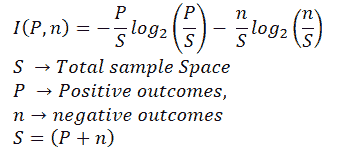
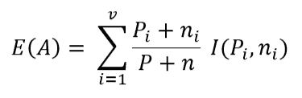
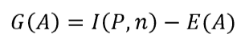
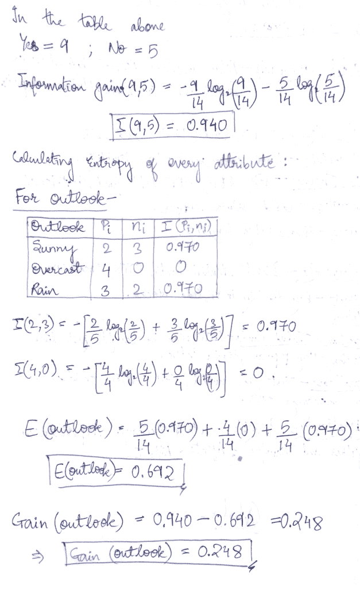
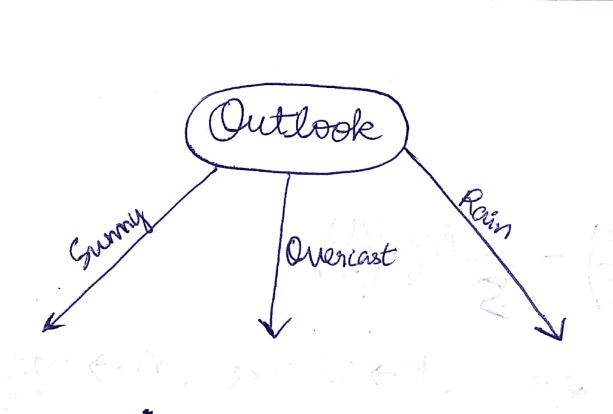
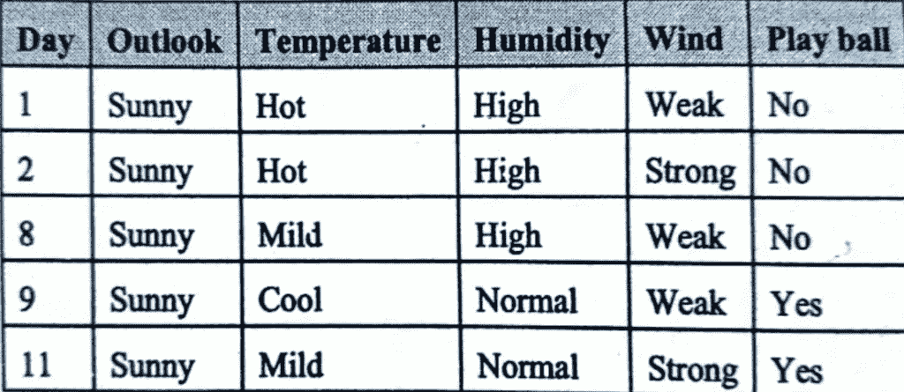
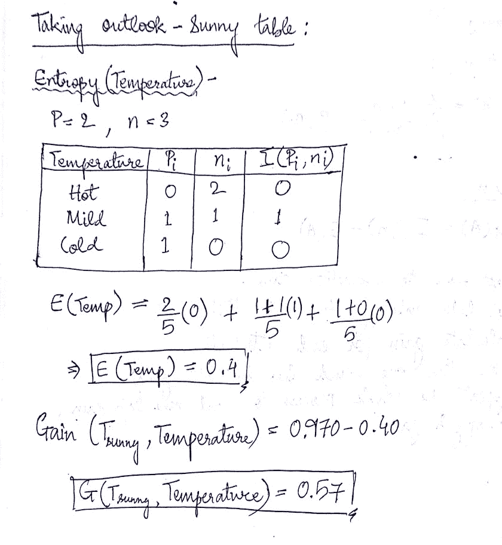
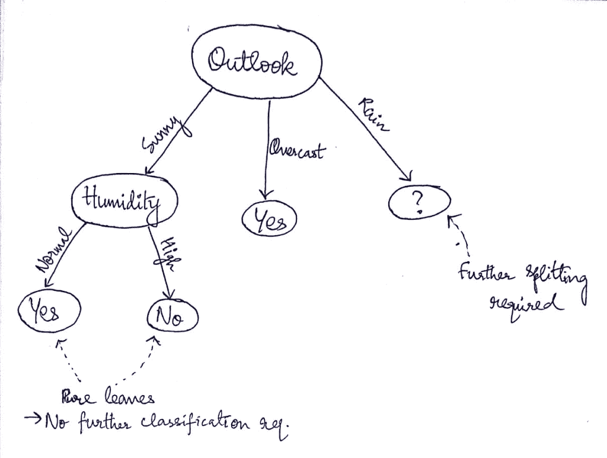
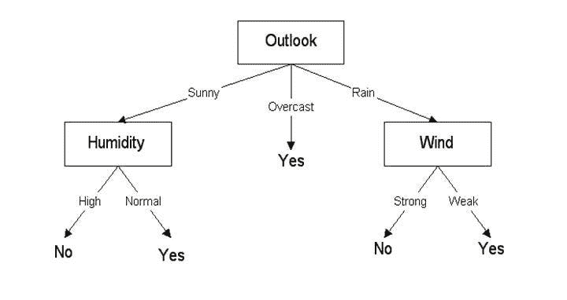

# 决策树是如何工作的？

> 原文：<https://medium.com/analytics-vidhya/how-decision-trees-work-2aa04879ef23?source=collection_archive---------30----------------------->

今天我将解释一个最常用的数据分类算法，决策树。在这种分类中，我们根据特征分割数据，然后进一步根据另一个特征分割数据，直到最后。我将使用 ID3(迭代二分法 3)来解释，它利用熵和信息增益度量来计算节点(特征)和叶子(最终输出)。

主要思想是以倒置树的形式划分整个数据集，并在每个分支的末端获得单个结果。

# 那么我们如何建造呢？

从树开始，我们需要一个属性(特征),它可以在数据中给出最大的分裂(或最大的信息增益),这样我们可以在最少的迭代中到达分支的末端。

让我用一个经典的“打网球”数据例子来解释一下:

这里我们需要根据某一天的天气情况来决定我们是否可以打网球。

正如我们在这里看到的，我们有 4 个属性(天气、温度、湿度和风力),根据这些属性我们可以决定是否去打网球。因此，让我们使用 ID3 算法来构建一棵树！

从根节点开始，我们需要选择能够对它们进行分类的最佳属性/特征。

# 如何选择最佳分类属性？

这里，我们借助信息增益公式，对每个属性进行计算。给出最高增益的那个将被选为我们的根节点。

主要有 3 个公式将用于 ID3 算法，它们是:

信息增益-

熵-

获得-

这些是我们遵循的步骤:

1.  首先计算表的信息增益。
2.  计算该属性的熵。
3.  现在计算相应属性的增益。
4.  取具有最高增益的一个作为节点。
5.  重复整个过程，找到新的一组信息增益、熵和过滤属性值后的增益。

以类似的方式，我也计算了其他属性的增益。

增益(展望)= 0.248
增益(温度)= 0.029
增益(湿度)= 0.151
增益(风)= 0.048

正如我们可以看到的，我们在“展望”属性中获得了最高的收益，因此，这将是我们决策树的根节点。因此，我们的决策树看起来像这样:

现在，我们将对表的子集重复相同的步骤，其中我们采用每种类型的展望，并查看哪个属性将用于进一步进行决策树。

因此，当我们以“阳光明媚”为前景时，我们只剩下这几行。

类似地，我们计算其他属性(湿度、风)的熵和增益。因此，这些是 Sunny table 中属性的增益:

增益(温度)= 0.57
增益(湿度)= 0.970
增益(风)= 0.020

正如我们可以看到的，最高增益是由**湿度**属性获得的，因此它成为我们分类的下一个节点。同样，如果我们看到阴天的前景，我们观察到所有的结果都是肯定的，我们可以直接在这里结束它(这是叶子)。

因此树木现在看起来像这样:

正如你现在可能已经有了一个想法，我们应该如何进行展望-雨表。对表 outlook-rain 再次执行上述步骤后，Wind 的增益最高，我们最终准备好了完整的决策树，它看起来是这样的:

我甚至用 python 实现了上面的算法，如果你想知道它是如何实现的，请查看我的 GitHub 库[这里](https://github.com/madhuresh97/DecisionTreeExample)。

我希望到现在为止，你已经对决策树的工作原理和计算方法有了一个非常清晰的理解。

谢谢！

*原载于 2020 年 5 月 17 日*[*http://madhureshgupta . home . blog*](http://madhureshgupta.home.blog/2020/05/17/how-decision-trees-work/)*。*