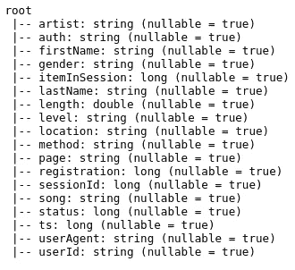
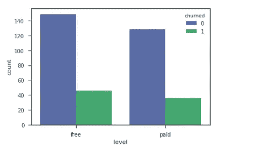
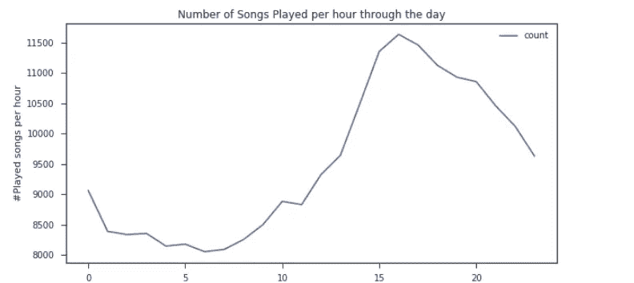

# 在客户来敲门之前，我如何预测客户流失？

> 原文：<https://medium.com/analytics-vidhya/how-did-i-predict-customer-churn-before-it-knocked-on-my-door-958ade92232b?source=collection_archive---------32----------------------->

# 介绍

Sparkify 是一个虚拟音乐流媒体服务，旨在让听众体验更好，无论你的计划是什么，我们的产品都会伤害这种体验，为此，我们需要知道客户是否想在不久的将来流失，然后我们可以采取适当的决定来避免这种情况，今天我写这篇文章向你展示我是如何根据用户历史在用户流失发生之前预测用户流失的。

在这个项目中，我遵循了这个过程:

*   数据探索和清理。
*   特征工程和数据转换。
*   模型训练、改进和评估。

解决问题，实现项目目标。

# 数据探索

## 概观

首先，这些数据得到了 [DSND](https://www.udacity.com/course/data-scientist-nanodegree--nd025) 的支持，包含了一个大约(12GB)的良好数据集，但为了验证这个概念，我们使用了整个数据集的一个很小的子集(128MB)，使用 [Pyspark](https://spark.apache.org/docs/latest/api/python/index.html) 来构建机器学习管道，并创建 ETL。

要开始加载数据，我们需要创建 spark sessions，然后加载 Sparkify 跟踪用户活动的数据，记录还包含收听会话、艺术家、歌曲、持续时间、用户信息，包括一些人口统计数据和访问的页面，下面我们可以找到数据方案的初始视图和预期值的样本。

图[1]数据集方案

图[2]数据集值示例

## 数据清理

*   **空值**

处理空值是任何数据集清理阶段的基本操作，在这里，我研究了空值并在许多列中发现了它们。

图[3]数据集中空值的平均值

但我总结成两种类型:—

I. ID 列空值，如“userId”和“sessionId”。

二。非 ID 列为空值，如“艺术家”和“长度”。

对于 ID 列，最常见的决定是删除，因为您不知道这些数据具体指的是谁，但是对于其他列，我们可以在以后基于特性状态做出决定。

*   **日期时间格式**

另一个常见的清理步骤是日期-时间列的格式化，它通常不是以人类可读的格式进行格式化的，因此我们需要以一种良好的方式对它们进行格式化，或者根据我们遵循的分析方法将它们提取到多个特征中，在我们的例子中，我们格式化这些列，并将它们拆分为“事件时间”、“注册时间”和“事件小时”，我们将在稍后的特征工程步骤中使用它们。

图[4]处理后的日期时间列

## 定义流失

**什么时候顾客可以被定义为被搅动？**

一旦用户点击了`cancellation confirmation`页面，出现在用户日志中的活动就可以被定义为来自我们服务的流失，而不再出现在日志中。

图[5]流失用户数

看了一下这个因素后，我们发现 225 个用户中有 52 个是被搅动的用户，所以我们需要将他们标记为被搅动的用户，并深入了解他们自注册服务以来的活动，并从我们在下面探索的一些方面来看:

**1。性别之间的变动模式:**

除了一种性别之外，还有其他性别可能会发生变动吗？

图[6]不同性别的流失人数

> 男性顾客比女性顾客更容易流失。

**2。用户计划类型和翻腾:**

图[6]每个用户计划的搅拌

> 客户流失通常发生在当客户使用免费计划时，他们可能觉得没有义务继续使用该服务

**2。报名以来的听课活动:**

**A .收听歌曲数量**

图[7]每个用户和性别类型的流媒体歌曲数量

**B .竖起大拇指数歌曲数**

图[8]每个用户和性别类型的拇指上行歌曲数

> 顾客一生中听过的歌曲无论是喜欢的还是只是听过的，变化都不大。

**4。每次会话的歌曲活动**

图[9]每个用户类型的活动会话计数

> 忠诚的用户比不忠诚的用户在服务上花费更多的时间

**5。翻唱的用户比没翻唱的用户听歌多吗？**

图[10]听歌对喝醉的用户很重要

> 没喝醉的用户比喝醉的用户听更多的歌

**6。一天中除了其他时段，还有其他时段有活动吗？**

图[11] 24 小时歌曲活动

> 白天比晚上更活跃。

# 特征工程

特征工程步骤将集中于为模型训练寻找有前途的特征，并且将关注以下特征:

**1。播放的歌曲总数**

用户听的歌曲越多，花在我们服务上的时间越多，用户参与度就越高，流失的机会就越少。

图[12]关于总歌曲播放特征的统计

**2。账户寿命**

自用户注册以来的时间长度。它可以反映用户参与度和忠诚度。

图[13]关于寿命特征的统计

**4。总收听时间**

它在检测用户活动并将其分成许多功能方面非常有用。

图[14]关于 listen_time 特性的统计数据

**5。每位用户的平均会话歌曲数**

每个会话的歌曲数量将用户在长时间活动(如工作或只是小会话)中使用服务进行分类。

图[15]关于 avg_session_songs_user 特征的统计

6。拇指向上/向下的总数

它们可能反映了两个方面，我们的服务质量和用户参与度。

图[16]关于拇指向上和拇指向下数字特征的统计

**7。添加到播放列表的歌曲总数**

将歌曲添加到列表中可以帮助推荐和发现用户的口味，并改善用户体验，这可能在搅动中起作用。

图 17 是关于添加到播放列表特征的统计

最后，在将这些特征结合在一起之后，我们添加流失标签，以获得将成为我们模型的基本特征的这个方案。

图[18]准备引入模型的最终方案

然后，我们应用 3 个步骤来完成数据处理，以引入培训阶段:

**一、特征矢量化:**使用 *VectorAssembler 将目标列从特征列中分离出来。*

**二。标准化数值特征:**通过取平均值并除以每个特征的标准差。

**三。数据分割:**将数据分为训练、验证和测试集，分别为 60%、20%和 20%，如下所示。

图[19]数据分割汇总

# 建模

## 培养

训练阶段的重点是通过交叉验证(5 重)将训练数据传递给一些分类器，这里是初始训练的总结，可以很容易地观察到第一个模型(基础模型)和最后一个模型之间的巨大差异，通过 [F1-score](https://towardsdatascience.com/accuracy-precision-recall-or-f1-331fb37c5cb9) 指标，我们选择该指标作为本项目中验证集的评估指标。

图[20]训练模型比较(分数和时间)

## 选择和提炼

我们确实关心时间资源，由于数据大小仍然相对较小，并且性能差异巨大，我们将更喜欢性能最好的模型。因此，我们选择**梯度增强树(GBT)** 模型作为最终使用的模型，并进行网格搜索，这次通过研究具有相同折叠数的 GBT 模型上的`maxDepth`和`maxIter`特征来微调我们的模型，并使用 F1 得分度量来评估它们。

## 估价

在模型调优之后，我们发现`maxDepth=5`和`maxIter=20`是我们模型的最佳参数，在验证集上得到 0.9 F1 分，在测试集上得到 0.71 分。

# 结论

作为时间序列事件数据提供的数据详细说明了用户在使用 Sparkify 服务时的活动，但用户流失是一个大问题，data science 通过**根据事件数据预测将流失的用户来解决此类问题，**我们遵循 [CRISP-DM](https://www.sv-europe.com/crisp-dm-methodology/) 方法来解决此问题，并获得了一个良好的模型，在验证集上的得分为 0.9 F1-得分，比我们的原始基础模型的 0.56 有所提高，并观察到了我们模型所基于的一些可靠功能。

图[21]选择的模型特征重要性分数

从上面的图表中，我们可以很容易地观察到这些特征是最重要的特征，它们可以决定用户在未来的预期行为:

*   喜欢/不喜欢的歌曲总数。
*   帐户生存期。
*   在单个会话中或一般情况下播放的歌曲数量。

**改进**

在考虑更多因素、添加更多功能后，功能可以得到很大改善，但随着用户群的增长，我们可以使用更多数据来获得更好的结果。

目前，我们有一部分独立用户，我们只使用其中的 60%进行培训。也就是说，如果样本量增加，模型有很大的改进潜力，预期性能也会提高。

最后，如果你对这个分析的细节很好奇，想深入了解，请不要犹豫，直接进入我的 [*GitHub*](https://github.com/DevMahmoud10/Sparkify) *repo。*