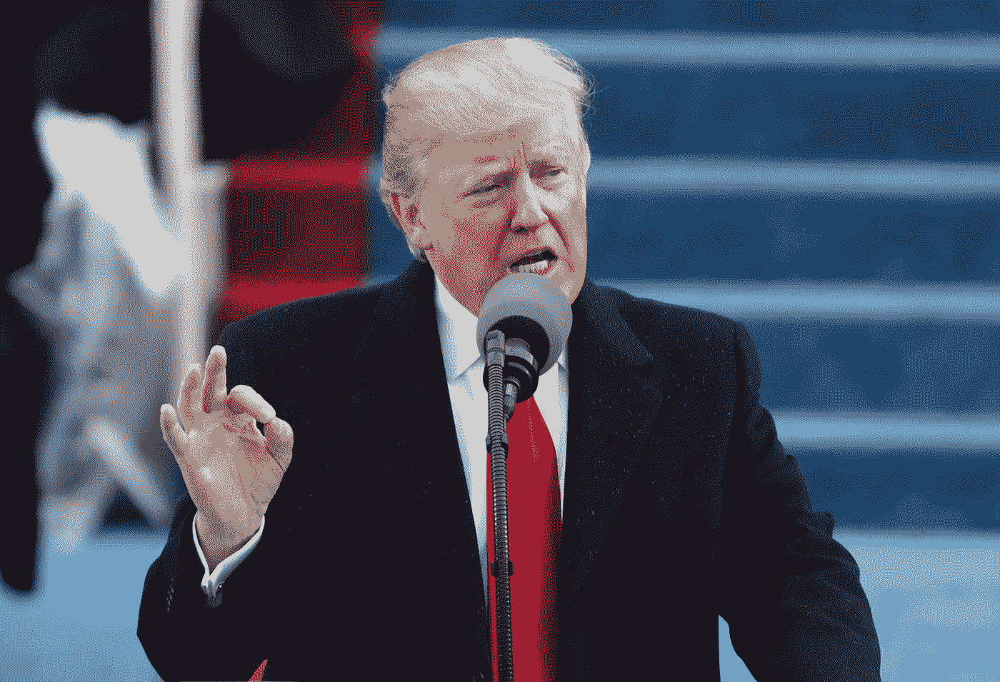
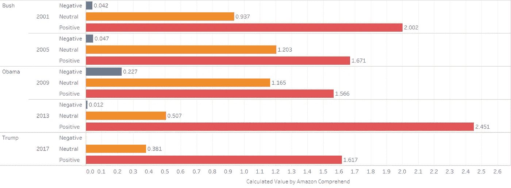
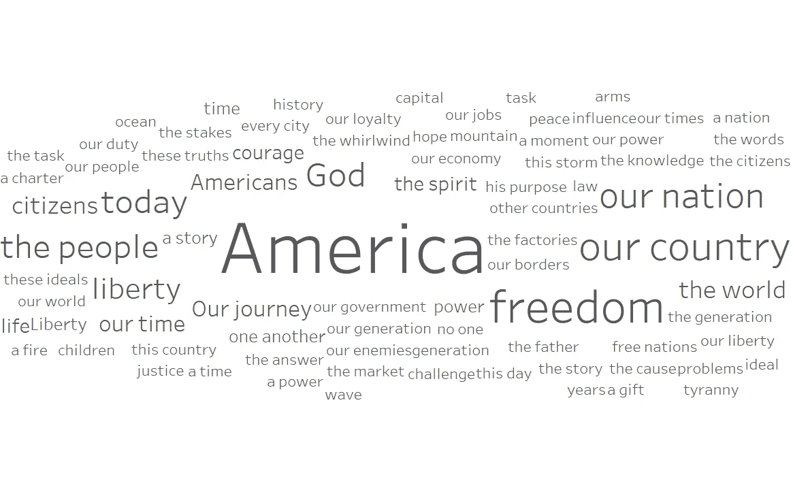
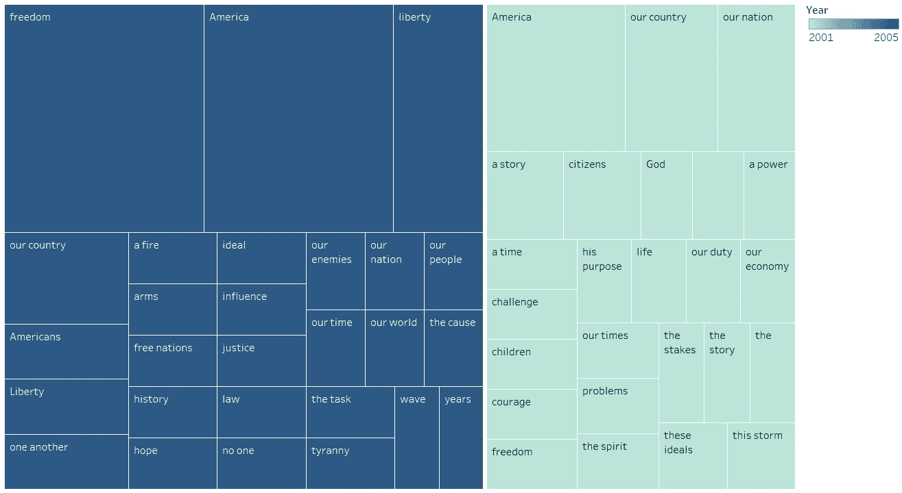
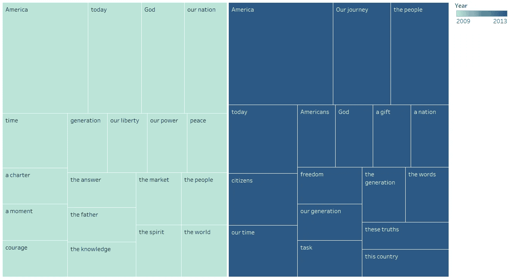
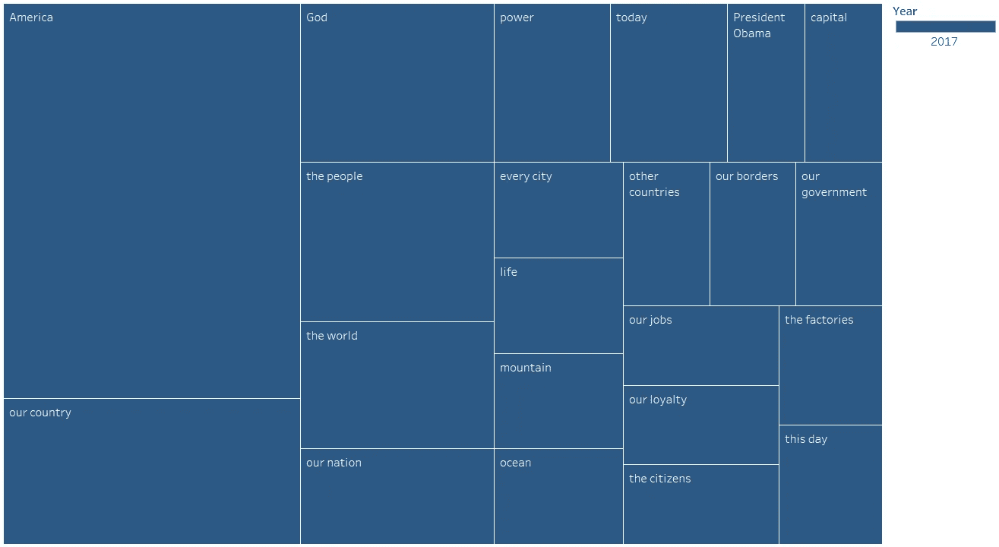

# 21 世纪是如何塑造就职演说的？

> 原文：<https://medium.com/analytics-vidhya/how-did-the-21st-century-shape-inaugural-addresses-e974c5e52eaa?source=collection_archive---------13----------------------->

## 2001-2017 年美国总统就职演说分析。

就职演说是就职典礼的一部分，它标志着新当选的美国总统四年任期的开始。总统们通常利用这个机会展示他们对美国的愿景，并为国家设定目标。

由于这些演讲总是人们关注的焦点，在我看来，探索它们的结构和它们传达的微妙信息是值得的。因此，我用 [*ytmp3*](https://ytmp3.cc/) 从 *Youtube* 下载了五篇最新的就职演说，然后上传到*亚马逊网络服务*上的 *S3* 桶里，以便能够用*亚马逊转录*把它们转换成文本。接下来，使用 *R* 以及 AWS 的*understand*库对脚本进行分析，包括情感分析和关键短语频率分析。首先，让我们讨论一下情感分析的结果。

情感分析的结果

可以得出结论，所有的演讲都给人留下了积极的印象，这并不奇怪，因为就职演说的主要目标之一是为增长和繁荣确定道路。然而，经济和政治因素对演讲的潜在影响不容忽视。根据调查结果，奥巴马 2009 年的演讲得到了最高的负分，比其他所有负分高一个数量级。据推测，造成这种情况的原因是 2008 年冲击全球经济的金融危机。第二高的负分来自布什 2005 年的演讲，这是 911 恐怖袭击后的第一次就职演讲，也是在阿富汗和伊拉克战争期间发表的演讲。

为了更深入地研究演讲的内容，并更好地理解它们如何反映一个时代的重要事件，我还进行了一次关键短语频率分析。以下是 21 世纪就职演说中最常用的短语。

就职演说中最常用短语的词云

一般来说， ***美国*** 是五个被分析地址中出现频率最高的词，依次是 ***【自由】******我国******我国*** 和 ***上帝*** 。由于这些都是与爱国主义联系在一起的非常普遍的概念，它们很容易主宰每一次演讲。因此，为了洞察一位总统即将出台的政治议程，需要逐一检查他的演讲。

乔治·w·布什就职演说中出现频率最高的短语

按照时间顺序，乔治·w·布什在 2001 年和 2005 年发表了 21 世纪的前两次就职演说。虽然布什的第一次演讲侧重于经济挑战，但他的第二次演讲清楚地反映了国内安全和恐怖主义威胁是如何在 911 袭击后成为布什政府的主要关注点的。除此之外，它的特点是短语****正义*** 和 ***任务*** 这可能是指他早些时候宣布，该国将不会休息，直到*找到、阻止并击败全球范围内的每一个恐怖组织。**

**

*巴拉克·奥巴马就职演说中最常见的短语*

*以下两场世纪演讲是由巴拉克·奥巴马在 2009 年和 2013 年发表的。根据短语 ***市场******回答*** 和 ***勇气*** 他 2009 年的演讲以解决金融危机的重要性为主题。他在 2013 年的演讲——根据情绪分析，这是最积极的演讲——充满了更普遍的观念，如****我们这一代******我们的旅程*** 。有趣的是，有一些短语( ***今天的*** ， ***我们这一代*** )似乎是奥巴马演讲的特色，因为它们出现在两篇演讲中，但在其他三篇演讲中却没有。**

****

**唐纳德·特朗普就职演说中出现频率最高的短语**

**唐纳德·特朗普在 2017 年发表了最新的就职演说。它和以前的演讲一样关注爱国主义，唯一不同的是在最常见的概念上，上帝在他的演讲中比在他的前任的演讲中稍微更频繁。该地址还包含提及其竞选议程的短语，包括*****工厂*** 和 ***我们的工作岗位*** 。****

**总的来说，我们可以看到，21 世纪的所有就职演说都倾向于传达一个总体上积极的印象，并且有一些关键短语通常主导这些演讲。然而，新当选的总统也乐于为当代的挑战提供答案，因此，我们可以在分析的就职演说的关键主题中看到一些变化。**