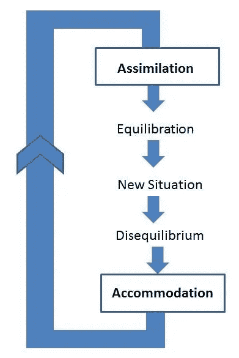
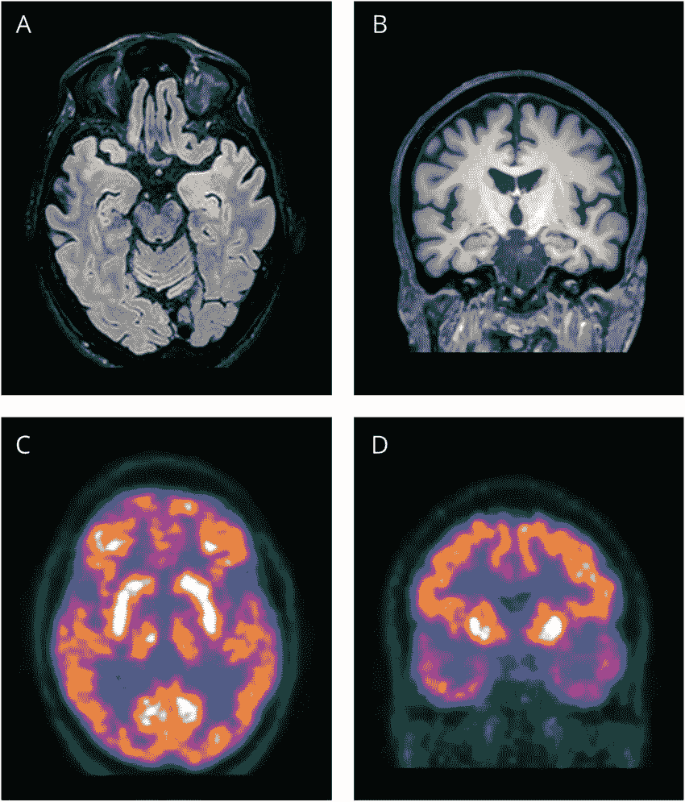
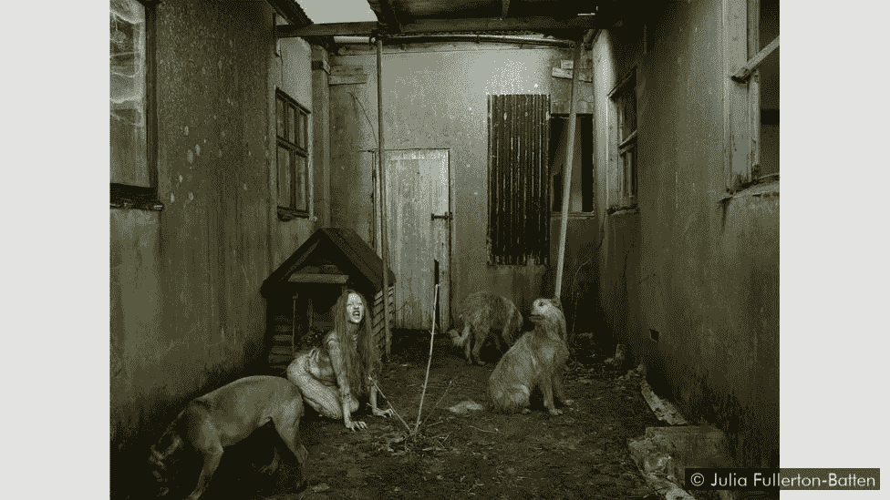

# 孩子们是如何了解这个世界的？

> 原文：<https://medium.com/analytics-vidhya/how-do-children-learn-about-the-world-6feee19b3085?source=collection_archive---------7----------------------->

本·麦克劳德在 [Unsplash](https://unsplash.com?utm_source=medium&utm_medium=referral) 上的照片

## 通过儿童获得学习的渴望，一种认知发展的方法。

> 随着我第一个孩子出生的日子一天天过去，我对婴儿和儿童如何学习产生了兴趣。在挖掘了一些心理学文章后，我想分享其中一些，并比较它们，看看我们当前的人工智能方法的相似性和差异。
> 
> **后天培养还是天生的？**我们人类受遗传基因的影响有多大，受外界因素的影响有多大？

这不是我通常关于机器学习的帖子，而是试图从我的狭隘观点中走出来，看看更广阔的图景。该员额将包括以下内容。

1.  认知发展理论
2.  大脑可塑性
3.  儿童的大脑和早期经历
4.  案例研究——亚马逊部落皮拉哈人的野孩子
5.  是什么让我们成为人类？

# **1。认知发展理论**

让·皮亚杰(1896-1980 年)

> 让·皮亚杰(1936)是第一个对认知发展进行系统研究的心理学家。他的贡献包括儿童认知发展的阶段理论，儿童认知的详细观察研究，以及一系列简单而巧妙的揭示不同认知能力的测试。

当我们谈论心理学和认知发展时，让·皮亚杰肯定会出现。他揭开了我们发展早期的神秘面纱，并为我们提供了一个认知发展理论。我们先来看看他的内在和儿童认知发展的不同阶段。

适应过程

# **建构主义**

皮亚杰受到了被称为“建构主义”的理论符号的影响。它来源于这样一种观点，即知识不是固定不变的，而是逐步构建的。儿童根据他们的经验和对环境的适应来建构知识和形成意义。皮亚杰的认知理论有三个基本组成部分。

**图式(一种组织知识的方式)**

图式(图式的复数)是世界心智模型的基本构件，我们可以将图式视为与世界的方方面面相关的知识“单元”，包括对象、动作和抽象(如理论概念)。

当儿童通过环境获得新的经验时，他们增加了图式的数量和复杂性。

例如，想象自己是个孩子，第一次尝试点菜。你必须建立菜单、钱、不同种类的面包等的模式。但是为什么我们不会被不同种类的面包所迷惑呢？或者一种完全不同的食物，比如[鸡饭](https://en.wikipedia.org/wiki/Hainanese_chicken_rice)？这是因为适应过程允许我们将新的鸡肉米饭模式映射到食物类别中。

> 模式就像机器学习中的向量表示。

**适应过程(从一个阶段过渡到另一个阶段)**

我们的智力成长可以理解为一个适应/调整世界的过程。这允许我们更新我们对世界的理解，这允许我们的模式保持相关以处理新的对象或情况。这是一个过程，包括 3 个阶段**同化、适应和平衡**。

*   同化使一个人将新的经历融入旧的经历中。这导致个人发展新的观点，重新思考曾经被误解的东西，评估什么是重要的，最终改变他们的看法。
*   **另一方面，适应是把世界和新的经历重新组织成已经存在的心智能力。当现有的模式(知识)不起作用，需要改变来处理新的对象或情况时，就会发生这种情况。每个人都有一个特定的想法，这个世界就是在这个想法中运作的。**
*   **平衡**是当孩子的图式通过同化处理大多数新信息时，心理状态发生的变化。当新的信息出现时，它会导致一种不愉快的不平衡状态，即新的信息不能适应现有的图式(同化)。平衡驱动着学习过程，因为我们不喜欢沮丧，并寻求通过适应来恢复平衡。一旦新信息被映射到一个模式(新的或旧的)，我们就回到一个平衡状态。

> 适应可以看作是图式的聚类过程或在我们的聚类中增加一个新的数据点。但是聚类算法将需要自组织映射的形式，因为自适应过程知道何时在必要时形成新的聚类。从 ML 训练的角度来看，这将更新我们的世界模型权重，以便为对象或事件创建最佳表示向量。但是 ML 缺乏在必要时创建新类的能力。我们的 ML 方法可能需要学习如何形成新的模式，当我们现有的方法不能捕获这些新的经验时。
> 
> 我们不知道的是这种表示向量的维数和驱动学习的理想方式(平衡过程)。在 ML 看来，驱动学习过程的是诸如随机梯度下降(SGD)之类的优化函数，其中我们下降以找到全局最小值。我们人类会陷入局部极小状态，不再可能学习语言和数学等新概念吗？(大脑可塑性)

# **皮亚杰认知发展的 4 个阶段**

皮亚杰的认知发展理论认为，儿童经历了 4 个智力发展阶段。他的理论侧重于理解儿童是如何获得关于客体永久性、数字、分类、数量、因果关系和公正等概念的知识的。这 4 个阶段是:

*   **感觉运动**(从出生到 18-24 个月)

知道了对象的永恒性，对象即使被隐藏也是存在的。

*   **产前**(18-24 个月到 7 岁)

能够象征性地思考问题。一个词或一个物体代表除了它本身以外的东西。但是思维仍然是以自我为中心的，婴儿很难接受他人的观点。这种以自我为中心的行为显示了某些动物的认知极限。

*   **具体操作**(7 至 11 岁)

儿童认知发展的主要转折点，因为它标志着逻辑或操作思维的开始。儿童可以理解不同的表示数字，如年龄、质量和体重。但有时需要借助图片和物品来解决难题。

*   **正式运营**(成年 11 岁及以上)

在这个阶段，它发展了思考抽象概念和逻辑测试假设的能力。一个孩子可以在头脑中而不是在物理形式中解决问题。

> 如果一个人能够在没有物理形态帮助的情况下只用内部运算解决复杂的问题，我们通常认为这个人是天才。比如尼古拉·特斯拉和斯蒂芬·霍金。我相信我们可以通过训练来解决大脑中的复杂问题。但是大自然在决定这种能力能发展到什么程度上起着更大的作用。也就是说，我们将研究养育的影响，以及当孩子完全没有养育时会发生什么。(4.案例研究)

每个孩子都以同样的顺序经历这些阶段，孩子的发展是由生物成熟(自然)和与环境的相互作用(养育)决定的。皮亚杰发现，儿童进步的速度存在个体差异，有些人可能永远也到不了后期。

 [## 让·皮亚杰理论与认知发展阶段

### 皮亚杰是第一个对儿童认知发展进行系统研究的心理学家。皮亚杰的理论…

www.simplypsychology.org](https://www.simplypsychology.org/piaget.html)  [## 正式运行阶段

### 由索尔·麦克劳德于 2010 年出版，正式的操作阶段大约从 12 岁开始，持续到…

www.simplypsychology.org](https://www.simplypsychology.org/formal-operational.html) 

# 2.大脑可塑性

[https://www . research gate . net/Figure/Figure-Structural-and-functional-brain-imaging _ fig 1 _ 323860846](https://www.researchgate.net/figure/Figure-Structural-and-functional-brain-imaging_fig1_323860846)

大脑可塑性是大脑修改其连接的能力。通过使用功能性脑成像(上图)的现代科学，我们现在知道学习的过程实际上在细胞水平上改变了我们大脑的结构。我们的大脑成长变化，为新信息腾出空间。

与计算机不同，神经通路复制功能，因此通过沿着不同的通路重新路由信号，可以很容易地纠正发育中的小错误或因损伤而暂时丧失功能。

我们的神经元连接在婴儿期处于高峰，一个婴儿从子宫中出来时就有 1000 亿个神经元，几乎是成人的两倍。这大量的神经元是婴儿在生命的第一年学习所必需的。突触在不再需要时会收缩起来，这就是所谓的突触修剪。

汉克·格林对大脑可塑性的简短解释

> 人脑和机器之间的一个明显区别是，生物学选择复制相似的大脑功能。在那里，如果你参加任何编程语言课程，我们被教导最大限度地重用函数。(现在你可以以此为借口复制功能 ***😏*** )
> 
> 生物大脑的另一个不同之处是，神经元在学习时会生长、修改和修剪。另一方面，我们的 ML 架构是由设计决定的，我们不能在培训期间改变设计。也许这解释了为什么辍学是通过关闭一些神经元而起作用的。(您可能还想研究 AutoML，模型修剪)

# 3.儿童的大脑和早期经历

随着对大脑可塑性的理解，我们现在知道幼儿的大脑非常具有可塑性，早期刺激非常重要。婴儿需要的不仅仅是牛奶、拥抱和换尿布。

虽然发展的早期阶段受到遗传因素的强烈影响；例如，基因将新形成的神经元引导到它们在大脑中的正确位置，并在它们如何相互作用中发挥作用。然而，基因并不能完全设计大脑。

相反，基因允许大脑根据它从环境中接收的输入来微调自己。例如语音，刺激与语言相关的大脑区域的活动。随着输入量的增加(如果听到更多的语音)，该区域神经元之间的突触会更频繁地被激活。

重复使用加强了突触。很少使用的突触仍然很弱，更有可能在修剪过程中被淘汰。突触强度有助于支持学习、记忆和其他认知能力的网络的连通性和效率。因此，一个孩子的经历不仅决定了什么信息进入她的大脑，也影响了她的大脑如何处理信息。

> 研究表明，婴儿在四个月大的时候可以辨别世界上任何一种语言的声音，但是到了八个月大的时候，他们就会失去这种能力。
> 
> 研究还表明，在笼子里长大的老鼠比在有攀爬、躲藏和挖掘笼子的环境中长大的老鼠有更少的树突分枝。

# **4。案例研究**

## 野孩子

乌克兰奥克萨纳马来亚的创作形象，1991

野生儿童是指从很小的时候就远离人类生活的人类儿童，他们很少或没有人类关怀、爱或社会行为的经验，更重要的是，他们没有学习人类语言。野孩子被关起来，被动物买走，与世隔绝地生活在野外。

大多数从 3-7 岁开始就与人类没有任何接触并被动物养大的野生儿童，在学习任何语言或人类行为方面都有困难或无法学习。他们已经错过了学习语言的黄金机会，修剪过程已经开始。

【1991 年

乌克兰女孩奥克萨娜·马来亚。根据富勒顿-巴顿的说法，“1991 年，奥克萨娜被发现和狗一起住在狗舍里。她八岁了，已经和狗一起生活了六年。她四肢着地跑着，吐着舌头喘着气，张牙舞爪。因为她缺乏人际交往，所以只知道‘是’和‘不是’两个字。”奥克萨娜现在住在敖德萨的一家诊所，和医院的农场动物一起工作。

 [## 野狼:被狼养大的孩子

### 朱莉娅·富勒顿-巴滕创作了一系列令人不安的照片，讲述了在…

www.bbc.com](https://www.bbc.com/culture/article/20151012-feral-the-children-raised-by-wolves) 

## **亚马逊部落的皮拉哈人**

[https://www.facebook.com/piraha.people/photos/?ref=page_internal](https://www.facebook.com/piraha.people/photos/?ref=page_internal)

大多数人在小时候就学会了数数。然而令人惊讶的是，并不是所有的语言都有代表数字的单词。最近发表在《认知科学杂志》上的一项研究表明，语言中缺乏数字词汇会导致这些文化中的人们在执行常见的量化任务时有困难。

亚马逊的皮拉哈人是一群大约 700 人的半游牧民族，居住在亚马逊河支流迈茨河沿岸的小村庄里，大约有 10 到 15 个成年人。根据迈阿密大学人类学语言学家 Caleb Everett 的说法，Piraha 人令人惊讶地无法表示精确的数量。他们的语言只包含三个不精确的数量词:Hòi 表示“小的尺寸或数量”，Hò i 表示“稍大的数量”，baàgiso 表示“使聚集在一起，或许多”。语言学家把没有特定数字的语言称为数字语言。

 [## 没有文字你无法计算:亚马逊部落缺少表示数字的文字

### 一位人类语言学家指出，亚马逊部落皮拉哈人的语言缺乏数词，作为一种特殊的语言，皮拉哈人的语言缺乏数词

www.sciencedaily.com](https://www.sciencedaily.com/releases/2012/02/120221104037.htm#:~:text=Summary%3A,time%20performing%20common%20quantitative%20tasks.&text=Most%20people%20learn%20to%20count%20when%20they%20are%20children) 

> 从上面的例子中，我愿意认为我们的大脑在学习互动时陷入了局部最小值。大脑的某些部分因为偏好其他功能而被修剪，这使得学习语言或数学变得异常困难。
> 
> 这也显示了培养的重要性，如果完全没有培养，我们可以彻底改变一个人。因此，自然是舞台，后天培养是表演。

# **5。是什么让我们成为人类？**

我们人类是群居动物，能够通过语言交流和传递知识，我们可以想到可供选择的未来，在头脑中创造抽象概念，并相应地做出深思熟虑的选择。社会交往在我们的生活中扮演着重要的角色，我们的行为实际上是由我们所生活的社会塑造的。人类通过与他人的互动学会了爱、贪婪或暴力行为，因为孩童时期并没有生来就有这样的情绪。儿童只是一面镜子，反映出社会的真实面目和呈现给他们的东西。

作为一个物种，我们受到道德责任的约束。我们的行为正在改变这个星球，我们是这个星球上唯一有能力预见和规划长远未来的物种，而其他生物却不能。我们应该更加努力地思考我们留给这个星球的影响，不要仅仅从人类的角度思考，而是作为占据这个星球的大家庭的一员。

 [## 第一年的神经科学|育儿资源

### 新生婴儿的大脑在出生时是不完整的——不像他们的其他器官，它们功能齐全，只需要…

www.parentingresource.nz](https://www.parentingresource.nz/supporting-information/neuroscience-in-the-first-year/)  [## 什么是大脑可塑性，为什么它如此重要？

### 神经可塑性——或称大脑可塑性——是大脑修改其连接或重新连接自身的能力…

theconversation.com](https://theconversation.com/what-is-brain-plasticity-and-why-is-it-so-important-55967)  [## 婴儿的大脑从现在开始:从受孕到 3 岁

### 由于最近科技的进步，我们对这些影响如何与早期癌症相关有了更清楚的了解。

www.urbanchildinstitute.org](http://www.urbanchildinstitute.org/why-0-3/baby-and-brain)