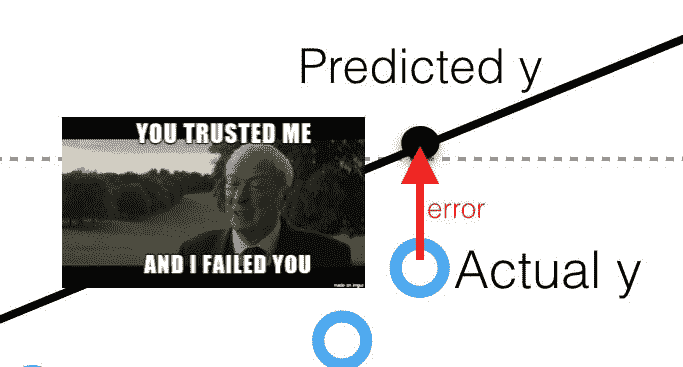
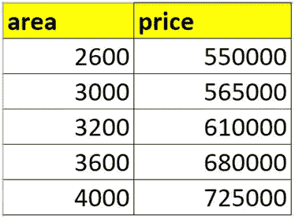
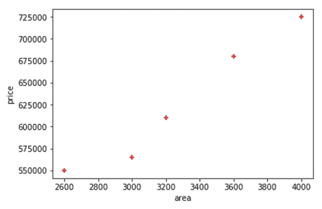
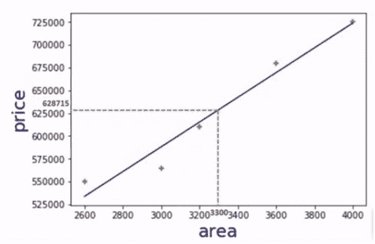
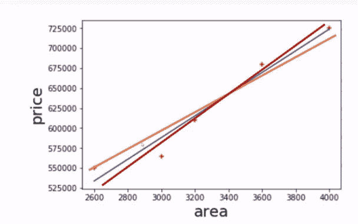
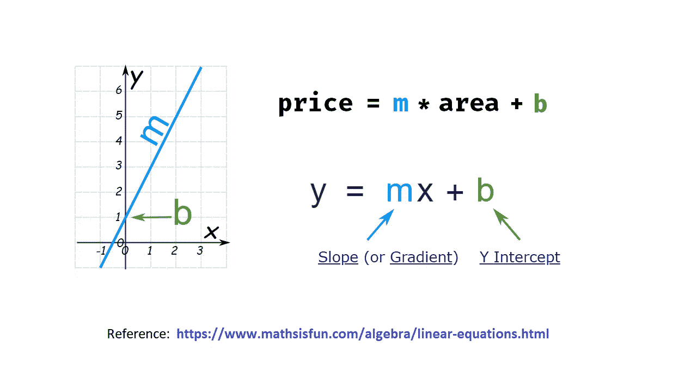
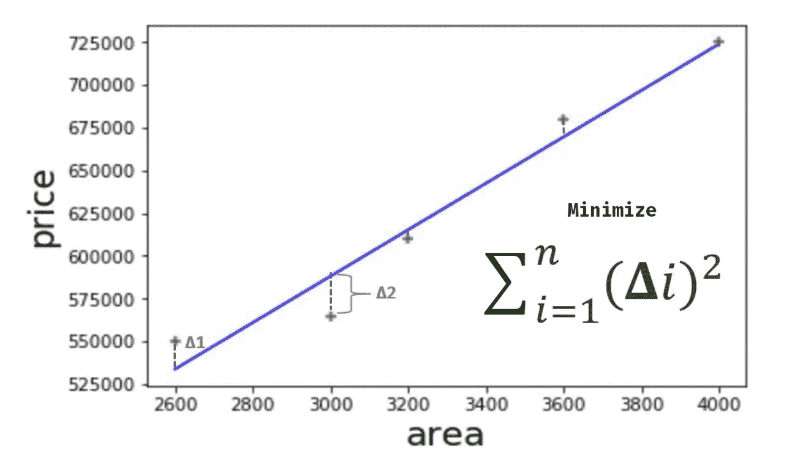
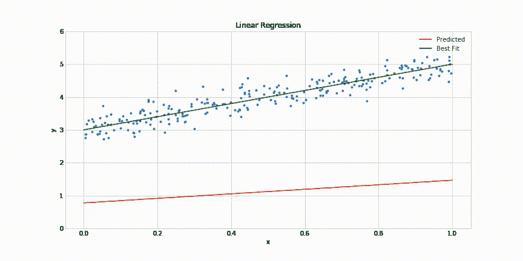
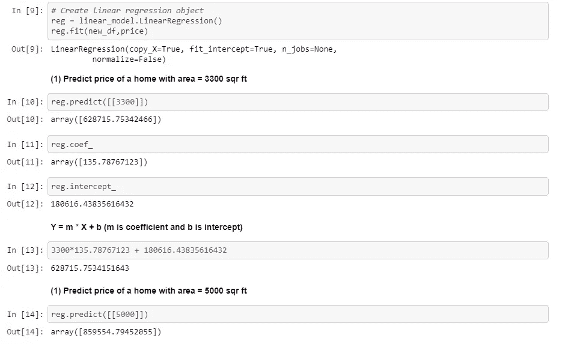

# 线性回归在数学上是如何工作的？

> 原文：<https://medium.com/analytics-vidhya/how-do-linear-regression-works-mathematically-c9bafd800f9b?source=collection_archive---------15----------------------->

线性回归背后的数学。

我在 youtube 上做了一个简单的视频如何开发一个机器学习系统。该系统可以使用数据集来训练，并且该系统可以预测未知数据集的输出，而无需显式编程。如果你有兴趣，请看看这个:我已经涵盖了 3 个步骤的实施:

网址:[https://www.youtube.com/watch?v=4smaKYJm1Xw&t = 312s](https://www.youtube.com/watch?v=4smaKYJm1Xw&t=312s)

在这篇博客中，我将谈论这个机器学习算法如何在数学上工作，以便我们可以有效地使用机器学习库。

这是我们在之前的视频中用于训练机器大脑的数据集。

为视频准备的数据集

我们可以使用 matplotlib 轻松地可视化数据集。这是用于可视化目的的库。

使用 matplotlib 的数据集可视化

在这个图中，我们要画一条直线，这条直线应该接触到大部分数据点。像这样。请注意:这条线也被称为最佳拟合线。一旦选择了最佳拟合线，现在我们的机器大脑就可以通过参考这条最佳拟合线来轻松预测。

使用数据集进行预测。

正如我们所看到的，当我们在视频中的 3 个步骤下实现线性回归时，它预测了相同的输出。这是我们机器大脑的预测系统背后的总体思路。现在可能会出现这样的问题:

*   如何确定最佳拟合线，因为可能有许多最佳拟合线可用？

多条最佳拟合线。

*   这个算法在数学上是如何工作的？因为如果数学上简单，我们可以用这个算法，用任何编程语言来实现？

让我们通过理解这个问题的答案来理解这个算法。

你可能还记得高中数学课上的线性方程。房价可以用下面的等式来表示，

> **y = m * x +c**
> 
> **根据我们的情景方程式会是:**
> 
> **房屋价格= m *(面积)+ b**

同一方程的一般形式是，

线性回归算法。

在这个例子中，我们可以比较，我们的 x 是我们的面积，y 是我们需要预测的房价。而 m 和 b 分别是斜率和截距。换句话说，m 和 b 是微调滑块。

m 和 b 值就像这个滑块。

这可用于调整线条，使我们的线条接触大多数数据点。现在可能会出现另一个问题，我们如何确定最佳拟合线，因为我们可以画许多这样的线:

多条最佳拟合线。

为此，我们必须计算误差。这部分我们称之为均方误差。在这种情况下，我们从随机线开始，或者我们可以说，线方程的 m 和 b 的随机值，然后我们试图找到每个数据点相对于我们的线的差异，然后我们将所有的差异相加，然后找到其平均值

均方误差

然后我们再次调整线，再次找到均方差，我们必须这样做，直到我们找到更小的误差。整个过程看起来像这样:

线性回归达到最佳拟合线演示。

一旦达到最佳拟合线，我们只需记下可用于预测的 m 和 b 的值。

使用 scikit learn 和手动数学预测 3300 sq 面积房屋。

在此图中我们可以看到 **reg.coef_ 和 reg.intercept** 分别是由 scikit learn 确定的 m、b 值，如下所示:

m=135.78767123，b = 180 . 56676766767

根据直线方程，我们可以预测输出如下:

> 3300 * 135.78767123 + 180616.4383561
> 
> 预测: **628715.75**

现在，这是一个非常迭代的过程，通过检查每一个错误，并以小步骤迭代，这可能是一个非常忙碌的过程。为了解决所有这些梯度体面进入图片。我们将在接下来的内容中看到。

> **希望你喜欢这个博客。祝您愉快**