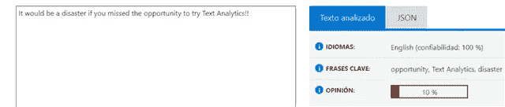

# 机器如何分析人类？

> 原文：<https://medium.com/analytics-vidhya/how-do-machines-analyze-human-beings-e6d6b2a1969b?source=collection_archive---------12----------------------->

主流媒体正在谈论很多人工智能，但引起我注意的一个领域是心理学的自动化研究:许多公司使用自动化的心理档案来选择他们的员工。问题是:它是如何工作的？

在 [Unsplash](https://unsplash.com?utm_source=medium&utm_medium=referral) 上由 [Franck V.](https://unsplash.com/@franckinjapan?utm_source=medium&utm_medium=referral) 拍摄的照片

## 解读我们思想的机器。

人工智能的一个工作室领域是文本分析。这是一个非常有争议的领域，因为它的应用包括从你的社交媒体输入中获取你的心理资料，或者从你的文本中提取你对某些事情的看法。

第一个服务是 IBM Watson Insights。我已经在另一个博客中写道:[https://medium . com/analytics-vid hya/Watson-personality-insights-introduction-and-how-to-access-Watson-without-SDK-89eb 8992 fff 2](/analytics-vidhya/watson-personality-insights-introduction-and-how-to-access-watson-without-sdk-89eb8992fff2)这个工具从人们的电子邮件或社交媒体输入中获取他们的心理资料。

第二个是意见挖掘，微软文本分析:从你的文本中得出对一些主题或实体的积极或消极的情绪。你可以在帖子中了解更多:[https://community . dynamics . com/nav/b/conceptsindailynavisionwork/posts/sensation-analysis-is-it-positive-if-I-like-to-kill-kitties](https://community.dynamics.com/nav/b/conceptsindailynavisionwork/posts/sentiment-analysis-is-it-positive-if-i-like-to-kill-kitties)

## 它是如何工作的？让我们开始语言黑客吧！！！！

我在 IBM Watson Insights 后台可以比微软文本分析基础更准确。我没有找到 MS 文本分析基础的可靠来源。但是我感觉使用了与 IBM 工具相似的原理:[https://cloud.ibm.com/docs/services/personality-insights?topic = personal-insights-science&locale = en](https://cloud.ibm.com/docs/services/personality-insights?topic=personality-insights-science&locale=en)

这些工具的基础是 LIWC(语言查询和字数统计)。这个想法是创建主题词典，根据每本词典的主题标注单词的尺寸。例如，如果你正在编写一本情感词典，你可以这样标注单词:

*   开心，漂亮，好=积极的情绪。
*   当然，骄傲，胜利=乐观。
*   恨，敌人=负面情绪。
*   难过，哭=悲伤或抑郁。

字典结合了一些类别:

*   语言维度(代词、否定、时态等。).
*   情绪过程(愤怒、悲伤、快乐)。
*   认知过程(因果关系、洞察力、差异、抑制)。
*   感觉过程。
*   社会进程。

你可以点击此链接阅读 LIWC 类别描述[https://en . wiki books . org/wiki/User:Vuara/language _ Inquiry _ and _ Word _ Count _ Dictionary](https://en.wikibooks.org/wiki/User:Vuara/Linguistic_Inquiry_and_Word_Count_Dictionary)

单词变成了分类维度的数字数组，这是人类行为机器学习的原材料。我们有几个类别的单词，这取决于我们使用哪种词典。使用一个情感字典，算法根据这个字典计算每个类别中包含的单词:愤怒、悲伤、快乐、焦虑、乐观等。:愤怒、悲伤、快乐、焦虑、乐观等。稍后，这些类别中的单词计数将通过机器学习算法进行处理，以获得最终结果:心理概况或文本的情感(积极或消极)。

事实是:重要的不是我们在说什么，而是我们如何说这些事情。没有上下文，没有意义分析。只有孤立的词。从 70 年前开始，心理学家不是在听我们在说什么，而是在听我们用什么词来表达自己。从罗夏到彭尼贝克，大多数人认为，我们使用的词语定义了我们。

# 警告 1:不要欺骗自己，系统是有效的！！

当你阅读下面的例子时，你可能会认为我在嘲笑这些工具，并暗示它们不起作用:LIWC 是一个很好的解决方案，事实上它是一个简单而伟大的解决方案。然而，这是一个程序员的博客，你可能知道简单的方法是最好的。我对沃森的心理侧写完全同意使用其他心理工具和测试。微软的情感分析也很好用。请注意，我将非常骗子从内部寻找系统的弱点！！

## 入侵微软 Azure 文本分析。

让我们遵循 LIWC 原则，主要的东西是单词。所以，让我们夸大文本分析，但是，技巧来了，在 LIWC 词典中，单词分别具有负面维度:灾难，错过或会:

“如果您错过了尝试文本分析的机会，那将是一场灾难！!"和“没有人是傻瓜”排在非常负面情绪。

我不确定微软背景是 LIWC，但真实答案应该很接近。

## 极端主义、性别歧视和种族主义的内容。黑客沃森洞察。

有了 IBM Watson，我的黑客技术至少是激进的。

我从这个文件[https://github . com/JalmarazMartn/Watson-personal-insights-node-whit hout-SDK/blob/master/profile Jesus . JSON](https://github.com/JalmarazMartn/Watson-personal-insights-node-whithout-SDK/blob/master/ProfileJesus.json)开始，带着个人的真实看法，结果不是很好:我在外向性、宜人性和责任心方面排名很低。另一方面，我在情感上排名太靠前了。我的用词很糟糕:很多第一人称单数，还有像“悲伤”、“想念”或“讨厌”这样的词。

我写了新的句子来改善我的个人资料，避免第一人称单数，包括更多积极的词语。另一方面，我改变了内容，把它变成了性别歧视，种族歧视和激进。所有例子都在这里[https://github . com/JalmarazMartn/Watson-personal-insights-node-whit hout-SDK/blob/master/profile radic . JSON](https://github.com/JalmarazMartn/Watson-personal-insights-node-whithout-SDK/blob/master/ProfileRadical.json)

并且轮廓得到改善。一个怪物？不，我重复一遍，我是极端的骗子，这不是我们在社交媒体和电子邮件中写作的方式。机器无法理解意思，唯一的解决办法就是字数统计和字典。我们错误地认为机器像人类一样处理信息，人工智能主要是数学！！请记住这些事实:人类心理学家也使用文本分析，自从它开始以来，它已经取得了突出的成果，例如，结束了对尤那邦伯的刑事起诉。