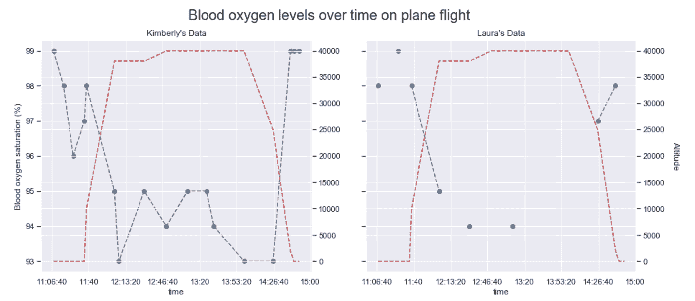
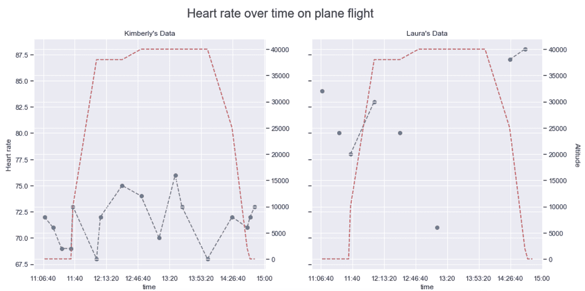

# 飞机飞行对我的生理有什么影响？

> 原文：<https://medium.com/analytics-vidhya/how-do-plane-flights-affect-my-physiology-c57984c31c3f?source=collection_archive---------23----------------------->

当我八年级的时候，我的数学老师给每个学生分配了一个萨克拉门托国王队的篮球运动员来参加我们的统计项目。我们的工作是随着时间的推移跟踪玩家的统计数据，以练习我们的数学技能。我小时候去看职业体育比赛的唯一记忆就是拿着记录每个国王队球员所有统计数据的小册子，计算他们的身体质量指数、随时间的变化等等。这很有趣，显然是享受运动的最好方式。

一晃 15 年过去了，我正坐在飞往巴亚尔塔港(Puerto Vallarta)进行海滩度假的飞机上，一边测量心率和 SpO2(血氧饱和度)，一边问自己一些问题，比如“飞机旅行对我的血氧饱和度有多大影响？”飞机机舱被加压到大约 8000 英尺，之前的研究表明，在飞机飞行期间，血氧水平下降了 2-9%。这似乎是一件大事。这是真的吗？回答这个问题时，没有人比我的姐姐更激动了，她成了我第二个(不情愿的)测试对象。

在我的 n==2 研究中，我发现血氧从 99% -> 95%的持续下降与海拔高度的增加高度相关。这与之前的工作一致，95–99%仍被认为在健康范围内。直到数字下降到 90%以下，它才被认为是低氧血症。我没有发现飞机飞行中每个参与者的心率有任何差异。

我选择了曼·惠特尼 U 检验来确定我的 SpO2 在海拔高度(定义为> 20，000 英尺)和海平面(定义为< 10，000 英尺)是否有显著差异。这是对零假设的非参数检验，即从一组中随机选择的值小于或大于从第二组中随机选择的值的可能性是相等的。由于我对心率测量值的分布没有预期，所以我认为非参数测试是一种可行的方法。使用曼·惠特尼 U 检验进行这种分析有一些注意事项。第一，所有的测量都来自一两个人，所以不是很独立的观察，第二，我的测量很少。尽管统计数据是非参数的，但 p 值转换通常假设检验统计数据呈正态分布。目前，这已经足够好了。对于我的观察，我发现 p 值为 0.008，表明在海拔高度和海平面的血氧之间存在显著差异。

有趣的是，我没有看到对心率的类似影响(曼惠特尼 U 检验，p 值=0.422)。

注意:这是用指尖脉搏血氧仪完成的，尽管 SpO2 测量显然也很快会出现在 Fitbit 上。

朱庇特分析笔记本:[这里](http://kimberlymcmanus.com/notebooks/Blood_oxygen_level_analysis_Feb2020.html)