# 变形金刚在 NLP 中是如何工作的？最新最先进型号指南

> 原文：<https://medium.com/analytics-vidhya/how-do-transformers-work-in-nlp-a-guide-to-the-latest-state-of-the-art-models-52424082c132?source=collection_archive---------1----------------------->

# 介绍

我喜欢现在作为一名数据科学家在自然语言处理部门工作。突破和发展正以前所未有的速度发生。从超高效的 ULMFiT 框架到谷歌的 BERT，NLP 真正处于黄金时代。

这场革命的核心是变压器的概念。这改变了我们数据科学家处理文本数据的方式——您将很快在本文中看到这一点。

想知道 Transformer 有多有用吗？看看下面这段话:

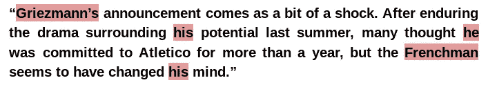

突出显示的单词指的是同一个人——格里兹曼，一个受欢迎的足球运动员。对我们来说，找出文本中这些词之间的关系并不困难。然而，对于一台机器来说，这是一项艰巨的任务。

捕捉句子中的这种关系和单词序列对于机器理解自然语言至关重要。**这就是变压器概念发挥重要作用的地方。**

*注意:本文假设对一些深度学习概念有基本的理解:*

*   [*深度学习精要——序列对序列建模注意*](https://www.analyticsvidhya.com/blog/2018/03/essentials-of-deep-learning-sequence-to-sequence-modelling-with-attention-part-i/?utm_source=medium&utm_medium=understanding-transformers-nlp-state-of-the-art-models)
*   *F* [*深度学习基础—递归神经网络简介*](https://www.analyticsvidhya.com/blog/2017/12/introduction-to-recurrent-neural-networks/?utm_source=medium&utm_medium=understanding-transformers-nlp-state-of-the-art-models)
*   [*Python 中使用深度学习的文本摘要综合指南*](https://www.analyticsvidhya.com/blog/2019/06/comprehensive-guide-text-summarization-using-deep-learning-python/?utm_source=medium&utm_medium=understanding-transformers-nlp-state-of-the-art-models)

# 目录

1.  序列间模型—背景
    —基于 RNN 的序列间模型
    —挑战
2.  NLP 中的 Transformer 介绍
    -了解模型架构
    -掌握自关注的诀窍
    -自关注的计算
    -Transformer 的局限性
3.  了解 Transformer-XL
    -使用 Transformer 进行语言建模
    -使用 Transformer-XL 进行语言建模
4.  NLP 中的新感觉:Google 的 BERT
    -模型架构
    - BERT 预训练任务

# 序列间模型——背景

**序列到序列(seq 2 seq)**NLP 中的模型用于将类型 A 的序列转换为类型 b 的序列。例如，将英语句子翻译为德语句子是序列到序列的任务。

**基于递归神经网络(RNN)的序列对序列模型**自 2014 年推出以来，已经获得了大量的关注。当前世界中的大多数数据都是以序列的形式存在的——它可以是数字序列、文本序列、视频帧序列或音频序列。

这些 seq2seq 型号的性能在 2015 年增加了**注意机制**后得到了进一步增强。在过去的 5 年中，NLP 的发展速度是如此之快，令人难以置信！

这些序列到序列模型非常通用，可以用于各种 NLP 任务，例如:

*   机器翻译
*   文本摘要
*   语音识别
*   问答系统等等

# 基于 RNN 的序列间模型

让我们举一个简单的序列到序列模型的例子。查看下图:

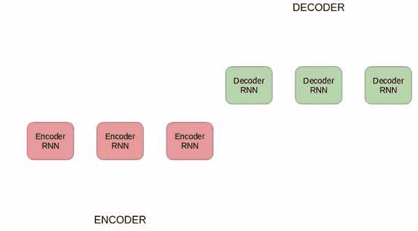

使用序列到序列模型的德语到英语翻译

上面的 seq2seq 模型将德语短语转换成英语短语。让我们来分解一下:

*   **编码器**和**解码器**都是 rnn
*   在编码器中的每个时间步长，RNN 从输入序列中提取一个字向量(xi ),并从前一个时间步长中提取一个隐藏状态(Hi)
*   隐藏状态在每个时间步更新
*   来自最后一个单元的隐藏状态被称为**上下文向量。**这包含关于输入序列的信息
*   该上下文向量随后被传递给解码器，然后用于生成目标序列(英语短语)
*   如果我们使用**注意机制**，那么隐藏状态的加权和作为上下文向量被传递给解码器

# 挑战

尽管 seq-2-seq 模型在这方面做得非常好，但仍有一定的局限性，请注意:

*   处理长期依赖仍然具有挑战性
*   模型架构的顺序本质阻止了并行化。谷歌大脑的变压器概念解决了这些挑战

# 变压器介绍

NLP 中的 Transformer 是一种新颖的体系结构，旨在解决序列到序列的任务，同时轻松处理长距离依赖性。论文中提出的变压器[你所需要的就是注意力](https://arxiv.org/abs/1706.03762)。推荐任何对 NLP 感兴趣的人阅读。

引用报纸上的话:

> “Transformer 是第一个完全依靠自我关注来计算其输入和输出的表示，而不使用序列对齐的 RNNs 或卷积的转导模型。”

这里，“转导”是指将输入序列转换成输出序列。Transformer 背后的想法是用**注意力**和完全递归来处理输入和输出之间的依赖关系。

下面我们来看看变压器的架构。这看起来可能有点吓人，但是不要担心，我们会一点一点地分解和理解它。

# 了解 Transformer 的模型架构

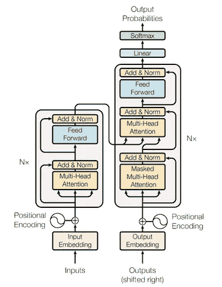

《变形金刚》——模型建筑
(来源:[https://arxiv.org/abs/1706.03762)](https://arxiv.org/abs/1706.03762))

上图是 Transformer 架构的绝佳展示。让我们首先只关注**编码器**和**解码器**部分。

现在关注下图。编码器模块有一层**多头注意力**，后面是另一层**前馈神经网络**。另一方面，解码器有一个额外的**屏蔽** **多头注意力。**

**编码器和解码器模块实际上是多个相同的编码器和解码器堆叠在一起。**编码器堆栈和解码器堆栈具有相同数量的单元。

编码器和解码器单元的数量是一个超参数。本文使用了 6 种编码器和解码器。

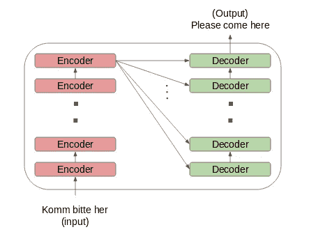

让我们看看编码器和解码器堆栈的设置是如何工作的:

*   输入序列的字嵌入被传递到第一编码器
*   这些然后被转换并传播到下一个编码器
*   编码器堆栈中最后一个编码器的输出被传递给解码器堆栈中的所有解码器，如下图所示:

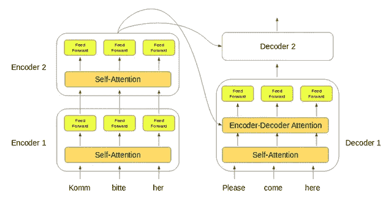

这里需要注意一件重要的事情——除了**自关注**和前馈层，解码器还有一层编码器-解码器关注层。这有助于解码器关注输入序列的适当部分。

你可能会想——这个“自我关注”层在《变形金刚》中到底做了什么？问得好！这可以说是整个设置中最关键的组件，所以让我们来理解这个概念。

# 获得自我关注的诀窍

根据该文件:

> 自我注意，有时称为内部注意，是一种为了计算序列的表示而将单个序列的不同位置联系起来的注意机制

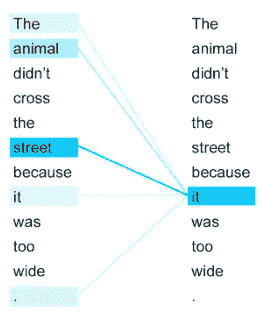

看一下上面的图片。你能猜出这个句子中的术语“它”指的是什么吗？

它指的是街道还是动物？对我们来说这是个简单的问题，但对算法来说不是。当模型在处理“它”这个词时，自我注意试图将“它”与同一个句子中的**“动物”**联系起来。

自我注意允许模型查看输入序列中的其他单词，以更好地理解序列中的某个单词。现在，让我们看看如何计算自我关注度。

# 计算自我注意力

为了便于理解，我将这一部分分成了不同的步骤。

1.  首先，我们需要从编码器的每个输入向量中创建三个向量:
    -查询向量
    -关键向量
    -值向量。
    (这些向量在训练过程中被训练和更新。完成这一部分后，我们将对他们的角色有更多了解)
2.  接下来，我们将为输入序列中的每个单词计算自我注意
3.  想想这句话——“行动得到结果”。为了计算第一个词“行动”的自我关注度，我们将计算短语中所有词相对于“行动”的得分。当我们对输入序列中的某个单词进行编码时，这个分数决定了其他单词的重要性。

通过取查询向量(q1)与所有单词的关键字向量(k1，k2，k3)的点积来计算第一个单词的分数:

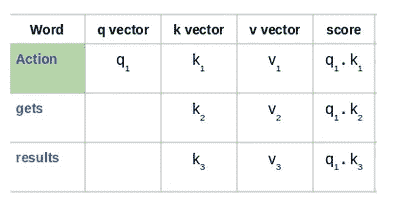

然后，这些分数除以 8，8 是关键向量维数的平方根:

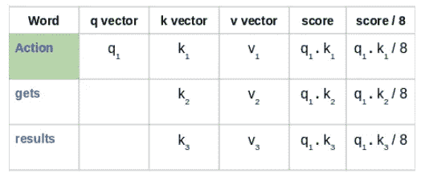

接下来，使用 softmax 激活函数对这些分数进行归一化:

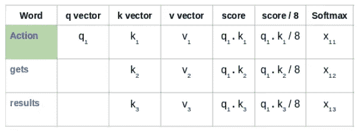

然后，将这些归一化的分数乘以值向量(v1，v2，v3 ),并将结果向量相加，以得到最终向量(z1)。这是自我关注层的输出。然后，它被传递到前馈网络作为输入:

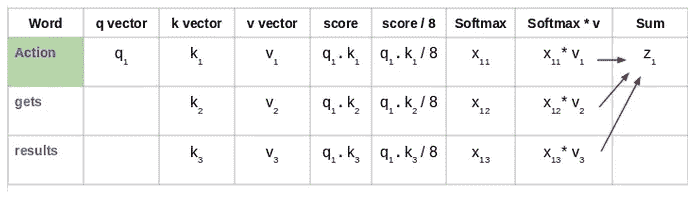

因此，z1 是输入序列“动作得到结果”的第一个单词的自我注意向量。我们可以用同样的方式得到输入序列中剩余单词的向量:

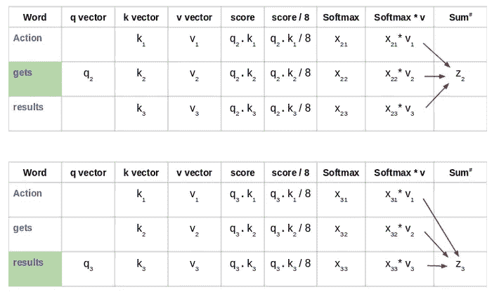

在 Transformer 的架构中，自我关注不是一次而是多次计算，并行且独立。因此被称为**多头关注**。输出被连接并进行线性转换，如下图所示:

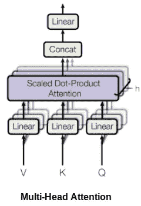

根据“注意力是你所需要的一切”这篇论文:

> *“多头注意力允许模型在不同位置共同注意来自不同表征子空间的信息。”*

你可以在这里访问实现 Transformer [的代码。](https://paperswithcode.com/paper/attention-is-all-you-need)

# 变压器的局限性

与基于 RNN 的 seq2seq 模型相比，Transformer 无疑是一个巨大的改进。但是它也有自己的局限性:

*   注意只能处理定长文本串。在作为输入输入到系统之前，文本必须被分割成一定数量的段或块
*   这种文本分块导致**上下文碎片**。例如，如果一个句子从中间分开，那么大量的上下文就丢失了。换句话说，在不考虑句子或任何其他语义边界的情况下分割文本

那么我们如何处理这些重大问题呢？这是和 Transformer 一起工作的人问的问题。由此诞生了 Transformer-XL。

# 了解变压器-XL

变压器架构可以学习长期依赖性。但是，由于使用了固定长度的上下文(输入文本段)，它们不能超出某个级别。论文中提出了一种新的架构来克服这个缺点——[Transformer-XL:固定长度上下文之外的注意力语言模型](https://arxiv.org/pdf/1901.02860.pdf)。

在这种架构中，在先前片段中获得的隐藏状态被重新用作当前片段的信息源。由于信息可以从一个部分流向下一个部分，因此它可以对长期依赖关系进行建模。

# 使用转换器进行语言建模

> *把语言建模想象成一个在给定前一个单词的情况下估计下一个单词的概率的过程。*

[Al-Rfou 等人(2018)](https://arxiv.org/abs/1808.04444) 提出了**应用 Transformer 模型进行语言建模**的思想。根据这篇论文，整个语料库可以被分割成大小可控的固定长度的片段。然后，我们独立地在分段上训练变压器模型，忽略来自先前分段的所有上下文信息:

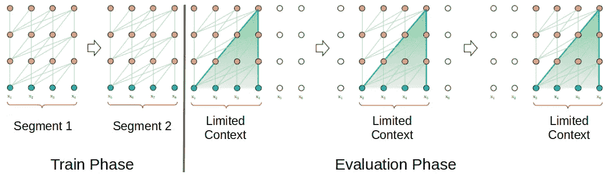

分段长度为 4 的变压器模型(来源:[https://arxiv.org/abs/1901.02860](https://arxiv.org/abs/1901.02860)

这种架构没有渐变消失的问题。但语境碎片化限制了其长期依存学习。在评估阶段，线段仅向右移动一个位置。新的段必须完全从头开始处理。不幸的是，这种评估方法是相当计算密集型的。

# 使用 Transformer-XL 进行语言建模

在 Transformer-XL 的训练阶段，为先前状态计算的隐藏状态被用作当前段的附加上下文。Transformer-XL 的这种递归机制考虑到了使用固定长度上下文的局限性。

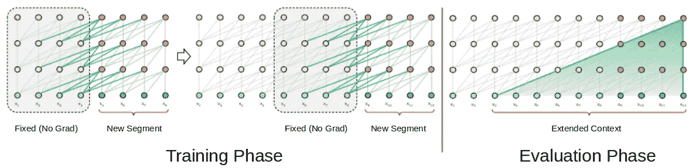

*分段长度为 4 的变压器 XL 型号*

在评估阶段，可以重用来自先前片段的表示，而不是从头开始计算(如变压器模型的情况)。这当然提高了计算速度。

你可以在这里访问实现 Transformer-XL [的代码。](https://paperswithcode.com/paper/transformer-xl-attentive-language-models)

# NLP 的新感觉:Google 的 BERT(变形金刚的双向编码器表示)

我们都知道**转移学习**在计算机视觉领域的重要性。例如，预先训练的深度学习模型可以针对 ImageNet 数据集上的新任务进行微调，并且仍然可以在相对较小的标记数据集上给出不错的结果。

语言模型预训练同样对于改进许多自然语言处理任务非常有效:

*   [https://papers with code . com/paper/transformer-XL-attention-language-models](https://openai.com/blog/language-unsupervised/)
*   [https://papers with code . com/paper/transformer-XL-attention-language-models](https://arxiv.org/abs/1801.06146)。

来自谷歌人工智能的新语言表示模型 BERT framework 使用预训练和微调来创建用于广泛任务的最先进的模型。这些任务包括问答系统、情感分析和语言推理。

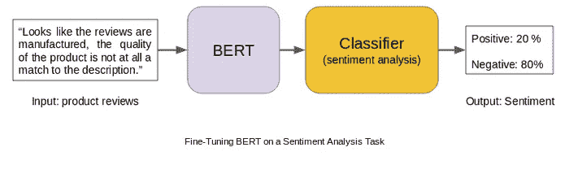

# 伯特的模型建筑

BERT 使用多层双向变压器编码器。它的自我关注层在两个方向上执行自我关注。谷歌发布了这种模式的两种变体:

1.  **BERT Base** :变压器层数= 12 层，总参数= 110M
2.  **BERT Large** :变压器层数= 24 层，总参数= 340 米

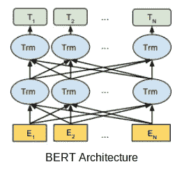

BERT 通过对几项任务进行预训练来使用双向性，这些任务包括**屏蔽语言模型**和**下一句预测**。让我们详细讨论这两个任务。

# BERT 培训前任务

使用以下两个无监督预测任务对 BERT 进行预训练。

## 1.掩蔽语言建模(MLM)

根据[论文](https://arxiv.org/pdf/1810.04805.pdf):

> *“屏蔽语言模型随机屏蔽输入中的一些标记，目标是仅基于其上下文预测屏蔽单词的原始词汇 id。与从左到右的语言模型预训练不同，MLM 目标允许表示融合左右上下文，这允许我们预训练深度双向转换器。”*

谷歌人工智能研究人员随机屏蔽了每个序列中 15%的单词。任务？来预测这些蒙面文字。这里有一个警告—被屏蔽的单词并不总是被屏蔽的标记[MASK]替换，因为[MASK]标记在微调过程中永远不会出现。

因此，研究人员使用了以下技术:

*   80%的情况下，单词被替换为掩码标记[MASK]
*   10%的时候，这些单词被随机的单词替换
*   10%的时间单词保持不变

## 2.下一句预测

通常，语言模型不能捕捉连续句子之间的关系。伯特也预先接受了这项任务的训练。

对于语言模型预训练，BERT 使用句子对作为其训练数据。每一对的选句都挺有意思的。我们试着借助一个例子来理解一下。

假设我们有一个包含 100，000 个句子的文本数据集，我们希望使用该数据集预先训练一个 BERT 语言模型。因此，将有 50，000 个训练示例或句子对作为训练数据。

*   对于 50%的配对，第二句实际上是第一句的下一句
*   对于剩余的 50%的对，第二个句子将是来自语料库的随机句子
*   第一种情况的标签是***‘是下一个’***，第二种情况的标签是***‘不是下一个’***

像 BERT 这样的架构证明了无监督学习(预训练和微调)将成为许多语言理解系统中的关键元素。低资源任务尤其可以从这些深度*双向*架构中获得巨大收益。

下面是 BERT 在其中扮演重要角色的几个 NLP 任务的快照:

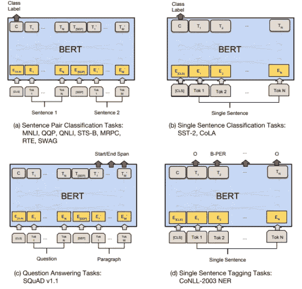

*来源:*[*https://arxiv.org/abs/1810.04805*](https://arxiv.org/abs/1810.04805)

# 结束注释

我们真的应该认为自己很幸运，因为这么多最先进的进步正在以如此快的速度在 NLP 中发生。像 Transformers 和 BERT 这样的架构为未来几年更高级的突破铺平了道路。

我鼓励你实现这些模型，并在下面的评论部分分享你的工作。如果您对本文有任何反馈或任何疑问/疑问，请告诉我，我会尽快回复您。

您也可以参加以下课程来学习或提高您的 NLP 技能:

*   [使用 Python 的自然语言处理(NLP)](https://courses.analyticsvidhya.com/courses/natural-language-processing-nlp??utm_source=medium&utm_medium=understanding-transformers-nlp-state-of-the-art-models)

*原载于 2019 年 6 月 19 日 https://www.analyticsvidhya.com**T21*[。](https://www.analyticsvidhya.com/blog/2019/06/understanding-transformers-nlp-state-of-the-art-models/)