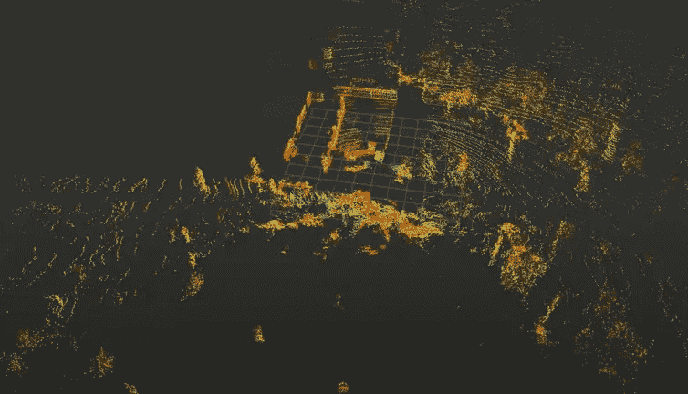

# 自动驾驶车辆如何使用激光雷达进行观察？

> 原文：<https://medium.com/analytics-vidhya/how-does-a-self-driving-vehicle-see-using-lidar-49f569ededf2?source=collection_archive---------6----------------------->

激光雷达点云。图片提供:作者的数据可视化。

随着优步、Lyft、Cruise Automation、Motional、Aurora、Aptiv、滴滴出行、Yandex 等公司试图创造一个完美的机器人，自动驾驶汽车已经成为最近的热门词汇。最近，优步以运营成本为由，将其自动驾驶机器人 robotaxi 部门出售给了 Aurora。但这并没有阻止其他创业公司将这项技术付诸实施。然而，许多人…