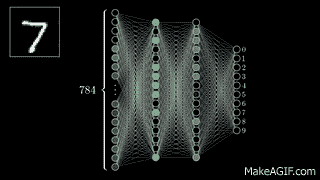

# 单个神经网络是如何工作的？

> 原文：<https://medium.com/analytics-vidhya/how-does-a-single-neural-net-works-163cdd7740f8?source=collection_archive---------13----------------------->

我们都知道人工智能领域的热门话题，

但是你是不是和许多人一样，认为这是一个奇特的领域，很难理解。

# 嗯，这不是 100%真实的。

如果你对数学感兴趣并且已经有了一些基本的理解，并且愿意学习新的东西，你可以很快攻克它。

让我解释一下它到底是什么。

人工智能是许多学科的结合，深度学习是其所有组成部分的主干。

手写数字预测器(深度学习模型)

深度学习只不过是建立一个有效且高效的模型的艺术，该模型由多层神经网络组成，旨在执行特定的任务。

为了更好地理解深度学习，我们首先需要理解，

***这是什么人工神经网络？***

人工神经网络非常类似于我们大脑中实际神经元的运作方式。它基本上是设计来模仿我们自己的神经元。

神经元放电

一个生物神经元细胞与成千上万的其他神经元相连，形成一个网络。
我们大脑不同部分的每一个神经元网络都控制着我们日常运作的困难方面。

同样，作为深度学习的一部分，我们正试图建立一个具有多层神经网络的人工神经网络，以执行更具体的任务，如分类问题，玩雅达利游戏，语言翻译等

## 为了理解这些人工神经网络是什么，我们需要知道单个神经网络是如何工作的。

有大量的文章解释了神经网络在互联网中的作用。
但这是我对单个神经网络功能的理解，并试图用一个非常简单的工作程序来解释它。

在开始之前，如果对线性代数和 python 编程有基本的了解，就很容易理解了。尽管你没有以上的理解，我还是会试着解释一下。

我们可以把这个分成两部分。

1.  **神经网络的理论解释**
2.  **使用 python 程序的实际实现。**

**神经网络的理论解释**

神经网络应被视为一个函数或系数矩阵，它将输入转换为所需的输出。

> 从现在起我们看到的每一个变量，都将是一个数字阵列或一个矩阵

可以表示如下。

## **Y = A X**

其中 **Y** 是输出，

**X** 是输入和

**A** 是作用于输入以给出输出的函数或一组系数。

在传统的计算机编程中，我们将知道输入 **X** ，并且我们将通过计算机程序创建具有逻辑组合的函数 **A** ，以获得期望的输出 **Y** 。

但是在这里，我们不是用逻辑组合来创建函数 **A** ，而是通过让它用已经可用的输入 **X** 和输出 **Y** 作为数据集来训练，来教导模型学习什么是函数 **A** 。

如果你想知道这种学习是如何发生的？

这实际上是每个人学习的方式

# 通过犯错！

最初，我们的模型将随机分配一组系数 **A** ，这组系数将作用于输入以给出输出(预测输出)，

然后我们将它与训练阶段的实际输出进行比较。
并计算误差值(实际输出和预测输出之差)。

# **E = Y 轴**

其中 **E** 为误差值

**Y**——是实际产量

**AX** —是我们之前看到的预测输出。

基于该误差值，模型确定需要改变多少系数组，
以使预测输出接近实际输出。

这个更新系数的过程是通过称为**梯度下降法或反向传播的过程来完成的。**

这使得模型通过回顾误差值并调整函数 **A** 的系数来从其错误中学习。

反向传播过程。

这个**反向传播**可以通过对误差方程应用微分来完成。

**但是为什么我们需要应用微分呢？**

一般来说，任何方程的微分都会给出输入值微小变化时方程变化的速率。

如果我们绘制出一个的**系数的所有值，并观察误差方程相对于其值如何变化。我们将得到一个下面凸形的图形。**

误差函数与系数。

> 从现在起，我们将把这个系数函数称为节点权重。

# **dE = d (Y 轴)**

根据节点重量对这个误差方程进行微分，我们会得到一个值。

如果我们用节点权重加上/减去这个值，误差值将开始向凸形图的最小点移动。这个极小点叫做**全局极小点**。

这是误差几乎变得最小(有时接近于零)的点

所以我们的目标是迭代运行这个更新节点权重的过程，直到它达到全局最小值。

现在让我们进入实现部分

# **使用 python 程序的实际实现**

这个 python 程序有两个主要部分，

1.  **神经网络类**(该类将包含如下神经网络所需的所有必要组件)

*a .节点重量*

*b .激活功能*

*c .预测功能*

*d .训练功能*

**2。主函数**(该函数将调用带有输入的神经网络，并返回预测输出)

随着代码的进展，我们将了解每一个单独的组件。

首先，我们需要导入这个程序所需的依赖项。

这里需要的重要依赖项是 **Numpy** 库，

这个库主要包含所有需要的数学运算和辅助函数。

现在我们用 __init__ 函数为神经网络创建我们的类，如下所示

# **1。神经网络类**

## *a .节点重量*

在 python 中，类中变量/函数的初始化发生在它的 __init__ 函数中，该函数初始化与整个类相关联的类变量。

对于没有任何 python 经验的人来说，可以认为这个函数用一些随机值初始化了节点权重。

要进一步了解 __init__ 函数，请参考下面的链接。

[https://micropyramid . com/blog/understand-self-and-_ _ init _ _-method-in-python-class/](https://micropyramid.com/blog/understand-self-and-__init__-method-in-python-class/)

我们将节点权重创建为 3×1(3 行 1 列)矩阵，因为我们的输入有 3 个二进制变量，这些变量与节点权重相乘，以提供单个二进制变量输出。

我们将使用梯度下降法微调该节点权重，试图减少预测输出和实际输出之间的计算误差值。

## b.*激活功能*

上述功能被称为激活功能，顾名思义，它激活我们试图产生的神经元。

我们应该将这种激活功能视为神经元的功能特征，就像我们大脑中的神经元细胞一样，神经元细胞由细胞核、细胞体等组成，构成了神经元的特征。

类似地，这里的激活函数决定了神经网络的特征，我们可以根据我们试图解决的问题来改变这个激活函数。

而我们这里使用的激活函数是 **Sigmoid** 激活函数，输出 t 在 0 到 1 之间的所有输入值。

从而将输入转换成更加规范化的形式，这有助于我们更好地理解输入和输出之间的关系。

这个 sigmoid 在输出为 0 或 1 的二进制分类问题中很有帮助。在这个程序中，我们也试图执行一个二进制分类问题，因为我们的输出不是 0 就是 1。

要了解更多关于 sigmoid 激活功能和所有其他类型的可用激活功能，请查看以下链接

 [## 神经网络中的 7 类激活函数:如何选择？

### 神经网络激活功能是深度学习的重要组成部分。激活功能决定输出…

missinglink.ai](https://missinglink.ai/guides/neural-network-concepts/7-types-neural-network-activation-functions-right/) 

现在我们需要对激活函数进行求导或微分，正如我们已经在**反向传播**过程中看到的。

在这种情况下，只需要激活函数的导数，因为除了乘以节点权重之外，没有对输入执行其他操作，因为它是一个常数值，所以没有导数。

> 但是在更复杂的神经网络中，会涉及到许多这样的激活函数，所以需要这些函数的导数。

## *c .预测功能*

大脑功能之上是重要和有趣的事情发生的地方。

这是输入和节点权重结合并通过 sigmoid 激活的地方。因此，输出函数如下所示

**输出= 1/(1+实验(-(输入。)nodel_weights))**

其中**(。)**表示点积

## d.培训功能

这个训练函数就是让神经网络学习的东西。

> 因为我们已经知道神经网络如何学习，所以让我们只关注实现部分。

这个训练函数背后的基本直觉是，通过在迭代中调用大脑函数(预测函数),神经网络进行如下操作

1.  预测产量
2.  将预测输出与实际输出进行比较，并计算误差值
3.  基于误差值，使用梯度下降更新节点权重。

以上 3 个过程一直持续到迭代结束。

# 2.主要功能

现在我们已经万事俱备，只需要用下面的数据集训练模型。

## 输入— [0 0 1]，[1 1 1]，[1 0 1]，[0 1 1]

## 输出— [0]、[1]、[1]、[0]

因此，该模型接受 3 个输入，给出 1 个输出。

下面是使用数据集训练模型并预测不在训练集中的测试输入的输出的主函数。

该模型将预测测试输入数据**【110】。**

让我们看看输出是什么，训练的节点权重是什么

和 viola，我们的模型计算了新的节点权重，并预测了新测试输入的值为 1(大约)。

有趣的是，如果我们仔细观察输入的训练数据集。我们可以看到输入矩阵的第一列与输出矩阵的第一列相同。

现在，如果我们可以看到新更新的节点权重，只有第一行将有一个正值，其余的行将有一个负值。

因此，通过训练，我们的**神经网络已经了解到，输入的第一列单独对输出**有贡献。因此，它得到了一个巨大的正值，而其他 2 列得到了负值。

当它传递到如下的 sigmoid 函数中时，

## 乙状结肠(输入(。)自我.节点 _ 权重)

输入的第一列将乘以正值，其余的输入列乘以节点权重的相应负值。

sigmoid 函数会将任何大于 1 的值转换为 1，将任何小于 0 的值转换为 0。

因此，如果输入的第一列是 1，输出也将近似等于 1。我们不需要关心函数的其余部分，因为它们乘以接近零的值。

## 就是这样！！！

我们有简单的全功能单一神经网络。

python 代码的灵感来自米洛·斯潘塞的[博客。](/technology-invention-and-more/how-to-build-a-simple-neural-network-in-9-lines-of-python-code-cc8f23647ca1#.l51z38s7f)

我发现他的程序和数据集非常简单易懂，但有几个基本问题我必须在别处搜索才能完全理解基本概念，所以我认为将所有东西放在一个地方对初学者会有帮助。

希望你喜欢学习神经网络。