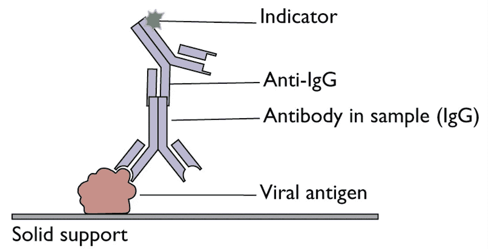
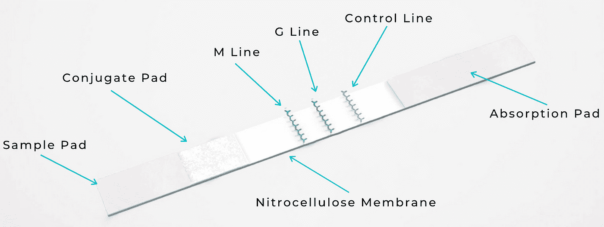
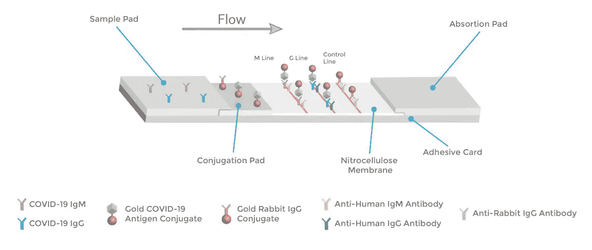

# 新冠肺炎抗体检测是如何进行的？

> 原文：<https://medium.com/analytics-vidhya/how-does-antibody-testing-work-9c7b8e0b9000?source=collection_archive---------34----------------------->

## 概述了用于诊断新冠肺炎的抗体测试原理，以及人工智能(AI)如何在设计这些工具方面提供很大帮助。

[国家癌症研究所](https://unsplash.com/@nci?utm_source=medium&utm_medium=referral)在 [Unsplash](https://unsplash.com?utm_source=medium&utm_medium=referral) 上拍摄的照片

免疫分析背后的科学极其简单。当人类被一种**病毒**感染时，会产生与**病毒**蛋白质结合的特异性**抗体**。免疫测定的原理是检测这些抗体，并产生可通过仪器(如读板仪)读取的信号。

换句话说，病毒蛋白被连接到塑料支持物上，然后临床样本(例如血清，拭子，..)补充。如果标本中存在针对病毒的抗体，它们将与固定的病毒抗原结合。然后通过使用与第一抗体结合的第二抗体来检测结合的抗体。这种第二抗体与指示剂(例如 HRP、荧光)相连，该指示剂通常需要平板阅读器来检测/读取。

免疫分析背后的原理(图片取自[病毒学博客](https://www.virology.ws/2010/07/16/detection-of-antigens-or-antibodies-by-elisa/)

虽然这种方法是间接的，不如聚合酶链式反应(PCR)灵敏，但它**非常简单**并且**不需要预先准备临床样本**(例如 PCR 需要提取 RNA，这很费时间)。临床样品可以立即应用而无需分离。这些试剂盒通常在 30-60 分钟内产生结果，因此可以测试相当多的人。问题是需要特殊的仪器(板阅读器)来读取信号。

# **我们能否优化免疫测定以创建护理点(POC)检测？**

简短的回答是**是的**。

我们可以使用基于纸张的**护理点(POC)** 免疫检测，这是类似于妊娠检测的**一次性 POC 血清学检测。**这些**它们也被称为**横向流动免疫分析(LFIA)** 。有趣的部分是，这些测试可以**视觉读取(用肉眼)**，或者结合阅读器技术提供数据。**

例如，在过去的 2-3 周里，Biomerica 和 Bioeasy 都发布了他们的新冠肺炎快速 POC CE-IVD 测试。

简而言之，试剂盒中有三条线路(IgM、IgG、对照)。

# **为什么是三条线而不是两条线(正反)？**

**答案是不同的抗体可以用来帮助医生区分新的和过去的感染**。如果有 **IgM** (这些是对病毒反应中出现的第一个抗体，这意味着**最近的**感染)或 **IgG** (这意味着在其**后期**过程中的感染)，样本可能是阳性的。**IgM 和 IgG 抗体也可以出现在阳性样本中。**

鼻子和喉咙后部是病毒复制的两个部位，因此从这些部位提取样本并应用于样本垫。然后，**样品通过金纳米颗粒**(稍后解释)与标记的新冠肺炎抗原相互作用，然后**通过毛细作用力穿过膜，最后由于结合捕获抗体而在测试(IgG 和 IgM 线)**和对照区中累积。

在阳性测试中，样品/缀合物复合物移动到含有识别人 IgM 的固定抗体的第一行。只有人 IgM 抗体/新冠肺炎抗原/金纳米颗粒复合物会产生可见的有色线。结果在 10 分钟内产生。

> 不同的标签直接影响检测结果。**金纳米粒子(AuNPs)** 是许多临床诊断工具中使用的纳米材料，因为它们能够与生物分子(例如蛋白质)形成共轭物，并且由于它们的稳定性和**强烈的颜色**。

# 人工智能如何帮助优化这些工具包？

**AI 在优化标签**(如 AuNPs)中起着极其重要的作用。[标签能否与探测器紧密结合是评价其质量的关键标准。它们还应该能够在结合时保持它们的性质，并且当它们的浓度低时是可检测的。在运动期间和短时间内，其生物活性在灵敏度和再现性方面也不会发生变化](https://pubs.rsc.org/en/content/articlelanding/2019/an/c9an00964g#!divAbstract)。

> 因此，**科学家使用不同的数学模型和算法**进行**横向流动免疫分析(LFIA)** 来优化测试结果。

然而，这些试剂盒**不够准确**来检测**正在进行的感染**，因为它不直接检测病毒。然而，这些测试将是非常必要的，以确定感染新型冠状病毒病毒的人口比例，甚至是无症状的人和潜在的对病毒有免疫力的人。