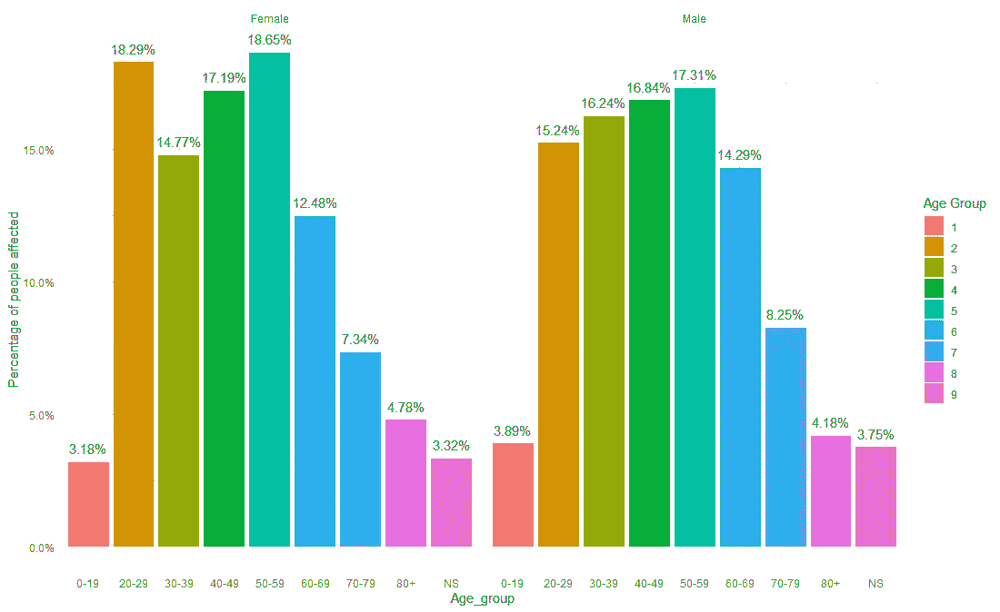
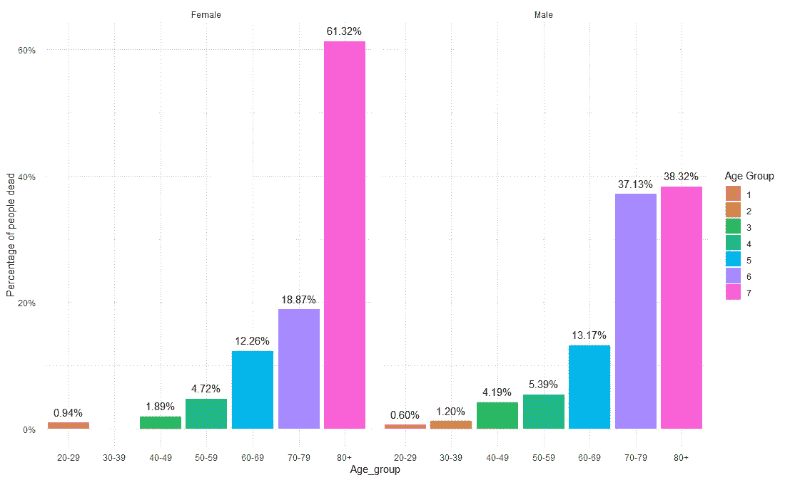
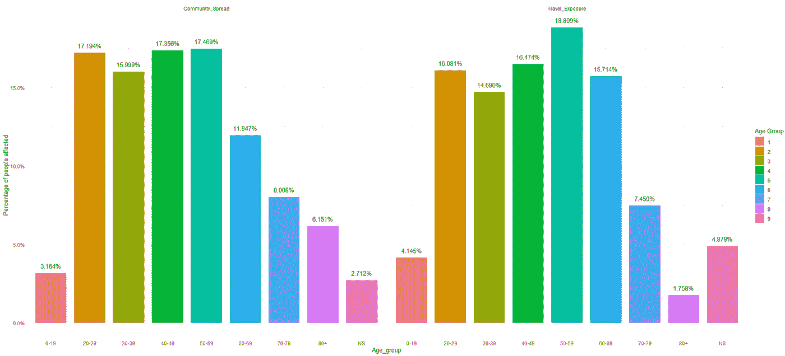
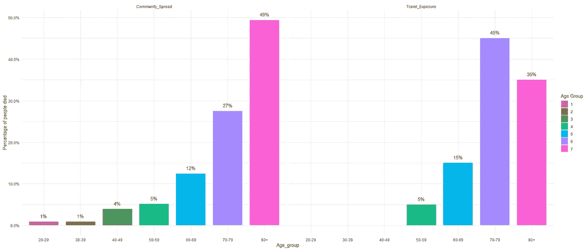
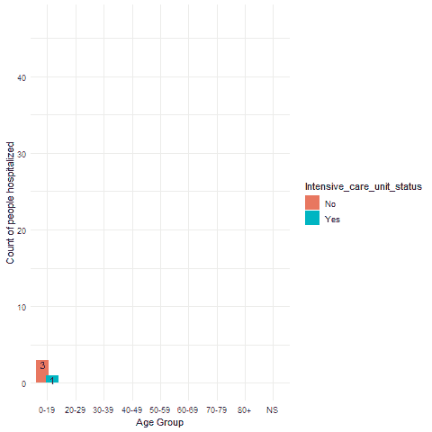
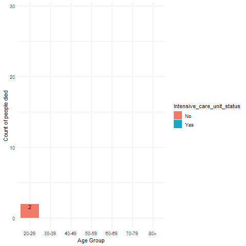

# 哪个性别和年龄组的人有感染新冠肺炎的风险？

> 原文：<https://medium.com/analytics-vidhya/how-does-covid-19-affect-different-age-groups-and-genders-8347155a189?source=collection_archive---------20----------------------->

[来源](https://www.dysartetal.ca/covid-19/)

> 最近爆发的冠状病毒震动了整个世界，几乎所有国家都受到了全球疫情的显著影响。5 月 9 日，冠状病毒病例总数突破 400 万。所有国家都受到了不同程度的影响，在美国等一些国家，COVID 的影响非常显著。到目前为止，美国报告了 80，000 例死亡，而加拿大的死亡人数超过了 5000。

答在最近的全球疫情之后，有许多新闻文章和博客声称只有老年人可能死亡，而年轻人是免疫的，一些报道声称年轻人也可能死亡。一些博客甚至声称男性比女性更容易死亡。关于 COVID 19 对不同年龄组和性别的影响，一直存在很多困惑。利用[加拿大统计局](https://www150.statcan.gc.ca/t1/tbl1/en/cv.action?pid=1310076601)公布的数据，我能够通过分析 10，000 个案例的数据来研究和验证一些事实并回答以下问题。

***1。死亡率和年龄有关系吗？这是否因性别而异？***

*有大量报道称，年轻人对 COVID 19 具有免疫力，这些人无需恐慌。在这方面有太多的困惑。这篇使用加拿大数据的博客证实了这一事实。*

***2。死亡率与年龄的关系是否因传播类型而异？***

这篇博客证实了不同类型的传播如何影响不同的年龄组，以及哪些年龄组因社区传播而感染最多。以及老年人是否因为年轻一代而处于危险之中。

***3。哪个年龄段的人最需要医疗护理？***

一些博客和 youtube 视频声称，即使年轻人感染了冠状病毒，也无需医疗即可治愈。所以这篇使用加拿大数据的博客证实了年轻一代是否需要医疗照顾。

# 不同年龄组和性别是如何受到影响的？

根据年龄组和性别，受 COVID 19 影响的人的百分比

可以看出，COVID 19 的感染率在较年轻的人群中较高。20 岁以下人群的感染率非常低，男性和女性的感染率都只有 3%。20 至 60 岁年龄组的人口占男性病例的近 70%，女性病例的 65%。在老年人口中，男性和女性的感染率分别为 25%和 30%。3%的人没有说明年龄组。那么这些受感染人群的死亡率是多少呢？

不同年龄组和性别人群的死亡率

尽管年轻人的感染率较高，但老年人的死亡率也很高，男性和女性的死亡率都接近 80%。令人惊讶的是，80 岁以上女性的死亡率非常高，为 60%，而男性的死亡率为 40%。这意味着 80 岁以上的女性人口更容易死亡。尽管 20 至 60 岁人口的感染率占 70%,但死亡率很低，仅占死亡人数的 10%。加拿大没有 20 岁以下人口死亡的报告。

# **不同类型的传播对不同年龄组有何影响？**

因不同年龄组的不同传播类型而受影响的人的百分比

所有年龄组中，因社区传播和旅行暴露而受影响的人的百分比几乎相同。仅对于 60-69 岁的人群，与社区传播导致的病例百分比相比，更多的人因旅行暴露而受到影响。

由于不同年龄组的传播不同，人们的死亡率也不同

对于有旅行史的 50 岁以下人群，没有死亡报告，但有 6%的死亡报告是由于社区传播。据报道，80 岁以上人群中有近 50%的死亡是由于社区传播，相比之下，有旅行史的人群中有 35%的死亡。与社区传播相比，有旅行史的 70-79 岁人群中报告的死亡人数更多。

# **需要住院和 ICU 的不同年龄组人群**

住院并幸存的人数

20 岁以下的年轻人对 COVID 19 并非完全免疫，一些人需要住院治疗和重症监护才能存活。可以看出，大部分年龄段的人在没有入住 ICU 的情况下存活了下来。越来越多需要重症监护治疗才能存活的人年龄在 60-69 岁之间。

可以看到，一些年龄在 20-29 岁之间的人在转移到 ICU 之前死亡。几乎所有其他年龄组的人都是在重症监护室死亡的。大多数 80 岁以上的老年人在被转移到 ICU 之前就已经死亡。

# **结论**

尽管如此，60 岁以下人群的感染率更高，60 岁以上人群的死亡率更高。80 岁以上女性人口的死亡率非常高，70 岁以上男性人口的死亡率非常高。不同年龄组因社区传播和旅行史导致的病例总数呈现相同趋势。极少数年轻人的死亡是因为社区传播而发生的。大多数年龄在 70-79 岁之间的老人在不需要医疗护理的情况下存活了下来，大多数 80 岁以上的老人在转移到 ICU 之前死亡。一些年轻人在接受医疗后活了下来。

# 数据收集

用于调查结果的数据由 10，000 个案例的信息组成，从[加拿大统计局](https://www150.statcan.gc.ca/t1/tbl1/en/tv.action?pid=1310076601)收集。

# 参考

加拿大统计局。[加拿大公共卫生署表 13–10–0766–01 冠状病毒疾病(新冠肺炎)详细确诊病例(初步数据)](https://www150.statcan.gc.ca/t1/tbl1/en/tv.action?pid=1310076601)

 [## 研究发现男性更容易死于新冠肺炎

### 根据今天在……上的一项研究，不论年龄，男性死于新冠肺炎的可能性是女性的两倍多

www.cidrap.umn.edu](https://www.cidrap.umn.edu/news-perspective/2020/04/studies-find-men-more-prone-covid-19-death) 

[https://www . weforum . org/agenda/2020/03/冠状病毒-年轻人-住院-新冠肺炎-图表](https://www.weforum.org/agenda/2020/03/coronavirus-young-people-hospitalized-covid-19-chart/) /

[https://www.youtube.com/watch?v=yWUHQaeTf9U](https://www.youtube.com/watch?v=yWUHQaeTf9U)

[https://emedicine.medscape.com/article/2500114-overview#a6](https://emedicine.medscape.com/article/2500114-overview#a6)