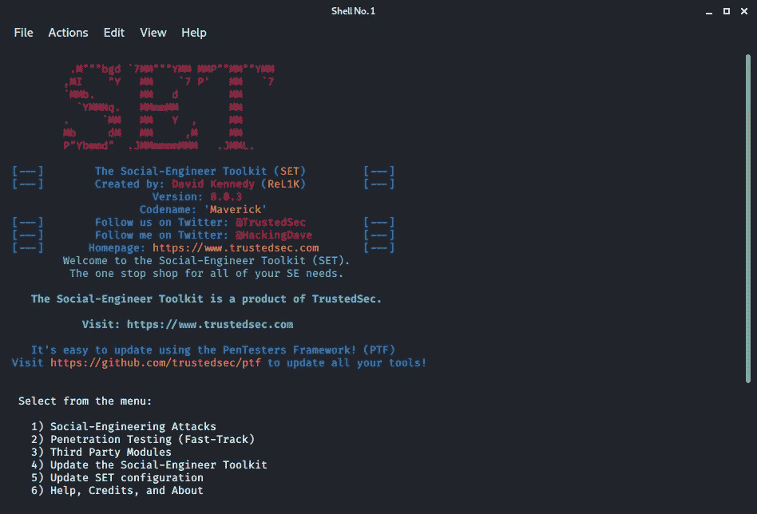

# 电子邮件欺骗是如何工作的

> 原文：<https://medium.com/analytics-vidhya/how-does-email-spoofing-work-e3007240dad8?source=collection_archive---------9----------------------->

从第一天开始，电子邮件欺骗就一直是我感兴趣的事情！但我从未真正尝试过，也不知道如何去做。我最近发现了它是如何做到的，我想我应该为其他和我一样好奇的人写点东西。声明:这仅仅是为了教育目的。我说够了！让我们开始吧:)

> 步骤 1 —安装社会工程师工具包(套件)

我们将使用 SET 框架来帮助我们执行“攻击”。所以让我们开始安装吧！


apt-get 安装集

要验证框架是否成功安装在机器上，请输入命令“setoolkit ”,并查看是否会弹出任何内容。



如果你看到这个，你已经成功地安装了框架！

> 步骤 2 —设置 SMTP 邮件服务器

为此，我们将使用 MAILGUN，因为它为初学者提供了一个免费的服务，将有限的带宽。前往该网站，创建一个免费的试用账户。


第一步是像这样设置你的 SMTP 用户帐户进行验证。


如果您正确地遵循了这些步骤，您将会看到您的 SMTP 用户被添加到用户设置中。底部还会有一些连接信息。注意:如果你在第一次显示密码时忘记了密码，只需点击重置密码，一个新的密码就会显示给你。记得拷贝好，保管好！！

> 步骤 3 —发起攻击(演示)

由于这是一次模拟攻击，我将向自己的个人收件箱发送一封电子邮件。(这仅仅是为了教育目的！！)

现在，让我们试着在这里恶搞这封邮件。

首先，用命令“setoolkit”打开 setoolkit


接下来，选择选项 1，因为我们将进行一种社会工程攻击。


在此菜单中，我们将选择选项 5，这将允许我们发送欺骗电子邮件。


在此菜单中，我们将为我们的用例选择选项 1。选择选项 1 后，我们将能够输入程序成功欺骗电子邮件所需的所有细节


```
Send email to: recipient's addressTHEN SELECT `USE YOUR OWN SERVER OR OPEN RELAY`From address: The address you want the recipient to see
From name: The "from" name you want the recipient to seeUsername for open-relay: can be found on mailgun's dashboard
Password for open-relay: can be found on mailgun's dashboard
SMTP email server adderss: smtp.mailgun.org
Flag this message/s as high priority? YES/NO (up to u)
Do u want to attach a file - Y/N: (up to u)
Do u want to attach an inline file - Y/N: (up to u)
Email subject: (up to u)
Send the message as html or plain - h/p: (up to u)
Enter body: (up to u); Remember to type `END` after u are done
```

这里有一个关于您需要在各个字段中输入什么的简短演练。

如果您正确地遵循了这些步骤，您将会看到以下内容。


现在，打开你的收件箱，检查邮件是否已经发出。


嘣！我们开始:)这就是你如何欺骗一个电子邮件地址，并成功地进入你的目标的邮箱。附注:你可以通过购买一台合适的个人 SMTP 服务器来摆脱“via-line”

我希望这已经帮助了我那些好奇的技术人员:)只是提醒一下！请不要滥用这个！这仅仅是为了教育目的！！干杯！

~Nee