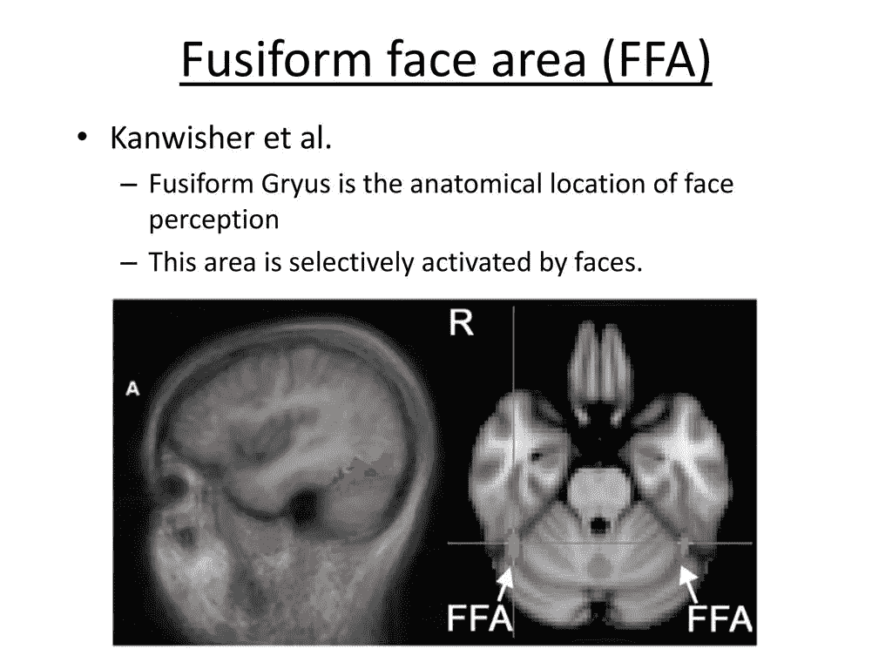
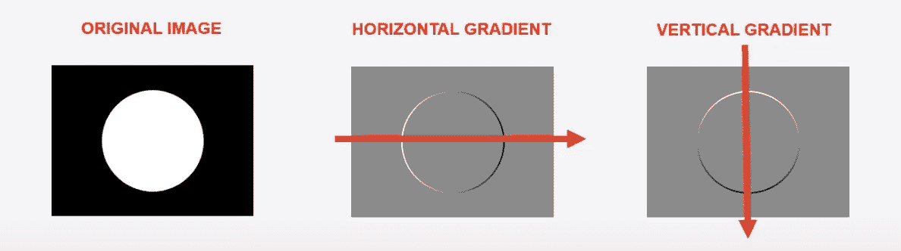
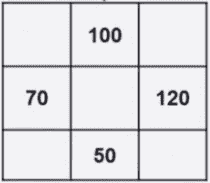
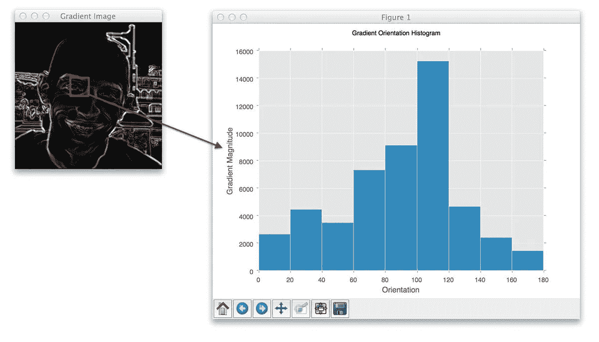
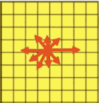
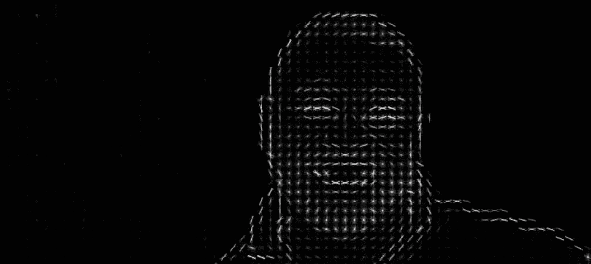
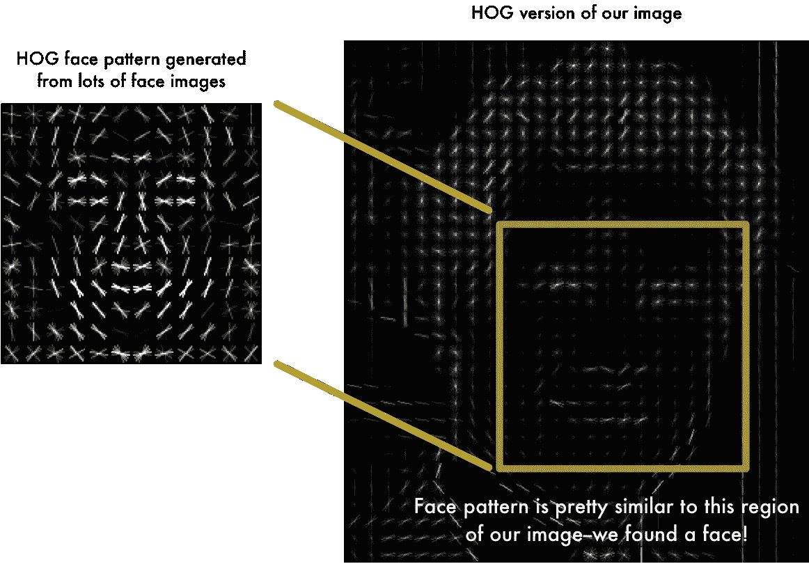

# 面部识别是如何工作的？Pt 1

> 原文：<https://medium.com/analytics-vidhya/how-does-facial-recognition-work-pt-1-5a27da18fb95?source=collection_archive---------22----------------------->

免责声明:非常基本的概述

**简史**

面部识别软件存在争议。但是它是如何工作的呢？我们后退！我们人类是如何识别人脸的？我们实际上已经在大脑中进化出了一个完整的区域，梭形面部区域(FFA)。这有助于我们做的是，它基本上使我们能够识别重复出现的模式，比如面部特征。1966 年，Woody Bledsoe、Helen Chan Wolf 和 Charles Bisson 试图将这种人类行为模仿到早期的面部识别技术中，并试图使用眼窝深度、鼻子宽度和两眼之间的距离将面部定义为“节点”。这些测量结果然后被用来计算一个被称为“面纹”的独特代码。但是这种技术有一个问题，为了正确匹配两张脸，给计算机的两张照片必须非常相似。这个模型也受到脸部角度、光线、任何头部倾斜和/或旋转以及老化的影响。自这些早期以来，面部识别软件已经走过了漫长的道路，有了[各种匹配面部的方法](https://towardsdatascience.com/face-recognition-for-beginners-a7a9bd5eb5c2)，包括神经网络和深度学习。

**先说最重要的——有没有人在场？**

[梯度方向直方图(HOG)](http://lear.inrialpes.fr/people/triggs/pubs/Dalal-cvpr05.pdf) 是一种非常可靠的检测人脸或物体的方法。理解猪如何工作的基础是上图中的。原始图像有一个黑色的外部正方形和一个白色的内部圆形。我们给黑人 0 分，给白人 1 分。首先，我们想弄清楚我们的水平梯度，当我们在原始图像上从左到右走过时，当我们“击中”白色圆圈时，我们的得分从 0 到 1。这在水平梯度图中被描绘为白色阴影，因为我们有正的增加。当我们在原始图像上移动时，当我们“击中”黑色的外部正方形时，我们再次看到光密度的变化，这在水平渐变图片上被描述为黑色阴影。我们对垂直梯度重复这个过程。

现在，我们如何将它应用于人脸检测呢？这种方法看起来是把一张图片变成一串描绘光线渐变的箭头。它的工作方式是首先我们把我们的照片变成黑白的。然后我们放大图像中的单个像素，并观察周围的像素。

然后这些像素得到一个梯度分数(0-255)，如下表所示。在一些快速的数学运算之后，我们算出了我们的梯度向量(方向)。我们对图片中的每个像素都这样做。

一旦我们计算出水平(120–70)和垂直(100–50)梯度，我们就可以找到梯度角。注意:因为我们要计算梯度差的平方，所以不管你是做 100-50 还是 50-100。

那么直方图在哪里发挥作用呢？现在我们看到的是单个像素，所以让我们缩小来看看 8 * 8 像素的网格。这给了我们 64 个像素，我们必须看。一旦我们为这些像素中的每一个做了梯度向量，我们就想把它们压缩成 9 个向量。我们如何做到这一点？我们将它绘制成一个幅值(y 轴)和角度(x 轴)的直方图。

我们现在必须在 8*8 位中对图像的其余部分进行这样的操作，一旦我们绘制了所有 8*8 的猪特征，我们就剩下一些看起来像脸的东西，同时保持了所有重要的特征！

我们快完成了！现在，我们所要做的就是找到我们的图像中看起来与已知的 HOG 模式相似的部分，这是我们从提供的其他训练人脸中提取的。

使用 PYTHON 进行您自己的面部识别:

接下来:如果一个人不面对镜头会怎样？