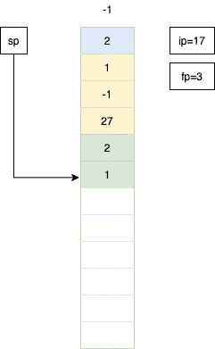
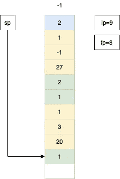

# Java 应用如何运行？什么是字节码？编写一个简单的虚拟机模拟

> 原文：<https://medium.com/analytics-vidhya/how-does-java-application-run-what-is-bytecode-write-a-simple-vm-simulation-d31e89c4839a?source=collection_archive---------15----------------------->

在研究 Java 和 JVM 架构时，我找到了 meetup talk[1]和其他资源。然后我意识到其他开发人员可能对 Java 的幕后工作很好奇。所以我决定写一篇关于 Java 应用如何运行的文章？Java VM 如何一步一步解释运行？为了讨论这个问题，我收集了一些背景资料。最后举例说明虚拟机的运行步骤。该示例应用程序基于 meetup talker Terence Parr[1]。


**背景信息**

**“Java**是一种通用的编程语言，它是基于类的、面向对象的，并且被设计成具有尽可能少的实现依赖性。它旨在让应用程序开发人员*编写一次，在任何地方运行* (WORA)，这意味着编译后的 Java 代码可以在所有支持 Java 的平台上运行，而无需重新编译。Java 应用程序通常被编译成可以在任何 Java 虚拟机(JVM)上运行的字节码，而不管底层的计算机架构如何。Java 的语法类似于 C 和 C++，但是它的底层工具比它们都少。据 GitHub 称，截至 2019 年，Java 是最受欢迎的编程语言之一，特别是对于客户端-服务器 web 应用程序，据报道有 900 万开发者。”[2]

正如在 Java 定义中所说的，一旦你用 Java 编写了你的程序，它可以在任何地方运行。为了达到这个目的，Java 使用了字节码和 JVM。在开始讨论 Java 架构之前，我们先来看看 c 等其他语言。

在编译阶段之后，所有的对象被合并并成为可执行文件。这叫做链接。输出 exe 已准备好运行。


另一方面，Java 编译器将。类文件，而不链接这些文件。这些类文件包含另一个称为字节码的 IL。但是计算机不能直接读取和运行字节码。所以虚拟机需要将这些转换成计算机可执行的代码。这种方法的优点是，当您创建字节码文件时，每个架构都使用自己的 JVM，并且可以运行 Java。Java 就是这样在每个平台上运行的。


另一方面，JIT 编译器(Just-In-Time)在运行时解释这个字节码。所以 Java 比一些语言要慢。同样，这种体系结构使得 Java 既是编译语言又是解释语言。因为 java 编译器编译 Java 文件生成类文件。然后 JIT 将类文件解释为本机代码。

利用这些背景信息，我们将编写自己的虚拟机。这个虚拟机会非常原始。但是理解了主要概念就更清楚了。理解字节码是如何执行的比编写简单的代码更重要。

将 Java 代码转换成字节码是 Java 编译器的责任。但是让我们不看细节。下面的代码包含了最原始的阶乘代码。

```
*/**
 ** ***@author*** *Yunus
 */* public class Main {

    static int factorial(int num) {
        if (num < 2) {
            return 1;
        }
        return num * *factorial*(num - 1);
    }

    public static void main(String[] args) {
        *factorial*(2);
    }
}
```

使用下面的命令将生成字节码。

```
javac Main.java
```

让我们用下面的命令来看看 Main.class 文件。

```
$javap -p -c -v Main.classLast modified Jul 3, 2020; size 378 bytes
  MD5 checksum 1928bdcf95625d8714f1aa34b13ec2f2
  Compiled from "Main.java"
public class Main
  minor version: 0
  major version: 52
  flags: ACC_PUBLIC, ACC_SUPER
Constant pool:
   #1 = Methodref          #4.#16         // java/lang/Object."<init>":()V
   #2 = Methodref          #3.#17         // Main.factorial:(I)I
   #3 = Class              #18            // Main
   #4 = Class              #19            // java/lang/Object
   #5 = Utf8               <init>
   #6 = Utf8               ()V
   #7 = Utf8               Code
   #8 = Utf8               LineNumberTable
   #9 = Utf8               factorial
  #10 = Utf8               (I)I
  #11 = Utf8               StackMapTable
  #12 = Utf8               main
  #13 = Utf8               ([Ljava/lang/String;)V
  #14 = Utf8               SourceFile
  #15 = Utf8               Main.java
  #16 = NameAndType        #5:#6          // "<init>":()V
  #17 = NameAndType        #9:#10         // factorial:(I)I
  #18 = Utf8               Main
  #19 = Utf8               java/lang/Object
{
  public Main();
    descriptor: ()V
    flags: ACC_PUBLIC
    Code:
      stack=1, locals=1, args_size=1
         0: aload_0
         1: invokespecial #1                  // Method java/lang/Object."<init>":()V
         4: return
      LineNumberTable:
        line 4: 0static int factorial(int);
    descriptor: (I)I
    flags: ACC_STATIC
    Code:
      stack=3, locals=1, args_size=1
         0: iload_0
         1: iconst_2
         2: if_icmpge     7
         5: iconst_1
         6: ireturn
         7: iload_0
         8: iload_0
         9: iconst_1
        10: isub
        11: invokestatic  #2                  // Method factorial:(I)I
        14: imul
        15: ireturn
      LineNumberTable:
        line 7: 0
        line 8: 5
        line 10: 7
      StackMapTable: number_of_entries = 1
        frame_type = 7 /* same */public static void main(java.lang.String[]);
    descriptor: ([Ljava/lang/String;)V
    flags: ACC_PUBLIC, ACC_STATIC
    Code:
      stack=1, locals=1, args_size=1
         0: iconst_2
         1: invokestatic  #2                  // Method factorial:(I)I
         4: pop
         5: return
      LineNumberTable:
        line 14: 0
        line 15: 5
}
SourceFile: "Main.java"
```

我们的主函数有一条指令，

```
1: invokestatic #2 // Method factorial:(I)I
```

基本上就是说调用阶乘方法。#2 的含义可以在常量池内找到，说明了我们的阶乘函数及其信息。可以从方法表中找到正确的函数。

```
#2 = Methodref          #3.#17#3 = Class              #18#17 = NameAndType        #9:#10         // factorial:(I)I
#18 = Utf8               Main#9 = Utf8               factorial
#10 = Utf8               (I)I
```

下面我们来关注阶乘函数的字节码:

```
0: iload_0
1: iconst_2
2: if_icmpge     7
5: iconst_1
6: ireturn
7: iload_0
8: iload_0
9: iconst_1
10: isub
11: invokestatic  #2                  // Method factorial:(I)I
14: imul
15: ireturn
```

因此，要运行阶乘代码，我们需要将其转换为计算机运算。有一个庞大的指令列表[5]。但是我将只在阶乘代码中实现使用过的指令。有了这种极简主义的方法，就容易理解了。

开始时，我们有唯一的内存堆栈，因为我们没有对象，等等。

我们的极简 VM 基本上接受指令并执行它。所以为了保存重要的信息，我们需要堆栈指针(sp)、指令指针(ip)和帧指针(fp)。

将使用堆栈指针，即堆栈中的当前位置。

指令指针保持哪个指令被执行。

帧指针…

例如:iload_0，从局部变量 0 加载一个 int *值*

还有，有一个叫 iload 的教练，从局部变量 *#index* 加载一个 int *值*

**iload_0** 和 **iload 0** 两者都为真。为了更加通用，我将使用 iload 0 来加载任何索引。其他说明也一样。

出于简单的原因，我们将只调用**和指令号，而不是调用 static #2**

**if_icmpge** = >如果 *value1* 大于或等于 *value2* ，则分支到 *branchoffset 处的指令。所以我把这些指令划分如下(ilt 和 brf)。*

我们继续前进，就好像生成了下面的字节码。如果一条指令有操作数，那么下一条指令的编号就会改变。

```
Factorial method:0: iload 0
2: iconst 2
4: ilt
5: brf 10
7: iconst 1
9: return
10: iload 0
12: iload 0
14: iconst 1
16: isub
17: call  0,1                  
20: imul
21: returnMain method:22: iconst 2
24: call 0,1
27: print
28: halt
```

首先，我们来定义指令。代码片段摘自会议讨论正如我在开始时所说，我做了一些重构[1]。我想演示每一步来说明它是如何工作的？实际上代码非常简单。理解概念更重要。

首先，我创建了 Instruction 类，它只包含阶乘样本所需的指令。

```
import java.util.Arrays;
import java.util.Optional;
public enum Instruction {

    *ILOAD*(1, 1),
    *ICONST*(2, 1),
    *ILT*(3, 0),
    *RET*(4, 0),
    *ISUB*(5, 0),
    *CALL*(6, 2),
    *IMUL*(7, 1),
    *PRINT*(8, 0),
    *HALT*(9, 0),
    *BRF*(10, 1);

    private final int code;
    private final int numberOfOperand;

    Instruction(int code, int numberOfOperands) {
        this.code = code;
        this.numberOfOperand = numberOfOperands;
    }

    public static Optional<Instruction> findByCode(int code) {
        return Arrays.*asList*(Instruction.*values*()).stream().filter(x -> x.getCode() == code).findFirst();
    }

    public int getCode() {
        return code;
    }

    public int getNumberOfOperand() {
        return numberOfOperand;
    }
}
```

定义测试类，字节码作为输入。状态从主方法的第一条指令开始。

```
public class Test {
    static int[] *factorial* = {
            Instruction.*ILOAD*.getCode(), 0,
            Instruction.*ICONST*.getCode(), 2,
            Instruction.*ILT*.getCode(),
            Instruction.*BRF*.getCode(), 10,
            Instruction.*ICONST*.getCode(), 1,
            Instruction.*RET*.getCode(),
            Instruction.*ILOAD*.getCode(), 0,
            Instruction.*ILOAD*.getCode(), 0,
            Instruction.*ICONST*.getCode(), 1,
            Instruction.*ISUB*.getCode(),
            Instruction.*CALL*.getCode(), 0, 1,
            Instruction.*IMUL*.getCode(),
            Instruction.*RET*.getCode(), Instruction.*ICONST*.getCode(), 2,
            Instruction.*CALL*.getCode(), 0, 1,
            Instruction.*PRINT*.getCode(),
            Instruction.*HALT*.getCode()
    };

    public static void main(String[] args) {
        Vm vm = new Vm(*factorial*, 22);
        vm.execute();
    }
}
```

虚拟机类别:

```
public class Vm {
    public static final int *DEFAULT_STACK_SIZE* = 1000;
    public static final int *NUMBER_OF_GLOBAL* = 0;
    public static final int *FALSE* = 0;
    public static final int *TRUE* = 1;
    int ip = -1, sp = -1, fp = -1, defaultOffset = -3;
    int[] code, globals, stack;

    public Vm(int[] code, int startip) {
        this.code = code;
        ip = startip;
        globals = new int[*NUMBER_OF_GLOBAL*];
        stack = new int[*DEFAULT_STACK_SIZE*];
    }

    public void execute() {
        int opcode = code[ip];
        Instruction instruction = getInstruction(opcode);
        Optional<Instruction> optionalInstruction;
        if (instruction == null) return;
        int a, b, addr, offset;

        while (opcode != Instruction.*HALT*.getCode() && ip < code.length) {
            instruction = getInstruction(opcode);
            ip++;
            switch (instruction) {
                case *ILOAD*:
                    offset = defaultOffset + code[ip++];
                    stack[++sp] = stack[fp + offset];
                    break;
                case *ICONST*:
                    stack[++sp] = code[ip++];
                    break;
                case *ILT*:
                    b = stack[sp--];
                    a = stack[sp--];
                    stack[++sp] = (a < b) ? *TRUE* : *FALSE*;
                    break;
                case *ISUB*:
                    b = stack[sp--];
                    a = stack[sp--];
                    stack[++sp] = a - b;
                    break;
                case *CALL*:
                    addr = code[ip++];
                    int nargs = code[ip++];
                    stack[++sp] = nargs;
                    stack[++sp] = fp;
                    stack[++sp] = ip;
                    fp = sp;
                    ip = addr;
                    break;
                case *RET*:
                    int rvalue = stack[sp--];
                    sp = fp;
                    ip = stack[sp--];
                    fp = stack[sp--];
                    nargs = stack[sp--];
                    sp -= nargs;
                    stack[++sp] = rvalue;
                    break;
                case *IMUL*:
                    b = stack[sp--];
                    a = stack[sp--];
                    stack[++sp] = a * b;
                    break;
                case *PRINT*:
                    System.*out*.println(stack[sp--]);
                    break;
                case *BRF*:
                    addr = code[ip++];
                    if (stack[sp--] == *FALSE*) ip = addr;
                    break;
            }
            opcode = code[ip];
        }
    }
```

现在最重要的部分来了。我想讨论一下在执行完每条指令之后的堆栈状态，以便深入研究逻辑。

让我们举例说明如何计算阶乘 2。

在执行任何字节码之前，我们的堆栈看起来像这样:


```
22: iconst 2 // bytecode
Instruction.*ICONST*.getCode(), 2,  // input equilavent
```

这个字节码基本上在栈中定义了一个整数常量。


如您所见，2 位于堆栈中。ip 变为 24，这意味着下一条指令。

```
24: call 0,1
Instruction.*CALL*.getCode(), 0, 1
```

当前指令说用 1 个参数调用指令 0。调用和返回是最复杂的操作。所以我试着给你更多的细节。在调用另一个函数时，我们需要存储重要的信息。该信息将在回电后使用。在我们的示例应用程序中，我们存储了 3 条信息。

1-)参数数量(1)

2-)当前帧指针(-1)

3-)下一条指令(27)


我们的 ip 变成了 0，因为下一条指令是 0。Sp 是 3。Fp 变成了 3，因为在执行另一个函数之前，sp 是 3。所以阶乘函数的 Fp 是 3。最后，我们从 main 方法调用阶乘函数。现在让我们迭代阶乘函数的第一条指令。

```
0: iload 0
Instruction.*ILOAD*.getCode(), 0,
```


正如您在加载数据时注意到的代码，有 **-3 偏移**。为什么会存在？因为在调用函数的时候，我们放了 3 个关于之前情况的额外信息。当从堆栈中加载数据时，我们需要用这个偏移量来获取值，以找到正确的值。3 额外信息显示为黄色。参数是蓝色的，本地值是绿色的。 **iload 0** 加载 2，它作为参数被推入 main 方法中。然后再次压入堆栈以用作本地值。现在 ip 变成了 2。我们走吧:

```
2: iconst 2
Instruction.*ICONST*.getCode(), 2,
```

现在我们来对 n<2 part of our functions. In order to that, we need to put value 2 to our stack.


```
4: ilt
Instruction.*ILT*.getCode(),
```

ILT, just pop the last 2 values and execute less than operations. If true then puts 1 to stack else puts 0\. 2<2 is false so puts 0.


```
5: brf 10
Instruction.*BRF*.getCode(), 10,
```

We divide if_icmpge operation to lt and brf. Brf means if false then branch specified index. Brf pops and looks stack whose last element 0\. 0 means false, so we need to branch instruction number 10.


```
10: iload 0
Instruction.*ILOAD*.getCode(), 0,
```


```
12: iload 0
Instruction.*ILOAD*.getCode(), 0,
```


```
14: iconst 1
Instruction.*ICONST*.getCode(), 1,
```


```
16: isub
Instruction.*ISUB*.getCode(),
```

Now we are trying to return 2* factorial(**2–1**进行一次短接操作。我们的程序弹出最后两个值，并将它们的差放入堆栈。所以我们弹出了 2 和 1。然后将 1 压入堆栈。



```
17: call  0,1
Instruction.*CALL*.getCode(), 0, 1
```

现在，我们进行递归调用(2* **阶乘(1)** 。


我们放 1 是因为参数的数量是 1。我们上一次的 fp 是 3，所以我们推 3。最后，在第 17 个指令之后，我们需要继续第 20 个指令，所以推 20。现在我们再次开始阶乘函数。我们一会儿将重复同样的操作。我只放当前状态的图片。

```
0: iload 0
Instruction.*ILOAD*.getCode(), 0,
```


```
2: iconst 2
Instruction.*ICONST*.getCode(), 2,
```


```
4: ilt
Instruction.*ILT*.getCode(),
```

这次 1<2 为真，就把 1 压入栈。


```
5: brf 10
Instruction.*BRF*.getCode(), 10,
```

这一次最后一个元素 stack 不为 false，所以我们不进行分支。我们继续学习指令 7。


```
7: iconst 1
Instruction.*ICONST*.getCode(), 1,
```



```
9: return
Instruction.*RET*.getCode(),
```

另一个非常重要的指令是返回。执行以下步骤:

*   从堆栈中获取返回值。在我们的例子中，它是 1。
*   从堆栈中获取指令指针值。我们需要这个值来找到继续的地方。在我们的例子中，是 20。在 factorial 返回递归调用后，我们需要应用乘法(inst#20)。
*   获取帧指针。现在是 3 点。
*   从堆栈中弹出这些值后。我们减少了参数数量。
*   我们需要将返回值压入堆栈。


```
20: imul
Instruction.*IMUL*.getCode(),
```

将堆栈中的最后两个元素相乘。


```
21: return
Instruction.*RET*.getCode(),
```

将执行另一个返回指令。


如你所见，我们返回了指令 27。我们又回到了主函数中。局部 2 是阶乘函数的返回值。

```
27: print
Instruction.*PRINT*.getCode(),
```

和你一样，没有任何打印说明。但是为了演示我们的工作，增加了这个指令。


```
28: halt
Instruction.*HALT*.getCode()
```

在 halt 指令之后，我们的程序将被退出。

这次我研究了字节码、JVM 和 JIT 资源，并编写了这些资源的输出。下次分享 Java、GraalVM 中的**提前编译** ( **AOT 编译**)和优缺点。保持联系。

引用:

1-)【https://www.youtube.com/watch?v=OjaAToVkoTw】T4

2-)[https://en . Wikipedia . org/wiki/Java _(编程语言)](https://en.wikipedia.org/wiki/Java_(programming_language))

3-)[https://www.guru99.com/java-virtual-machine-jvm.html](https://www.guru99.com/java-virtual-machine-jvm.html)

4-)[https://www . lo hika . com/methods-invocation-inside-of-a-Java-virtual-machine #:~:text = JVM % 20 methods % 20 invocations，dedicated % 20 part % 20 of % 20 文章。](https://www.lohika.com/methods-invocation-inside-of-a-java-virtual-machine#:~:text=JVM%20methods%20invocations,dedicated%20part%20of%20the%20article.)

5-)[https://en . Wikipedia . org/wiki/Java _ bytecode _ instruction _ listings](https://en.wikipedia.org/wiki/Java_bytecode_instruction_listings)