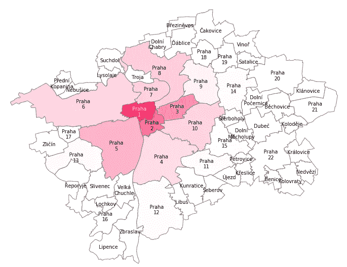
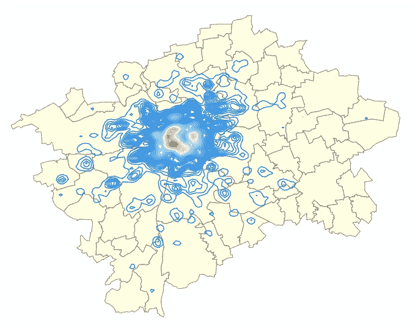
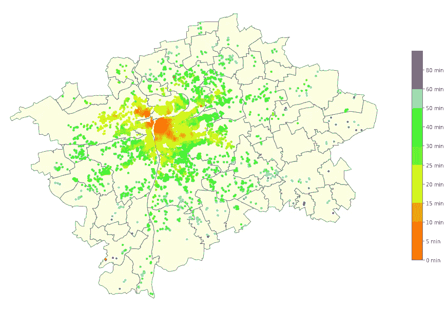
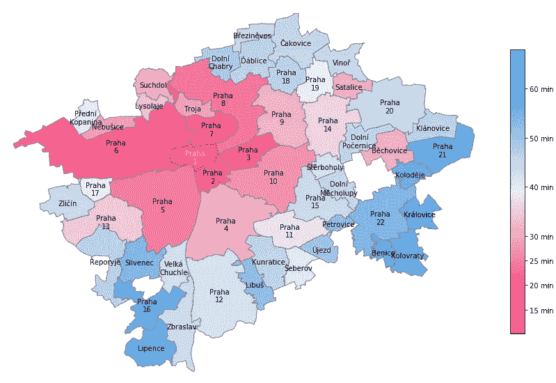
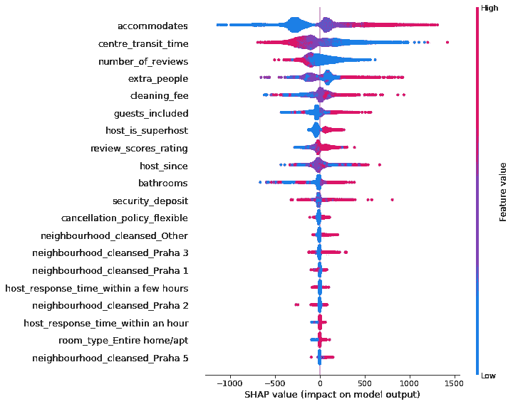
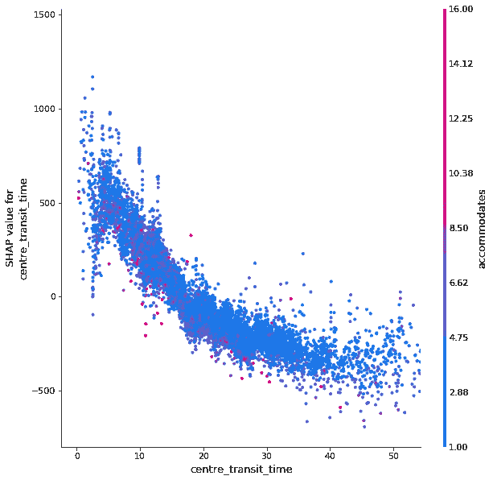

# 地理位置如何影响布拉格 Airbnb 的价格？

> 原文：<https://medium.com/analytics-vidhya/how-does-location-affect-the-price-of-airbnb-in-prague-b8e31e766ca8?source=collection_archive---------30----------------------->

Anthony DELANOIX 在 [Unsplash](https://unsplash.com?utm_source=medium&utm_medium=referral) 上拍摄的照片

布拉格从世纪之交的默默无闻变成了欧洲第五大游客最多的城市。毫不奇怪，布拉格的 Airbnb 市场正在蓬勃发展，主人在争夺每一个预订，游客在房源中寻找隐藏的宝石。

在这项分析中，我最感兴趣的是 Airbnb 房源的不同特征，尤其是位置，是如何影响价格的。

# 我们有什么数据？

多亏了 Airbnb 内部的[项目](http://insideairbnb.com/get-the-data.html),我们能够使用直接从 Airbnb 新收集的房源数据。这包括以下信息:

*   房产——卧室、浴室、便利设施的数量、房产类型、文字描述等。
*   主机——其他列表的数量、超级主机状态、主机经验
*   酒店位置——街区信息、纬度和经度
*   有效性
*   审查摘要

在我们的数据中，唯一能对价格产生影响的可用地理特征是邻居的名字。因为我们有每个列表的纬度和经度值，所以我们可以确定它离市中心有多远。一种简单的方法是“直线”计算距离。但是我们可以做得更好…

假设乘坐公共交通工具到市中心的时间是列表中最理想的地理质量，我们可以通过利用谷歌的 [Google Maps Route API](https://cloud.google.com/maps-platform/routes) 来利用谷歌的力量，通过“到市中心的交通时间”功能来增强我们的数据集。老城广场[被选为我们的中心位置，所有时间都是在工作日上午 9:00 获取的。](https://goo.gl/maps/faDAmiJgMgtiavXz8)

# 数据可视化

多亏了 Airbnb 的地理空间数据，我们能够可视化布拉格的房源分布。

一个行政区的色彩饱和度代表了布拉格市场中的上市份额

所有列表的核密度估计图

我们可以看到，到目前为止，中央区(布拉格 1 号)在列表中的份额最大，几乎达到 30%。周围的行政区仍然相当受欢迎，尤其是布拉格 2 区和 3 区。另一方面，郊区的上市公司仍然很少。

# 可视化公共交通时间

每个点是一个单独的列表，色调代表到市中心的时间

从上面的图中我们可以看到，随着离市中心距离的增加，时间不是线性增加的，而是遵循从市中心开始的线状模式。这些事实上与布拉格地铁系统不谋而合。

一个行政区的颜色饱和度代表该区内的列表到市中心的平均公共交通时间

这个图给了我们一个关于哪些行政区可能用他们的位置欺骗我们的想法。例如*多尔尼亚伯里*和*ďáblice*在地理上离市中心相当近，但它们缺乏与布拉格交通系统的连接。关于 *Satalice* 和*bóCHO vice*街区可以说是相反的情况，它们通过区域火车服务直接连接到市中心。

# 位置对上市价格的影响

该分析中采用的方法是训练一个机器学习模型，根据列表的可用功能预测每日价格，然后检查它们对模型决策的影响。

特征工程包括从数据集中移除不相关和高度相关的变量、一次性编码分类变量和输入缺失值(相关 [Github 报告](https://github.com/jakubkocvara/prague-airbnb)中的详细信息)

选择的机器学习技术是使用流行的 XGBoost 算法的回归。训练模型包括基于平均权重、信息增益或决策树覆盖范围的特征重要性信息，但这些指标有时会产生误导，特别是如果我们没有充分消除相关特征。

## 使用 Shapley 值的解释

为了解释我们特征的影响，我们将转向经济博弈论的一个概念。通过使用我们的特征空间的各种子集进行预测，并查看它如何影响我们的预测价格，我们计算每个特征对输出的平均贡献- *Shapley 值。*在 [SHAP 知识库](https://github.com/slundberg/shap)中找到关于该技术和所用库的更多信息。

SHAP 摘要图为我们的预测模型，输出是对捷克克朗(CZK)价格的影响。

我们可以看到，对于我们的模型的决策来说，最重要的特征是酒店可以容纳多少客人。第二个最重要的预测因素是到中心的旅行时间，仅次于允许的游客数量。正如我们所料，它与价格成反比关系:从房产到市中心所需的时间越少，价格越高。它的影响力也远远高于其他看似重要的因素，如复习分数。有一个有趣的现象，评论的数量对价格有负面影响，这似乎与直觉相反，但可能只是因为较便宜的房产容纳的人较少，出租的频率更高，因此评论数量更高。

SHAP 部分从属地块为“到市中心的时间”。随着旅行时间的增加，我们可以看到价格明显下降。色调代表一个给定的属性可以容纳的人数

# 结论

我们研究了可视化地理空间数据的各种方法，并得出结论，毫不奇怪，房产的位置对房产的价格有很大的影响。我还想展示从外部来源构建新特性的价值，在我们的例子中是 Google Maps API。通过这种分析，我们只是触及了表面，深入了解 Airbnb 市场有着巨大的潜力。你可以随意从 Airbnb 的[下载最新数据，并随意使用。](http://insideairbnb.com/get-the-data.html)

与这篇文章相关的所有代码都在我的 Github 资源库中:【https://github.com/jakubkocvara/prague-airbnb】T4。