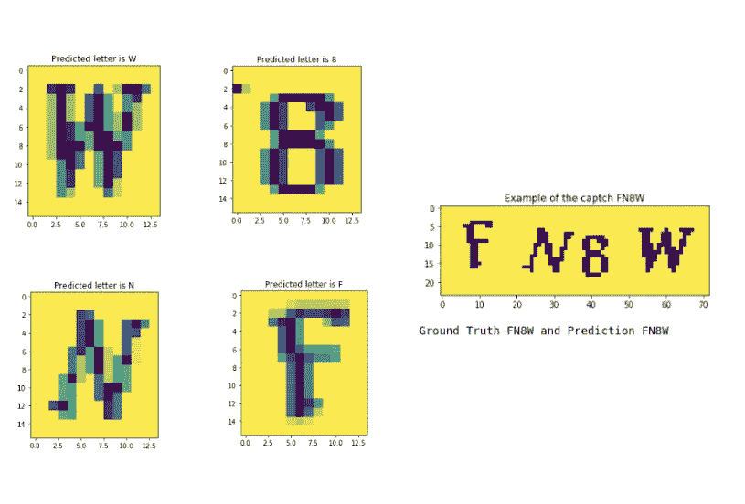

# 机器学习如何公平对抗验证码？

> 原文：<https://medium.com/analytics-vidhya/how-does-machine-learning-fair-against-captcha-4fd98bbaf364?source=collection_archive---------26----------------------->

(权利:拥有)

> 让我们看看 CNN 和宇宙魔方能否破解验证码！

验证码应该是用来检查是机器人还是人在电脑后面做这个动作。嗯，不是说它过时了(因为我们在这里使用相当弱的验证码)，但有些很容易被攻击。在本文中，我们将展示两种潜在的方法，分别是我们的架构…