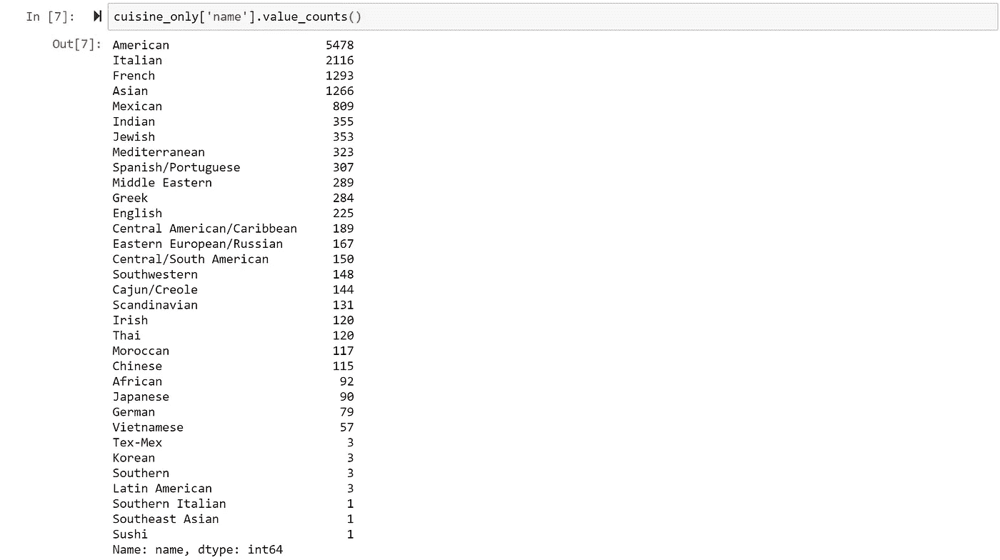
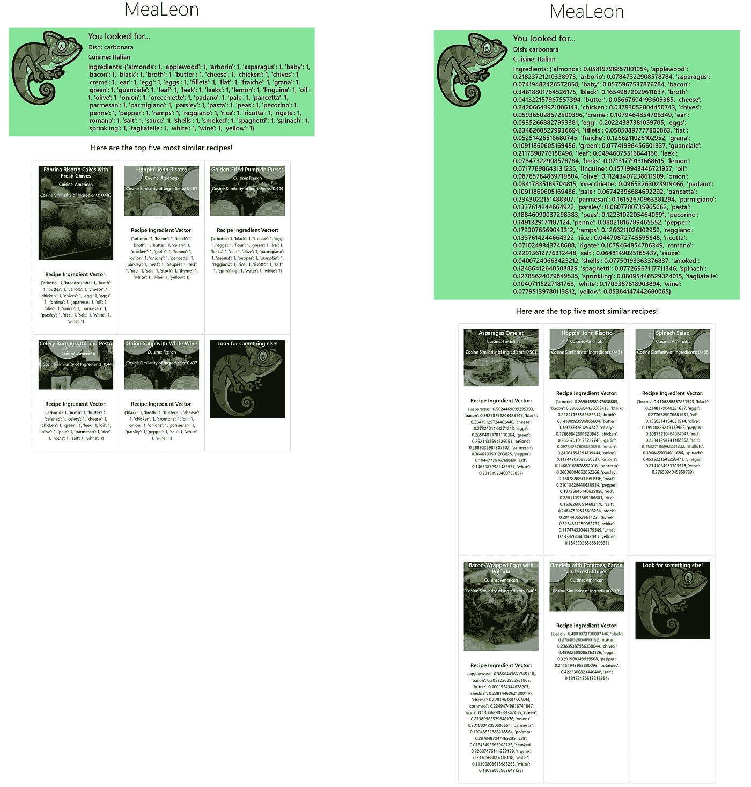
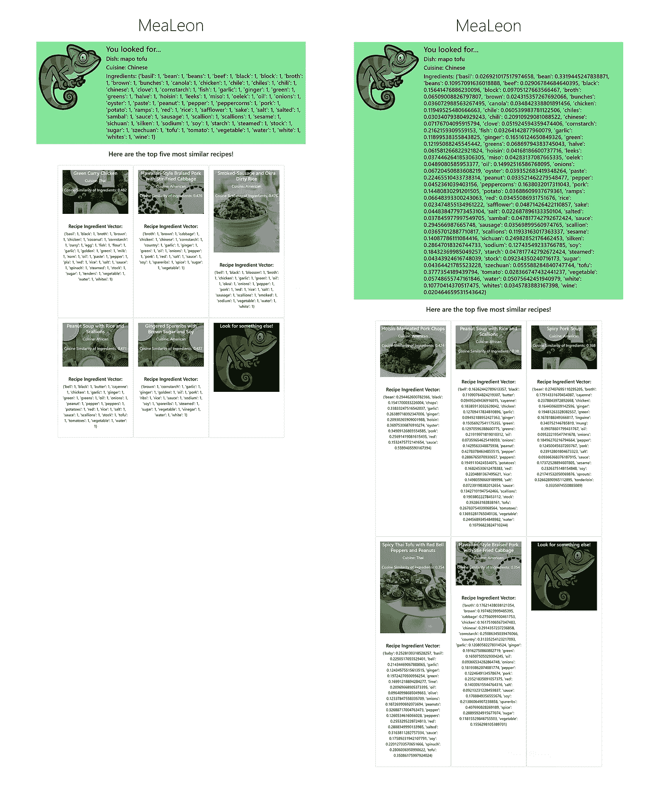
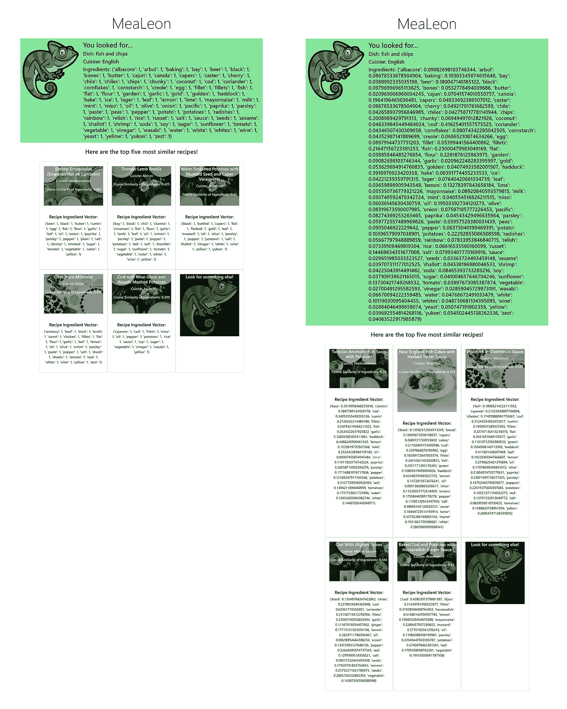
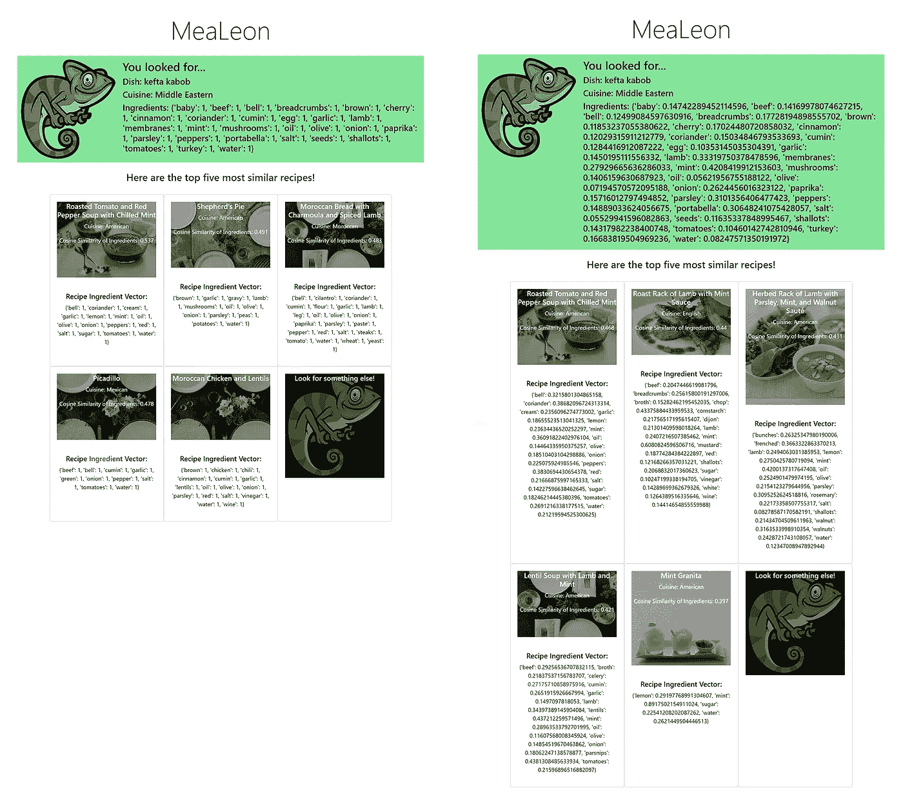
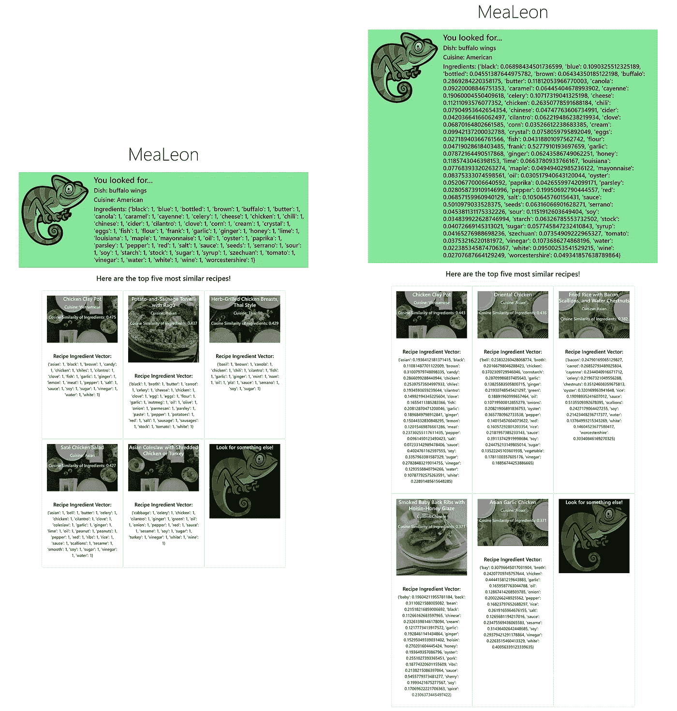

# MeaLeon 如何使用 NLP？第 3 部分:比较 Hot 编码和 TF-IDF 的一些结果

> 原文：<https://medium.com/analytics-vidhya/how-does-mealeon-use-nlp-part-3-some-results-comparing-one-hot-encoding-and-tf-idf-e664c879882d?source=collection_archive---------23----------------------->

阿什利·巴茨在 [Unsplash](https://unsplash.com?utm_source=medium&utm_medium=referral) 上的照片

嘿伙计们！

这是我的全栈机器学习 webapp [MeaLeon](http://mealeon.herokuapp.com/) 如何使用自然语言处理(NLP)根据你作为搜索查询输入的一个菜系，提供不同菜系烹饪新菜的建议的演练教程系列的第 3 部分！查看上面的链接，以及这里的[回购](https://github.com/AaronWChen/MeaLeon)。

在本系列的第一部分[中，我讨论了如何通过结合自然语言工具包(NLTK)、WordNet 词汇化和“专家”知识(我对烹饪的熟悉程度)，将一组文档(食谱)和原始文本成分转换成词根的标记。](/analytics-vidhya/a-walkthrough-nlp-workflow-using-mealeon-part-1-prepping-the-data-8ffe46820f56)

在[的前一部分](/analytics-vidhya/a-walkthrough-nlp-workflow-using-mealeon-part-2-rise-and-cosine-d027c339829b)中，我讨论了如何将标记化的成分列表转换成多维空间中的向量，以及为什么使用余弦相似度比向量之间的欧几里德距离更好地提供建议。

在本文中，我将向您展示从 MeaLeon 获得的一些示例食谱的结果，以及 One Hot Encode (OHE)和术语频率、逆文档频率(TF-IDF)之间的一些比较。

提醒一下，因为这些数字很可能会在以后出现，所以 MeaLeon 使用了一个数据库，其中包含来自 24 个菜系的约 18，000 种食谱，涵盖了超过 2，000 个配料轴的配料空间。老实说，这不是吹牛！尽管我很喜欢开发和使用 MeaLeon，但它仍处于不断改进的状态:

1.  还有其他食谱来源有更多的菜肴；我考虑的一个来源有将近 50 万。
2.  24 cuisines 是一个非常小的数字，目前的数据库是不成比例的加权和标签低于令人满意的质量。至少对我来说是这样。

如果你对代表性不足的菜系有什么建议，请告诉我！

3.2000 多种配料听起来很多……如果你从来没有做过大量加香料的食物。我记得几年前，希拉·狄龙试图用英国广播公司的菜谱做一道咖喱菜，当她去一家专卖店询问配料和菜谱的质量时，店主给了她一道菜的家庭菜谱，里面有 50 多种配料。

# **挑选 10 个，咀嚼 5 个:MeaLeon 搜索并显示**

首先，MeaLeon 会要求用户输入一道菜的名称以及这道菜的来源。菜肴名称通过主页上的文本框提供，菜名从下拉列表中选择。MeaLeon 使用毛豆 API 来查找具有相同菜名的菜肴，从 API 中提取 10 个热门菜名，并从所有 10 个菜名中提取配料表，以制作一个“平均版本”。这个“平均版本”用于余弦相似性分析。MeaLeon 的数据库是从 Epicurious 刮来的。

我将展示 One Hot Encoded 和 TF-IDF 结果之间的一些比较。这些截图不是我在 Heroku 应用程序上部署的，因为我发现演示对用户来说没有吸引力，也没有帮助。它们显示每个成分向量的重量，本质上是许多数字。然而，它们对我很有帮助，因为我正在尝试迭代改进应用程序。

无论如何，这里有一些测试食谱！在每张照片中，OHE 的结果在左边，TF-IDF 的结果在右边。

首先，意大利烤肉卷

第二，中国麻婆豆腐

第三，英式炸鱼薯条

第四，中东卡夫塔烤肉串

最后，美国布法罗鸡翅

我们在这里如何衡量绩效？注意，没有一个食谱的余弦相似度是 1。这将要求搜索查询和数据库之间的所有标记化成分都是相同的……这是可能的，但可能性极小。但是更高的余弦相似性将反映出菜肴成分之间更紧密的关系。

那么 OHE 和 TF-IDF 哪个更好呢？逻辑上，我会说 TF-IDF 更好，因为它降低了语料库中最常见单词的重要性。有了这五个食谱，我个人认为 TF-IDF 产生了与搜索查询最相似的建议。然而，我觉得 OHE 返回的结果比 TF-IDF 给出的更令人惊讶！

事实上，我想我可以重构这个来显示前五名最相似的(TF-IDF)和前五名伸展/冒险相似的(OHE)！

但是模型/电脑性能呢？我想留到下次吧。与此同时，请随时给我一个尝试，让我知道哪些建议的食谱对你来说是最有趣的！