# PCA(主成分分析)到底是怎么工作的？

> 原文：<https://medium.com/analytics-vidhya/how-does-pca-really-work-e53f640e5323?source=collection_archive---------5----------------------->

## 揭开主成分分析工作背后的数学，为什么它是重要的，以及如何解释其结果。

PCA 或主成分分析是一种无监督算法，用于降低数据的维数，而不尽可能补偿信息的损失。通过只提取重要变量，然后创建新的不相关变量来最大化方差，PCA 有助于解决维数灾难和过拟合等问题。实现 PCA 的代码(用 Python 或 R)相当简单且容易获得。因此，我不会在这上面浪费时间，而是将重点放在算法成功运行背后的数学上。
在这个阶段，我认为在深入研究 PCA 之前，关注一下我们所说的维数灾难是很重要的，因为这将帮助我们认识到使用 PCA 的重要性以及何时有必要这样做。除非我们确信某样东西确实有用和重要，否则它几乎不值得学习。

# 这个“诅咒”是什么？

两个假设形成了半监督学习的基础:**嵌入**(高维数据的底层结构通常要简单得多)和**连续性**(彼此靠近的数据点比相距较远的数据点彼此更相似)。这两个假设，以及一些统计结果，在处理多维数据时会产生一些问题。

1.  随着维度数量的增加，数据呈指数增长，可能会影响性能速度和质量中的一个或两个。对于 n 个各有 m 维的观测值，我们基本上有 nᵐ条信息。
2.  并非所有的维度都是真正相互独立的，而是相互关联的，并且违反了重要的统计假设。
3.  在极高的维度中，随着空闲空间的增加，数据变得更加分散。几乎所有的观察都变得彼此等距，从而使距离度量的有效性无效。

# 那么，PCA 是如何工作的呢？

现在我们知道了为什么 PCA 是重要的，让我们借助一些可视化的例子来了解它的数学知识以及它是如何工作的。毕竟，我们为什么要盲目地相信一个算法，并想当然地认为无论它在做什么都是正确的呢？！我将首先带您看一个简单的二维例子，然后说明它在三维甚至更高维数据集的情况下是如何工作的。为什么是 2D？因为对我来说这是最容易说明的，对你来说也是最容易想象的。毕竟，在三维空间之外，事物对人类来说更有趣而不清晰。如下所示，我们给出了以下数据，并将其绘制在相应的二维平面上。

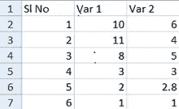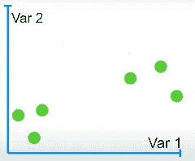

现在，我们要做的是沿着 2 个变量轴取所有观察值的平均值，并用它们来计算数据的中心。之后，我们将沿着平面移动观测值，使数据的中心与 2D 平面的原点重合。

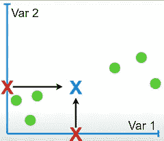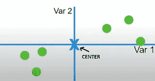

**a.** 沿各轴的观察中心。 **b.** 将中心转移到原点。

这里我们不能忽略的一件重要事情是，这种变换不会改变点之间的相对位置。最右边的点保持最右边，最下面的点保持最右边，以此类推。我提到这一点只是为了说明点的移动不会影响数据的相对分布，因此是一个可以接受的操作。这样做的原因很快就会清楚了。

# 寻找第一个主成分:

现在，我们将尝试找到点的最佳拟合线，通过中心。如何选择最佳拟合线与其他需要使用最佳拟合线的技术非常相似，使用 OLS(普通最小二乘法)的方法。然而，这条线穿过中心的必要性允许我们稍微调整一下，让事情变得简单一点。如下图所示，首先选择任意一条线，然后将点投影到其上。

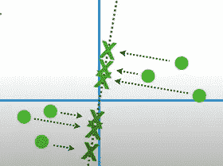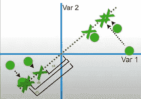

**a.** 一条随机线。 **b.** 旋转它，使用距离平方和找到最佳拟合线

我们接下来要做的是测量从这些投影点到原点(在上图中标记为 dᵢ's)的距离，将它们平方，然后最大化其总和。 ***对，最大化！*** 直观上，这就跟最小化点到线的距离平方和一样。(希望你能用毕达哥拉斯定理算出来)。这两种方法会产生相同的结果，从而产生有效的优化，但我更喜欢阐述 PCA 算法使用的确切方法。
* **最佳拟合线是 d**₁**+d**₂**+d**₃**+d**₄**+d**₅**+d**₆**=最大值***

最后，我们得到了第一个主成分，即 PC1。我们现在需要做的就是找出这条线的斜率。为了便于讨论，假设 PC1 对于我们这样获得的数据的斜率是 0.25。这在几何上意味着，对于沿 Var1 轴的每 4 个单位步长，我们在 Var2 轴上移动 1 个单位步长。在我们的数据环境中，PC1 只是两个变量的组合。一种看待它的方式类似于化学溶液的成分:我们需要混合 4 份 Var1 和 1 份 Var2 以获得精确的化学溶液。

现在是谈论某些重要术语的合适时机。最佳拟合直线的一个单位称为特征向量。相应组件的长度称为加载分数。对于我们的例子(直线斜率= 0.25)，我们可以计算如下:

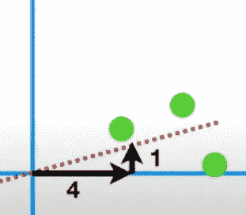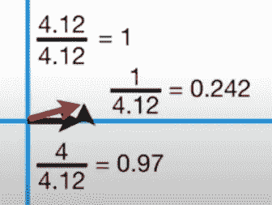

将最佳拟合线缩小到 1 个单位

这条 1 单位长度的最佳拟合线被称为 PC1 的**特征向量或奇异向量**。
对应的值 0.97 和 0.242 称为 PC1 的 Var1 和 Var2 的**加载分数**。(正如所料，比例保持不变，因此我们可以考虑将 0.97 份 Var1 与 0.242 份 Var2 混合)。
已经获得的原始平方和值就是**特征值**。

# 寻找第二个主成分:

现在我们已经完成了第一个主要步骤，但是我们还没有达到最终的目标。为此，我们也需要找到第二个主成分。(因为只有两个变量，我们最多可以有两个分量。)

现在是讨论 PCA 的一个非常重要的性质的时候了。
**任何数据集的所有主成分总会组成一个相互正交的系统。**简单来说，这是因为主成分本质上是数据集的多个(或所有)变量的线性组合。*协方差矩阵是对称的，对称矩阵总是有实特征值和正交特征向量*。
详细的数学解释请参考以下链接:[https://stats . stack exchange . com/questions/130882/why-are-principal-components-in-PCA-featured vectors-of-the-协方差矩阵-mutu](https://stats.stackexchange.com/questions/130882/why-are-principal-components-in-pca-eigenvectors-of-the-covariance-matrix-mutu)

因此，在我们的例子中，PC2 将只是一条穿过原点并垂直于 PC1 的线，我们已经知道了。以类似于上面解释的方式进行计算，我们得到 PC2 的以下结果:Var1 的 1 部分必须与 Var2 的 4 部分混合。之后，我们只需要旋转所有的东西，把投影点从直线上反过来。我们已经完成了我们的电脑绘图。

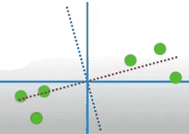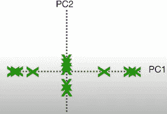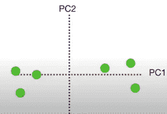

但是等等，这对我们有什么帮助？我们开始时只有两个变量，在这里，我们再次以两个主成分结束！那么，这对我们有什么用呢？为此，我们需要检查数据中的总方差有多少是由每个主成分单独解释的。

假设 SS₁和 SS₂分别是 PC1 和 PC2 的平方和。这些平方和除以(样本量减 1)将给出每个样本在原点附近的变化。从这些数据中，我们现在可以计算出由每个成分解释的**变化百分比。** 对于这个例子，让我们考虑 SS₁= 20，SS₂ = 5。
那么由 PC1 单独解释的变异百分比: **20/(20+5) = 0.8 = 80%** 和由 PC1 单独解释的变异百分比: **5/(20+5) = 0.2 = 20%** (需要注意的一点:由于样本量自始至终是相同的，所以简单的 SS 评分就足以计算出变异百分比。我们可以跳过除法步骤)

因此，我们可以得出结论，PC1 本身就足以解释整个数据中的大部分差异。*这正是我们最初的目标——用较少的变量解释尽可能多的变化。*

现在我们已经看到了数学是如何工作的，让我们试着做一个三维的例子！

# 三维数据的主成分分析:

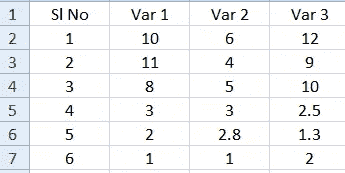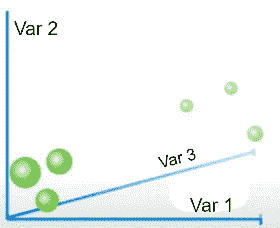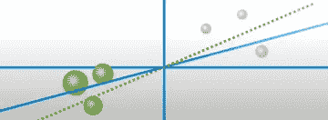

按照类似于 2D 情况的步骤，我们得到如上所示的第一主成分。然而，由于我们现在处理 3 个变量，我们可以有多达 3 个主分量——当然相互垂直，并且每个都经过原点。

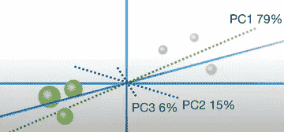

想想看，SS₁、SS₂and SS₃分别是 79 岁、15 岁和 6 岁。那么，这三个因素解释的变异百分比分别为 79%，15%和 6%。因此，PC1 和 PC2 合起来可以解释 94%的数据差异。阈值的选择可以因用户而异，也取决于手头的问题。但是，最重要的结论是**我们已经成功地减少了变量的数量！**

# 概括和结论:

我希望我已经在某种程度上能够抓住这个精确而美丽的算法背后的主要本质。但是，我用的数据集是完全荒谬的，不需要还原。PCA 的真正威力可以在处理真实世界的数据集时实现，这些数据集很容易具有数十甚至数百个变量。很明显，并不是所有的变量对我们的任务都有用，主成分分析通常是减少变量但不丢失太多信息的常用技术。

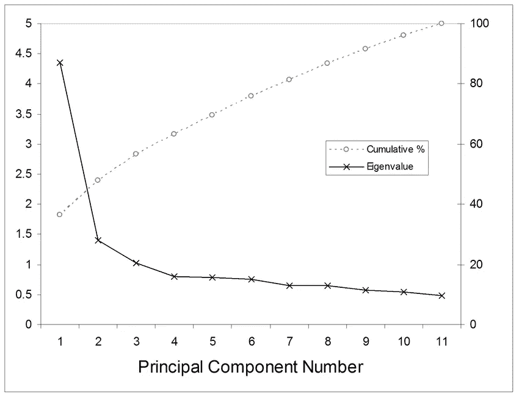

显示累积方差的 Scree 图

在这方面，有一个工具非常方便: **Scree Plots** 。它们描述了由前“n”个主成分解释的数据的累积变化。然后，用户可以选择哪些要使用，哪些要丢弃。
在随附的图中，7 个成分足以解释总方差的 80%以上，并且与最初存在的 11 个变量相比有相当大的下降

现在，我想回到我在上面没有详细谈到的一些事情上来，以免事情的流程被打乱。我定义的术语，即特征向量和特征值，有一定的价值。特征向量代表方向，特征值代表大小(或重要性)。自然，特征值越大，对应的方向(特征向量)越重要。这与我们早期的结果一致，我们发现具有最大特征向量的 *PC 可以最有效地解释数据的总体方差。*

最后，除非你知道如何正确实施，否则数据科学没有任何用处。没有必要浪费时间解释代码行，但我会留下一些易于访问和理解的资源:

1.  [https://sci kit-learn . org/stable/modules/generated/sk learn . decomposition . PCA . html](https://scikit-learn.org/stable/modules/generated/sklearn.decomposition.PCA.html)
2.  [http://sebastianraschka . com/Articles/2015 _ PCA _ in _ 3 _ steps . html](http://sebastianraschka.com/Articles/2015_pca_in_3_steps.html)

附:这是我第一篇关于媒介的文章。非常感谢你，如果你有足够的耐心通读整篇文章。请随时留下您的真实反馈，指出这篇文章中存在的技术和印刷错误，或者在评论部分澄清您的疑问和疑问。干杯:)