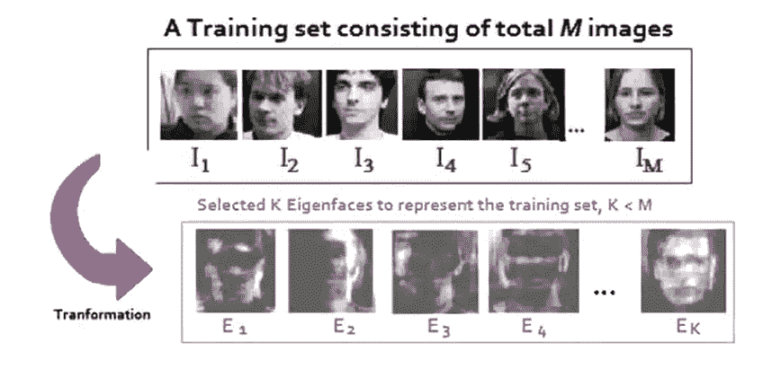
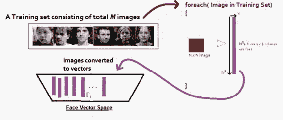
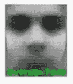
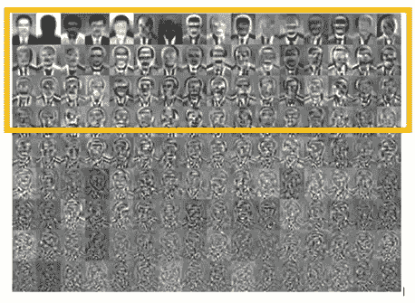

# 主成分分析与面部识别(特征脸)有什么关系

> 原文：<https://medium.com/analytics-vidhya/how-does-principal-component-analysis-relate-to-facial-recognition-eigenfaces-522bece60c80?source=collection_archive---------22----------------------->

**什么是 PCA？** 主成分分析是卡尔·皮尔逊在 1901 年发明的。PCA 是一种降维技术，有助于深入了解我们的数据。它有助于衡量每个变量是如何相互关联的，并找到我们的特征的相对重要性。

**PCA 的步骤:**

1.  把你的数据分开！x 和 Y
2.  居中，规范！中心含义，对于每一列，从每个条目中减去该列的平均值，这样每一列的平均值为零。
3.  取你在步骤 2 中做的 Z 的新矩阵，乘以 Z 的转置，你就得到协方差矩阵。
4.  做一些快速的数学运算，计算协方差矩阵的特征向量和特征值。
5.  将特征值从大到小排序。你应该得到和特征数量一样多的特征值(这就是转置的由来，不过故事还有一天……)

**它和面部识别有什么关系？你实际上可以使用主成分分析来帮助你在图像中找到人脸😮我们仍然在做同样的步骤，但是我们不叫它们主成分，而是叫它们特征脸。**

你知道我们如何降低常规数据集的维数吗？我们对图像做同样的事情！这样想，你的手是三维的(希望如此)，当你用光照你的手时，你的手在墙上的影子就是 2D。我们在没有损失太多细节的情况下减少了尺寸！！！

所以我们将遵循之前的步骤。假设我们有 100 张图片！

这就是我们应该结束的，有点恐怖吧！

在这种情况下，我们实际上没有 x 或 y，所以✅

但是我们必须把图像转换成面部向量！每张图片都有一定数量的像素。在我们的例子中，我们会说它是 50 x 50，每张图像总共有 2500 个像素，我们有 100 张图像。我们要做的是把每张图片变成一个向量。每个向量的大小为 N×1。

**第二步)**居中，标准化。好，所以我们必须找到平均值，然后从每个观察值中减去。嗯……在这种情况下，我们的“平均”脸是:

LOL 什么！

所以我们从每个向量中减去这个平均值。✅

**步骤 3)** 将矩阵与其转置自身相乘。✅

**步骤 4)** 计算特征脸！✅下面是结果，看起来他们已经。正如我们所看到的，有 N 个特征脸，但看起来在几个之后，剩下的并没有告诉我们更多的特征，似乎只是噪音。第一个特征脸显示了图像中最主要的“特征”。因此，我们将只选择少数几个显示出最大差异的特征脸。

参考资料:

 [## 主页

### FewTutorials 用 C#展示了 EmguCV 中从初级到高级水平的教程

fewtutorials.bravesites.com](http://fewtutorials.bravesites.com/)