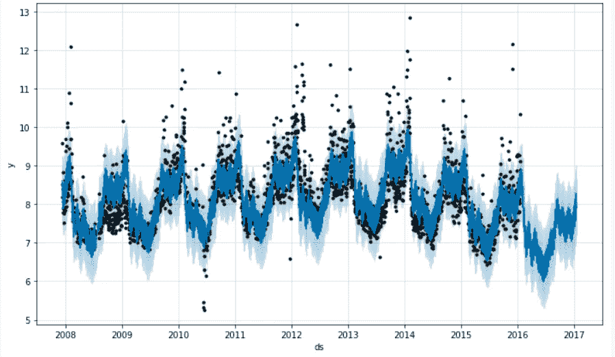
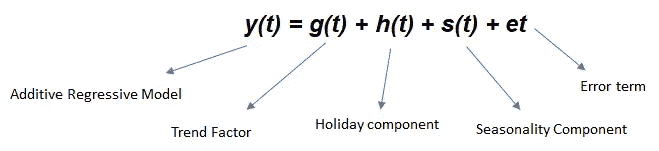
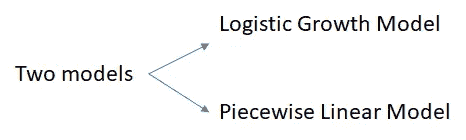
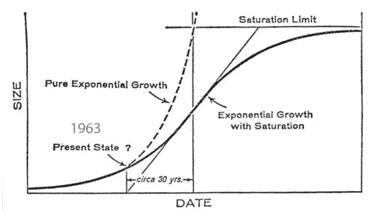
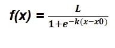
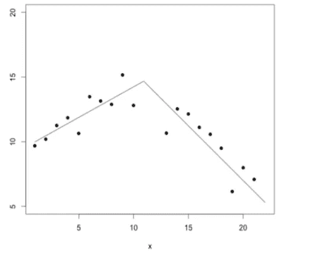
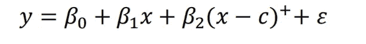
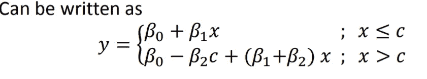
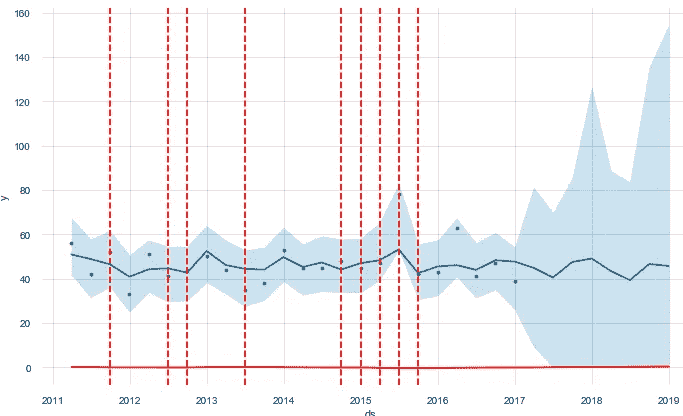
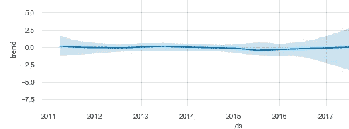

# 先知是如何工作的？第一部分

> 原文：<https://medium.com/analytics-vidhya/how-does-prophet-work-44addaab6148?source=collection_archive---------1----------------------->



使用 Fbprophet 进行预测

因此，每当我们想到实现时间序列建模时，我们脑海中首先出现的几个库是——回归、ARIMA 或先知。但是我们知道在这些算法的背景下发生了什么吗？我们如何进一步调整它们，使其适用于我们的时间序列数据集—

预言者预测模型——它是一个加性回归模型

这个模型的方程式是—



预言者预测模型方程

让我们稍微深入了解一下这些组件—

在这篇文章中，我将重点关注趋势因子的调整。在我的下一篇文章中，我将分享如何调整先知的季节性和其他 T2 成分。

> **g(t) —趋势因子—它实现了两种可能的趋势模型**



趋势因子可以使用这些模型进行调整

***a)* 逻辑增长模型 *—*** 它处理的是饱和的非线性增长*(你可能会好奇它现在是什么意思？哦..迷茫？？)*让我们明白——

饱和状态下的非线性增长—增长的初始阶段近似为指数增长(几何增长)，随着饱和状态的开始，增长速度减慢为线性增长(算术增长)，到了成熟期，增长停止。



饱和的逻辑增长(摘自 solla price 1963)



逻辑增长模型

x0-sigmoid 点的 X 值

L —曲线的最大值

k——逻辑增长率或曲线的陡度

```
**m = Prophet(growth='logistic')
m.fit(df)**
```

> ***b)分段线性模型—*** 这是线性模型的一个简单修改，然而非常有用。不同的𝑥范围，出现不同的线性关系单一的线性模型可能无法提供充分的解释或描述断点是斜率变化处的𝑥值断点的值在分析前可能已知也可能未知，未知时必须进行估计
> 
> 默认情况下，Prophet 使用线性增长模型。—恒定增长率—最适合无饱和增长的情况。



分段线性模型



分段线性模型

𝑐是断点的值



我们可以通过设置断点(也称为变点)和总上限(即市场规模或容量值)来调整我们的 prophet 模型中的这些参数(趋势成分)——必须为数据框中的每一行指定，并且不必是常数。如果市场规模在增长，那么上限可能是一个递增序列。

```
**# Python
future = m.make_future_dataframe(periods=1826)
future['cap'] = 8.5
fcst = m.predict(future)
fig = m.plot(fcst)** 
```

像 CAP 一样，我们也有饱和最小值(称为下限)。

```
**# Python
df['y'] = 10 - df['y']
df['cap'] = 6
df['floor'] = 1.5
future['cap'] = 6
future['floor'] = 1.5
m = Prophet(growth='logistic')
m.fit(df)
fcst = m.predict(future)
fig = m.plot(fcst)**
```

该库本身可以通过拟合历史数据来选择趋势变化的最佳点。

如果你想手动调整它们——你可以参考[这里](https://facebook.github.io/prophet/docs/trend_changepoints.html) —

> `m = Prophet(changepoint_prior_scale=0.08)`

Python 代码-默认情况下，此参数(`changepoint_prior_scale`)设置为 0.05。增加它将使趋势*更加*灵活。

```
**m = Prophet(changepoint_prior_scale=0.5)
forecast = m.fit(df).predict(future)
fig = m.plot(forecast)**
```

您可以使用`changepoints`参数手动指定潜在变更点的位置

```
**# Python
m = Prophet(changepoints=['2014-01-01'])
forecast = m.fit(df).predict(future)
fig = m.plot(forecast)**
```

您还可以设置— changepoint_range 参数。默认情况下，Prophet 指定了 25 个潜在的变点，这些变点统一位于时间序列的前 80%

```
**# Python
from fbprophet.plot import add_changepoints_to_plot
fig = m.plot(forecast)
a = add_changepoints_to_plot(fig.gca(), m, forecast)** 
```



红色的变化点

您可以通过以下方式更改该参数—

> `**m = Prophet(changepoint_range=0.9)**`

`(based on the breakpoints you have in your data)`

因此，如果你看到你的趋势在上升，但你的实际数据集点在下降，那么你可以调整这些参数，使你的趋势更加灵活(但请记住不要过度拟合你的数据(我将在我即将发布的帖子中分享如何[交叉验证你的数据](http://yet to come))。

例如，你可以用以下公式绘制先知方程的组成部分

> m.plot_components(预测)。
> 
> 因此，您可以通过查看趋势线(蓝色实线——是否与您的最终输出一致)来调整上述参数。如果你的实际点的趋势是下降的，而你的预测趋势似乎是上升的，那么你肯定需要使用上面讨论的参数来改进你的趋势组件。



关于季节性和其他组成部分，请参见[第 2 部分](/analytics-vidhya/how-does-prophet-work-part-2-c47a6ceac511?source=friends_link&sk=4a285048592930d6728b3b049fbe713d)。

链接到我的 GitHub 库—[https://github.com/DeeptiAgl?tab=repositories](https://github.com/DeeptiAgl?tab=repositories)

如果您有任何问题，请分享您的反馈。我将尽力回答这些问题。