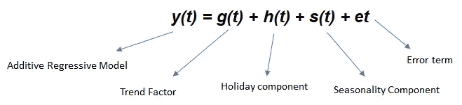
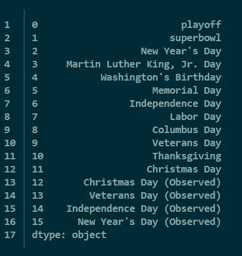

# 先知是如何工作的？第二部分

> 原文：<https://medium.com/analytics-vidhya/how-does-prophet-work-part-2-c47a6ceac511?source=collection_archive---------2----------------------->

到目前为止，我们已经学会了如何调整 prophet 库的趋势组件(你可以在这里查看)。

在这篇文章中，我将解释**季节性成分和假期**

**组件-**

这个模型的方程式是—



让我们稍微深入了解一下季节性成分(s(t))，它为模型提供了灵活性(每周、每年、每天的季节性变化成分)。

该组件使用**傅立叶级数—**


长度为 1、2、3 和 4 项的四个部分和(傅立叶级数)。显示了方波的近似值如何随着项数的增加而提高

季节性是使用部分傅立叶和估计的。傅立叶顺序决定了季节性变化的速度(每年季节性的默认顺序是 10，每周季节性的顺序是 3)。增加傅立叶阶次可以使季节性适应变化更快的周期(我们在设置该参数时需要非常小心，因为它会导致过度拟合)。

```
**m = Prophet(weekly_seasonality=False)
m.add_seasonality(name='monthly', period=30.5, fourier_order=5)**
```

除了周、年和日季节性之外，我们还可以使用条件季节性。注意:-使用条件季节性的主要原因是-默认的周季节性假设周季节性的模式在一年中是相同的。

还有另一个可以调整的参数—

***季节性 _ 先验 _ 标度*** - >它调整季节性模型与数据的拟合程度(注意:——同样我们也通过使用— ***先验 _ 标度*** 参数为各个假日设置类似的变量)。为了更深入的了解，你可以查看官方指南。

```
# Python
m = Prophet()
m.add_seasonality(
    name='weekly', period=7, fourier_order=3, prior_scale=0.1)
```

> 假期部分(h(t))

每个国家的假期由 Python 中的`holidays`包提供。您可以使用它，也可以为假期创建自己的数据框架—注意:-记住您的假期应该包含两个参数— `holiday`和`ds`

您还可以包括列`lower_window`和`upper_window`，它们将假期延长到日期前后的`[lower_window, upper_window]`天。您还可以包含一个列`prior_scale`来分别设置每个假期的优先等级。

将 dataframe 作为参数传递给 prophet，如下所示

```
**Holiday_dataframe = pd.DataFrame({
  'holiday': 'superbowl',
  'ds': pd.to_datetime(['2010-02-07', '2014-02-02', '2016-02-07']),
  'lower_window': 0,
  'upper_window': 1,
})** # Python
m = Prophet(holidays=**Holiday_dataframe**)
forecast = m.fit(df).predict(future)
```

您可以通过使用`add_country_holidays`方法来使用一个内置的特定于国家的假日集合

```
**# Python
m = Prophet(holidays=holidays)
m.add_country_holidays(country_name='US')
m.fit(df)**
```

去看假期—

```
**# Python
m.train_holiday_names**
```



让我们看一个例子——

> *m = Prophet(mcmc_samples=1000，changepoint_prior_scale=0.07，seasonality _ mode= '乘法'，\
> yearly _ seasonity = 10，
> weekly _ seasonity = True，
> daily _ seasonity = False，change point _ range = 0.9)
> m . add _ seasonity(' quarterly '，period=91.25，fourier_order=10，mode = '加法')*

在上面的代码中，可以看到参数 ***模式。*** *根据您的数据集，您可以定义参数—****乘法或加法*** *。您可以分别为每个季节性因素设置参数。*

***MCMC _ samples***—该参数用于得到季节性的不确定性。它使用贝叶斯抽样。你设置的越高，需要的时间就越多。从低(也许 500)开始，然后你可以根据你想要多少时间有效的解决方案来增加它。(我倾向于 1000 以上，这同样取决于数据大小，因为这需要时间)

(上述代码的所有其他组件已在[第 1 部分](/@deepti.agl16/how-does-prophet-work-44addaab6148)中讨论过)

想要更深入的了解，你可以查看[官方指南](https://facebook.github.io/prophet/docs/seasonality,_holiday_effects,_and_regressors.html#specifying-custom-seasonalities)。

链接到我的 GitHub 库—[https://github.com/DeeptiAgl?tab=repositories](https://github.com/DeeptiAgl?tab=repositories)

如果您有任何问题，请分享您的反馈。我将尽力回答这些问题。