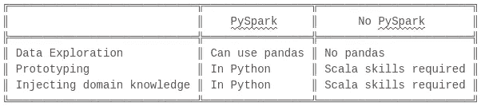

# PySpark 是如何工作的？—循序渐进(附图片)

> 原文：<https://medium.com/analytics-vidhya/how-does-pyspark-work-step-by-step-with-pictures-c011402ccd57?source=collection_archive---------0----------------------->


你是否发现自己在谈论 Spark 时并没有真正理解你所使用的所有词汇？对于 Spark 在 Python 中是如何使用的，是不是感觉没有一个清晰的心智模型？

本指南旨在帮助您在几分钟内快速上手。

(如果你不知道 Spark 是什么，最好从这里开始，然后[摆弄代码，](https://realpython.com/pyspark-intro/#hello-world-in-pyspark)稍后再回到本文)。

# 关键问题

如果您曾经处理过数据，尤其是大数据，您可能知道 Spark 是一个非常棒的工具。如果你像我一样，使用 Python 做几乎所有的事情，你可能遇到过 py Spark——也就是 Python API for Spark。

> 但是 PySpark 到底是什么呢？
> 
> Python 不是有点慢吗？
> 
> 为什么会有人用这种语言做大数据处理？
> 
> 当我使用 PySpark 时，我的数据实际上会发生什么变化？

我们马上会回答这些问题。

不过，在我们深入本质之前，让我们先来看看一些核心的数据工程概念。我保证，会有帮助的。

# 关键心智模型

(如果对您来说这些都是老掉牙的内容，请随意跳过这一部分)

让我们简单看一下以下术语:

*   ***每个程序员都应该知道的数字***
*   **大数据**
*   **颠簸**
*   **并行计算**
*   **进程间通信**
*   JVM

在深入研究(Py)Spark 之前，您需要理解这些概念。

> 为什么？

你希望你的知识形成一棵坚实的树，而不是一堆树叶。所以我们从主干和粗枝开始——核心概念。这将使学习更精细的细节变得更加有趣和易于管理。

还有，你不希望这些核心知识在 2 周后蒸发掉。如果你想记住你在这里读过的东西，你需要使用间隔重复。Anki 是一个很好的工具，可以让你快速上手。

这里有一个现成的 Anki 模板给你——这将帮助你巩固你从这篇文章中学到的东西

## ***数字每个程序员都应该知道***

*速度:处理器>内存>磁盘>网络*

几年前，一个名叫 Peter Norvig(谷歌研究总监)的非常聪明的人在网上发布了一个数字表[描述了计算机上发生的各种数据相关操作的速度。](http://norvig.com/21-days.html#answers)

这些数字被称为每个程序员都应该知道的*数字*，它们对于理解数据工程非常重要。

**不要说太多细节，要点如下**:

> 处理器速度极快。记忆力也挺快的。磁盘比较慢。访问网络中的其他计算机甚至更慢。
> 
> 超负荷工作的计算机速度极慢。*

*(我自己的话，不是彼得·诺维格的话)


这是一个(有点过时的)类比，可以帮助你理解“快”和“慢”在计算机上的含义。假设你在美国西雅图的一个酒店房间里，你需要走到某个地方去获取数据。

## 大数据

*难以在笔记本电脑上处理*

“大数据”是无法在您的计算机上轻松处理的大量数据。正是这**的数据量可能会让你的电脑开始工作得非常慢。**

当通过网络将大数据的一部分发送到另一台计算机，并在两台不同的计算机上的两个进程之间分配计算更快时，您知道您正在处理大数据。

## 并行计算

*多台计算机一起处理数字*

这是指两个进程(程序)同时处理同一个数据集的不同部分。这通常比一个进程试图做所有的工作要快。

分布式计算是相似的，但是进程运行在不同的计算机上。Spark 充分利用了分布式计算。

## 痛打

*太多的数据会堵塞你的电脑*


如果某个程序占用了太多的内存，你的计算机会大大变慢。

进程需要随机存取内存(RAM)来快速运行。当你启动一个进程(程序)时，操作系统将开始给它分配内存。但是如果没有足够的内存来存放所有的数据呢？

如果你的程序试图处理的数据超过了它的内存容量，它将开始花费大量的时间从磁盘上存储和读取数据。这太慢了。

想象一下，你正在参加数学考试，你正试图解一个长方程。突然，你的试卷上的空间用完了，你不得不开始在泥板上划动你的笔记！这将花费很多时间，并减缓你的速度。同样，您的应用程序正在做更少的计算，因为它忙于做所有的家务！

更糟糕的是，你的程序不再和处理器交流了(它正忙着在粘土板上划，也就是你的硬盘)。这使得处理器认为你不太需要它，它将开始接受其他任务，这给可用资源带来了更大的压力。

计算可能会在某个时候完成，但会花费很多时间。你要不惜一切代价避免这种情况。将一些数据发送到另一台计算机可能会更快，即使通过网络发送相对较慢(在计算机世界中)。

## 进程间通信

*当一个程序必须和另一个程序对话的时候*

程序之间是如何对话的？不允许一个进程在内存中创建一个对象(例如 Python 字典)，然后将这部分内存直接传递给另一个进程。

两个程序不允许访问彼此分配的内存空间，所以它们通常必须在其他地方“写东西”，在一个两个进程都可以访问的地方。

简而言之——进程为彼此留下消息。它可以是一个文件。它可以是发送到网络套接字的数据(例如，想象一下当您通过互联网发送 web 表单时会发生什么)。

例如，在 Python 中，两个不同的进程可以将彼此的数据作为一串字节保存在硬盘上(Python 称之为“[pickle](https://wiki.python.org/moin/UsingPickle)”)。

在计算机的世界里，IPC 是相当慢的东西。

## **JVM — Java 虚拟机**

*这是 Java 进程在你的计算机上运行的方式*

Java 有自己特殊的方式将代码(文本)翻译成计算机指令 JVM。它使 Java 变得非常快速和可移植。出于这个原因，许多语言都被设计成在 JVM 中运行——Java 本身、Scala、Clojure，甚至有趣的实验，如 [Jython](https://en.wikipedia.org/wiki/Jython) 。

为了简单起见，无论何时在本文中看到 JVM 这个词，只要想到“Java”就可以了。

现在我们已经介绍了相关的 CS 概念，让我们将它们与 PySpark 的工作原理以及它的优缺点联系起来。

# PySpark 循序渐进

## 当你在终端中输入“pyspark”时会发生什么？


该命令启动一个 Python 程序，您可以与之交互。它还启动了…一个 JVM 程序！

使用`ps aux`可以看到正在运行的 Python 和 JVM 进程:


PySpark 所做的是，它允许你使用 Python 程序向名为 Spark 的 JVM 程序发送命令！

迷茫？

这里的关键点是 **Spark 是用 Java 和 Scala 编写的，而不是用 Python** 编写的。所有的计算、所有的查询优化、所有酷的火花都发生在 Python 程序之外。


那么，为什么首先要有 Python 应用程序呢？不会让事情变得更复杂吗？

嗯，是的。但是 Spark 对于数据科学家、数据分析师和其他帮助你的企业蓬勃发展，但通常不喜欢使用 Java/Scala 的人来说非常有用。


数据科学家太忙了，没有时间研究 Java

因此，有人想出了一种通过 Python 控制 Spark 的方法，而不是让人们学习 Java 或 Scala。

## PySpark 中的“火花”对象

您的 PySpark shell 带有一个名为`spark`的变量。就变量而言，这个很酷。


例如，您可以启动`pyspark` shell 并输入`spark.sql(.....)`，然后立即对来自某个数据库的数据进行一些转换。只用一行代码！—那太好了。

这是因为`spark`变量让您可以访问一个叫做`sparkContext`的东西。


您与之交互的这个`sparkContext`是来自`pyspark`库的 Python 对象。如你所见，它似乎做了很多重要的事情:`runJob`、`stop`、`setLogLevel`、`cancelAllJobs` …:

```
>>> dir(spark.sparkContext)[... 'accumulator', 'addFile', 'addPyFile', 'appName', 'applicationId', 'binaryFiles', 'binaryRecords', 'broadcast', 'cancelAllJobs', 'cancelJobGroup', 'defaultMinPartitions', 'defaultParallelism', 'dump_profiles', 'emptyRDD', 'environment', 'getConf', 'getLocalProperty', 'getOrCreate', 'hadoopFile', 'hadoopRDD', 'master', 'newAPIHadoopFile', 'newAPIHadoopRDD', 'parallelize', 'pickleFile', 'profiler_collector', 'pythonExec', 'pythonVer', 'range', 'runJob', 'sequenceFile', 'serializer', 'setCheckpointDir', 'setJobDescription', 'setJobGroup', 'setLocalProperty', 'setLogLevel', 'setSystemProperty', 'show_profiles', 'sparkHome', 'sparkUser', 'startTime', 'statusTracker', 'stop', 'textFile', 'uiWebUrl', 'union', 'version', 'wholeTextFiles']
```

那么，让我们看看这个神秘的火花背景到底是什么。

## pyspark 是什么？SparkContext 真的有吗？

来看看它的[官方文档](https://spark.apache.org/docs/latest/api/python/pyspark.html#pyspark.SparkContext):

> Spark 功能的主要入口点。SparkContext 表示到 Spark 集群的连接，可用于在该集群上创建 RDD 和广播变量。

嗯，这有点误导。Python 中的 SparkContext *真正做的唯一一件事是，它连接到你计算机上的一个网络端口，通过那个端口，它到达 JVM 程序(Spark)中的一个 SparkContext 对象。然后**你的 Python SparkContext 告诉 Java SparkContext 你想要做什么。***

想象一下，你在你的私人飞机上，你告诉你的助手约翰·史密斯，你想去肯尼亚的内罗毕。约翰·史密斯走进驾驶舱和飞行员(也是约翰·史密斯)交谈。然后飞行员把飞机带到内罗毕。它们的名字是一样的，但是只有飞行员约翰·史密斯真正驾驶飞机。

类似地，Java 中的 SparkContext 实际上完成了所有很酷的、繁重的 Spark 任务，比如启动作业和接收结果。Python 对象本质上是一个传声筒，您可以通过它与 Java 对象对话。

类似地，整个 PySpark 库本质上是位于重型 Java 机器旁边的一层薄薄的 Python。


Java SparkContext — Pilot(飞行)


python spark context——不是一个飞行员(只是说话)

## 等等，PySpark 是怎么和 Java 进程对话的？这是什么鬼把戏？

PySpark 之所以能够在 JVM 进程中完成任务，要感谢一个名为 Py4J 的 Python 库(如“Python for Java”)。Py4J 允许 Python 程序:

*   打开一个监听端口(25334)
*   启动一个 JVM 程序
*   让 JVM 程序监听不同的网络端口(25333)
*   向 Java 进程发送命令并监听响应


作者:皮奥特·茹萨科夫斯基，[https://deepsense.ai/cooperative-data-exploration/](https://deepsense.ai/cooperative-data-exploration/)

Py4J 可以在 Python app 和 JVM app 之间搭建桥梁！

难怪 PySpark 的作者决定使用该库来创建 Python shell 和 Spark 之间的桥梁。

## 呃，为什么 PySpark 通过端口与 Spark 通信？不是说网络连接慢吗？

是的。使用 PySpark 会使基于 Spark 的应用程序变慢。您在这里处理的是进程间通信！

如果希望 Python 进程和 JVM 进程相互通信，它们不能只访问内存中的相同数据——操作系统不允许这样做。

因此，这两个进程既可以将消息写入(序列化)到一个文件中，也可以通过网络套接字相互通信。这也需要数据的序列化和反序列化。

为什么这是个问题？

想象一下，用 Python 加载一个 4GB 的 pandas 数据帧并对其进行处理，然后将其发送到 Spark。这个 4GB 的数据帧必须被序列化([腌制](https://github.com/apache/spark/blob/master/python/pyspark/context.py#L86))成一个字节流，通过[临时文件](https://github.com/apache/spark/blob/master/python/pyspark/context.py#L567)或[特殊服务器](https://github.com/apache/spark/blob/master/python/pyspark/context.py#L555)传递给 JVM 进程，然后 JVM 进程将对其进行反序列化……然后 Spark 必须再次序列化结果，将其返回给 Python。

毫无疑问，使用 PySpark 会让基于 Spark 的应用程序做很多额外的事情。

## 那么使用 PySpark 有什么好处呢？



正如我们前面所说的，很多从事数据工作的人喜欢 PySpark，因为它允许他们使用 Python。Python 对于任何需要快速构建原型、探索数据或思考问题的时候都非常有用。

它的学习曲线也很低，这意味着拥有领域知识的人(分析师)可以轻松地将他们的知识转化为代码，而不必是经验丰富的程序员。这对于你的业务来说是非常好的，因为知识可以很快转化为解决方案(事实上，这些解决方案有时会让开发人员想哭，这是另一个讨论:)。

## 我能看到我的数据逐步发生变化的例子吗？

当然可以。让我们看一个从 PySpark 执行作业的最小例子。

让我们启动 Python shell 和 JVM:

```
pyspark
```

您可以看到 Python 和 Java 正在运行，这两个进程之间有一点点网络通信:


现在，让我们用 Python 创建一些数据:

```
>>> some_string = spark.sparkContext.parallelize("hello hello hello")
```

什么都没发生。如果我们转到`localhost:4040`，我们可以看到 Spark UI 还没有显示任何工作。


这是意料之中的。`parallelize`被懒洋洋地执行。这是因为`some_string`代表了一个[火花 RDD](https://spark.apache.org/docs/latest/rdd-programming-guide.html#rdd-operations) (一个用于处理分布式数据集的接口):

```
>>> type(some_string)
<class 'pyspark.rdd.RDD'>
```

RDD 的很多操作都很懒惰——这是 Spark 设计的一部分。除非你在 RDD 上调用一个*动作*操作，否则它们不会执行(也就是说，你要求 Spark 给你一个结果)。

让我们对数据采取行动:

```
>>> some_string.take(5)
['h', 'e', 'l', 'l', 'o']
```


很好，我们可以看到 Spark 执行了一些东西。您可以看到 Python 向 JVM 发送了一个请求，JVM 做出了响应(并执行了一些额外的网络活动):


那么，在这个简单的例子中，您的数据发生了什么变化呢？

**Python** :

```
Serialize "hello hello hello" -> temporary file 
Tell JVM (via Py4J) to pick up the file and create a Java RDD ("parallelize" the data)
Create a Python variable to store information about the Java RDD
```

**JVM**

```
Read the temporary file into a collection of (byte) arrays

Create a Java RDD object from this collection (partitions and distributes the data in memory - this is the point of the parallelize operation)Tell Python where to find the object in the JVM 
```

**Python**

```
Ask JVM for the first 5 records from the data stored in Spark's memory
```

JVM

```
Return results via Py4J
```

**Python**

```
Unpickle incoming data into a string
Display result
['h', 'e', 'l', 'l', 'o']
```

在这个简单的例子中，Spark 没有做多少有用的事情——它只是从 Python 中取出序列化数据，将其分割成分区，并存储在自己的(分布式)内存中。


在处理大数据时，将数据存储在多台计算机的内存中非常有用

如果我们想进行某种转换，比如将文本数据转换成大写，会怎么样呢？JVM 如何知道如何在字符串上执行 Python 代码，比如`.upper()`？Spark 是否将 Python 语言中的所有函数都映射到 Scala/Java 中的等价函数？

并没有。 [**Spark 创建 Python 工作进程来执行 Python 函数。**](https://github.com/apache/spark/blob/7dff3b125de23a4d6ce834217ee08973b259414c/core/src/main/scala/org/apache/spark/SparkEnv.scala#L75)

它将序列化的数据、*和*一些序列化的 Python 函数交给它们来执行。

让我们创建一个更大的输入来说明这一点:

```
>>> something = 'hello ' * 1000000
>>> another_string = spark.sparkContext.parallelize(something)
```

让我们对它运行一个地图函数并请求一个结果:

```
>>> another_string.map(lambda a: a.upper()).take(100)
20/06/01 16:39:24 WARN TaskSetManager: Stage 2 contains a task of very large size (1507 KB). The maximum recommended task size is 100 KB.['H', 'E', 'L', 'L', 'O', ' ', 'H', 'E', 'L', 'L', 'O', ' ', 'H', 'E', 'L', 'L', 'O', ' ', 'H', 'E', 'L', 'L', 'O', ' ', 'H', 'E', 'L', 'L', 'O', ' ', 'H', 'E', 'L', 'L', 'O', ' ', 'H', 'E', 'L', 'L', 'O', ' ', 'H', 'E', 'L', 'L', 'O', ' ', 'H', 'E', 'L', 'L', 'O', ' ', 'H', 'E', 'L', 'L', 'O', ' ', 'H', 'E', 'L', 'L', 'O', ' ', 'H', 'E', 'L', 'L', 'O', ' ', 'H', 'E', 'L', 'L', 'O', ' ', 'H', 'E', 'L', 'L', 'O', ' ', 'H', 'E', 'L', 'L', 'O', ' ', 'H', 'E', 'L', 'L', 'O', ' ', 'H', 'E', 'L', 'L']
```


您可以看到 JVM 发出了一个大文件。这是发送到 Spark 集群进行并行化的输入数据(即，保存在 Spark workers 的内存中)。

(注意:在这里,“集群”并不十分引人注目——它只是本地计算机上的一个进程；但通常它是云中一组计算机上的一组进程)。

有趣的是，您可以看到新的 Python 进程正在被创建(这些是我们之前提到的 Python 工作者):


s

每个 PySpark 进程都从 Spark 接收数据和代码。他们对数据执行`.upper()`函数，然后将结果再次序列化为 Pickle 格式。序列化的数据被传递回 Spark 并存储在 Spark workers 的内存中。

最后，Spark 将结果(1kb 大)发送回我们最初的 PySpark 进程。


PySpark 然后反序列化结果，并为您打印出一个 Python 数组。

咻，在各种 Python 和 JVM 进程之间有很多来回。

幸运的是，你很少会简单地手工创建一百万行文本并在一张空白的 RDD 上工作。你通常会从一些 SQL 数据库或 pandas 中读取数据。您的数据也将更加结构化，例如，将有带名称的列。

这允许 PySpark 使用更优化的解决方案，如 DataFrame 类或 Apache Arrow 序列化格式，并让 Spark 完成大部分繁重的计算(数据连接、过滤等)。

根据您的代码，Python 进程要么需要做很少的工作，要么需要做很多工作。一个很好的例子是决定是在 pandas 中还是在 Spark 中进行表连接——当然，您希望是后者。这可不是白叫 Py **Spark** 的。

# 摘要

## **py spark 到底是什么？**

它是实际 Spark 应用程序的 Python 包装器，用 Java 和 Scala 编写。

## **Python 是不是有点慢？**

是的，使用 PySpark 会使事情变得更慢——它必须通过网络连接与实际的 Spark 对话。除此之外，在整个作业执行过程中，数据会被序列化和反序列化。

## **为什么会有人用 PySpark 做大数据处理？**

因为 PySpark 非常方便，可以让人们提高工作效率。

## 使用 PySpark 时，我的数据会发生什么变化？

数据被序列化到一个文件中，并被 Spark JVM 进程获取。Spark 在其工作人员的内存中分发数据。

然后 Spark 可以运行内置的 Spark 操作，比如对数据进行连接、过滤和聚合——如果它能够读取数据的话。

否则，Spark 可以启动一组新的 Python 进程，向它们传递一些序列化的 Python 代码和序列化的数据，并要求它们对数据执行代码。

无论哪种情况，结果都会作为序列化数据再次存储在 Spark 的内存中。

最后，您的数据从 Spark 发送回来，并从一堆字节反序列化为 Python 对象。你现在可以打印这些对象，将它们传递给其他函数等等。

**注**:

我简化了一些实现细节，以便帮助您关注关键的心智模型。我将在未来写一篇更高级的文章来涵盖更令人讨厌的细节。

**属性**

头图—[https://www . Reddit . com/r/woahdude/comments/55 klru/lightning _ snake/？UTM _ source = share&UTM _ medium = web2x](https://www.reddit.com/r/woahdude/comments/55klru/lightning_snake/)

“颠簸”——[https://upload . wikimedia . org/Wikipedia/commons/6/67/颠簸。GIF](https://upload.wikimedia.org/wikipedia/commons/6/67/Thrashing.GIF)

“数据科学家”——https://www.pxfuel.com/en/free-photo-jmtew

“存储延迟”——[https://blog . coding horor . com/content/images/2014/May/storage-latency-how-far-away-the-data . png](https://blog.codinghorror.com/content/images/2014/May/storage-latency-how-far-away-is-the-data.png)

# 关于作者

Obi 是一名具有软件测试背景的数据工程师。他喜欢健身操，抱怨，和对生产力的极客。

你可以在 [LinkedIn](https://www.linkedin.com/in/obiorciuch/) 上和他联系。