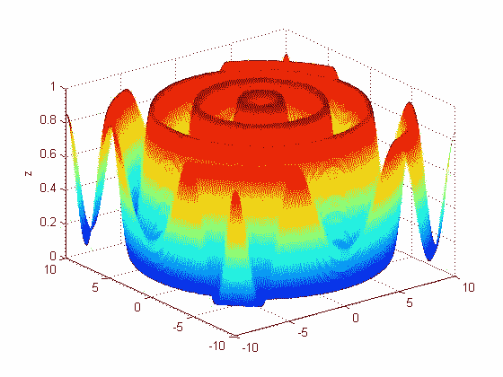

# 随机搜索算法是如何工作的？Python 实现。

> 原文：<https://medium.com/analytics-vidhya/how-does-random-search-algorithm-work-python-implementation-b69e779656d6?source=collection_archive---------2----------------------->

## 介绍

随机搜索算法是一种优化算法，但是，什么是优化，它是为了什么？

**优化**是所有学科都有的领域。任何活动或流程都可以优化。当我们将一项任务的时间、产品的成本或投资的风险最小化时，我们就是在优化。当我们…