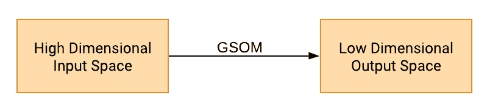
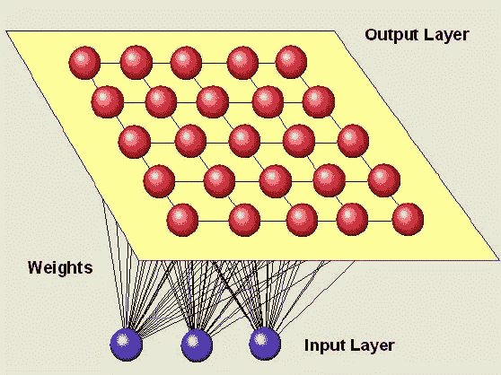
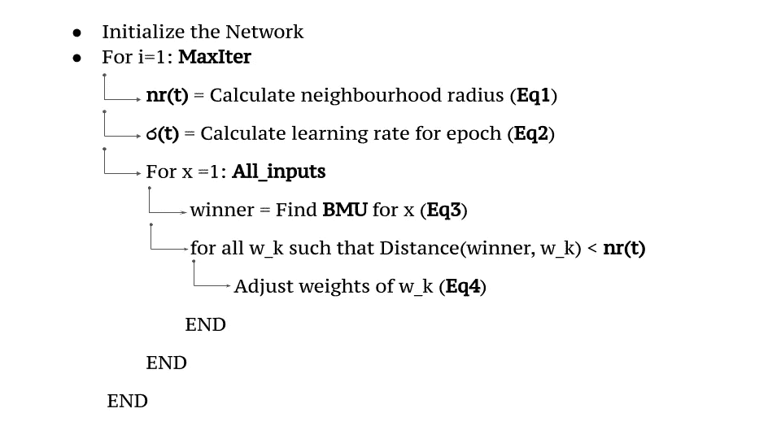
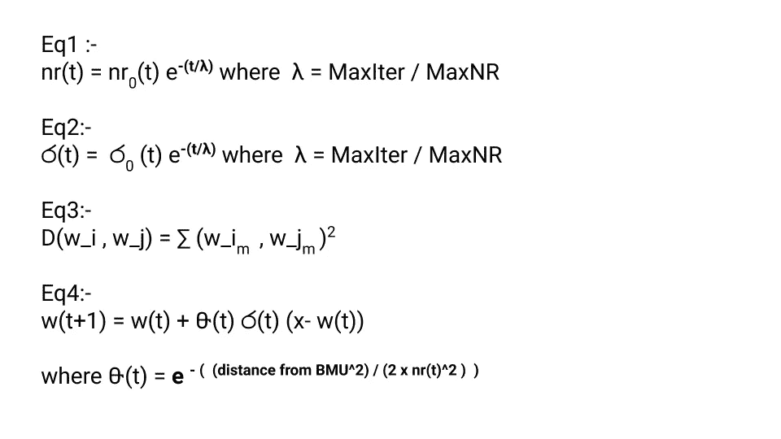
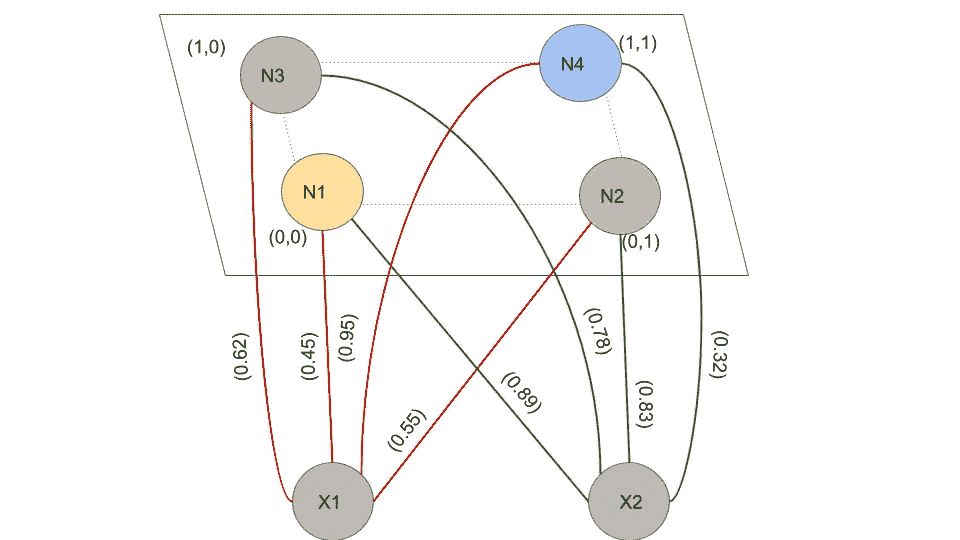
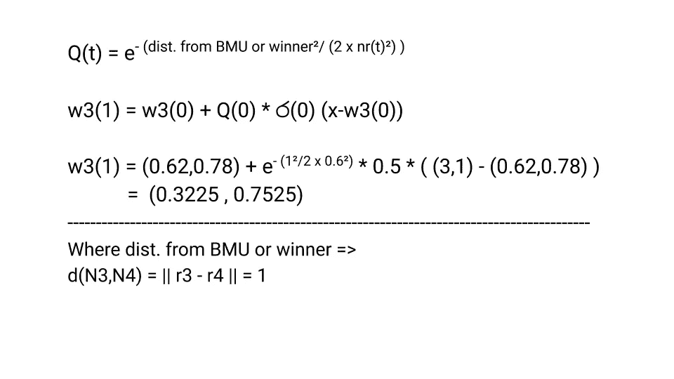
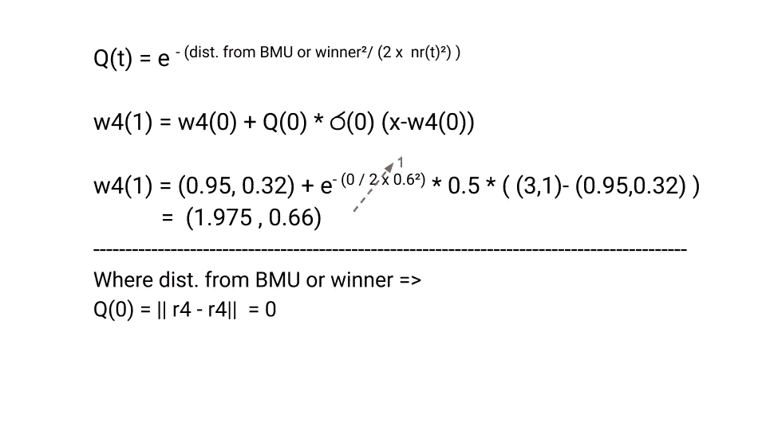

# 自组织算法是如何工作的？

> 原文：<https://medium.com/analytics-vidhya/how-does-self-organizing-algorithm-works-f0664af9bf04?source=collection_archive---------9----------------------->

## 带有数学示例的简单分步指南

Teuvo Kohonen 提出的自组织地图(SOM)是一种数据可视化技术。通过将数据的维度缩减到地图上，有助于理解高维数据。此外，它还通过将相似的数据分组来展示聚类。这种聚类能力在 SOM 的一个变种——生长自组织 ma 被引入后得到了广泛的认可。

我们可以将 SOM 总结为:

图 1 . SOM 是做什么的？作者绘制

SOM 是独特的，因为它偏离了大多数通用的“纠错”方法，而是遵循竞争学习。

图 2[李哲](https://www.researchgate.net/profile/Zhe_Li9)绘制的 SOM 示意图

## 实际发生了什么？

数据点将相互竞争以获得网络中的表示。首先，用权重初始化网络。从训练数据集中随机选择数据，并计算节点(权重)和样本向量之间的距离。最短的距离被认为是 T4 BMU T5。然后找到获胜节点或 BMU 的邻域。更新邻居权重或节点。重复该过程，直到针对每个训练数据对网络进行了训练。

**最佳匹配单元(BMU)** :从自身到样本向量距离最短的胜出节点(或权重)。确定距离的方法有很多，但是，最常用的方法是 [*欧氏距离，*](https://en.wikipedia.org/wiki/Euclidean_distance) *是计算权重和样本向量之间距离的最常见度量。*

## 算法崩溃

*   初始(随机化)
*   竞赛(选择获胜者节点)
*   合作(识别邻居)
*   适应(适应赢家和邻居的权重)
*   平滑(随着迭代的增加减少 NR/引入可选的平滑阶段)

## 因素

> **遥控** —行数/列数
> 
> **N** -神经元的数量
> 
> **MaxIter** —迭代次数
> 
> **MaxNR** —网格的最大半径
> 
> **nr(t)** —邻域半径
> 
> ර(t)——学习率
> 
> A —尺寸数量
> 
> 神经元 I 和 j 之间的距离=> D(wi，wj)
> 
> 输入-> **All_inputs={x1，x2…}**
> 
> wk=所有权重或节点

图 4 作者起草的 SOM 算法

图 5 .作者起草的方程

## 对特定数据尝试 SOM 算法

初始权重是 w1 = (0.45，0.89)，w2 = (0.55，0.83)，w3 = (0.95，0.32)，w4 = (0.62，0.78)。并且让四个神经元(N=4) N1、N2、N3 和 N4 分别位于笛卡尔平面位置(0，0)、(1，0)、(1，0)和(1，1)中的网格处。并且假设网络取 2 维(A=2)输入向量(x1，x2)。设 w_i= (w1_i，w2_i)为神经元 **i** 的权重。nr = 0.6。输入向量(3，1)。假设学习率= 0.5，并且始终保持不变。假设初始重量如图所示。

图 6 .作者绘制的网格和权重

## 第一次迭代

1.  计算邻域半径= > **nr** = 0.6(从第一次迭代开始)
2.  计算学习率= >**【ර(t】)**= 0.5(和常数)

3.查找给定矢量输入的最近邻或优胜节点(使用欧几里德距离)

> d (V，N1)=(3–0.45)+(1–0.89)= 6.514
> 
> d (V，N2)=(3–0.55)+(1–0.83)= 6.03
> 
> d (V，N3)=(3–0.62)+(1–0.78)= 5.71
> 
> d (V，N4)=(3–0.95)+(1–0.32)= 4.66

4.因为 d(V，N4)是最小距离，所以**胜出节点是 N4** 。

5.计算获胜者节点和其他节点之间的距离

> d(N4，N1)= sqrt((0.45–0.95)+(0.89–0.3))= 0.75(> NR)
> 
> d(N4，N2)= sqrt((0.55–0.95)+(0.89–0.32))= 0.648(> NR)
> 
> d(N4，N3)= sqrt((0.62–0.95)+(0.89–0.78))= 0.566(< nr)
> 
> d(N4,N4) = sqrt ( (0.95–0.95)² + (0.89–0.89)²) = 0 (

6\. Choose nodes to Update weights

> Since d(N4,N3), d(N4,N4) < nr =>N3，N4 被选择用于更新它们的权重

7.使用更新他们的权重

> w(t+1) = w(t) + Q(t) * ර(t) (x-w(t))

> **更新 N3 的权重:**

图 7。作者起草的 N3 体重更新

> **更新 N4 的权重:**

图 8 .更新作者起草的 N4 的权重

在这篇博客中，我们讨论了一个小例子，说明了如何为单个输入添加权重。对每个输入和每个时期的手动计算是复杂的，因此缺乏这种能力。但是我希望任何事情都可以通过一个恰当的例子来解释。希望这个例子能让你对 SOM 算法及其工作原理有更多的了解。很高兴知道这里的任何问题，并希望在同一博客中添加更多的例子，如果可能的话。