# DB-SCAN 算法是如何工作的？

> 原文：<https://medium.com/analytics-vidhya/how-does-the-dbscan-algorithm-work-5a18098148d6?source=collection_archive---------3----------------------->

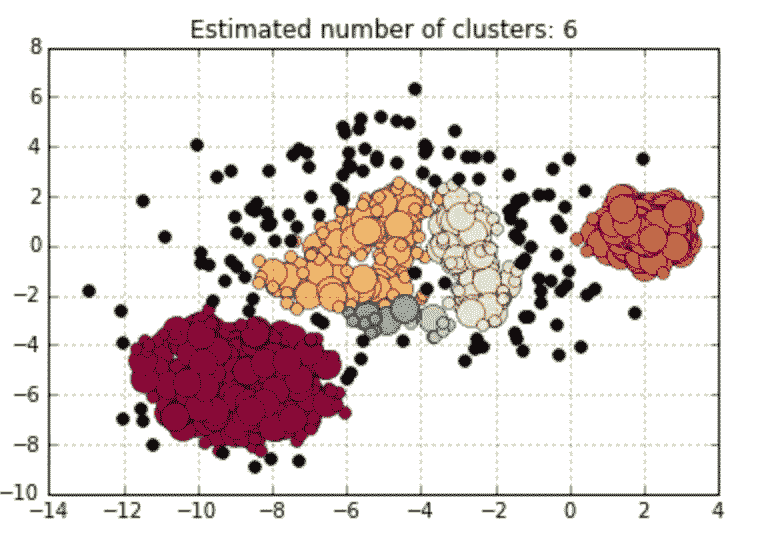

集群这个词意味着相似类型的对象被组合在一起，以显示它们以相似的方式运行。聚类问题是最重要的问题之一，因为它用于了解那些输出变量未给定的问题的数据类型，因此我们需要了解数据的类型。因此，聚类算法开始发挥作用。

**带噪声应用的基于密度的空间聚类** ( **DB-SCAN** )是一组数据库和数据挖掘社区在 90 年代初提出的数据聚类算法。

现在，在我们开始之前，让我们了解一下 DB-SCAN 的核心概念。

让一个给定的点数据集(数据集 D = {xi})，我们必须将点划分成密集区域，我们称之为*簇*和稀疏区域，其中可能包含*噪声*。

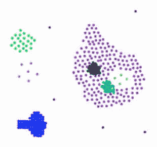

稀疏区域是点密度较小的区域，点密度较大的部分是密集区域。

让我们介绍一些关于 db-scan 的基本主题:

***eps:*** *指定点彼此之间应该有多近才能被认为是聚类的一部分。这意味着如果两点之间的距离低于或等于该值(eps)，则这些点被认为是邻居。*

***min points****:形成密集区域的最小点数。例如，如果我们将 minPoints 参数设置为 5，那么我们至少需要 5 个点来形成密集区域。它基本上被称为 min_samples。*

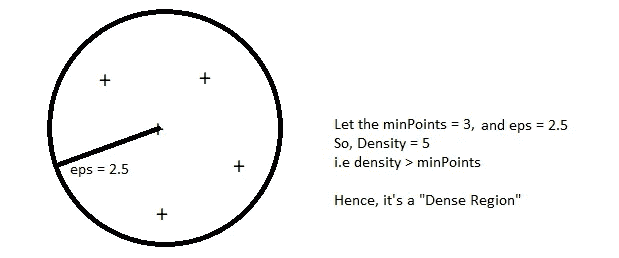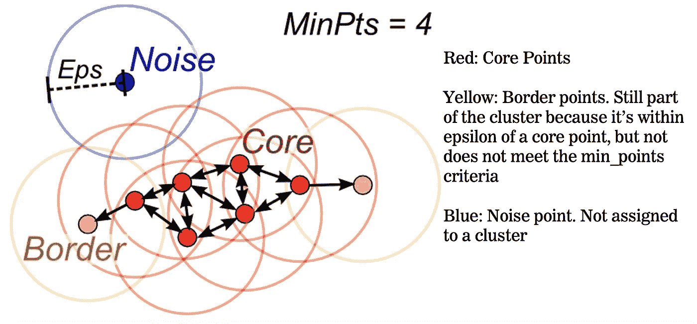

该算法中有三种类型的点——噪声点、核心点和边界点。让我们简单讨论一下这个问题:

## 核心观点:

*   如果一个点在其周围 *eps* 半径内有超过指定数量的 m 个*内点*，则该点是核心点。
*   核心点总是属于密集区域。
*   例如，如果' *p'* 在其周围的 *eps* 半径内有≥ *minPoints* ，那么让我们认为' *p'* 被设置为核心点。

## 边界点:

*   如果一个点在 *Eps* 内的最小点少于*个，但是在*核心点*的邻域内，则称该点为边界点。*
*   例如，如果' *p'* 不是核心点，则 p 被设置为边界点。即' *p'* 在 *eps* 半径内有<T42 分点。但是' *p'* 应该属于邻区' *q'* 。其中' *q'* 为核心点。
*   p∈*q*的邻域和距离( *p，q* ) ≤ *eps* 。

## 噪音点:

*   噪声点是不是核心点或边界点的任何点

## 密度边缘:

如果 a 和 b 都是核心点，并且(a，b) ≤ *eps* 之间的距离，那么我们可以连接图中的 *p，q* 顶点，称之为“*密度边*”。

## 密度连接点:

如果 a 和 *b* 都是核心点，并且它们存在一条由密度边形成的连接点(a)到点(b)的路径，则称两点 a 和 b 是密度连接点。

# DBSCAN 算法:

因此，给定所有这些术语和概念，让我们进入 DBSCAN 算法的核心，看看它是如何工作的。

## 算法:

**步骤 1** : ∀ xi ∈ D，标注点为核心点、边界点和噪点。

**第二步**:去除或消除所有噪声点(因为它们属于稀疏区域。即它们不属于任何集群)。

**步骤 3** :对于每个还没有被分配到集群的核心点 *p*

a)用点 *p* 创建一个新的集群，并且

b)添加密度连接到 *p* 的所有点。

**第四步**:将每个边界点分配到最近的核心点的聚类中。

## 算法如何工作:

首先我们选择两个参数，一个正数ε和一个自然数 minPoints。然后，我们从在数据集中选取任意一点开始。如果在距离该点ε的距离内有多于 minPoints 个点，(包括原始点本身)，我们认为它们都是“簇”的一部分。然后，我们通过检查所有新点并查看它们是否在ε的距离内也具有多于 minPoints 的点来扩展该聚类，如果是，则递归地增长该聚类。

最终，我们用完了添加到集群中的点。然后我们选择一个新的任意点，重复这个过程。现在，完全有可能我们选择的点在其 epsilon 球中的点数少于 minPoints，并且也不是任何其他簇的一部分。如果是这种情况，它被认为是不属于任何聚类的“噪声点”。

(有一个小小的复杂情况值得指出:假设 minPoints=4，你有一个点，它的 epsilon 球中有三个点，包括它本身。假设其他两个点属于两个不同的簇，并且每个点在它们的ε球中有 4 个点。然后，这两个密集点将“争夺”原始点，并且它最终会出现在两个集群中的哪一个是任意的。要理解我的意思，请尝试 minPoints=4，epsilon=1.98 的“示例 A”。由于 DBSCAN 以任意顺序考虑这些点，因此在不同的运行中，中间点可能会出现在左簇或右簇中。这种点被称为“边界点”)。

## DBSCAN 什么时候效果好？

*   它可以很好地处理噪音。
*   DB-SCAN 可以处理不同形状和大小的集群。

## 当不是！

*   DBSCAN 虽然功能强大，对某些应用程序来说也不错。没有永远有效的单一算法。每个职业都有不好的一面。
*   如果数据集具有多个密度或变化的密度，DBSCAN 往往会失败。在这种情况下，它不太管用。
*   它对超参数极其敏感。超参数的微小变化会导致结果的剧烈变化。
*   正如我们所知，像密度这样的概念在高维数据中可能不太适用。我们应该避免将它用于文本数据。

## 时间和空间复杂性:

**时间复杂度** : O(n logn)

**空间复杂度** : O(n)

# 实施:

我们可以使用互联网上的一个库/包。另外， [Sklearn](https://scikit-learn.org/stable/modules/generated/sklearn.cluster.DBSCAN.html) 有一个 DBSCAN 实现包。

## 代码示例:

## 带 Scikit-Learn 的 DBSCAN 算法示例:

为了查看 DBSCAN 算法的一个实际例子，我使用了加拿大 2014 年的天气数据来对气象站进行聚类。首先让我们加载数据—

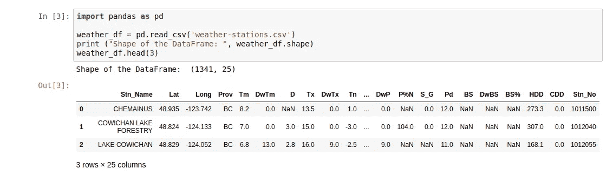

数据帧由 1341 行和 25 列组成，为了理解列名代表什么，让我们看看下面最重要的特性

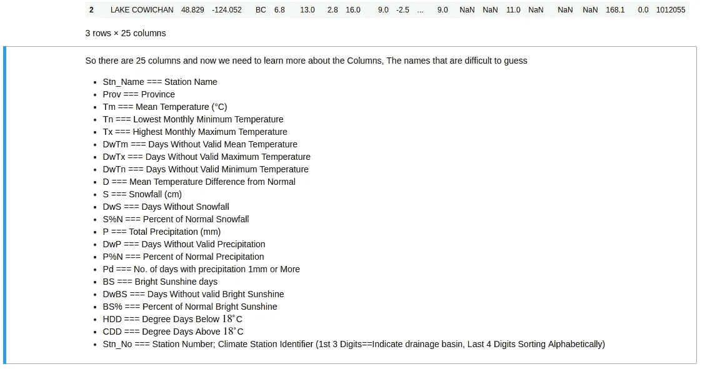

因为，我想使用不同的温度作为第一次尝试聚类气象站的几个主要特征，首先，让我们删除“平均温度(Tm)”、“最低温度(Tn)”和“最高温度(Tx)”列中包含 NaN 值的行。


在删除上述列中包含 NaN 值的行后，我们剩下 1255 个样本。尽管这几乎是 7%的数据损失，但是考虑到我们仍然有超过 1000 个样本，让我们继续进行聚类。

由于我们要进行空间聚类，并在地图投影中查看聚类，以及不同的温度(“Tm”、“Tn”、“Tx”)、“Lat”、“long”也应作为特征。在这里，我使用了[底图工具包](https://matplotlib.org/basemap/users/intro.html)，一个用于绘制 2D 数据的库，以便用 Python 绘制地图。正如底图文档中提到的*“底图本身不进行任何绘图，但提供了将坐标转换为 25 种不同地图投影之一的工具”。*底图的一个重要属性是-使用参数纬度/经度(以度为单位，如我们的数据框中所示)调用底图类实例，以获取 x/y 地图投影坐标。

让我们使用底图绘制气象站，以便熟悉它。从导入必要的库开始

```
from mpl_toolkits.basemap import Basemap
import matplotlib
from PIL import Image
import matplotlib.pyplot as plt
from pylab import rcParams
%matplotlib inline
rcParams['figure.figsize'] = (14,10)
```

我们现在准备调用底图类—

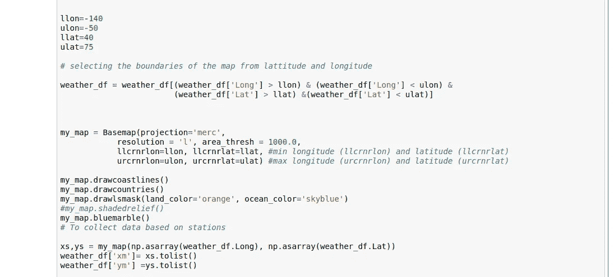

让我简单解释一下代码块。我开始使用[墨卡托投影](https://en.wikipedia.org/wiki/Mercator_projection) ( *投影=‘merc’*)、低分辨率(*分辨率=‘l’*)调用一个底图类实例，地图域的边界由 4 个参数给出 *llcrnrlon、llcrnrlat、urcrnrlon、urcrnrlat、*，其中 *llcrnrlon* 表示所选地图域左下角的经度，依此类推。*绘制海岸线，绘制国家*顾名思义，*绘制遮罩*绘制高分辨率陆海遮罩图像，将陆地和海洋颜色指定为橙色和天蓝色。使用下面的命令将纬度和经度转换为 x/y 地图投影坐标—

```
xs, ys = my_map(np.asarray(weather_df.Long), np.asarray(weather_df.Lat))
```

这些地图投影坐标将用作要素，以便在空间上将数据点与温度一起聚类。首先让我们看看下面的气象站—

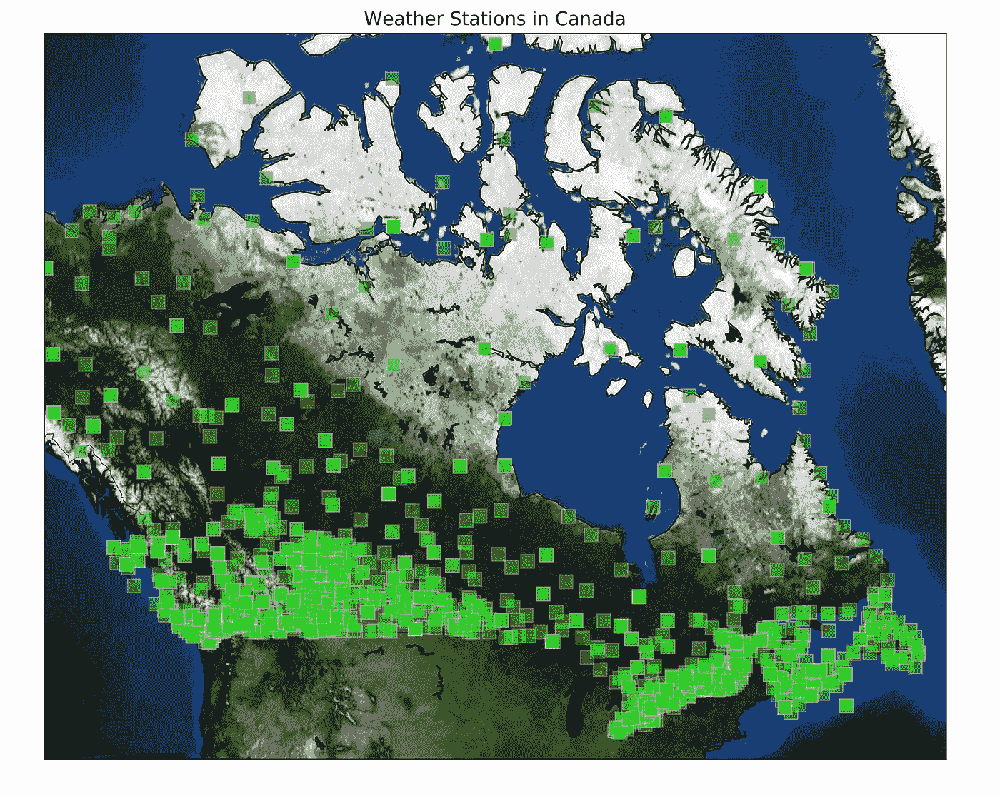

使用底图绘制的加拿大气象站。

## 3.1 —聚类天气数据(温度和坐标作为特征)

对于聚类数据，我遵循了[sci kit-DBS can](https://scikit-learn.org/stable/auto_examples/cluster/plot_dbscan.html#sphx-glr-auto-examples-cluster-plot-dbscan-py)的学习演示中所示的步骤。

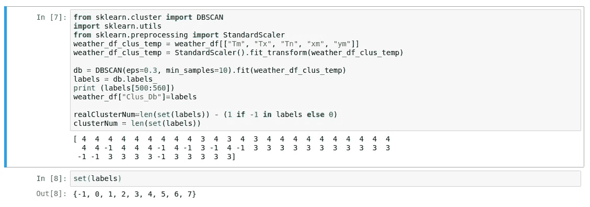

选择温度(' Tm '，' Tx '，' Tn ')和坐标的 x/y 映射投影(' xm '，' ym ')作为特征，并将ϵ和 *MinPts* 分别设置为 0.3 和 10，给出 8 个唯一的聚类(噪声标记为-1)。您可以随意更改这些参数来测试集群会受到多大的影响。

让我们使用底图来可视化这些集群—

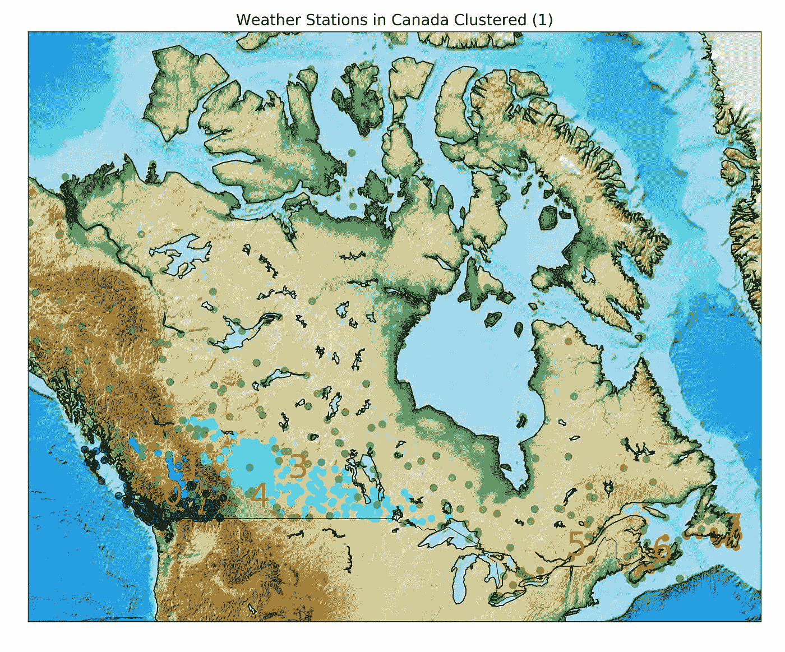

加拿大基于天气数据中几个选定特征的 8 个独特聚类。ϵ和 MinPts 分别设置为 0.3 和 10。

最后，我将降水(“p”)包含在特征中，并重复相同的聚类步骤，将ϵ和 *MinPts* 设置为 0.5 和 10。我们看到了与以前的聚类的一些不同，因此它给了我们一个思路，当我们缺乏领域知识时，即使使用 DBSCAN 也可以对无监督数据进行聚类。

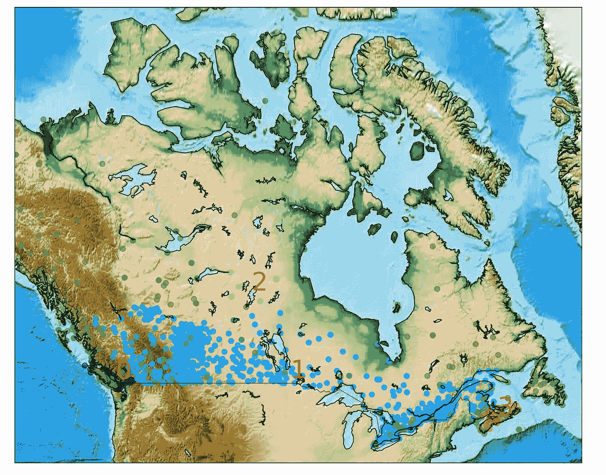

根据天气数据中的选定特征(与以前的情况相比，现在包括降水),加拿大有 4 个独特的聚类。ϵ和 MinPts 分别设置为 0.5 和 10。

您可以尝试重复这个过程，包括一些更多的功能，或者，改变聚类参数，以获得更好的整体知识。

# **结论:**

最后，我们介绍了 DBSCAN 算法的一些基本概念，并测试了该算法对加拿大气象站的聚类。详细代码和所有图片将在我的 GitHub 中提供。可以与 K-均值聚类进行直接比较，以便更好地理解这些算法之间的差异。希望这将有助于您开始使用一种最常用的聚类算法来处理无监督问题。

**参考文献:**

维基百科:【https://en.wikipedia.org/wiki/DBSCAN 

sk learn:[https://sci kit-learn . org/stable/modules/generated/sk learn . cluster . DBS can . html](https://scikit-learn.org/stable/modules/generated/sklearn.cluster.DBSCAN.html)

基于密度的聚类方法；高，j。布法罗大学副教授。[演示链接。](https://cse.buffalo.edu/~jing/cse601/fa12/materials/clustering_density.pdf)