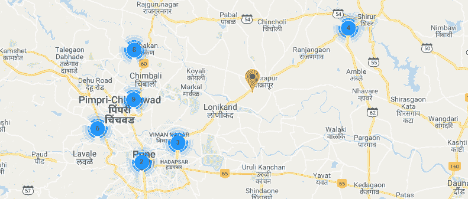

# 你能多有效地管理你的供应链？？

> 原文：<https://medium.com/analytics-vidhya/how-effectively-can-you-handle-your-supply-chain-cb4754685ca3?source=collection_archive---------3----------------------->

**供应链分析(附案例研究)**

# **简介**

随着数据科学和分析在不同领域的应用越来越多，分析数据和优化网络的方式也在发生变化。企业现在使用先进的分析工具来管理库存和优化供应链网络，以降低成本。


供应链中使用分析的各个领域包括需求预测、库存优化、牛奶运行管理系统的供应商细分。

**因此，在本文中，我们将首先研究供应链分析的不同领域，并通过案例研究对供应链网络中实施牛奶运行的供应商进行细分。**

# **目录**

1.  **不确定条件下的库存管理**
2.  **需求预测/时间序列分析**
3.  **供应链中的牛奶跑是什么？？**
4.  **案例研究**

## **不确定条件下的库存管理**

每当一家制造公司在市场上交付不同类型的产品时，它都需要跟踪不同产品的需求，并在此基础上管理库存。每个公司都想把他们的库存降到最低，因为库存会导致各种成本。

1.  持有成本
2.  仓储成本
3.  股票随时间的贬值
4.  过时

有一些术语在库存管理中非常常用。

**再订购点(ROP)——**这是公司确定的库存阈值，如果库存低于该值，将向供应商下订单补充库存。

**提前期—** 是供应商将产品供应给指定行业所需的时间。

**安全库存—** 是企业为应对各种不确定性而在库存中保留的库存。

**库存概率模型**

不同的公司有不同的工作模式-

1.  需求和交付周期不确定的公司。
2.  只有需求存在不确定性且交付周期固定的公司。
3.  有固定需求和固定提前期的公司。

第三类公司的客户来自不同的行业，他们根据自己的预测提供需求。最常见的实际情况是第二种情况，因为交付周期几乎是恒定的，并且我们都知道。

ROP =提前期需求+ Z*𝜎dLT

其中 Z =平均需求的标准偏差数。

提前期内需求的𝜎dLT=标准差。


上面的正态分布就是需求曲线。

𝜎dLT= 𝜎d*(lead 时间)

绿色区域代表正态曲线区域的 95%，这是没有缺货的可能性，而 5%(红色区域)是缺货的可能性。缺货意味着我们没有原材料来生产我们的产品。

## **需求预测**

对公司特定产品的需求预测是基于对该产品销售的时间序列分析，以及通过公司网站上的评论获得的人们对该产品不断变化的看法。

有不同的时间序列模型，但在本文中，我们只简要介绍了 ARIMA 预测模型。

1.  **ARIMA 时间序列建模**

**自回归综合移动平均(ARIMA)** 模型是自回归移动平均(ARMA)模型的推广。这两种模型都适用于时间序列数据，以便更好地理解数据或预测序列中的未来点(预测)。在数据显示非平稳性证据的一些情况下，应用 ARIMA 模型，其中初始差分步骤(对应于模型的“积分”部分)可以应用一次或多次以消除非平稳性。

ARIMA 的 AR 部分表明，不断变化的感兴趣的变量是根据它自己的滞后(即先前)值回归的。MA 部分表示回归误差实际上是误差项的线性组合，其值在过去的不同时间同时出现。

非季节性 ARIMA 模型通常表示为 ARIMA( *p* ， *d* ， *q* )，其中参数 *p* ， *d* 和 *q* 为非负整数， *p* 为自回归模型的阶(时滞数)， *d* 为差异度(数据具有过去值的次数季节性 ARIMA 模型通常表示为 ARIMA( *p* 、 *d* 、 *q* )( *P* 、 *D* 、 *Q* ) *m* ，其中 *m* 表示每个季节的期数，大写的 *P* 、 *D* 、 *Q*

大多数需求预测模型都是季节性模型，因为对于特定的产品来说，有一个销售上升的季节，所以我们需要捕捉这种季节性成分以进行有效的预测。

## **供应链中的牛奶跑是什么？？**

来自不同供应商的混合货物的交货方式。不同的供应商(比如说 6 个)不是派出他们不同的卡车来满足他们每周的需求，而是一辆车拜访不同的供应商来收集客户每天的需求。这样，即使使用 6 辆车来供应货物，也可以在一周内每天用一辆卡车来分配。这种方法将大大降低供应商和客户的库存成本。


## **案例研究**

考虑一家制造公司“ABC ”,其本地供应商分布在他们的区域，如果该公司是一家基于汽车“JIT ”(准时生产)的公司，将有大约 80-100 家本地供应商，因此在 Milk run 实施中连接所有这些供应商将是困难的。

由于该公司采用 JIT 生产方式，因此更希望在仓库中储存尽可能少的材料，并在从卡车上卸下材料后直接在生产线上供应。

这里的问题是根据供应商的地理位置以及不同的约束条件(如供应商每天供应的材料所占的体积以及材料包装的类型)对供应商进行分类。让我们借助一个例子来理解这一点——

假设公司“ABC”有 5 个供应商，我们需要根据地理位置、每日总量、包装风格和其他一些特征对他们进行分类。我们的卡车容量约为 9 立方米。我们知道，供应商“1”和“2”在同一个地区，每天的需求量分别约为 4m3 和 4.5m3，并且他们的包装风格相同。供应商“3”和“4”在同一个地区，而且来自供应商“5”的卡车在前往公司“ABC”的途中会经过“3”和“4 ”,因此可以收集他们的日常需求。

**如何自动化这个过程？？**

将有一个仪表板，其中将有关于每个供应商的库存水平的数据，并在此基础上，它会自动根据第二天计划的每日数量要求对供应商进行分类。假设有一天，供应商“3”、“4”和“5”由于容量限制而无法将他们的物料装入一辆卡车。因此，我们需要派两辆卡车去取材料，然后供应商“5”可以送更多的材料。然后，可以存储每日需求和额外的材料，对于第二天的计划，我们的算法将具有供应商“5”的库存水平。基于这一点，如果可能的话，它会尝试将供应商“3”、“4”和“5”连接在一辆运奶卡车上，以节省运输成本。

通过这种方式，算法将根据需求数据和库存水平自动计划第二天的牛奶运行实施，并且在轮班结束时，关于第二天容量需求的数据将被发送给供应商。

**这对供应商和客户都有什么好处？？**

供应商将有每日数量要求，因此他将能够在不增加运输成本的情况下供应材料(因为一次牛奶运输中的所有供应商将支付卡车费用)。这也将有助于降低他的库存成本，因为在旧系统中，他需要生产整个一周的需求，存储它，然后用一辆卡车供应全部材料。

客户的库存成本也将降低，生产线进料系统和双重材料处理也将减少，这反过来又减少了(IDL)间接劳动力的工作。

**聚类技术**

我们需要选择聚类技术，这样我们就可以根据我们的需求形成聚类，这就导致了所谓的“**层次聚类**

*层次聚类也称为*层次聚类分析，*是一种将相似的对象分组为称为*簇*的组的算法。端点是一组群集*、*，其中每个群集彼此不同，而每个群集内的对象彼此大致相似。*

**

*假设 A、B、C、D、E 和 F 是我们的供应商，它们是根据地理位置绘制的。所以我们可以根据我们的日常需求，通过一个树状图来对它们进行聚类。如果 C，D，E，F 的材料的体积可以被一辆卡车占据，那么我们可以得到两个集群——一个是(A，B ),另一个是(C，D，E，F)。如果这是不可能的，那么我们可以转到下一级的三个集群——第一个是(A，B ),第二个是 C，第三个是(D，E，F ),并检查需求。这整个过程将自动进行，以减少我们的目标函数，即“成本”。*

*假设在我们的牛奶运行中，我们的卡车可以覆盖半径大约为“3 Km”的区域，那么我们可以分析聚类，然后我们也可以分析半径为“5 Km”的聚类。*

**

***半径为“3 公里”的聚类***

**

***半径为“5 公里”的聚类***

**

*其中“蓝三角”是“ABC”的位置，所有其他点代表他们的供应商。*

**

*因此，上面的 excel 表格是库存管理团队数据表的一个示例，每天还会有一个库存盘点列。*

*与此同时，将会有一个具有不同成本的表，如运输成本、库存持有成本和其他成本，并且我们的目标函数将被最小化。*

***为什么我们要把问题当作半监督聚类来处理？？***

*我们先来了解一下“什么是半监督聚类？”*

*聚类技术倾向于根据数据集中的特征将数据集划分为同类组。因此，在我们的案例中，我们也希望集团在地理位置、包装类型和其他一些特征的基础上是同质的。然而，这里的问题是，这种无监督类型的聚类倾向于将相同的“每日需求量”供应商聚类到一个组中，这将产生一个问题，因为提供大量材料的供应商将被分组到一个组中。因此，我们将需要大量的卡车来运送牛奶，这将导致我们的运输成本很高，间接导致我们从不同供应商处一次性收集材料的目的无法实现。*

*此外，可能还有其他因素导致我们认为这两家供应商不能在牛奶销售中联合在一起。*

*由于在我们的聚类技术中存在不能将大量供应商链接到一个组中的限制，这种关于将我们的数据分组到聚类中的先验知识引导我们进行“半监督聚类”。*

*有两种类型的约束-*

1.  *必须链接约束*
2.  *无法链接约束*

*例如，我创建了一个 excel 文件，其中包含不同的供应商信息、位置、包装风格以及每日总需求量。*

**

*因为我们的卡车容量在 10 立方米左右。我们可以清楚地将我们的不可链接约束放在前 3 行，因为它们不能在一次牛奶运行中。分类变量可以通过“一键编码”转换成数字数据。*

## ***R 中的代码***

```
*library(‘conclust’)
library(“readxl”)#Read the data file into Rdata = read_excel(‘C:/Users/Shreyansh/Desktop/Book13.xlsx’)#Specify Cannot Link ConstraintscantLink = matrix(c(1,1,2,2,3,3), nrow = 3)#MustLink constraints are zero in our casemustLink = 0#Number of clusters to be formedk = 4#prediction using ckMeanspred = ckmeans(data, k, mustLink ,cantLink)pred*
```

***输出***

*1 3 2 2 2 2 2 2 2 2 2 4 4 4 4 4*

*我们可以清楚地观察到，尽管前 3 行在许多特性方面是同类的，但是通过提供不可链接约束，它们被分组到不同的集群中。*

***有容量限制的车辆路径问题***

*上面提到的聚类技术在提供好的结果方面可能不是最好的，因为我们需要手动指定不能链接约束。运筹学中的 CVRP 问题是用遗传算法解决的。[或-Tools](https://developers.google.com/optimization/routing/vrp) 可以通过要求您给出距离矩阵和车辆容量作为输入来帮助您解决 CVRP 问题。不同的颜色路径是不同的牛奶运行路线，这将优化成本。*

**

# ***结束注释***

*通过为库存管理系统创建仪表板，我们可以有效地计划牛奶运行实施，并根据我们的要求，我们可以满足需求，我们的牛奶运行计划将准备就绪。该仪表板还可以帮助以有效的方式管理库存。通过我们的仪表盘，我们可以回答“哪个牛奶厂连接哪个供应商”的问题，并且基于我们的库存数据，我们还可以对我们与库存相关的重大决策进行“ **What-If** ”分析。*

***— Shreyansh Nanawati***

*我现在是从那格浦尔理工大学机械工程专业毕业的第四年。作为一个数据科学爱好者和喜欢玩数学的人，我希望探索我在这个领域的知识。*