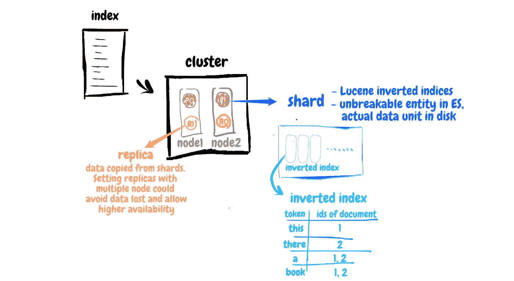

# Elasticsearch 怎么搜索这么快？

> 原文：<https://medium.com/analytics-vidhya/how-elasticsearch-search-so-fast-248630b70ba4?source=collection_archive---------2----------------------->

es 如何保存你的数据

与数据库相比，Elaticsearch 在搜索大数据时效率更高。它是如何工作的？高速的核心来源于并行计算和倒排索引。

因此，本文将与您分享在 Elasticsearch 中创建索引的过程。我将介绍保存索引的过程，从文本到倒排索引，并讲述 Elasticsearch 如何完成搜索任务。