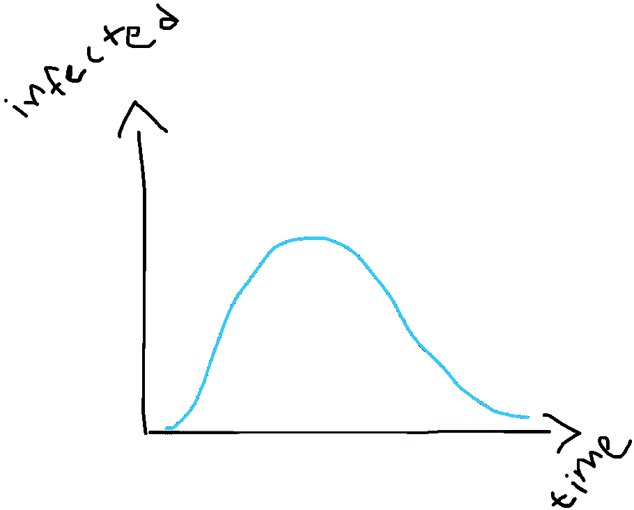
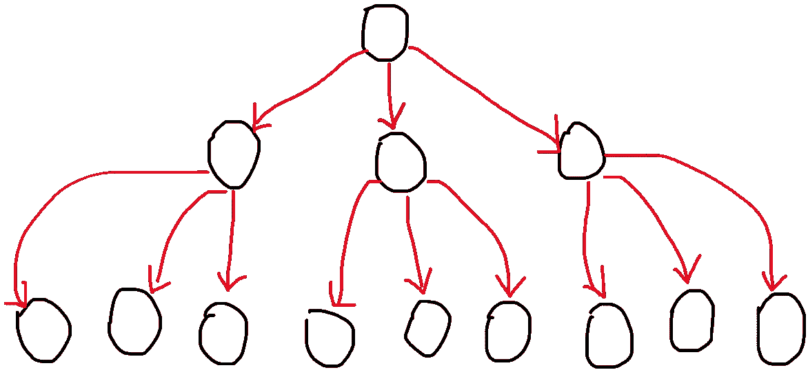
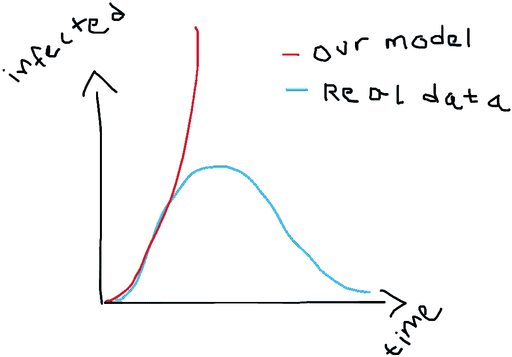
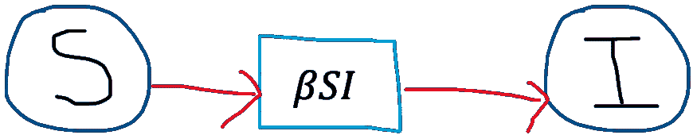
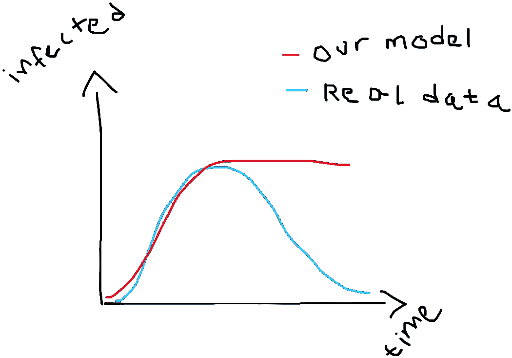
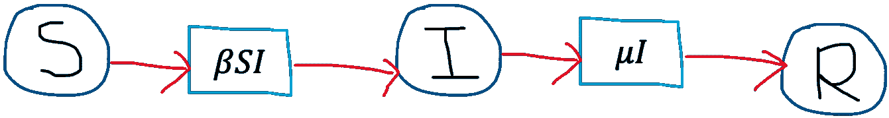
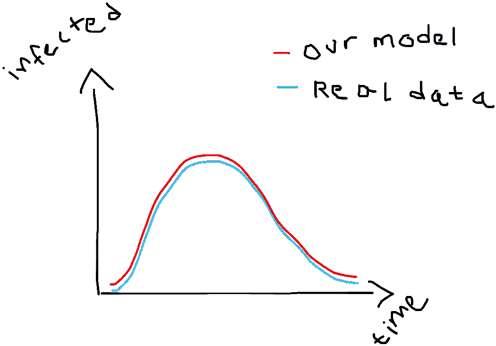
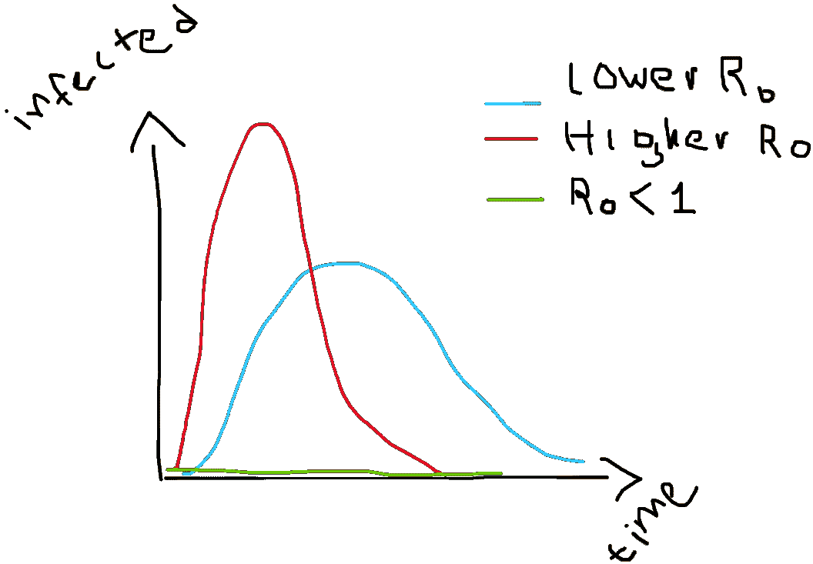

# 流行病学家如何施展他们的魔法并模拟疾病爆发(为我们其他人)

> 原文：<https://medium.com/analytics-vidhya/how-epidemiologists-do-their-magic-and-model-outbreaks-for-the-rest-of-us-a958819b964a?source=collection_archive---------21----------------------->

## 流行病模型背后的直觉以及为什么它们对专家如此有用

***编辑 4 月 18 日:*** *我已经把这个帖子翻译成了西班牙语，你可以在这里找到它***。**

*流行病的数学建模无疑是一个数据驱动的学科，它使用由流行病学和传染病知识提供的强参数模型和下一事件模拟技术。在这里，我总结了我在过去几个月里通过聆听专家意见(尤其是一个来自牛津的精彩视频)和大量阅读所收集到的信息。也准备好我的**全管状**手绘图形，因为我很懒。*

*如果您在过去的三个月中有所关注，您可能会看到类似下图的一些变化:*

**

*我真的为自己牛逼的画图技术而骄傲(不是)。*

*这是传染病爆发期间病例数的表现方式。它们上升得非常快，达到顶峰，然后开始像上升一样快地消失。如果你回顾过去，你会看到许多具有相同行为的疾病爆发的例子！事实证明这是有原因的:那些小杂种的繁殖和从一个人跳到另一个人的方式受相似的法则支配。*

*非常聪明的人开始注意到这些相似之处，并想出了利用数学来预测这些感染曲线形状的方法。他们被称为流行病模型。*

# *传染病的数学模型*

*让我们来看看最简单的，然后我们会继续努力，直到我们得到更接近现实的东西，好吗？*

## *天真的模型*

*传染性病菌在人与人之间传播。它们已经进化到能做到这一点，有些在这方面非常高效。以麻疹为例。这个小杂种(一种病毒)在这方面非常擅长，一个感染者可以反过来感染多达 12 到 18 个其他人。在新冠肺炎病毒(新型冠状病毒冠状病毒)的例子中，人们认为一个感染者平均可以把它传染给 2-5 个人。让我们画一个小图来看看这种传播是怎样的:*

**

*在这个假设的例子中，每个被感染的人会感染另外 3 个人。然后那些新感染的人又去感染另外三个，如此循环。如果我们假设一个新感染者需要一天时间才能感染另一个人，那么仅仅三天之后，你就会有 ***27*** 人被感染。这并不令人印象深刻，但是当你意识到仅仅 14 天后***4782969***就可能被感染时，你开始意识到这种增长(称为指数增长)可能非常危险。如果仔细观察该图，您会发现病例数根据以下公式变化:*

*其中 t 是时间，I 是感染人数。如果我们在公式中插入一个零，我们将得到第 0 天的病例数，也就是一个感染者。堵一个会得三个，对应三个感染者。同理，如果你输入一个 3，你会得到 27 个感染者。诸如此类。*

*让我们画出这些数字，看看会得到什么样的曲线:*

**

*看那个！我们的第一个模型在某种程度上与真实数据相符，但只是在开始阶段。一段时间后，真实曲线达到峰值，然后下降，但我们模型的曲线只是保持上升，这不是很好。原来，我们忽略了传染病往往会发生的重要事情:在你被感染后，1。死或 2。你从疾病中康复，无论是哪种情况，你都会从可能被感染的人群中被带出来，因为你已经死了，或者你美丽的免疫系统(通常)学会了如何击败攻击者，这样你就不会再次得病(你对这种病菌产生了免疫力)。最终这种病菌会从人群中消失，所以数字开始下降。*

*我们的模型看起来不太好是吗？。但是不要害怕，这正是科学的工作方式:你做一个猜测，然后你看数据，判断你的猜测是否与数据相符。如果不符合，你就用数据来完善你的猜测，然后再测试一次。洗涤、冲洗并重复。*

*请记住，我们的模型缺少的关键是人们不再容易受到感染(他们已经免疫或死亡)。让我们试着在模型中加入这一点。*

## *SI 模型*

*一个非常聪明的人有一个同样聪明的主意:让我们把人放进盒子里，或者说是隔间里。开始时，每个人都在“我们可接受的盒子”里，当有人得病时，我们会把它移到“我已感染的盒子”里。我们会想办法决定人们从第一个盒子转移到第二个盒子的速度。这个想法是最简单的房室模型，SI 模型的基础。看起来是这样的:*

**

*记住，人们以特定的速率从 **S** 易受感染区间过渡到 **I** 易受感染区间，**β**。把它想象成一个装满水的桶，桶底有一个洞:在某个时候，所有的水会流到别的地方。对于你们之间更倾向于数学的 *(* ***枯燥的数学提醒:*** *有些数学正在向你走来但是如果你喜欢你可以跳过它，只要注意紧接其后的就行)*，人们从一个隔间到另一个隔间的方式可以用下面的微分方程来建模:*

*其中 ***β*** 为感染率。第一个方程是易感个体的*变化率*，第二个方程是受感染个体的*变化率*。第一个等式上的负号模拟了这样一个事实，即随着疫情的发展和人们生病，易感个体的数量会随着时间的推移而下降。*

*酷，现在数学已经结束了，让我们看看我们的模型形状是什么样子的:*

**

*你看到了吗？我们的模型不再保持上升，但现在它在真实数据图达到峰值的同时达到峰值！我们在这方面越来越好了。然而，正如你所见，在达到峰值后，真实的图表下降，但我们的停留。那我们现在怎么办？请记住，我们使用数据来提高我们的猜测。这让我们想到:*

## *SIR 模型*

*事实证明，我们的 SI 模型只解决了问题的一半:病毒没有人可以感染，所以感染人数停止增长。但是我们忽略了另一半，那就是，既然人们不会永远被感染，他们必须进入另一个盒子:恢复盒。在实践中，这也可能是死箱，但我们会保持积极的态度。无论如何，我们的小模型现在看起来像这样:*

**

*这被称为 SIR 模型，原因(我希望)是显而易见的。同样，从数学角度来看，SIR 模型背后的等式是:*

*请注意，受感染人群的变化率现在包括一个负项，用于模拟从受感染区慢慢流出的人群，第三个等式用于模拟康复人群的变化率。再次，*是感染率(每个感染个体对每个易感个体)，我们的新参数*称为恢复率(*1/****μ***称为平均传染期，即一个普通感染者能够将疾病传染给他人的时间)。***

**让我们来看看它的实际应用:**

****

**是啊，这还差不多。随着人们从感染区转移到恢复区，感染人数下降，这就是我们熟悉的钟形。**

**事实证明，这个 SIR 模型是由真正的专业人士使用的，在某些情况下，它是对真实交易的一个足够好的近似。事实上，有了它我们可以探索一些流行病学的概念，其中一些你可能在最近的新闻中听过。有:**

## **R0**

***R0* (读作*“R 零”*)定义为**

> **每个原发病例产生的病例数(在完全易感人群中)。**

**简单地说， *R0* 是一个普通的(受感染的)乔可以将疾病传播给的人数，这个数字对很多事情来说都非常重要。R0 较高的疾病传播性更强，成为流行病的风险也更大(后面会详细介绍)。它的正式定义是**

**是的，那些希腊字母来自我们的 SIR 模型。 ***β*** 为感染率，*1/****μ***为平均感染期。从模型中估计这些参数可以让流行病学家找到疾病在人群中传播的速度。说到这里，这是你最近可能见过的另一个图表:**

****

**原来， *R0* 的值越高，产生的曲线就像红色的那条，也就是说，流行病传播得更快，达到峰值的速度更快，消失得也更快。较低的值或 *R0* 产生更多的展开曲线，达到峰值和消失需要更长的时间。最后但同样重要的是，如果由于某种原因 *R0* 小于 1，则没有流行病发生！这是因为受感染的普通人无法将疾病传播给足够多的人以维持流行病爆发(即平均而言，他将疾病传播给不到一个人)。关于 R0 的好消息是，它不是固定的，我们可以做一些事情来减少它，并最终将其控制在一个范围内，并消灭一种流行病。**

## **群体免疫**

**哈！著名的群体免疫，我们对它有太多的了解(双关语)。群体免疫被定义为当足够大比例的个体(群体的一部分)免疫时，对疾病传播的抵抗力。如果媒体报道可信的话，世界上至少有一个国家的政府在押注新冠肺炎疫情会得到控制，从而让人们产生群体免疫力，并最终消灭它。看起来,*新型冠状病毒*的杀伤力太大，传染性太强，这种策略无法奏效，但我知道什么呢？不管怎样，如果群体免疫导致疾病在人群中传播缓慢，它一定会以某种方式影响其 *R0* 对吗？答案是肯定的！群体免疫将 *R0* 向下推。记住这一点**

**嗯，如果存在群体免疫，那么群体中可接受个体的数量就更小，根据上面的公式，这又会导致更小的 R0。我喜欢这样。**

## **流行病风险**

**我真的很想回避这个问题，因为我认为很重要的一点是，有时候科学没有人们想要的答案。x 病会变成疫情吗？不是吗？我们应该关闭机场吗？还是让它们开着？不幸的是，答案并不明确，因为这些事情存在大量的不确定性。有时候最好的答案是一个有根据的猜测。**

*****疫情风险*** 是对某一疾病的输入病例导致重大疫情的可能性的有根据的猜测。基于这种风险(实际上是适当的概率)，公共政策可能会制定为关闭、禁飞等。而这个风险与 *R0* 有直接关系: *R0* 越高，疫情风险越高。**

**你如何应对这种流行病风险来降低它？嗯，记得 *R0* 是感染率乘以易感人数，乘以平均传染期？如果你在这些方面采取行动，你可以降低疫情风险。那些是什么动作？让我们看看:**

*****接触追踪和隔离。*** 当你追踪一个感染者的密切接触者并将其隔离时，你在降低他们可以传染其他人的有效时间窗，即他们的传染期*1/****μ***，所以你把 *R0* 往下赶。**

*****社交疏远。*** 社交距离减少了人与人之间密切接触的次数，从而降低了疾病传播的速度(对你来说就是 ***β*** )，把 *R0* 往下推。**

*****接种疫苗。*** 疫苗接种的工作原理是启动我们的免疫系统来抵抗致病的细菌，使我们对它们具有免疫力。如果更多的人因为接种疫苗而免疫，那么易感人数( ***S*** )就会下降，从而降低 *R0* 。**

## **SIR 模型的扩展**

**分室模型的好处是它们非常具有可扩展性。以下是让 SIR 模型更强大的一些方法:**

*   **添加随机性(随机 SIR):因为 SIR 模型是由方程控制的，所以它们总是会给你同样整洁、良好的答案。问题是现实世界并没有那么整齐，那些完美的钟形在真实的疫情中并没有那么完美。为了捕捉一些真实世界的疯狂，流行病学家与模型玩“骰子”,每次都得到稍微不同的答案。然后，有了一千条不同的曲线，他们可以找到一种感染最可能的途径，并对他们的预测进行一些置信度的估计。**
*   **添加隔间:隔间模型非常酷的一点是，你可以根据建模的具体情况来定制它们。例如，如果人们在被感染时没有传染性，您可以在**S**S 易受感染和 **I** 受感染人群之间添加一个新的区间，以模拟那些已经**暴露于*的人群；创造一个 SEIR 模式。如果您怀疑无症状携带者(被感染但没有表现出症状的人)在疫情中扮演重要角色，您可以添加一个新的 ***一个*** *有症状的*区间，以此类推。***
*   **人口结构:到目前为止，我们已经讨论过的模型的一个基本假设是每个人都和其他人混合得差不多。嗯，那不是真的，不是吗？我的意思是，我们和一群相当少的人(这里是内向的人)在一起，所以我们周围的方式可能有一些结构。这种结构可以被整合到模型中，通过创建一系列模型来应用于特定的人口亚群体:地理亚群体，年龄亚群体，你选择一个。然后你可以让人们偶尔以不同的速度从一个小组转移到另一个小组，从一个模型转移到另一个模型。**

# **结论**

**像我们在这里看到的流行病学模型对于专家评估公共卫生干预措施在抑制和/或缓解疫情和流行病方面的能力非常有用。鉴于真实数据有时不可能在短时间内获得，这些模型在许多假设下运行，这意味着流行病学家可能不得不求助于近似或有根据的猜测来获得一些答案。尽管如此，这些模型在专家手中是一个令人敬畏的工具，可以在推动战胜疾病的行动中发挥很大作用。**

**在每个人似乎都有自己观点的时候，通常我们这些非流行病学家(包括我自己)能做的最好的事情就是……听听真正的专家，在批评这个或那个之前，考虑一下我们*可能甚至没有错*的可能性😉*。***