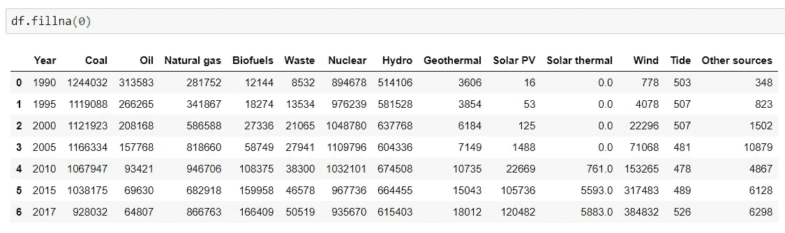

# 欧洲是如何发电的——用 Plotly 分析

> 原文：<https://medium.com/analytics-vidhya/how-europe-is-generating-electricity-analysis-with-plotly-3819e9ec61c2?source=collection_archive---------21----------------------->

## 近距离观察欧洲的电力生产，使用 Plotly 库生成交互式图表。

根据 EN 21 社区的报告“可再生能源全球现状报告(GSR)”，2017 年可再生能源占全球发电能力净增加的 70%，但 2017 年全球与能源相关的二氧化碳排放量增加了 1.4%。

发电跟踪是跟踪电力部门去碳化的一种重要方法，以便了解每种能源对电力供应的贡献。这类数据有几个来源，今天我们将与国际可再生能源机构合作。你可以去 https://www.irena.org/[网站查看所有关于能源的信息和数据。](https://www.irena.org/)

下图显示了 1990 年至 2017 年欧洲的发电量。我们可以注意到煤和石油的减少，水电和核能发电几乎不变，而可再生能源却在增加。此图中的一个问题是一些来源的比例不同，使得它们在此图中几乎不可见。


欧洲的发电。数据来源:国际可再生能源机构。

当你做报告时，根据你要讲的故事，用适当的方式展示你的研究是很重要的。在之前的图表(用 Matplolib 制作)中，如果你想关注可再生能源，这不是展示数据的最佳方式。

> [查看这本关于欧洲风能和 Matplotlib 的出版物。](/@lugoafonso/wind-energy-in-europe-and-data-science-1228cb83b0c1)

下面的视频是用 [**Plotly**](https://plotly.com/) 交互方式呈现的相同数据。使用这个工具，我们可以缩放绘图区域，查看屏幕上的值，取出一些源，将它们添加回去，甚至保存修改后视图的图像。


有几种方法可以使这种形象化，我将向你展示其中一种容易理解的方法。我们将使用 [Pandas](https://pandas.pydata.org/) 读取 CSV 文件，使用 [Numpy](https://numpy.org/) 操作数据，使用 [Plotly](https://plotly.com/) 创建可视化。因此，第一步是导入您将使用的库，然后从 Pandas 调用类‘read _ CSV’来加载数据。

```
import pandas as pd
import plotly.graph_objects as go
import numpy as np#Load the csv file with Pandas
df = pd.read_csv('Electricity generation by source - Europe.csv')
```

使用“df.head()”查看数据帧的前 05 行总是有用的。


一些值被加载为 NaN(不是数字),这对我们的分析不利。我们可以使用 df.fillna(0)将这些 NaN 值替换为零，如下图所示。



现在我们使用 Numpy 中的类‘as array’来操作 Pandas 数据框中的数据。

```
#Transform all the columns into arrays with Numpy
years = np.asarray(df['Year'])
coal = np.asarray(df['Coal'])
oil = np.asarray(df['Oil'])
natgas = np.asarray(df['Natural gas'])
biofuels = np.asarray(df['Biofuels'])
waste = np.asarray(df['Waste'])
nuclear = np.asarray(df['Nuclear'])
hydro = np.asarray(df['Hydro'])
gethermal = np.asarray(df['Geothermal'])
sol_pv = np.asarray(df['Solar PV'])
sol_therm = np.asarray(df['Solar thermal'])
wind = np.asarray(df['Wind'])
tide = np.asarray(df['Tide'])
other = np.asarray(df['Other sources'])
```

现在，我们可以通过创建一个图形并添加之前创建的每个阵列的图来开始绘制图形。参数“fill = 'tonexty '”用于在每个区域的顶部创建一个区域，“stackgroup = 'one '”为所有源创建一个组，而“mode = 'none '”用于删除区域的线条。

```
#Create a figure and add the stacked lines with Plotly.graph
fig = go.Figure()
fig.add_trace(go.Scatter(x = years, y = coal, name= 'Coal', fill = 'tonexty', stackgroup= 'one', mode= 'none'))
fig.add_trace(go.Scatter(x = years, y = natgas, name = 'Natural Gas', fill = 'tonexty', stackgroup = 'one', mode = 'none'))
fig.add_trace(go.Scatter(x = years, y = oil, name = 'Oil', fill = 'tonexty', stackgroup = 'one', mode = 'none'))
fig.add_trace(go.Scatter(x = years, y = biofuels, name = 'Biofuels', fill = 'tonexty', stackgroup = 'one', mode = 'none'))
fig.add_trace(go.Scatter(x = years, y = waste, name='Waste', fill = 'tonexty', stackgroup = 'one', mode = 'none'))
fig.add_trace(go.Scatter(x = years, y = nuclear, name = 'Nuclear', fill = 'tonexty', stackgroup = 'one', mode = 'none'))
fig.add_trace(go.Scatter(x = years, y = hydro, name = 'Hydro', fill = 'tonexty', stackgroup = 'one', mode = 'none'))
fig.add_trace(go.Scatter(x = years, y = gethermal, name = 'Geothermal', fill = 'tonexty', stackgroup = 'one', mode = 'none'))
fig.add_trace(go.Scatter(x = years, y = sol_pv, name = 'Solar PV', fill ='tonexty', stackgroup='one', mode = 'none'))
fig.add_trace(go.Scatter(x = years, y = sol_therm, name = 'Solar Thermal', fill ='tonexty', stackgroup='one', mode = 'none'))
fig.add_trace(go.Scatter(x = years, y = wind, name='Wind', fill = 'tonexty', stackgroup = 'one', mode = 'none'))
fig.add_trace(go.Scatter(x = years, y = tide, name='Tide', fill= 'tonexty', stackgroup = 'one', mode = 'none'))
fig.add_trace(go.Scatter(x = years, y = other, name = 'Others', fill = 'tonexty', stackgroup = 'one', mode = 'none'))
```

最后，我们可以自定义图形的情节，添加一个标题，标签 y 和 x，图例和一切我们认为是必要的。

```
#Customize the graph
fig.update_layout(title={'text':'Europe Electricity Generation by Source','y':0.9,'x':0.5,'xanchor':'center','yanchor':'top'},
    xaxis_tickfont_size=12,
    yaxis=dict(title='Electricity [TWh]', titlefont_size=12, tickfont_size=12,),
    legend=dict(x=0, y=-0.1, bgcolor='rgba(255, 255, 255, 0)', bordercolor='rgba(255, 255, 255, 0)'),
    legend_orientation="h"
)
fig.show()
```

Python 可能是数据分析的最佳语言，因为它易于理解，并且它提供了各种各样的工具来操作我们的数据并创建多种类型的可视化，这些可视化可用于内部分析以及最终报告或现场演示。

感谢阅读！

推特 [@afonso_lugo](https://twitter.com/afonso_lugo)

领英[阿丰索卢戈](https://www.linkedin.com/in/afonso-lugo-03055727/)