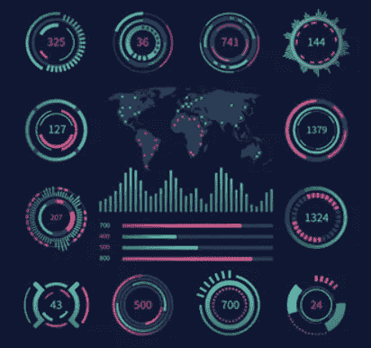
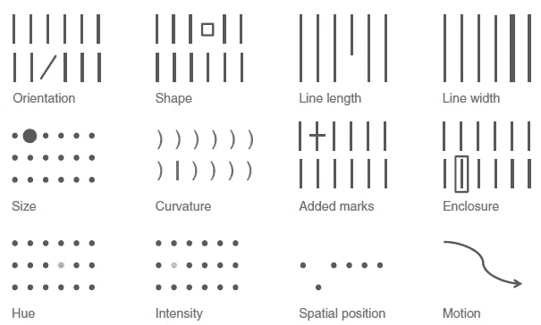
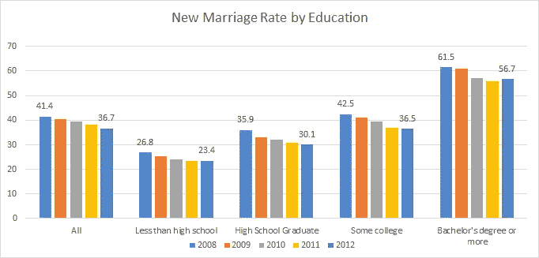
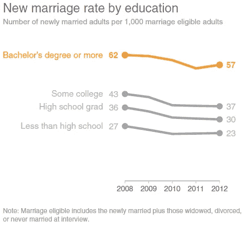
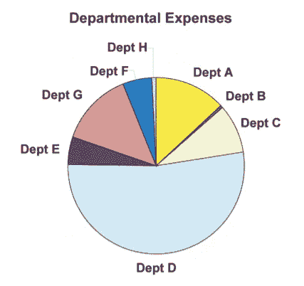
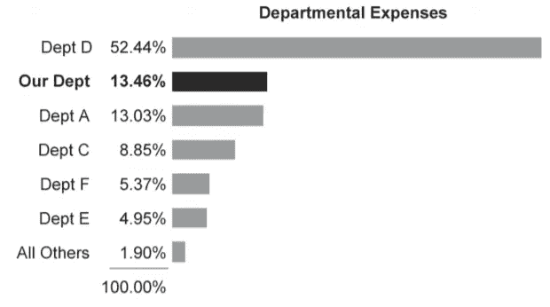
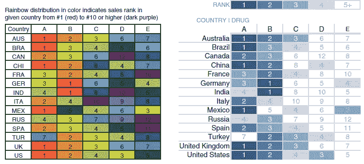
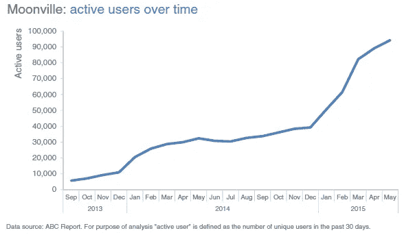
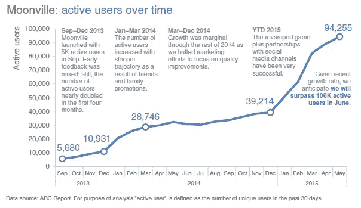

# 如何用一个更好的故事来呈现任何数据集？

> 原文：<https://medium.com/analytics-vidhya/how-every-data-set-deserves-to-be-told-better-into-a-story-cb5ff4874f0c?source=collection_archive---------33----------------------->

我们都在阅读，因为新冠肺炎，当前的锁定时间是如何最适合提升我们自己的技能。因此，我想写一篇关于数据可视化的文章，强调要关注的关键元素，并成为一个更好的故事讲述者。

来源:Whizlabs

*   **了解背景** —清楚地了解你正在与谁沟通，你需要他们知道什么或做什么，你将如何与他们沟通，以及你有什么数据来支持你的案例。运用“3 分钟故事”这样的概念(想象你只有三分钟时间告诉你的观众他们需要知道什么，你会说什么？)、[大创意](https://www.duarte.com/presentation-skills-resources/how-to-develop-the-best-big-idea-for-your-presentation/)和故事板来清晰地表达你的故事，并计划想要的内容和流程。
*   **选择合适的视觉显示器**——当突出显示任何数字时，简单的文本是最好的。 ***折线图*** 通常最适合连续数据。 ***条形图*** 非常适合分类数据，必须有零基线。让您想要显示的关系指导您选择的图表类型。**避免** ***馅饼*** ， ***甜甜圈*** ， ***3D-ones*** 和 ***辅助 y 轴*** 因视觉判读困难。展示你的视觉效果，突出一个要点，使其清晰明了。
*   **消除杂乱-** 找出那些不能增加信息价值的元素，把它们从你的视觉效果中移除。利用[格式塔原则](https://www.toptal.com/designers/ui/gestalt-principles-of-design)来理解观众是如何感知视觉的。战略性地使用对比。运用元素对齐和留白来帮助你的观众对你的视觉效果有一个舒适的体验。
*   **将注意力集中在你想要的地方——**利用预先注意属性的力量，如****大小*** 和 ***位置*** 来表示什么是重要的。使用这些战略属性来吸引你的观众的注意力，并通过你的视觉引导他们。通过应用“你的眼睛看向哪里？”来评估视觉中前注意属性的有效性测试。*

**

*吸引眼球的各种预先注意的属性(来自斯蒂芬·菲勒的《给我看数字》)*

*   ***像设计师一样思考—** 为你的观众提供视觉指导，作为如何与你的视觉化互动的线索:突出重要的东西，排除干扰，创建信息的视觉层次。通过不使设计复杂化并利用可视化工具中的文本来标注要素，使您的设计易于访问。设计思维最初是一门科学，但随着你越来越深入，它变得越来越艺术化。你也可以参加一些[设计思维研讨会](https://www.google.com/search?q=design+thinking+workshops&rlz=1C1GCEA_enIN864IN864&oq=design+thinking+workshops&aqs=chrome..69i57.226j0j4&sourceid=chrome&ie=UTF-8)，来学习这些概念。*
*   ***讲故事——**最后但同样重要的是，按照正确的顺序构思你的故事:*引言*、*问题*、*解决*和*高潮*(或号召行动)。利用冲突和紧张来抓住并保持你的观众的注意力。考虑你叙述的顺序和方式。利用重复的力量来确保你的故事坚持下去。使用类似[反向故事板](http://www.storytellingwithdata.com/blog/2013/12/reverse-storyboarding)的策略来寻求一个新的视角，并确保你的故事在你的交流中清晰地表达出来。*

> *有几个例子可以说明你的视觉效果可以是清晰的和面向行动的—*

*   *向你的听众展示最重要的要点*

**

*…在消除了一些视觉混乱并展示了最重要的见解之后…*

**

*   *为您的数据选择合适的可视化工具*

**

*…这样设计后，前面的图表可以更快地阅读…*

**

*   *使用正确的颜色搭配(彩虹是大自然创造的)。确保这对于色盲来说不是一个艰难的练习*

**

*   *用重要的面包屑引导你的观众*

**

*原始图表*

*…添加市场活动后…*

**

*希望，你喜欢这本书。如果你觉得这篇文章有帮助，请随意评论并鼓掌。*

> *额外阅读*

*一些免费的附加读物，我通常会参考以获得更多的想法:*

*   *[**热切的目光**](http://www.eagereyes.org) (罗伯特·科萨拉)*
*   *[**流动数据**](http://www.flowingdata.com) (Nathan Yau)*
*   *[**Policywiz**](http://www.policywiz.com) (乔恩·施瓦比什)*
*   *****(冯凯泽)*****
*   *****[**感知边缘**](http://www.perceptualedge.com) (斯蒂芬几)*****
*   *****[**用数据讲故事**](http://www.storytellingwithdata.com) (科尔·努斯鲍默)*****
*   *****[**可视化数据**](http://www.visualisingdata.com) (安迪·基尔克)*****
*   *****[**维兹威兹**](http://www.vizwiz.blogspot.com) (安迪·克里贝尔)*****