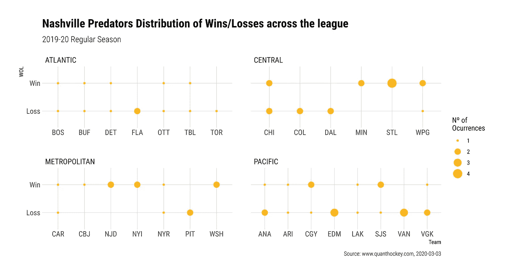
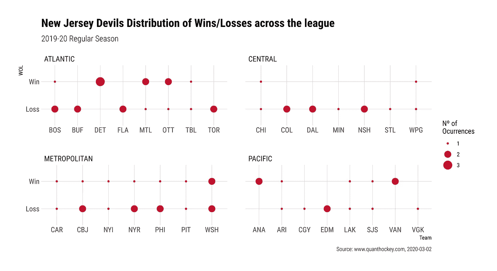
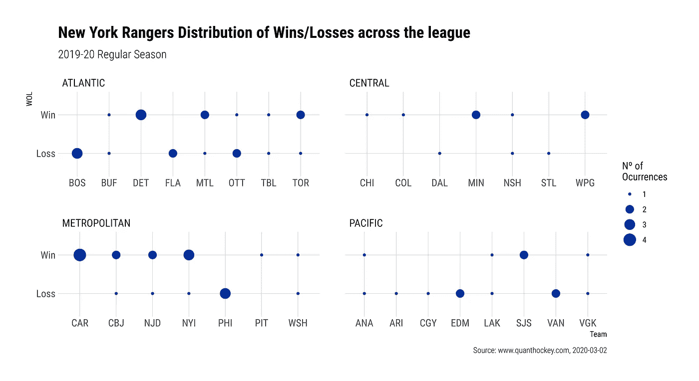

# 到目前为止每支 NHL 球队是如何得分的。

> 原文：<https://medium.com/analytics-vidhya/how-every-nhl-team-got-its-points-so-far-c41aa7613a8d?source=collection_archive---------6----------------------->

## 2019-20 常规赛各队战绩明细。

**常规赛**几乎只剩下一个月，我们将看到每一分是如何收集的，联盟中每支球队的胜败记录，扑救百分比以及 SV%和 SH%之间的相关性，*又名*。PDO。我将显示截至 2020 年 3 月 3 日的记录。

一个简单的解释，在计算盈亏的图表上，它认为加班和止损是亏损。因此，即使一个团队得到了“*失败者分数*”，也算失败。

# 阿纳海姆鸭队

```
Points:  60
PTS%:  0.462
Pace:  76
Overall:  26-31-8
Last 10:  4-5-1
```


# 亚利桑那郊狼

```
Points:  72
PTS%:  0.537
Pace:  88
Overall:  32-27-8
Last 10:  5-4-1
```


# 波士顿布鲁因斯

```
Points:  94
PTS%:  0.712
Pace:  117
Overall:  41-13-12
Last 10:  7-3-0
```


# 水牛刀

```
Points:  66
PTS%:  0.508
Pace:  83
Overall:  29-28-8
Last 10:  5-5-0
```


# 卡尔加里火焰

```
Points:  75
PTS%:  0.56
Pace:  92
Overall:  34-26-7
Last 10:  5-4-1
```


# 卡罗莱纳飓风

```
Points:  75
PTS%:  0.586
Pace:  96
Overall:  35-24-5
Last 10:  4-4-2
```


# 芝加哥黑鹰队

```
Points:  66
PTS%:  0.508
Pace:  83
Overall:  29-28-8
Last 10:  4-6-0
```


# 科罗拉多雪崩

```
Points:  87
PTS%:  0.669
Pace:  110
Overall:  40-18-7
Last 10:  7-2-1
```


# 哥伦布蓝色夹克

```
Points:  78
PTS%:  0.582
Pace:  95
Overall:  32-21-14
Last 10:  2-4-4
```


# 达拉斯明星队

```
Points:  81
PTS%:  0.623
Pace:  102
Overall:  37-21-7
Last 10:  6-2-2
```


# 底特律红翼

```
Points:  35
PTS%:  0.257
Pace:  42
Overall:  15-48-5
Last 10:  1-8-1
```


# 埃德蒙顿油工队

```
Points:  78
PTS%:  0.591
Pace:  97
Overall:  35-23-8
Last 10:  5-3-2
```


# 佛罗里达黑豹队

```
Points:  73
PTS%:  0.553
Pace:  91
Overall:  33-26-7
Last 10:  3-6-1
```


# 洛杉矶国王队

```
Points:  56
PTS%:  0.424
Pace:  70
Overall:  25-35-6
Last 10:  6-3-1
```


# 明尼苏达野生动物

```
Points:  71
PTS%:  0.546
Pace:  90
Overall:  32-26-7
Last 10:  6-3-1
```


# 蒙特利尔加拿大人

```
Points:  69
PTS%:  0.515
Pace:  84
Overall:  30-28-9
Last 10:  3-5-2
```


# 纳什维尔掠食者

```
Points:  72
PTS%:  0.554
Pace:  91
Overall:  32-25-8
Last 10:  6-3-1
```



# 新泽西魔鬼队

```
Points:  64
PTS%:  0.492
Pace:  81
Overall:  26-27-12
Last 10:  6-2-2
```



# 纽约岛民

```
Points:  78
PTS%:  0.609
Pace:  100
Overall:  35-21-8
Last 10:  3-5-2
```


# 纽约游骑兵队

```
Points:  74
PTS%:  0.569
Pace:  93
Overall:  35-26-4
Last 10:  7-3-0
```



# 渥太华参议员

```
Points:  58
PTS%:  0.439
Pace:  72
Overall:  23-31-12
Last 10:  5-4-1
```


# 费城传单

```
Points:  83
PTS%:  0.638
Pace:  105
Overall:  38-20-7
Last 10:  8-2-0
```


# 匹兹堡企鹅

```
Points:  80
PTS%:  0.625
Pace:  102
Overall:  37-21-6
Last 10:  3-6-1
```


# 圣何塞鲨鱼队

```
Points:  60
PTS%:  0.462
Pace:  76
Overall:  28-33-4
Last 10:  4-6-0
```


# 圣路易斯布鲁斯

```
Points:  88
PTS%:  0.667
Pace:  109
Overall:  39-17-10
Last 10:  7-2-1
```


# 坦帕湾闪电

```
Points:  87
PTS%:  0.669
Pace:  110
Overall:  41-19-5
Last 10:  6-4-0
```


# 多伦多枫叶队

```
Points:  78
PTS%:  0.591
Pace:  97
Overall:  35-23-8
Last 10:  6-4-0
```


# 温哥华加人队

```
Points:  74
PTS%:  0.569
Pace:  93
Overall:  34-25-6
Last 10:  4-5-1
```


# 维加斯黄金骑士

```
Points:  80
PTS%:  0.597
Pace:  98
Overall:  36-23-8
Last 10:  8-2-0
```


# 华盛顿首都

```
Points:  86
PTS%:  0.662
Pace:  108
Overall:  40-19-6
Last 10:  4-5-1
```


# 温尼伯喷气机队

```
Points:  72
PTS%:  0.537
Pace:  88
Overall:  33-28-6
Last 10:  4-5-1
```


# 结束语

波士顿有望以 117 分赢得总统奖杯，并领先坦帕(87 分)7 分，尽管在过去的 5 场比赛中输掉了 4 场，但自 1 月以来(20-6-1)已经取得了令人印象深刻的连胜。多伦多(78)，现在有 5 分的领先优势，在大西洋的第三位超过黑豹队，他们在过去的 10 场比赛中(3-6-1)。

企鹅队已经连续输了 6 场比赛，在大都会赛区排名第三，仅领先纽约岛民队和 CBJ 队 2 分(78 分)，后者在联盟中领先 7 分，是埃尔维斯·默兹利金斯的 5 分(多么好的发现)，今年只有大约 40%的机会进入季后赛。仅领先飓风队 3 分，流浪者队 4 分，但打了更多的比赛(67 场)。费城赢得了过去 10 场比赛中的 8 场，仅落后首都队 5 分(86 分)。

圣路易斯在西部领先科罗拉多 1 分(87 分)，科罗拉多在客场 9 连胜，与 NYR 并列赛季最佳。达拉斯以 81 分领先纳什维尔 9 分，在中部赛区排名第三。

在太平洋地区，拉斯维加斯黄金骑士队(80)赢得了过去 10 场比赛中的 8 场，现在领先手握一场比赛的石油人队和充满活力的双人组合麦克戴维和德雷赛特队 2 分(分别为 94 分和 107 分)。三支队伍接近第三名。温哥华有 2 场比赛在手的优势，仅落后卡尔加里(75)1 分，卡尔加里领先郊狼和温尼伯 3 分。这两个外卡名额被 5 个队争夺，最后一个是落后的明尼苏达野生 71 分，但只打了 65 场比赛。

# 感谢

我要感谢 quanthockey 公司的同事们和 T2 AV 队的同事们帮助我出版了这本书。