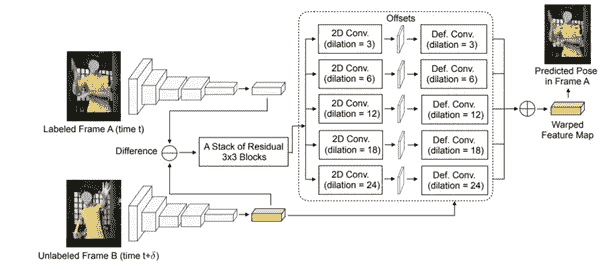

# 脸书人工智能如何使用该网络生成更多数据来训练姿势估计模型。

> 原文：<https://medium.com/analytics-vidhya/how-facebook-ai-used-this-network-to-generate-more-data-to-train-a-pose-estimation-model-339a45d09415?source=collection_archive---------21----------------------->

读者们好。这篇博客是对我目前在 Tensorflow 2.0 中实现的一篇研究论文的评价。我个人认为这篇论文的目的和发现值得与尚未阅读的读者分享。因此，在深入研究这篇能够生成更多数据来训练自身并提高其准确性的论文之前，我要感谢作者——**宾夕法尼亚大学的 Gedas Bertasius、Christoph Feichtenhofer、Du Tran、时剑波、Lorenzo Torre Sani——脸书·艾。**

用于姿态估计的深度神经网络中的现代方法需要大量密集注释。这意味着，如果你想训练一个用于姿态估计的神经网络，你将需要视频中大量手动标记的帧，这些帧带有你希望你的模型估计的点的坐标。这个过程非常昂贵，因为它需要手工劳动。现在，这就是论文中提出的网络前进的方向。本文命名为*pose warper 网络，能够仅借助于视频中的少量标记帧来标记视频中的帧。*

*为了训练，PoseWarper 网络输入相同视频的两个帧——一个标记的帧 **A** 和一个未标记的帧 B，它们之间仅相隔几步时间**。**现在，两个帧都被馈入网络( ***SimpleHRNet*** )，该网络生成热图 **f(A)** 和 **f(B)。**对于那些不熟悉 HRNet 的人来说，HRNet 是一个网络，它输入人的图像并输出热图(指定人的关节的标记图像)。有关 SimpleHRNet 的详细信息，请点击 [**此处**](https://github.com/stefanopini/simple-HRNet.git) 。为了更好地理解，请参考下图。*

**

*简单 HRNet 的输入和相应的输出*

*现在，在从**预训练的** HRNet 获得两个热图(f(A)，f(B))之后，开始 ***PoseWarper*** 网络的可训练区域。简而言之，该网络使用未标记帧 **B** 和标记帧 **A** 的热图，并计算两者的差异。(f(A)-f(B)=***φ***)。现在这个**φ**被发送到网络的可训练区域，该区域进一步用 **f(B)** 扭曲**φ**，并试图使其与标记为**帧 a**中的地面真实情况相匹配。这形成了网络的训练部分。这正是 PoseWarper 网络的目的:训练权重，以使在未标记帧 **B** 中估计的姿势与在标记帧**a**中的真实姿势相匹配。为了更清楚起见，请参考这个图示。*

**

*PoseWarper 的训练部分*

*使用稀疏标记的视频进行姿态检测的方法的高级概述。在每个训练视频中，姿势注释仅每 k 帧可用。在训练过程中，系统会考虑一对帧——一个标记的帧 A 和一个未标记的帧 B，并使用帧 B 的特征来检测帧 A 中的姿态。*

*在训练模型之后，我们感兴趣的是传递一些未标记的帧，并作为输出得到那些标记的帧。我们的目标是通过使用 PoseWarper 标记视频中未标记的帧来不断生成新数据，从而增加我们的训练数据集。下图显示了模型如何标记未标记的帧。*

**

*标记未标记的帧并同时生成更多数据*

*因为这篇文章的目的是提出本文中提到的想法，而不是实现细节。然而，为了更加清晰，我们可以考虑模型架构。下面是模型架构的图像。*

**

*模型架构*

*如果读者需要了解更多关于架构、实现细节、实验和模型能力的信息，他们可以随时在这里阅读研究工作**。***