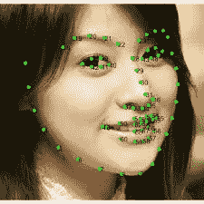
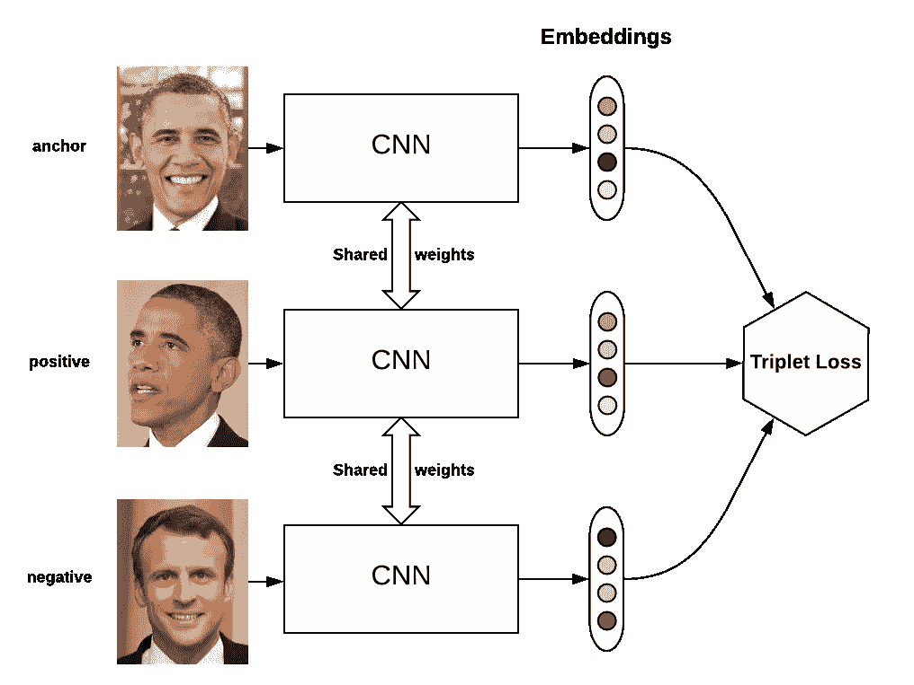
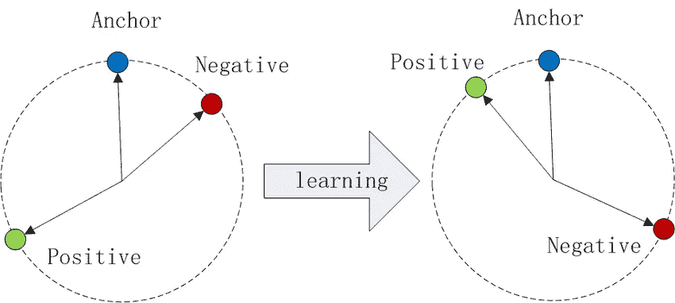

# 面部识别系统是如何工作的？

> 原文：<https://medium.com/analytics-vidhya/how-facial-recognition-systems-work-edcbb227e614?source=collection_archive---------9----------------------->

这个标题不需要介绍，每个人在日常生活中都遇到过这个术语。我们非常自由地使用这个术语，而不知道人脸识别算法的广泛应用。面部识别算法不仅仅局限于通过验证一个人的面部来开门，其应用广泛超出了安全领域。这些算法可以用来预测一个人的性别、年龄、种族，追踪失踪的人和宠物，帮助执法部门追踪世界各地的罪犯等等。

人类可以出色地完成识别人脸的任务，但让计算机或机器自动识别人脸迄今仍是一个难题。让我们了解一下面部识别软件的工作原理。

# 自动面部识别的流程

面部识别的任务分为 4 个步骤

*   人脸检测。
*   面部对齐。
*   特征提取。
*   认可/验证。

实现面部识别的传统系统将这 4 个步骤中的每一个都作为单独的模块，而现代面部识别软件根据系统的架构将这些步骤中的一些或全部合并到单个模块中。

## 人脸检测

第一步是识别图像或输入视频源中的一张或多张人脸。这个过程包括预测一个/多个面的位置&必须被定位的面的范围(边界框)。

人脸检测的任务类似于目标识别和检测，在这种情况下，要识别的目标类别只有人脸。

> 人类也首先检测视线中的面孔，仔细观察这些面孔以识别他们是某人或某物。我们的大脑处理这些信息的速度非常快，大约在几毫秒内&因此不能把它解释为两个不同的过程。

人脸检测算法必须是鲁棒的，因为这是人脸识别管道中的第一步。*“未被检测到的人脸，无法被识别”。*

由于人脸是高度动态的，其外观具有高度的可变性，该算法必须能够检测所有方向、角度、发型、肤色、年龄、化妆与否等等的人脸。

面部检测可以通过两种方式进行

1.  **使用特征描述符算法**

特征*检测器*算法获取输入图像&输出图像中重要区域的位置。例如，输出图像中边缘位置的边缘特征检测器，类似地，角检测器输出包括角的位置。除了它们应该检测的特征之外，它们不提供关于任何其他特征的信息。

一旦检测到特征，就可以提取特征周围的局部图像块。这种提取可能涉及相当大量的图像处理。结果被称为特征描述符或特征向量。特征描述符算法正是这样做的。

特征*描述符*是一种算法，它拍摄图像并输出*特征描述符* / *特征向量*。特征描述符将感兴趣的信息(特征)编码成一系列数字，并充当一种数字“指纹”，可用于区分一个特征与另一个特征。理想情况下，该信息在图像变换下是不变的，因此即使图像以某种方式被变换或者相同的特征出现在另一个图像中，我们也可以再次找到该特征。

**梯度方向直方图**或简称为 **HOG** 就是这样一种特征描述符，它被广泛用于检测面部识别管道中的面部。点击此[链接](https://www.analyticsvidhya.com/blog/2019/09/feature-engineering-images-introduction-hog-feature-descriptor/)了解更多关于 HOG 的信息。

简而言之， **HOG** 将图像划分为小的正方形单元(图像被划分为 **nxn** 正方形)分别计算每个正方形的直方图。通过计算每个单元中像素值的梯度&方向来创建直方图。

为了在 HOG 图像中找到人脸，所要做的就是从训练图像中找到看起来与人脸的已知 HOG 模式相似的图像区域。

特征描述符在实时检测对象时非常有效，但是当照明条件变化或者如果对象模糊或者如果面部的方向改变时，特征描述符具有局限性。这些限制可以通过使用基于卷积神经网络的检测器来解决。

2.**基于 CNN 的检测器**

基于预先训练的 CNN 的检测器可以用于定位图像中的面部。该网络根据不同场景下的个人或人群的图像进行训练。

这些可以在任何方向、光照条件下检测人脸&比 **HOG** 或 **SIFT 强得多。**

像 [YOLO](/analytics-vidhya/yolo-you-look-only-once-9af63cb143b7) 或[fast-RCNN](https://towardsdatascience.com/faster-r-cnn-for-object-detection-a-technical-summary-474c5b857b46)这样的物体检测算法可以被训练来检测人脸。

YOLO 网络被训练来检测人脸。

> MTCNN 是一种算法，其提供级联到单个网络中的面部检测和面部标志检测。

使用基于 CNN 的检测器的主要缺点是处理时间。计算和运行数十亿个参数需要相当长的时间，这对于实时来说是不理想的。一个强大的 Nvidia GPU 可以用来运行 CNN，但它非常昂贵。

## 面部对齐

人脸检测算法的输出是人脸所在的区域。在我们继续识别检测到的人脸之前，有必要对人脸进行中心对齐。

**为什么？**

如所讨论的，检测到的面部可能不总是人的正面轮廓。有时，检测到的面部可能仅仅是面部的左侧或右侧轮廓，或者面部可能倾斜或取向不同。为了使算法有效地提取特征，有必要将面部居中对齐。

为了对准面部，应用面部标志检测来检测面部上的关键标志。直觉是定位每个人脸上的标志，如眼睛、鼻子、眉毛、嘴唇。有两种广泛使用的标志检测算法，即 **68 点标志& 5 点标志**算法。

让我们理解使用 68 点标志算法的过程。

给定图像中检测到的面部区域，该算法为给定的面部识别 68 个不同的关键点或标志。这些包括内眼、外眼、上唇、下唇等，如上图所示。

现在，通过简单地旋转、缩放和剪切图像，我们已经获得了重要标志(如眼睛、鼻子、嘴)的位置，我们可以尽可能地将关键点/标志居中对齐。面部对齐的目标是变换图像，使得

*   人脸在图像中居中
*   旋转这些面，使眼睛位于一条水平线上(旋转后，眼睛位于同一 y 坐标上)
*   应该以这样的方式缩放，使得面的尺寸大致相同。

人脸对齐中使用的更优化和更快速的版本是 5 点人脸标记模型，该模型使用左眼上的 2 点、右眼上的 2 点和鼻子上的 1 点，或者眼睛上的 2 点、鼻子上的 1 点和嘴唇两侧的 2 点。

5 点标志比 68 点标志快 10%，模型比 68 点标志小 10 倍。如果任务只是对齐面部，5 点标志就足够了。

地标检测的应用并不局限于人脸对齐，而是扩展到人脸对齐之外。

*   Instagram/Snapchat 过滤器和微件。
*   睡意检测。
*   数字化妆
*   面部表情预测和面部姿态估计。

诸如读取面部表情的任务涉及分析面部上的多个点，68 点界标是最合适的&同样在困倦检测器的情况下，68 点界标为每只眼睛提供 6 点，为嘴部区域提供 20 点。

## 特征提取和人脸嵌入

这是任务的识别部分的开始。到目前为止，我们处理的是人脸的检测&如何对齐它们以便有效地提取特征。这是网络学会区分两张脸的部分。

人脸是动态的，在我们当中有着高度的可变性。就面部特征而言，每个人的脸都不同于另一个人。例如，眼睛、鼻子、眉毛的大小，头发的颜色，以及几个因素的组合。

这就提出了一个问题*哪种面部特征测量对识别最可靠？*是眼睛的大小、鼻子的大小，还是所有面部特征的组合？

事实证明，对我们人类来说似乎显而易见的测量对查看图像像素值的计算机来说没有意义。最佳策略是让计算机或深度学习网络找出最佳特征表示。

深度学习网络为给定人脸创建的特征表示称为**人脸嵌入**。

深度卷积神经网络被训练来为对齐的面部生成固定长度(128 或更多)的向量。这 128 个潜在向量对于它在训练数据集中遇到的每个人脸保持唯一。

**网络如何为每个人创造独特的载体？**

CNN 的训练是通过在每次迭代中查看 3 幅图像来进行的。这里，3 个图像中的 2 个是同一个人(比如说人 A) &另一个图像是另一个人(比如说人 B)。

*   加载 A 的训练图像(**锚图像**)。
*   加载 A 的不同训练图像(**正图像**)。
*   加载 B 的训练图像(**负像**)。

CNN 输出 3 幅图像的 3 个特征嵌入向量。

这就是神奇的地方，在**三重态损失函数中。**

三重损失估计**锚图像** & **正图像**的特征向量之间的误差(距离)，估计**正图像** & **负图像**的特征向量之间的误差。

**调整 CNN，使得锚图像的矢量&正图像之间的距离减小，而正图像的矢量&负图像之间的距离增大。通过这样做，网络为同一个人生成相似的面部嵌入。**

通过在成千上万不同人的数百万幅图像上训练网络，网络学习为不同的人输出不同的特征/嵌入向量。现在，经过训练的网络可以可靠地输出一个从未见过的人的特征向量。

已经训练了不同的网络来输出人脸嵌入&向量的长度取决于所使用的网络。使用的一些著名的 CNN 有 FaceNet，VGGFace，OpenFace，DeepFace 等。

人脸嵌入的应用不仅限于验证个人的身份&其范围远远超出了这个范围。人们可以预测一个人的年龄、性别、国籍等等。

## 识别面孔

最后，管道的最后一部分是确定人的身份。前一个模块是特征提取算法或 DNN，其输出表示人的图像的特征向量。一个人所要做的就是在数据库中识别人脸嵌入匹配的人的名字。

如所讨论的，由于人们每天的外貌变化或者人脸的方向不会每次都相同，所以人脸嵌入值也会变化，即同一个人的两个不同图像的人脸嵌入会不同，具有某种程度的可变性。

通过使用 SVM 分类器或任何其他聚类或分类算法，我们可以获得在数据库中找到的人脸嵌入的最接近匹配。

瞧……..

# 结论

我希望这篇文章对你有所帮助，请看看我的其他文章。感谢您的阅读！:)