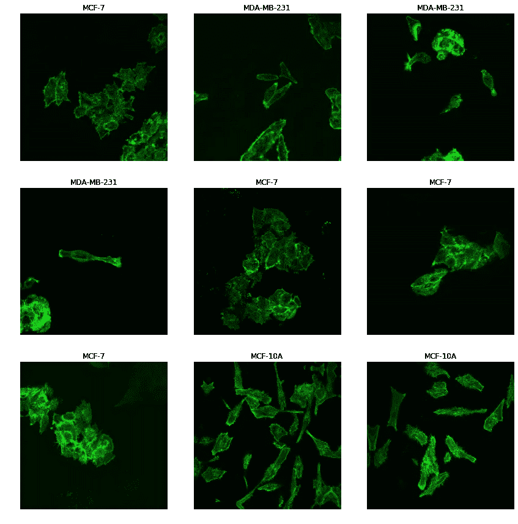

# fastai 如何让深度学习变得简单:使用 CNN 对癌细胞进行分类

> 原文：<https://medium.com/analytics-vidhya/how-fastai-makes-deep-learning-easy-classifying-cancer-cells-using-cnn-115520457733?source=collection_archive---------12----------------------->

这篇文章是为刚接触深度学习并正在寻找快速建立神经网络模型的人准备的。他们可能不一定来自数学或计算机科学背景，但有 python 经验，并对在自己的领域使用深度学习感兴趣。要知道在现实生活中，没有免费的饼干，深度学习也不例外，这一点很重要。是的，它如何工作的基础非常简单，但要真正理解深度学习，人们必须更深入地挖掘并超越基础。这可能很容易学，但是很难掌握。底线是，即使大多数在线课程或博客(包括这篇)可能会给你留下深度学习非常有趣和简单的印象，它只是为了激发兴趣，但人们应该永远记住，深度学习的核心是一件事，数学。

尽管如此，我们都需要从某个地方开始，所以我们不妨从利用像 **fastai** 这样的框架开始，来帮助我们快速实现神经网络，这样我们就可以可视化正在发生的事情，并直观地了解深度学习如何在我们自己的领域中帮助我们。

**定义正在解决的问题:**

由于我来自生物医学背景，我显然对理解深度学习如何影响医学研究和治疗的未来更感兴趣。当大多数人想到医学技术的未来时，他们会想象机器人进行手术或治疗方案的突破，但实际上最需要的是诊断领域的创新，特别是病理学领域的创新。即使在今天，大多数病理学家仍然在各个实验室之间运行带有组织或液体样本的载玻片进行咨询，并且严重依赖于通过光学显微镜进行人工载玻片观察。这样确实效率不高，容易出错。因此，自动细胞分类是一项重要而又具有挑战性的计算机视觉任务，对生物医学具有重大意义。

在这篇博客中，我们将尝试使用 [**fastai**](https://github.com/fastai/fastai) 库(感谢杰瑞米·霍华德和他在[**【USF】**](https://www.usfca.edu/data-institute)的团队)来构建一个图像分类器，它在分类任务中工作得非常好。我们将尝试复制杨玉久等人的工作。艾尔。在那里，他们提出了一种基于卷积神经网络(CNN)的方法，根据肌动蛋白丝组织对人类乳腺来源的细胞系进行分类。他们想要分类的细胞如下:

1.  正常乳腺上皮细胞系，MCF-10A(非侵袭性)
2.  乳腺癌细胞系，MCF-7(攻击性较低)
3.  MDA-MB-231(更具攻击性)

他们收集了总共 552 幅图像，其中每幅图像包含至少三个单独的细胞，从而产生了超过 1500 幅单独的细胞图像(每种类型的细胞大约有 500-600 幅单独的细胞图像)。具体来说，MCF-10A、MCF-7 和 MDA-MB-231 类分别包含 182、186 和 184 幅图像。这项工作的目标是在他们的数据集上训练一个卷积神经网络，并达到接近或接近最先进的结果。

**显示了由人类专家**执行的细胞分类任务的混淆矩阵

这篇博客文章展示了使用 Fastai + Pytorch 对他们的数据集进行的研究和分析，并作为参考、教程和开源资源提供给其他人参考。它并不打算成为严肃的临床应用的生产就绪资源。我们在这里使用的是原始高分辨率图像的低分辨率版本，用于教育和研究。这被证明是原型化和测试各种深度学习算法的有效性的有用基础。

在这篇博文中，我们将分三步解决这个问题:

1.  将数据加载到正确的格式
2.  创建我们的神经网络模型的实例并对我们的数据进行训练
3.  学习如何创建最终调整和调整以使模型更好

**加载我们的数据:**

在我们开始构建模型之前，重要的是我们要探索、准备和加载数据集，使之成为一种可以学习模型的格式。Fastai 附带了一个惊人的 ***data_block api*** ，它允许我们从不同的来源加载数据。在这篇文章中，我将使用下载并保存在不同文件夹中的图片。文件夹的名称作为我们图像的标签值，我们在一个名为 **classes** 的变量中指定。下面的代码显示了我们如何将图像加载到一种适合 CNN 模型的格式中。

然后我们可以检查我们的图像看起来如何

**创建我们的模型**

一旦我们正确地设置了 ImageDataBunch 对象，我们现在就可以将它和预先训练的 ImageNet 模型一起传递给 cnn_learner。下面一行实例化了我们将用来执行分类的模型。我们使用的 Resnet 模型将是 imagenet 数据库上的预训练模型。

在接下来的一行中，我们实际上继续前进并拟合模型。fastai 库的组织方式我们通常只需要在 3 件事情中做出决定来构建最简单的模型。

1.  模型架构(在我们的例子中，我们使用 ***resnet34*** )
2.  epoch(我们希望通过网络传递数据集的次数)
3.  学习率(决定步长的调整参数)

我们可以从 3 个纪元周期开始，看看我们的模型表现如何，我们得到以下输出

仅用 3 个周期，我们就设法得到小于 7%的误差，这已经比人类专家的表现更好了。我们可以查看混淆矩阵以了解更多信息。我们的模型在识别正常细胞系方面是好的，但是在分类 MCF-7 和 MDA-MD-231 方面仍然不好。

**微调我们的参数:**

尽管我们有一个很好的模型，但我们可以做得更好。通常对于没有计算机科学背景的人来说，这往往是我们通过使用我们的领域专业知识而真正发光的部分。我们要做的第一件事是获得被错误预测的数据图像，并查看与每个图像相关的概率值。通过查看图像，我们可以尝试并了解哪里出了问题，然后尝试一些纠正方法。请查看 fastai 文档以了解更多信息。使用 fastai 库，我们只用一行代码就可以得到这些错误分类的图像。

当我们查看错误分类细胞的图像时，我们没有看到任何明显的模式。当细胞聚集在一起时，它们可能会导致我们的模型对它们进行错误分类，但至少在我们的情况下不是这样，因为我没有看到任何明显的模式。

我们可以尝试旋转我们的图像或进行一些图像增强或数据增强方法，但这似乎没有必要。我们可以试着把我们的错误率和学习率对应起来。对于神经网络来说，学习率基本上是网络抛弃旧信念以接受新信念的速度。

如果一个孩子看到 10 只猫，它们都有橙色的皮毛，她会认为猫有橙色的皮毛，并在试图识别一只猫时寻找橙色的皮毛。现在她看到一只黑猫，她的父母告诉她这是一只猫(监督学习)。有了较大的“学习率”，孩子会很快意识到“橙色皮毛”并不是猫最重要的特征。学习率小，她会认为这只黑猫是离群的，猫还是橙色的。

因此，简而言之，选择正确的学习率可以帮助训练我们的模型来发现异常值。我们可以使用 fastai 库只用几行代码就可以做到这一点，并获得学习率。

我们只在 1 个周期内训练我们的模型，因此我们可以看到错误率在一个周期内是如何变化的。

我们可以看到，我们的损失函数显示学习率在 1e-5 到 1e-3 之间急剧下降。这意味着，如果我们训练我们的模型，保持学习率在这些学习率之间，它可能会提高其性能。

因此，我们再次拟合模型，但这一次为学习率设置了新的参数。我们的做法如下

我们只需要在我们的函数中指定另一个名为 max_lr 的参数，并将学习率的值放在我们注意到最急剧衰减的地方。

所以这一次，仅仅用了两个周期，我们就成功地获得了大约 98.2%的准确率。我们的模型可以有效地捕捉差异。唯一的不同是，这一次它设法错过了一个侵略性的细胞图像，并将其归类为正常的 MCF-10A。所以还是有提升的空间。

# 参考资料:

Oei RW，Hou G，Liu F，Zhong J，Zhang J，An Z，等(2019)利用细胞内肌动蛋白网络的显微镜图像进行细胞分类的卷积神经网络。PLoS ONE 14(3): e0213626。https://doi.org/10.1371/journal.电话:0213626

[fast.ai](https://www.fast.ai/) —程序员实用深度学习在线课程