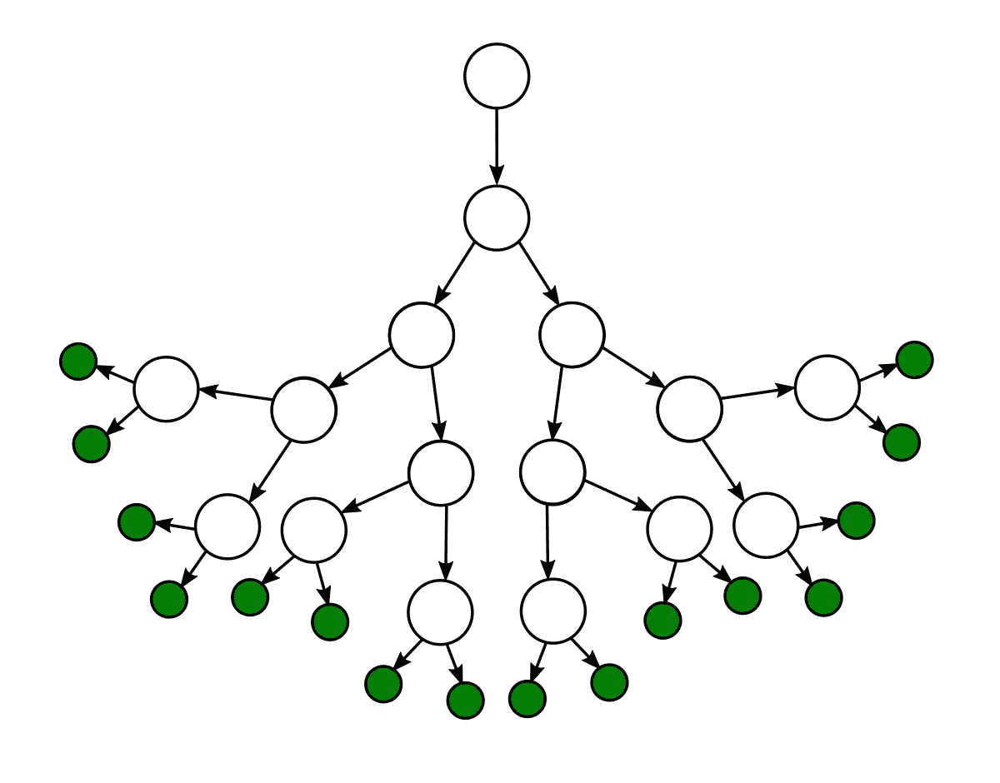
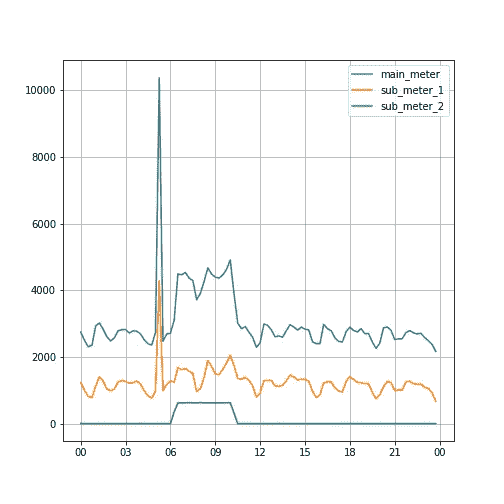
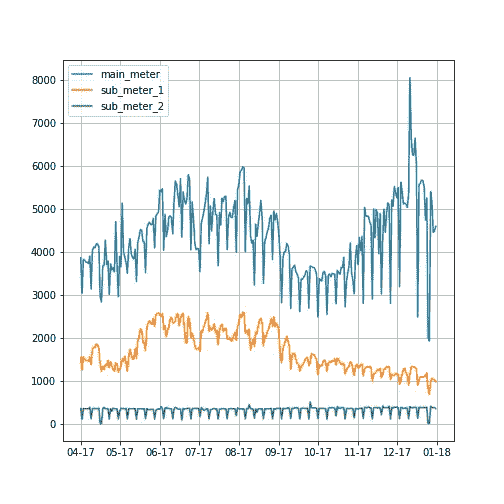
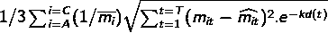
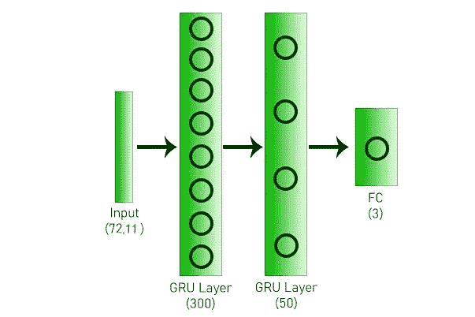

# 特征工程如何胜过算法

> 原文：<https://medium.com/analytics-vidhya/how-feature-engineering-trumps-algorithms-ef9eae6d95be?source=collection_archive---------12----------------------->

*我将在这里实际证明，无论选择何种用于预测的 ML/DL 算法，特征工程如果做得正确，都可以获得更好的准确性*

决策树。[来源](https://www.tidio.com/blog/flowchart-and-decision-tree-examples/)

# **数据集描述和方法**

我将使用一栋商业建筑的用电数据，其中包含一栋建筑从 2017 年 4 月到 2018 年 4 月的数据。该建筑包含 3 个仪表(主仪表和 2 个副仪表)。因此，每个算法有 3 个目标。此外，我们将使用特殊类型的 RMSE 度量来评估每个算法的结果。

> 在这篇文章中，我将尝试展示不同的功能集与 3 种不同的算法(如 XGBoost、LightGBM 和 GRU)在这个数据集上的表现。

安装必要的库后，我们将加载训练集(2017 年 4 月-12 月)和测试集(2018 年 1 月-4 月)。

加载数据集，并绘制 2017 年 4 月 1 日一整天的数据

我们可以从上面的图中看到，数据不是静态的，所有 3 米的使用都有突然的峰值和下降。因此，我选择使用 ML/DL 方法而不是统计模型进行预测。

我们现在将开始为前面提到的每种方法生成特征。

# XGBoost 的特性工程#1

正如我们从上面的数据图中看到的，从早上 6 点到下午 6 点有一个突然的消费高峰。我们可以围绕这一点建立一个类似“工作时间”的功能，这样我们的算法就可以理解在这个时期发生了一些特殊的事情。

2017 年 4 月 2 日的功耗

此外，我们可以看到，与工作日相比，周末(周日)的电力消耗相对较低，这是因为这是一座商业建筑。因此，我们也将为天构建特性。

这是给定训练期的**完整趋势**。我们可以看到，一年中存在某种季节性，如六月至八月期间和十一月至一月期间的功耗较高，而主电表读数中剩余月份的功耗较低。

因此，我们可以构建两个更多的功能，如“季节”和“月份”。

现在是我们构建上述特征并使用 XGBoost 回归器训练模型的时候了。

*注意:我已经调好了 XGBoost 的超级参数，为了代码清晰和切中要点，这里不再赘述。*

从上面的图中我们可以看到，我们的预测非常好，能够捕捉数据中的波峰和波谷。

我们现在将应用回归量来预测 2 个子米。

从上面的图中我们可以看出，至少在训练集上，我们能够以良好的精度预测亚米的值。

如前所述，我们将使用**加权 RMSE** 来评估所有 3 米的测试结果。此指标对较近的预测月份给予较高的权重，而对较远的未来预测数据给予较低的权重。

加权 RMSE

其中 A、B 和 C 分别表示主计量表、子计量表 1 和子计量表 2，

*   t 是特定建筑物的测试集中时间戳的总数，
*   t 是进行预测的时间戳，
*   k = (ln 2) / 100
*   d(t)是时间戳 t 所在的一天的值
*   m(it)是仪表 I 在时间步长 t 的实际值
*   Caret(m(it))是在时间步长 t 时仪表 I 的预测值
*   Bar(m(i))是仪表 I 的平均值—该值用于归一化

***我们用 XGBoost 对测试集的加权 RMSE 是 26.33***

# LightGBM 的特征工程#2

现在，我们将探索如果我们使用不同的特征集和不同的算法，我们的结果会是什么。

我们将构建一些新的功能，如每一行的一刻钟(0-3)，一天中的一小时(0-23)，一个月中的一天，一周中的一天，月初和月末指示器。此外，我们将根据层次结构汇总上述每个特性的目标值。这将给出每个数据点的汇总目标值。

《出埃及记》**2017 年 4 月 1 日 23:00** 的 building _ number _ day ofweek _ hour of day _ quartereofhour _ mean 将通过对 building_number=1、dayofweek=5、hourofday=23、quartereofhour=0 的所有目标值取平均值而得出

在这里，我们将看到循环特性的使用。使用正弦和余弦变换将一天中的小时转换为循环特征。这样做是因为它可以保存信息，例如 23 小时和 0 小时彼此靠近且不远。

> 类似地，我们还会将一刻钟、星期几和月几转换为循环特征。

*注意:我已经调好了 LightGBM 的超参数，为了代码清晰和切中要点，这里不再赘述。每个仪表的每个回归器将使用相同的参数。*

基于 LighGBM 的模型代码

***我们使用 LightGBM 对测试集的加权 RMSE 是 32.31***

# 与 GRU 合作的特色工程#3

在这最后一部分，我将用 GRU(门控递归单元)进行实验，这是一种特殊类型的递归神经网络，它解决了标准 RNN 的消失梯度问题。GRUs 使用遗忘门和重置门来记住过去的序列。

这里使用的人工神经网络架构

我将添加一个采用二进制值的公司特性。对于工作时间(上午 8 点到下午 8 点)，该值将设置为 1，对于休息时间，该值将设置为 0。此外，我们将构建一个热编码形式的星期几功能。

我尝试了 GRU 模型的不同配置，我两种都尝试过，为每栋建筑的每一米训练单独的模型，还有一个通用的建筑特定模型。我发现，通用的建筑智能模型比针对每一个仪表的单独模型更好地预测了所有三个仪表的读数。

基于 GRU 模型的代码

***我们用 GRU 为测试集的加权 RMSE 是 29.93***

这总结了我对不同类型的 ML/DL 模型使用的不同特征集的实验结果。我们可以清楚地看到，具有 XGBoost 的特征工程集#1 给出了 3 个集中的最佳预测。集合#2 包含更多样的特征集合，但是不知何故它不能给出最低的误差。

> 有时，我们需要构建更简单的特征，但可以尽可能多地解释数据中的差异，这有助于模型更有效地学习。

一些特性可能有数学上的意义，就像在集合#2 中看到的(循环和聚集特性)，但是可能没有你期望的那么强大。

> 这是一个反复试验的游戏，用不同的 ML/DL 技术尝试不同的特性组合。然后满足于给你最好的准确性或最低的误差。

*我希望你喜欢这个帖子和有趣的收获。上述解决方案可能并不完美，但总有改进的空间。像你一样，我也是数据科学的学习者和实践者，我总是乐于接受反馈，所以请随意在下面发表评论，我将尝试相应地改进方法。*

*免责声明:第 2 节和第 3 节中的代码和想法是从我参加的黑客马拉松的参与者那里得到的灵感，我是前 3 名获奖者之一。*