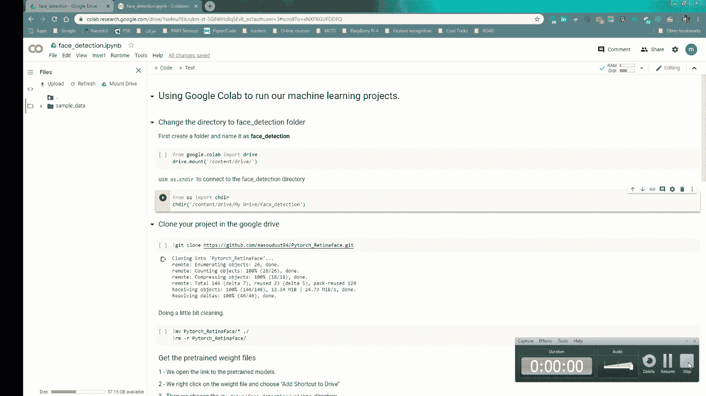

# Google Colab 如何帮助我在远程工作且没有 GPU 的情况下加快视频处理任务的速度。

> 原文：<https://medium.com/analytics-vidhya/how-google-colab-helped-me-to-speed-up-my-video-processing-tasks-during-quarantine-62641dc3b325?source=collection_archive---------12----------------------->

照片由[拉杰什瓦尔·巴楚](https://unsplash.com/@rajeshwerbatchu7?utm_source=unsplash&utm_medium=referral&utm_content=creditCopyText)在 [Unsplash](https://unsplash.com/?utm_source=unsplash&utm_medium=referral&utm_content=creditCopyText) 拍摄

在今天的帖子中，我想向你展示我们如何简单地在 google colab 上运行人脸检测程序。

# **动机**

几天前，我国许多公司(包括我的公司)决定对员工采用远程工作政策，以减少他们对冠状病毒感染的担忧。嗯，远程工作确实很棒，但对我来说也有一些缺点:

*   许多人呆在家里，当然也使用他们的电话互联网(主要是 Instagram)。我通过笔记本电脑上的 hotspot 分享我的手机数据(你已经猜到接下来会发生什么了！).所以我经常忍受工作中的滞后和脱节。我现在真的很怀念办公室的免费快速上网！
*   我的工作是处理视频和预训练网络，它们都很重，每个都超过 300 MB。我经常需要从我公司的服务器上下载或上传视频来检查我的视频结果。通过 VPN 连接将文件传输到办公室(通常带宽较低)给服务器带来了很大压力(这也增加了我同事连接的延迟)。
*   最后也是最重要的，我有一台没有 GPU 计算支持的笔记本电脑(这是最痛苦的情况！).我不得不等了很久(真的！)对于 pytorch/tensorflow/keras/…中的我的模型，来训练或准备输出视频。

所以我必须想办法解决这些问题。在[这里](https://stackoverflow.com/questions/60703371/how-to-be-able-to-import-every-file-in-a-folder-in-google-drive)我在 stackoverflow 上问了一个问题后，突然想到用 google colab。它为我提供了以下优势:

*   无需在本地机器上下载大量文件。也可以在虚拟机上完成。它还提供了显示在线视频结果的工具。
*   没有互联网和快速下载/上传的限制(我可以使用`wget`命令从任何链接获取任何文件)。
*   也可以在多个驱动器中存储多个数据集。每当我想处理特定数据集时，我可以挂载任何驱动器。
*   当然，谷歌提供的 GPU 或 TPU 是使用这项服务的最重要原因。(爱你谷歌！)

这是为着急的人准备的 [github 库](https://github.com/masouduut94/Pytorch_Retinaface)。我将教程分为 7 部分，并为每一部分提供了教程 gif。

# **1)第一步:创建 Colab 文件**

在你的 google drive 中创建一个文件夹，命名为“face_detection”。然后在 google drive 中安装 google colaboratory 后，右键单击 google drive 并选择创建新的 google colaboratory 文件，该文件与系统上的 jupyter 笔记本文件具有相同的文件扩展名。然后将文件重命名为 face_detection。

创建 google 协作文件

# **第二步:设置运行时类型**

现在，您必须单击 runtime 选项卡并选择 change runtime type。选择 GPU 或 TPU 来加速进程。

将运行时类型更改为 GPU

# **第三步:安装谷歌硬盘**

为了能够安装 google drive，我们使用以下代码([参考](https://stackoverflow.com/questions/60703371/how-to-be-able-to-import-every-file-in-a-folder-in-google-drive/60706508)):

然后，google 处理认证步骤并安装驱动器。现在您可以将目录更改为`face_recognition`目录。

安装 google drive

# **第四步:克隆人脸检测库**

是时候克隆你的项目来驱动了。在我的例子中，我使用我的`RetinaFace`库，它是一个快速且极其精确的人脸检测程序。你可以在这个[链接](https://github.com/masouduut94/Pytorch_Retinaface)里找到。

使用此命令克隆存储库。如您所知，在 jupyter 笔记本中，可以通过在命令开头使用`!`来使用终端命令:

然后我用这个命令进行了一点文件夹管理。我只是将`Pytorch_Retinaface`目录中的每个文件移动到它的父目录中，然后删除它。

克隆 retinanet 人脸检测库

# **第五步:从另一个 google drive 获取预训练的重量。**

现在正如在 [github 库](https://github.com/masouduut94/Pytorch_Retinaface) readme 文件中提到的，我们必须得到预训练的模型来运行程序并得到合理的结果。我们打开链接，右击名为`Resnet_50_Final.pth` 的文件，将文件添加到`My Drive/face_detection/weight` 目录。对我来说，这里最酷的事情是不需要用终端下载、上传和额外的拷贝粘贴，只需点击几下就可以完成。这与我在办公室的日常工作正好相反，我不得不花很长时间来下载大文件。
查看以下 gif 文件，获取视觉指南。

从链接中获取预训练的模型权重，并将其添加到我们的项目文件夹权重中。

# **步骤 6:获取运行算法的视频(如有必要)**

你可以使用`wget` 方法来获得你的测试文件。我在 Coverr.com 找到了视频文件，并把链接复制粘贴到了笔记本上。然后使用下面的代码下载视频:

我当然装不下这个环节。现在，我使用下面的代码准备上传文件夹中的输入视频，并删除多余的文件:

为人脸识别过程设置视频文件

# 第 7 步:运行 face_detection_server.py 文件

最后一部分是运行此命令来启动人脸检测的视频处理:

出于项目目的，还可以调整其他参数，但是这里我们需要的只是输入文件夹。处理后，输出文件将保存在公共目录中。

检查输出结果

最后，我真的希望这些提示和技巧对你有用，特别是如果你是远程做机器学习项目的另一个受害者。
当我享受远程编码的时候，我意识到远程工作还有另一个缺点，那就是你如何找到做饭的方法(再也没有办公餐了！).不幸的是，谷歌没有烹饪在线食物的 API！