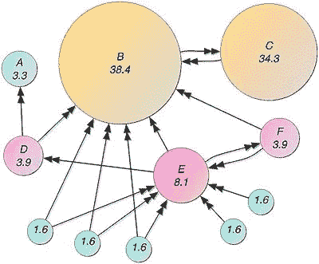
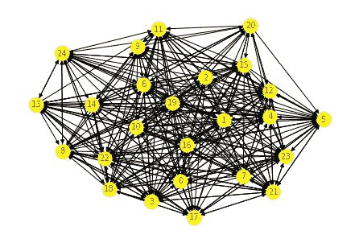

# 谷歌搜索是如何工作的？使用 Python 的页面排序算法

> 原文：<https://medium.com/analytics-vidhya/how-google-search-works-page-rank-algorithm-using-python-9643d9c9a981?source=collection_archive---------1----------------------->


谷歌搜索引擎

PageRank (PR)是谷歌搜索使用的一种算法，用于在其搜索引擎结果中对网站进行排名。PageRank 是以谷歌创始人之一拉里·佩奇的名字命名的。PageRank 是衡量网站页面重要性的一种方式。根据谷歌的说法:

PageRank 的工作原理是通过计算一个页面的链接数量和质量来粗略估计该网站的重要性。潜在的假设是，更重要的网站可能会从其他网站收到更多的链接。

> 它不是谷歌用来排序搜索引擎结果的唯一算法，但它是该公司使用的第一个算法，也是最知名的算法。

# 使用 python 的 Page Ranker 算法:-



1.  谷歌的每个网页都被存储为一个图中的一个节点
2.  链接/指向其他节点的每条边都是该网页中的超链接
3.  基于这一点，图表看起来就像上面说明的图像
4.  截至目前，活跃网站的数量接近 **1，769，486，964。**所以会有数十亿个节点与图相连。出于实现的目的，我使用了 25 个节点。将有数万亿条边连接到谷歌使用的图形。
5.  所以首先让我们为这个实现导入必要的库

```
import networkx as nx
import numpy as np
import pandas as pd
import matplotlib.pyplot as plt
import operator
import random as rd
```

6.现在使用 networkx 库生成一个有 25 个节点的图。这里我们将概率设置为 0.6，这是一个图中两个节点之间有边的概率。

```
# created a directed graph
graph=nx.gnp_random_graph(25,0.6,directed=True)#draw a graph
nx.draw(graph,with_labels=True,font_color='red',font_size=10,node_color='yellow')#plot a graph
plt.show()
```

生成的输出图如下所示:



生成的图形

7.现在让我们存储特定节点的节点和邻居的数量，这将是算法的进一步实现所需要的。

```
#number of nodes for graphcount=graph.number_of_nodes()#graph neighbours of a node 1print(*list*(graph.neighbors(1)))
```

上述单元的输出是:

```
[2, 3, 4, 5, 6, 10, 11, 12, 13, 15, 16, 17, 18, 19, 20, 21, 23, 24]
```

8.现在，我们需要从一个随机节点开始，遍历它的邻居节点并增加分数，从而为每个节点生成一个随机遍历分数。现在为了实现，我重复这个过程 500000 次。

```
#Page Rank Algorithm-Calculating random walk score#initialising the dictionary which contains key as node and value as random walk scorerank_dict={}# taking a random node as the starting node:x=rd.randint(0,25)#Setting random walk score of each node to zerofor j in range(0,25):
  rank_dict[j]=0#Incrementing score of starting noderank_dict[x]=rank_dict[x]+1#iterating process for 50000 times and updating scorefor i in range(500000):
  #storing list of neighboring nodes in list
  list_n=*list*(graph.neighbors(x))
  #if length of list is zero then taking another node and process starts
  if(len(list_n)==0):
    x=rd.randint(0,25)
    rank_dict[x]=rank_dict[x]+1 #else choose any node from the list and continue the process by updating score to that node
  else:
    x=rd.choice(list_n)
    rank_dict[x]=rank_dict[x]+1
print("Random Walk Score Updated")
```

8.一旦我们得到了存储在字典中的分数，我们需要通过将随机漫步分数除以迭代次数来标准化分数。

```
#normalising valuesfor j in range(0,25):
  rank_dict[j]=rank_dict[j]/500000
```

9.现在让我们通过使用 networkx 库中的内置函数 pagerank 来获得该图的随机分数，并根据分数对获得的字典进行排序。

```
#Page rank by networkx library
pagerank=nx.pagerank(graph)#sorting both dictionaries based on items
pagerank_sorted=sorted(pagerank.items(),key=*lambda* v:(v[1],v[0]),reverse=True)
```

10.现在对我们用算法生成的字典进行排序并存储。

```
#sorting the rank_dict based on valuesrank_dict_sorted=sorted(rank_dict.items(),key=*lambda* v:(v[1],v[0]),reverse=True)
```

现在，让我们比较两个结果:-

```
#display the order
print("The order generated by our implementation algorithm is\n")for i in rank_dict_sorted:
  print(i[0],end=" ")
print("\n\nThe order generated by networkx library is\n")
for i in pagerank_sorted:
  print(i[0],end=" ")
```

11.输出是:-

我们的实现算法生成的顺序是

22 11 23 10 3 6 18 14 5 21 19 15 13 8 0 4 9 17 24 1 12 16 2 7 20

networkx 库生成的顺序是

22 11 23 10 3 6 18 5 14 21 19 15 13 8 4 0 9 17 24 1 12 16 2 7 20

几乎是一样的。

# 结论:-

这样，谷歌搜索排名就是靠页面排名算法来工作的。

如果你想在源代码方面得到更多的帮助，你可以查看下面的要点

谢谢你。