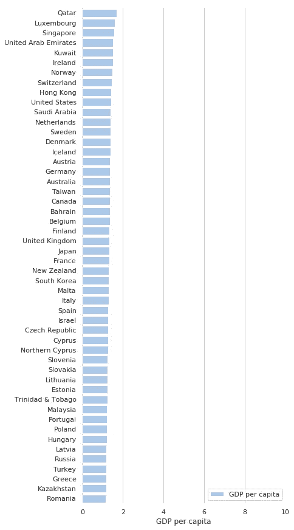
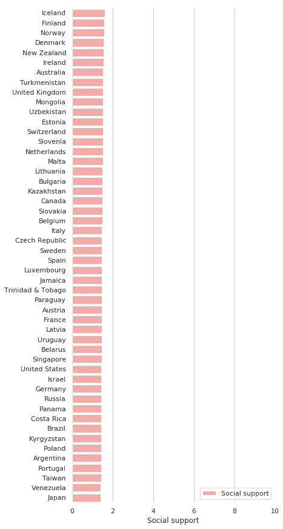
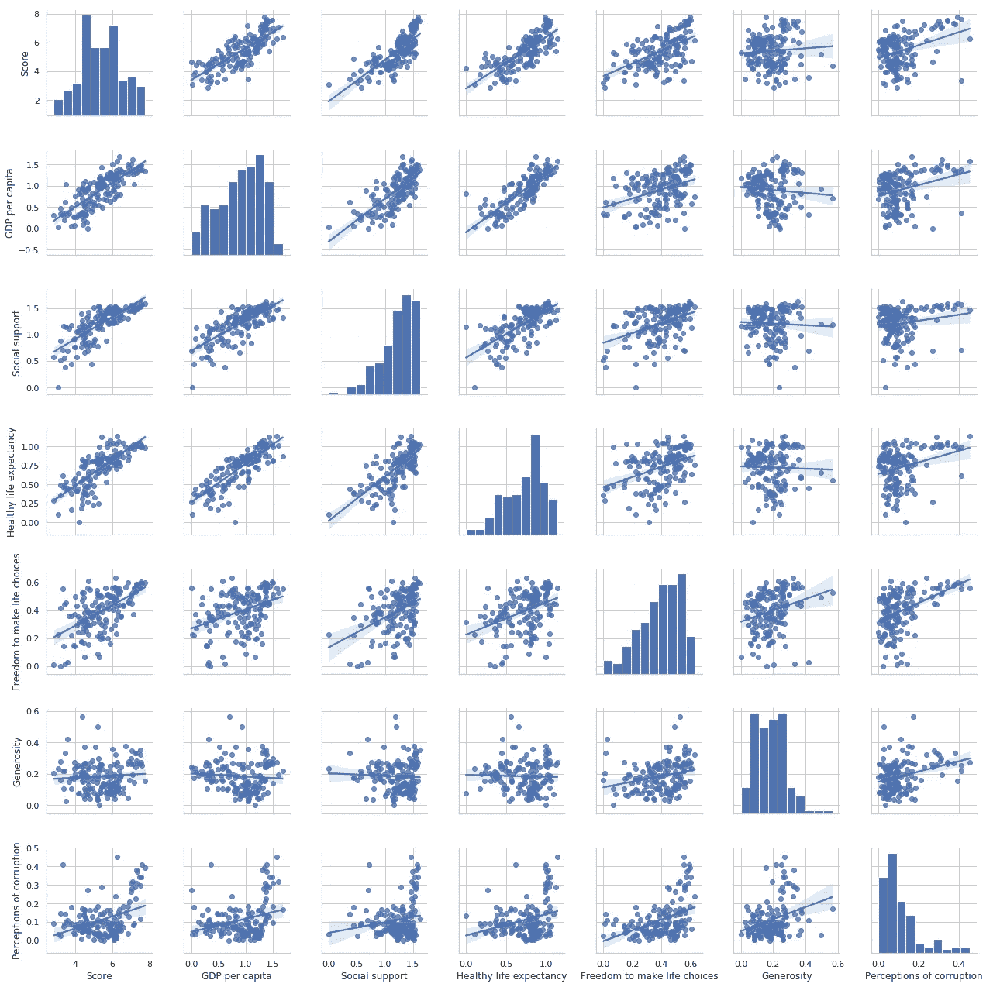
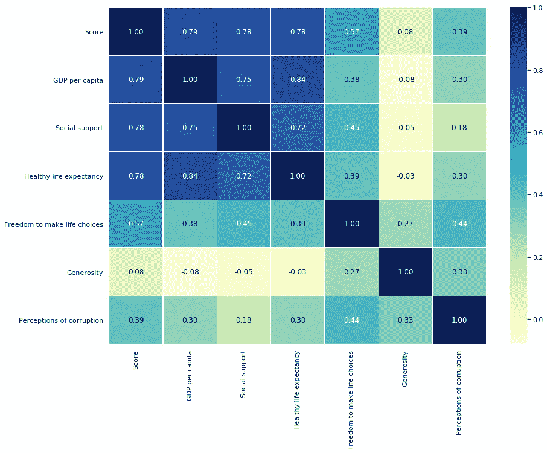

# 你今天在这个世界上有多幸福？

> 原文：<https://medium.com/analytics-vidhya/how-happy-are-you-in-the-world-today-4381c09e2b?source=collection_archive---------33----------------------->

[出发地:www.psychologies.co.uk](http://www.psychologies.co.uk)

# 介绍

韦氏词典可以把幸福仅仅描述为“a:一种幸福的状态，其特征是从满足到极度喜悦的各种情绪；b **:** 愉快或满意的经历。

还是那句话，真正决定一个人幸福程度的是什么？根据詹妮弗·艾克等人的*快乐心理学*研究表明:

“我们持久的**幸福水平** (H)是由我们的幸福设定点、生活环境(受气质和性格方面的影响，如抑郁和睡眠质量)以及有意或自愿的活动(V)决定的。马丁·塞利格曼提出了一个幸福方程式:

H = S + C + V

此外，Sonja Lyubomirsky 是快乐领域的杰出研究者，也是《快乐的方式》一书的作者，她将百分比与这些因素联系起来。她提出，我们的“设定点”，或者由出生或遗传决定的幸福水平，占幸福的 50%；婚姻状况、收入和长相等因素决定了 10 %;我们其余的快乐来自于我们能改变快乐水平的日常活动或事情。"

由*可持续发展解决方案网络*推广的**世界幸福报告**回顾了当今世界的幸福状况，并展示了新的幸福科学如何解释个人和国家在幸福方面的差异。根据可持续发展解决方案网络，这些分数是基于对民意调查中主要生活评价问题的回答。这个被称为**坎特里尔阶梯**的问题，要求回答者想出一个对他们来说最好的生活是 10 分，最差的生活是 0 分的阶梯，并在这个等级上给他们自己目前的生活打分。

**六大因素**:

*   经济生产，
*   社会支持，
*   预期寿命，
*   自由，
*   没有腐败，以及
*   慷慨

有助于提高每个国家的生活评价，使其高于反乌托邦国家的生活评价。反乌托邦国家是一个假想的国家，在六个因素中，每个因素的值都等于世界上最低的国家平均值。它们对每个国家报告的总分没有影响，但它们确实解释了为什么一些国家的排名比其他国家高。六个因素和残差提供的数据构成了幸福系数。

2017 年、2018 年和 2019 年的数据涵盖 156 个国家，每个国家的样本量超过 3000 个。

鉴于幸福对我们健康的重要性，我有兴趣了解以下信息:

*   哪些国家的总体幸福度和六大幸福因素中的每一项排名最高？
*   六个因素对总分的影响程度和关联程度如何？
*   哪些因素与幸福指数更相关？

为此，我们将使用从可持续发展解决方案网络 Kaggle 的数据库中检索的数据库。

我为实现这些目标所采取的程序和方法在其他地方，在这个[链接](https://github.com/joanamdsantos/world_happiness)中介绍。

# 第一部分。幸福指数排名最高的国家和每个因素

## 幸福分数

芬兰在 2019 年获得了最高的整体幸福分数，其次是北欧的许多邻国。不断变化的大陆，新西兰和澳大利亚，以及加拿大和其他欧洲国家，如奥地利和瑞士。

等级可以在图 1 中观察到。与幸福得分相关的六个因素是经济生产、社会支持、预期寿命、自由、没有腐败和慷慨，所以让我们看看最高的排名和相关性。

图一。2019 年幸福得分前 50 名。

## 人均国内生产总值

图二。GDP 得分最高的前 50 名。

国内生产总值是一个与收入相关的变量。如前所述，它有助于幸福这一事实通常是主观的。正如我们从图 2 中所观察到的，卡塔尔、卢森堡和阿联酋的人们更看重他们生活的国家的富裕和他们的幸福。

## 社会支持

社会支持是指家庭和在爱、教育和经济方面提供的支持。图 3 显示，幸福指数最高的国家再次出现在社会支持排名的首位。由此，我们可以推断家庭是幸福的一个重要因素。

图 3。社会支持得分前 50 名。

## 健康预期寿命

预期寿命是一个与健康生活相关的因素，通常是指饮食、财务稳定性以及与特定国家的生活方式相关的其他因素。从这个意义上说，排名最高的国家是新加坡、香港、日本和西班牙，这些国家的预期寿命非常高。

## 做出人生选择的自由

做出生活选择的自由主要是民主国家给予的礼物。作为幸福的一个因素，也是主观的。各国获得的数据大多相似，乌兹别克斯坦也是如此。柬埔寨、挪威、阿联酋和芬兰。

## 慷慨

根据对慷慨因素得分最高的前 50 名的分析，与其他因素相比，除了对腐败的看法之外，对整体幸福的贡献较低。认为慷慨是幸福因素的国家有缅甸、印度尼西亚、海地、马耳他和肯尼亚，这可能是由于特定宗教的观念。

# 对腐败的看法

像慷慨一样，对腐败分数的感知对幸福分数的贡献较小。尽管如此，价值观较高的国家认为，感知腐败是他们幸福的一个相关因素，是需要预防或打击的事情。得分最高的国家是新加坡、卢旺达、丹麦、芬兰和新西兰。

# 第二部分。这些因素与幸福指数的相关性

给定每个因素获得的分数，分布的图形表示以及它们和幸福分数之间的相关性如图 4 所示。

图 4。分布和相关矩阵。

这些图表明，除了分数似乎遵循正态分布之外，所有六个因素都呈偏态分布。右倾代表慷慨和腐败，左倾代表其他。这表明，对于大多数国家和幸福的平均分数来说，与其他国家相比，这些因素的值较低。

在幸福指数中，自由、健康和社会支持最受重视。尽管偏离了正态分布，但幸福指数似乎与国内生产总值、社会支持和健康预期寿命更相关。对变量进行的正态分布测试证实了快乐分数是唯一遵循正态分布的分数(数据未显示)。

为了查看因素和总得分之间的相关性，图 5 中显示了一个热图，其中显示了获得的相关值。在没有任何转换的情况下，可以观察到 GDP、社会支持和健康预期寿命因素与幸福得分高度相关，其值在 0.78 和 0.79 之间。

图 5。相关矩阵热图。

同样如图 4 所示，分数和慷慨度之间的相关性几乎为零，这意味着它不会影响快乐分数。对腐败的看法与幸福指数有轻微的关联。

热图还显示了高度相关的因素:国内生产总值、社会支持和健康预期寿命。健康预期寿命与 GDP 的相关系数达到 0，84。

# 结论

由可持续发展解决方案网络开发的世界幸福调查是评估世界各地人民幸福的里程碑，并显示了新的幸福科学如何解释个人和国家在幸福方面的差异。

这些分数是基于调查中被称为**坎特里尔阶梯的主要生活评价问题的答案。A** 让受访者想出一个阶梯，其中对他们来说最好的可能生活是 10，最差的可能生活是 0，并在这个等级上给他们自己的当前生活打分。

六个因素:经济生产、社会支持、预期寿命、自由、无腐败和慷慨使得每个国家的生活评价都比在**反乌托邦**中的高，反乌托邦是一个假设的国家，在六个因素中的每一个方面，它的值都等于世界上最低的国家平均值。它们对每个国家报告的总分没有影响，但它们确实解释了为什么一些国家的排名比其他国家高。六个因素和残差提供的数据构成了幸福系数。

鉴于幸福对我们福祉的重要性，我使用了 2019 年调查的数据来回答关于分数和国家以及它们之间的相关性的问题。结果可能是:

*   芬兰在 2019 年获得了最高的整体幸福分数，其次是北欧的许多邻国。不断变化的大陆，新西兰和澳大利亚，以及加拿大和其他欧洲国家，如奥地利和瑞士。
*   幸福得分与 GDP、社会支持和健康预期寿命的相关性更大，而得分和慷慨度几乎为零，这意味着它不影响幸福得分。对腐败的看法与幸福指数有轻微的关联。
*   研究还显示，存在高度相关的因素:国内生产总值、社会支持和健康预期寿命。

这些研究是理解我们所生活的世界的幸福的一个重要途径。

你呢？你在今天的世界上快乐吗？