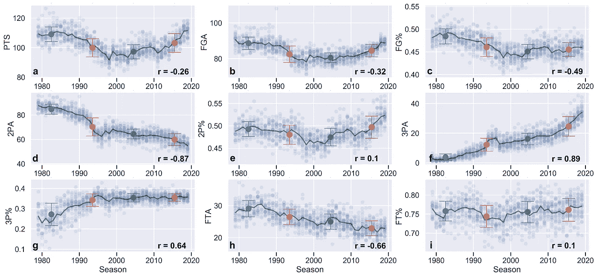
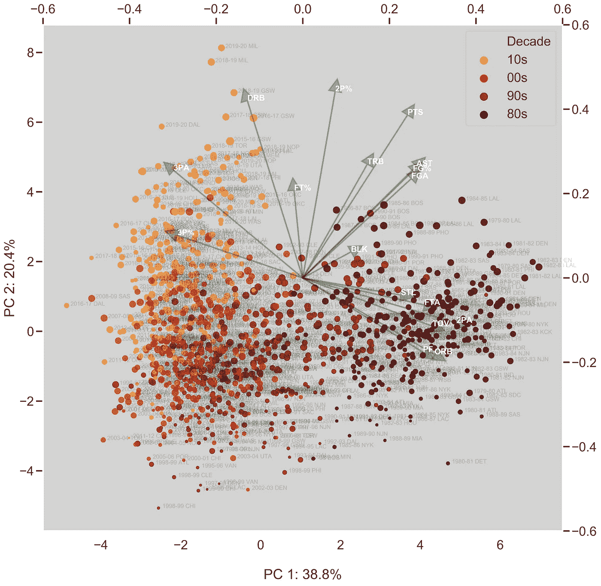

# 在过去的 40 年里，NBA 发生了怎样的变化？

> 原文：<https://medium.com/analytics-vidhya/how-has-the-nba-changed-in-the-past-4-decades-cbdf3f0387b7?source=collection_archive---------1----------------------->

> 自从 1979-80 赛季引入三分线以来，美国国家篮球协会(NBA)已经发生了变化。一开始，球队不情愿地投三分球，而今天，像斯蒂芬·库里和詹姆斯·哈登这样的球员正在领导一场“三分革命”。篮球从一个“大家伙”的游戏变成了一个没有位置的运动，基于空间和远距离投篮。但是这些数据说明了什么呢？他们是同意还是表现出别的什么？

## 本文末尾有一个常规的 PCA 图。如果你愿意，你可以在下面的链接中看到它的互动版本。

 [## PCA _ 交互式

### 带有下拉菜单和滑块的交互式 PCA 图。

nskyllas.github.io](https://nskyllas.github.io/PCA_interactive/) 

# 结果

图 1:1979 年以来所有 NBA 球队得分相关统计类别的时间序列:a)PTS，b) FGA，c) FG%，d) 2PA，e) 2P%，f) 3PA，g) 3P%，h) FTA 和 i) FT%。黑线代表每年的平均值，彩色圆点和误差线代表每十年的平均值和标准差，蓝色圆圈代表各个团队。每个类别与时间(NBA 赛季)的相关系数绘制在每个子图的底部。

在整个 80 年代，BA 队每场比赛的得分接近 110 分(图 1a)，这一数字在最近几年再次达到(111.5)。在此期间，得分持续下降(90 分),直到在 00 分之前达到低于 100 分的最小值。同样的模式也适用于投篮命中率(图 1b，得分相关系数= 0.79)、投篮命中率(图 1c，得分相关系数= 0.73)和 2 分投篮命中率(图 1e，得分相关系数= 0.73)。另一方面，两点尝试(图 1d)显示自 1979 年以来稳步下降，与时间呈强负相关(r = -0.87)。它们在 80 年代、00 年代和 10 年代的标准差小于 90 年代的标准差(σ = 3.9)。这可能是因为 90 年代初 2PA 的突然下降，暗示了球队试图适应他们的比赛风格的过渡十年。3 点尝试(图 1f)显示了完全相反的趋势:稳定增加，与时间呈强正相关(r = 0.89)。这个统计类别中有趣的是 1994、95 和 96 年期间的一个高峰(平均 16.13 帕)，当时三分线被带到离篮筐更近的地方(22 英尺)。这种尝试的普遍增加并没有带来三分球命中率的增加(图 1g)，因为他们在 90 年代中期达到了 35%的水平，并从那时起保持稳定，这表明球员在 90 年代已经是优秀的射手，但他们没有像现在这样尝试很多的三分球。80 年代 3 分百分比的标准差(σ = 0.06)比其他几十年都大，这表明好的和差的投篮队伍之间存在很大的差异。罚球次数(图 1h)显示，自 80 年代以来，每场比赛的罚球次数减少了近 7 次(21%)，同时投篮命中率保持在 75%左右(图 1i)。

在 80 年代，球队得分更多，投篮命中率接近 50%，两分球命中率也同样高。在 90 年代，上述所有类别都明显下降，在 00 年代达到最低点。在那十年里，球队得分更少，出手更少，投篮命中率更低。两分球的尝试并不是他们的最低点，但他们有着过去 41 年来最差的百分比。三分球命中率和今天一样高，但尝试的次数更少了。在过去的十年(10 秒)中，球队再次获得了更多的分数(和一般的投篮命中率)，但与过去相比，他们更多地依赖于 3 分球，同时他们投了更少的 2 分球，但条件更好(百分比更高)。

图 2:1979 年以来所有 NBA 球队非得分相关统计类别的时间序列:a) Wt。，b) ORB，c) DRB，d) TOV 和 e) PF。黑线代表每年的平均值，彩色圆点和误差线代表每十年的平均值和标准差，蓝色圆圈代表各个团队。每个类别与时间(NBA 赛季)的相关系数绘制在每个子图的底部。

图 2 中与评分无关的统计类别与时间(季节)呈正相关或负相关，大于 0.6 (|r| > 0.6)。有趣的是，团队的平均体重(图 2a)从 1979 年的 203.6 磅增加到了 2019-20 年的 215.6 磅。除了平均体重，防守篮板(图 2c)与赛季呈正相关(r > 0.6)。更具体地说，他们在 90 年代后期开始增加，从每场比赛 30 次增加到最近的 35 次。在 10 年代，它们显示出比前几十年更大的标准差(σ = 2.2)，表明这可能是特定类别的过渡十年(正如 90 年代是 2PA 的十年)。其余的统计类别，进攻篮板，失误和个人犯规，显示出负相关(r < -0.6) with season. Seemingly, fewer fouls lead to fewer free throws, and shooting more long-range shots in the recent years, possibly lead to fewer offensive and more defensive rebounds.

Fig 3: Principal Component Analysis (PCA) of 17 stat categories for all NBA teams since season 1979–80 and on. The size of each dot represents the amount of wins during the regular season (teams with more wins have larger dots) and the color depicts the decade of the team (see plot legend). An interactive version of this plot can be found [这里。](https://nskyllas.github.io/PCA_interactive/)

主成分 1(图 3)占数据(团队)中变异的 38.8%。其最大负载来自 2PA、3PA、3P%、TOV 和 ORB，这意味着沿 x 轴的团队变化主要是由于前述统计类别的变化。沿着 x 轴，如颜色所示，团队主要根据他们的年龄来划分。80 年代球队主要依靠 2 分投篮，犯下更多的个人犯规，更频繁的转身和收集更多的进攻篮板，聚集在图的右侧，而最新的球队(00 和 10)则聚集在左侧，他们投篮更多，三分球命中率更高。90 年代的球队介于两者之间，处于剧情的中下部。主成分 2 解释了数据中 20.4%的方差，并沿 y 轴将现代(10s)团队与过去十年(00s)的团队区分开来。它的最高负荷来自 DRB，2P%和 PTS，这意味着在过去十年中，球队收集了更多的防守篮板，提高了他们的 2 分命中率和得分更多。80 后团队在 y 轴上的位置也更高，这表明与 90 后和 00 后团队相比，他们在上述三个类别中的人数也更多。

值得一提的球队包括最近布登霍尔泽领先的雄鹿队，他们明显与 NBA 其他球队有所区别。他们在剧情的上极端，甚至比最近的勇士王朝还要远。00 年代中期的菲尼克斯太阳队似乎是当时的先锋队，从其他 00 年代球队中分离出来，比其他球队更早地进入了现代 3 分统治时代，只是在近十年后被火箭队和勇士队等球队追随。90 年代末至 2000 年代初的芝加哥公牛队(乔丹退役后)处于该图的左下角，与其他 90 年代至 2000 年代的球队不同，每场比赛的得分和常规赛的胜率都很低。

PCA 图的互动版本可在此处找到[。](https://nskyllas.github.io/PCA_interactive/)

# 结论

时间序列表明，NBA 已经从一个以高得分、2 分和进攻篮板为主导、有很多失误和个人犯规的时代进入了另一个高得分时代(10 秒)。这个新时代以 3 分投篮和防守篮板为主。在这之间，有一段时间得分更少，投篮次数更少，投篮命中率更差(从 90 年代中期到 00 年代后期)。这些数据似乎遵循了过去“大家伙”时代的叙事，即我们今天正在目睹的“3 点革命”以及中间的中端时代。这在 PCA 图中得到了更好的体现，图的右下方是一个“生态系统”，在这个生态系统中，“大个子”可以通过更靠近篮筐、高命中率的近距离 2 分投篮、收集更多的进攻篮板和强硬的防守(抢断、个人犯规和失误)来茁壮成长。左下方是一个过渡(80 到 10 之间)“生态系统”，分数较低和 2P%较低的团队聚集在这里。这可能表明射击决策效率较低，可能是中距离射击。左上角是现代球队的“聚集地”，有更多的 3 分尝试，更好的 3 分和 2 分命中率，收集更多的防守篮板。

**篮球是一项美丽且不断发展的游戏，球员通过发展必要的技能来适应并统治不同的时代(或“生态系统”)。因此，在不同年代的球员之间进行比较，以寻找“史上最伟大”可能是不成立的。**

# *方法*

> 从 1979-80 赛季到(未完成的)2019-20 赛季，收集了所有 NBA 球队每场比赛的逐年球队统计数据。数据是从 [*篮球参考*](https://www.basketball-reference.com/) *刮来的，只对应常规赛。这个项目中使用的 22 个统计类别是:每个赛季的胜场数(W)，每个赛季的输球数(L)，平均球员年龄(age)，平均球员身高(ht。)，平均球员体重(Wt。)、场均投篮命中率(FGA)、场均投篮命中率(FG%)、场均 3 分投篮命中率(3PA)、场均 3 分投篮命中率(3P)、场均 2 分投篮命中率(2PA)、场均 2 分投篮命中率(2P%)、场均罚球命中率(FTA)、罚球命中率(FT%)、场均进攻篮板数(ORB)、场均防守篮板数(DRB)、场均总篮板数(TRB)、场均助攻数(AST)、场均抢断数(STL)、场均盖帽数(BLK)、场均失误数(TOV)、场均对所有统计类别进行了与季节相关的测试，其中 9 个类别的相关系数|r| >为 0.6。为 14 个统计类别创建了时间序列，这些统计类别要么显示出与季节的强(|r| > 0.6)相关性，要么随着时间的推移具有清晰的模式。此外，他们的十年平均和标准偏差进行了检查。最后，对 17 个统计类别进行了主成分分析(PCA ),选择这些统计类别是因为它们反映了每个队的比赛风格，与 PCA 中忽略的类别形成对比:W、L、年龄、Ht。和 Wt。这些都与比赛风格无关。在所有的计算中，1979-80 赛季包含在 80 年代，因为它是 70 年代中唯一一个有三分线的年份。*

# 参考

> [https://www.basketball-reference.com/](https://www.basketball-reference.com/)