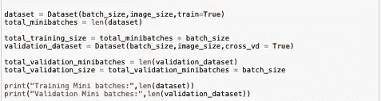

# 我如何在 Kaggle 深度学习竞赛中获得 95.5%的准确率

> 原文：<https://medium.com/analytics-vidhya/how-i-achieved-a-95-5-accuracy-on-a-kaggle-deep-learning-competition-35c96d568d7e?source=collection_archive---------15----------------------->

这是一个非常奇怪的时代。突然间，你手中有了这么多时间，以至于你真的不知道该做些什么。我写这篇博客是因为我厌倦了拖延。从没想过事情会发展到这一步，但事实就是如此。我的待办清单上有两项任务已经悬而未决很久了。第一，参加在线 ML 竞赛，第二，写科技博客。首先，我要感谢希亚·拉博夫激励人心的讲话。如果你缺乏动力，我建议你看看这个的视频。他睿智的话语可以激励一块岩石侵蚀得更快，只是说。

开门见山，这个博客旨在为那些上过吴恩达的 ML 课程或者熟悉 ML 和深度学习概念但不知道从哪里开始以及如何为 ML 编写好代码的新手提供一些指导。我写这篇博客是因为我想到了一系列问题，以及当我遇到 Kaggle 挑战时我是如何回答的。

我的目标只是学习如何以正确的方式训练模型，用最佳的编码实践组织我的代码，并希望在这个过程中达到良好的准确性。我发现了一个有趣的挑战，叫做康奈尔大学主办的植物病理学挑战。问题陈述看起来相当简单，是一个很好的挑战。Kaggle 中描述的问题的目标如下

**TL；大卫:给定一张叶子的图像，你必须诊断植物的健康状况。将其分为 4 类:健康、多种疾病、锈病或疮痂。**

> “植物病理学挑战”的目标是使用训练数据集的图像来训练模型，以 1)将来自测试数据集的给定图像准确地分类到不同的患病类别或健康叶片；2)准确区分多种病害，有时一片叶子上不止一种；3)处理罕见类和新奇症状；4)解决深度感知——角度、光、阴影、叶子的生理年龄；以及 5)在识别、注释、量化和引导计算机视觉中结合专家知识，以在学习期间搜索相关特征。”


来自叶[数据集](https://arxiv.org/abs/2004.11958)的 4 个样本输出

**阅读完关于挑战的文章后，我的第一反应是什么？**

我的第一个想法是，我必须阅读最先进的 CNN 模型。目前， [EfficientNet](https://arxiv.org/pdf/1905.11946.pdf) B7 已经在 ImageNet 数据集上取得了 84.4%的最高准确率，似乎是应对这一挑战的一个非常可靠的工具。

我如何训练一个最先进的通讯网络？
从零开始训练大型 ConvNets 是不可取的。最先进的 ConvNets 很大，有大量的参数(EfficientNet-B5 有 3000 万个参数)。最好是加载在大型数据集上训练的预训练权重，然后针对您的任务进行训练，也就是迁移学习。

把预加应力的重量想象成房子的地基。预训练重量的训练就像是在这个基础上建造房子的其余部分。调整预训练的权重以从图像中提取重要特征。因此，当您使用自定义数据集进行训练时，模型不需要学习如何提取重要特征。特征可以像图像上的垂直线一样简单，也可以像检测图像上的汽车一样复杂。模型学习提取的内容完全取决于对网络进行预训练的数据集。因此，在像 ImageNet 这样的大型数据集上训练的模型是非常可靠的！

**我如何构建我的代码？**

我有两年多的软件开发专业经验。在这 2 年里，我学到了一些写结构良好的代码的好方法。此外，我浏览了 Kaggle 上发布的各种 jupyter 笔记本和多个开源 GitHub 项目。每个人都有自己写代码的方式，但是大多数开发者有一个总的趋势。我遵循对我有意义的结构。我已经用这个结构开发了植物病理学挑战的代码库。希望这对你也有意义。:)

这是我遵循的结构

> 1.把所有的超参数和常数放在开始的地方

```
batch_size = 16
epoch = 50
model_name = 'efficientnet-b5'
image_size = EfficientNet.get_image_size(model_name)
device = torch.device("cuda:0" if torch.cuda.is_available() else "cpu")
```

这是很有帮助的，因为你可以很容易地从一个地方改变你的超参数，把它放在一个地方是很好的，因为你会做整个超参数调整。

> 2.为数据集创建自定义类，并定义满足您需求的函数。

这是一种非常典型的做事方式。基本上，这个想法是你创建一个自定义类，它导入数据(比如从一个 csv)并进行各种转换，然后输出转换后的数据，这些数据可以输入到你的模型中。

例如，我定义了一个类 *Dataset* ，它根据我在创建它的对象时传递给它的参数加载训练/交叉验证/测试数据。


类数据集的代码

此外，我还定义了另外两个函数 *__next__()* 和 *__iter__()* ，这两个函数使类数据集[的对象成为可迭代的](https://www.programiz.com/python-programming/iterator)。


使类数据集可迭代

最后，我添加了一个 *parse_annotations()* 函数，它可以动态地放大图像。[如果你想概括并防止你的模型过度适应训练数据，数据扩充](http://cs231n.stanford.edu/reports/2017/pdfs/300.pdf)是必要的。查看[这篇](https://towardsdatascience.com/data-augmentation-for-deep-learning-4fe21d1a4eb9)文章，了解各种增强库的概述。

> 3.初始化您的数据集



初始化数据集

注意:我已经将训练集 80–20 分成了训练集和交叉验证集。

> 4.定义你的损失函数

植物病理学挑战是一个多类分类问题。交叉熵损失最适合这种情况。幸运的是，Pytorch 实现了损失函数。实现它是相当容易的。


损失函数

> 5.定义你的神经网络

通常，这是您定义自定义神经网络类的地方。我使用了 EfficientNet 的一个开源 Pytorch 实现。我已经定制了前几层来适应我的目的。


神经网络定义

> 6.定义你的优化函数

现代神经网络中的*事实上的*规则是学习速率衰减。它有助于优化和一般化。更多相关信息可在[这里](https://arxiv.org/pdf/1908.01878.pdf)找到。

你可能已经猜到我在使用学习率衰减，因为我没有在超参数定义中定义它。我使用了一个实现余弦学习率衰减的库。


优化功能

> 7.定义训练和交叉验证模型的函数

训练功能的任务如下:-
a)将训练数据输入网络
b)根据网络输出和目标数据计算损耗。
c)它通过改变权重来反馈损失和调整网络。
d)记录损失，用于以后制作[训练和交叉验证损失图](https://machinelearningmastery.com/learning-curves-for-diagnosing-machine-learning-model-performance/)，以了解您的模型性能。

交叉验证功能的任务如下:-
a)将交叉验证数据(无数据扩充)输入网络
b)输出数据并计算损失
c)不**而**训练网络
d)记录交叉验证损失以制作训练和交叉验证损失图


培训和交叉验证功能

> 8.训练你那该死的模型！

现在，我们终于要回答题目中的问题了。我最初训练了一个我自己制作的神经网络。这并不新奇。它类似于 AlexNet，但长度、宽度和分辨率更小。我首先在我自己的神经网络上训练，因为我想看看我的代码是否如预期的那样工作。我在测试数据集上达到了 72%的准确率。为了进一步提高准确度，我在康文网上进行训练。我训练的第一个 ConvNet 是 [DenseNet](https://arxiv.org/abs/1608.06993) ，批量为 16，30 个历元的学习率为 0.001。我能够在交叉验证集上获得 94%的准确率，在测试集上获得 93%的准确率。
有了最先进的 EfficientNet，我的准确性有了很大提高。我在下面提到了我训练的网络列表，直到我获得了 95.5 %的准确率。

a)效率网 B3，批量大小-16，分辨率-494，次数-50，余弦学习率衰减，交叉验证准确度- 94.3%
b)效率网 B7，批量大小-2，分辨率-494，次数-50，余弦学习率衰减，交叉验证准确度-93.44%
B7 的批量大小仅为 2，因为它有 6600 万个参数，12 GB GPU 因批量大小超过 2 而不堪重负。:(
c) EfficientNet B5，批量-4，分辨率-494，历元-50，余弦学习率衰减，交叉验证准确率- 96.74%，测试准确率-95.5%

目前领先的选手准确率为 98.7%。我害羞了 3.2%，这已经很多了！希望在下一次挑战中我能取得更好的成绩。对我的第一场比赛来说还不错吧？:)

这是艰难的时刻，到处都有很多不确定性。大多数事情都超出了我们的控制范围。我们能控制的是我们如何管理我们的时间，以及我们如何利用时间。做一些你喜欢的事情。对我来说，是学习如何更好地训练网络，更直观地了解神经网络的工作原理。你找到你的东西。

用我们这个时代的先知和英雄希亚·拉博夫的一句美丽的话来结束这篇博客，

> “不要让你的梦想成为梦想。做就是了！”

[https://giphy.com/gifs/just-do-it-24xRxrDCLxhT2](https://giphy.com/gifs/just-do-it-24xRxrDCLxhT2)

你可以在这里找到我的完整代码。

**编辑:**我用整个训练数据集训练了 EfficientNet B5。换句话说，交叉验证集现在也被用于训练。我对网络进行了 50 个纪元的训练，得到了 97.5%的准确率。

