# 我如何确信客户流失问题的难度

> 原文：<https://medium.com/analytics-vidhya/how-i-am-convinced-the-difficulty-of-churn-problems-465ac7b0038c?source=collection_archive---------31----------------------->

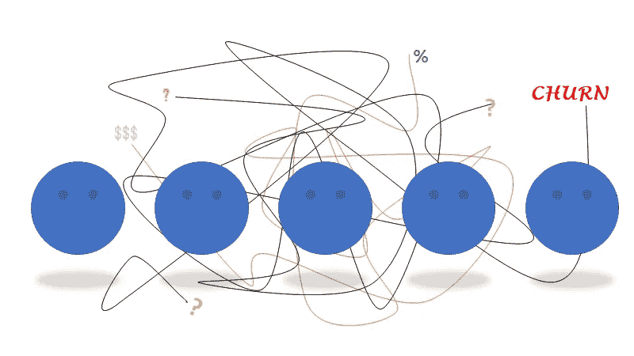

# 介绍

在牛津在线词典中，单词“churn”的定义是让某人感到不安或情绪混乱。尽管我们知道客户流失是商业中的客户流失，但字典中的意思在商业中也是如此合乎逻辑。如果有人对不同的消费机会感到不安或困惑，她可以离开。这里的问题是:数据能帮助我们理解消费者是否变得愤怒或开始困惑吗？

流失的用户可能只占所有用户的一小部分，这使得问题变得很突出。然而，尽管我们永远无法确切知道一个人真实的经历，这些数据仍然对我们有很大的帮助。

在 sparkify 问题中，提供了用户的日志，我们试图猜测他们的流失行为。大约 300 个用户有 64 天的数据和大约 28 万个日志。52%的用户有流失日志。在这个项目中，pyspark 被用于清洁、建模等。；只有在绘图时，才使用 mathplotlib 和 pandas 库。

在项目期间，主要目标是预测客户流失。然而，这是如此开放式的表达，因此需要明确的目标定义。

# **数据探索和数据清理**

在设置 spark 会话和提取等常见步骤之后，数据分析开始了。只有一个数据框架可用于该项目，它包含以下各列:

*   艺术家:字符串(可空=真)
*   auth: string (nullable = true)
*   名字:字符串(可空=真)
*   性别:字符串(可空=真)
*   item insession:long(nullable = true)
*   lastName: string (nullable = true)
*   长度:double(可空=真)
*   级别:字符串(可空=真)
*   位置:字符串(可空=真)
*   方法:字符串(可空=真)
*   页面:字符串(可空=真)
*   注册:long(可空=真)
*   sessionId: long (nullable = true)
*   song: string(可空=真)
*   状态:long(可空=真)
*   ts: long(可空=真)
*   userAgent: string (nullable = true)
*   userId: string (nullable = true)

Sparkify 是一个音乐平台，通过查看列名和前几行，我们可以看到这是一个日志表。如上所述，我们的目标是猜测表现出不安态度的用户。为此，我们应该区分搅动和非搅动用户，并调查他们的不同态度。我只是试图澄清，主要的焦点应该放在用户身上。

因此，在观察空用户的日志后，删除了具有空用户 id 的行。他们只访问了 7 个页面，而这些页面实际上并不代表任何活动，比如听音乐。根据它们的名称，这些页面可能不需要任何身份验证，因此可以断定这些用户还没有登录，或者刚刚退出。

*   主页
*   关于
*   提交注册
*   注册
*   注册
*   帮助
*   错误

页面特征显示了用户的活动，因此它将构成我们模型的主要部分。所有的动作都保存为页面。下面列出了这些。当我们观察用户访问的页面时，我们可以看到取消确认意味着流失，因为在它之后没有日志。

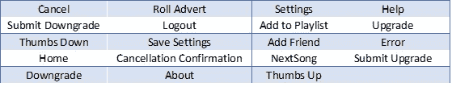

表 1:页数

**定义:**

**流失用户**:拥有注销确认页面日志的用户。

**部分特征数据(清洗后)**:

行数:~278k

天数:64 天(从 2018 年 10 月 1 日至 2018 年 12 月 3 日)

用户数量:225

流失行动次数:52 次

数据集只包括 64 天，所以很难比较和评估用户对取消的不同态度。然而，我们有 173 个未被调用的用户和 52 个用户，这似乎足以比较用户的不同态度。

当我们调查用户每小时的活动时，两组之间没有观察到不同的趋势。晚上的高峰时间通常是申请的高峰期。情节如下。

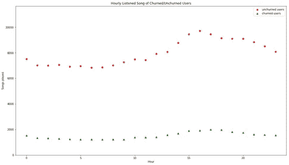

还分析了其他一些特征。其中一些看起来在搅动用户方面有所作为。然而，这里面临另一个问题。由于流失用户在所有用户中只占很小一部分，所以未流失用户的行为会发生显著变化。例如，下图显示了过去 30 天用户的在线天数。正如所看到的，毫无疑问，大量用户的平均值更高，但仍有许多未流失的用户几乎整天都在线。

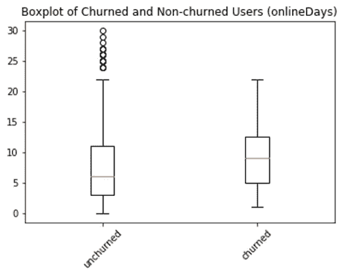

这种情况在几乎所有的统计中都引起了问题。因此，收集了用户日志数量。从下面可以看出，很多用户几乎没有日志，只有少数用户生成了数量极高的日志。在我看来，这两种情况都应该被消除，因为低的数字不会产生有用的统计数据，而大量的数字可以观察到与一般情况不同的趋势，并打破模型的结构。

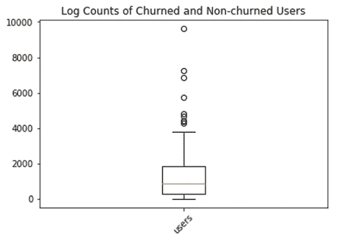

这里，在一些可视化之后，需要一个方法论。例如，首先我想知道一个没有搅动的用户上周的趋势是如何变化的。因此，我提取了所有数据中的上周数据，但随后我意识到这些数据对于被搅动的用户来说毫无意义，因为他们可能在上周之前已经搅动过了。这种情况可以让我们很容易地确定搅动的用户，但这是非常不现实的，因为模型回顾而不是进一步。

然后，我改进了我的策略，提取了他们上周的用户数据。然而，这也具有误导性。首先，这种情况导致所有的数据都无法盈利。使该模型变弱的主要问题是，虽然未被搅动的用户的数据在很长一段时间内是可用的，但是被搅动的用户的信息可能相对较少。

后来，我决定，对于任何类型的用户，这段时间都应该是均等的。此外，确定原点并将其评估为当前时间可以使模型更加真实。查看一段时间的数据，并试图猜测她是否会在下一次离开，这将提供更深入的见解。

为了分析用户，页面列是非常有用的。在这一栏中，我们可以计算用户听的歌曲数量，面临的错误数量，喜欢/不喜欢等。另一个特征是家访的数量，这有助于计算会话中活动的平均数量(例如歌曲的数量)。

# **特性和特性工程**

**在线天数**:用户使用应用的天数。假设倾向于流失的用户可以有更少的活跃天数。然而，下图显示它在十天内不起作用。这一分析给出了这样一个想法，即被搅动的用户正在给应用程序最后一次机会，因此他们的活跃天数可能会增加。

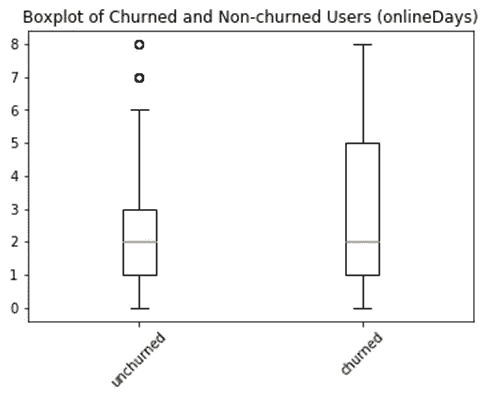

**喜欢/不喜欢**:竖起/放下大拇指的次数。这种情况与在线天数分析中的情况相同。同样，被搅动的用户显示出更多喜欢或不喜欢歌曲的倾向。这些特性对我们的模型很有帮助。

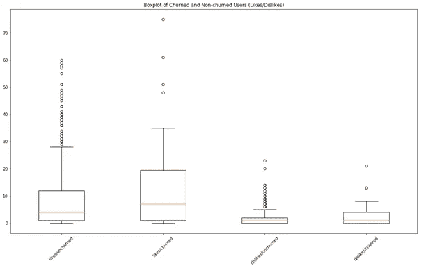

**listenedSongs** :用户听过的歌曲数量

**首页访问**:用户返回首页的次数。同样，享受更多的应用程序可以导致更多的访问主页。可能，不活跃和未被调用的用户正在对统计数据进行加权。

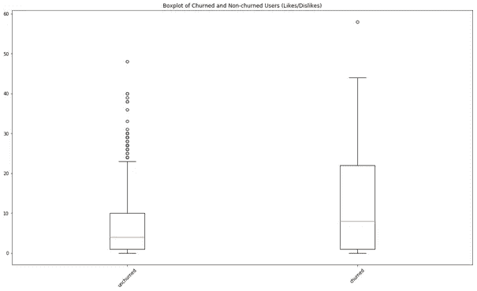

**错误:**用户可以得到错误，所以这个数据也是持有的。如果用户得到更多的错误，他们可以放弃使用该应用程序。下图在某种程度上证实了这一假设，但其他功能仍然面临同样的问题。

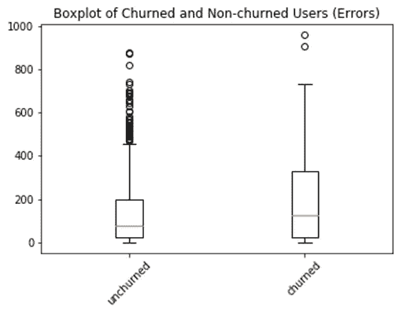

**differentArtists:** 这显示了用户在此期间收听了多少位不同的艺术家。该特征包括在特征工程中，但不包括在模型中，因为它没有显著的区别，并且与收听的歌曲数量高度相关。

**totalLogs:** 从名称可以看出，是用户创建的日志数量。

**like ratio/dislike ratio:**这些是喜欢和不喜欢占歌曲总数的比例。

**歌曲比例:**所有日志中歌曲的比例。由于这是一个音乐应用程序，这个比率对于应用程序如何实现其目标至关重要。

**错误率:**所有日志的错误率。这个比例也可以创造一个差异，而不仅仅是数字。例如，20 个日志对于如此活跃的用户来说可能是微不足道的，但是对于不太活跃的用户来说可能是破坏性的。

在评估不同的特征并比较分数之后，选择一些特征以获得更好的模型并避免过拟合。

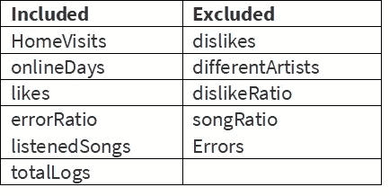

表 2:功能

关键的一步是澄清问题并提供所需的健壮性。该模型应包括功能和输出，他们的周期可以设置。如上所述，我创建了一个分别为 20 天和 10 天的培训和验证时间，但是它们仍然可以更改。

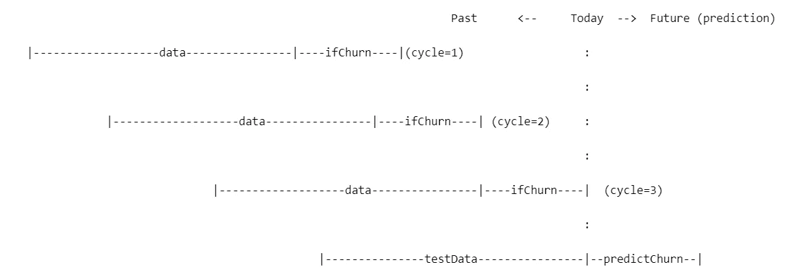

图 1:依赖于时间的特征工程方法

数据被提取为要素列，输出为 ifChurn 列。主要的一点是，如果我们试图猜测今天，我们正在分析过去 20 天的数据，并试图猜测用户是否会在 5 天内流失。

# **建模**

为了能够应用机器学习算法，首先应该对数据进行拆分以进行验证。分割数据有两种方法。第一个是较早的数据可以用来训练数据，最后的时间间隔成为测试数据。这种方法更符合实际，因为它节省时间。这种方法也有随机性等缺点。此外，由于搅动的用户仅占数据的一小部分，我们试图用这种方法猜测相同的几个用户。因此，如果我们侥幸猜对或猜错，就可能导致数据拟合失误。

第二种方法是收集所有数据，对这些数据进行随机分割，得到训练和测试部分。这种方法对随机性更好，但缺乏真实性，因为我们试图用未来的数据来猜测过去的搅动。这两种方法都尝试在这个项目中，不幸的是，这些都没有区别。

Pyspark 支持构建流水线和不同的机器学习算法。

管道通过三个步骤构建:

*   VectorAssembler:这一步是从数据集中提取特征并将它们矢量化。向量汇编程序将提供训练数据。
*   索引器:这是为保存标签列而生成的。模型将试图找到这个创建的标签。
*   机器学习算法:最后一步是机器学习模型能够训练和转换数据。该项目中使用了三种算法:

1.  逻辑回归

2.决策树分类器

3.随机森林分类器

该模型可以通过不同的时间段来构建，如 20 天的训练期和 5 天的验证期。建立这些模型后，评估就开始了。

# **评估与结论**

所有模型都通过 F1 分数进行评估和比较。由于我们试图猜测搅动的用户，F1 评分对我们来说是最好的评估者之一。流失的用户是由很少的数据组成的，所以试图猜测未流失的用户是有误导性的。例如，如果 5%的用户流失，并且我们猜测没有任何用户会在没有任何模型的情况下流失，我们可以轻松达到 95%的成功。然而，在 F1 评分中，只评估流失的用户或预测会流失的用户。比率 1:流失用户占所有流失用户的比率比率 2:流失用户占所有预计流失用户的比率。

f1 = 2 *(1/ratio1)+(1/ratio2))^-1

所有分数给 0 分。我们可以得出结论，功能应该改进。我们已经提取了比我们使用的更多的特征，但其他特征也不令人满意。

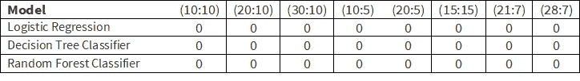

表 3:不同时间段模型的 F1 值

当我们把预测看做流失时，下面的行返回真实的流失。可以看出，用户数量很少，所以很难猜测他们。当我们分析概率时。

*   为了更好地训练数据，数据应该被放大。
*   一些用户既不经常使用应用程序，也不离开它。这些用户主宰着数据。为了处理它，可以对每个周期分别进行边缘情况的消除。
*   在这个小的数据集中，大部分被搅动的用户在一开始就取消了他们的会员资格。这导致这些用户没有足够的数据量。
*   特色薄弱。即使建立一个健康的模型有障碍，零分是非常令人心碎的许多确定的特征。

尽管没有一个模型给出令人满意的结果，但我们已经建立了一个现实世界的问题，有时很难预测如此小的子群体。而且，功能也需要改进。即使时间段在逻辑上是分开的，功能也不包括时间权重。在模型中，用户的最后活动可以被更加权。

因为我们不能得到除零以外的任何分数，所以没有应用交叉验证。但是，如果能找到更好的特征，交叉验证也会有助于提高准确性。

[【1】](#_ftnref1)(2020 年牛津高级学习词典中关于 churn 动词的定义)